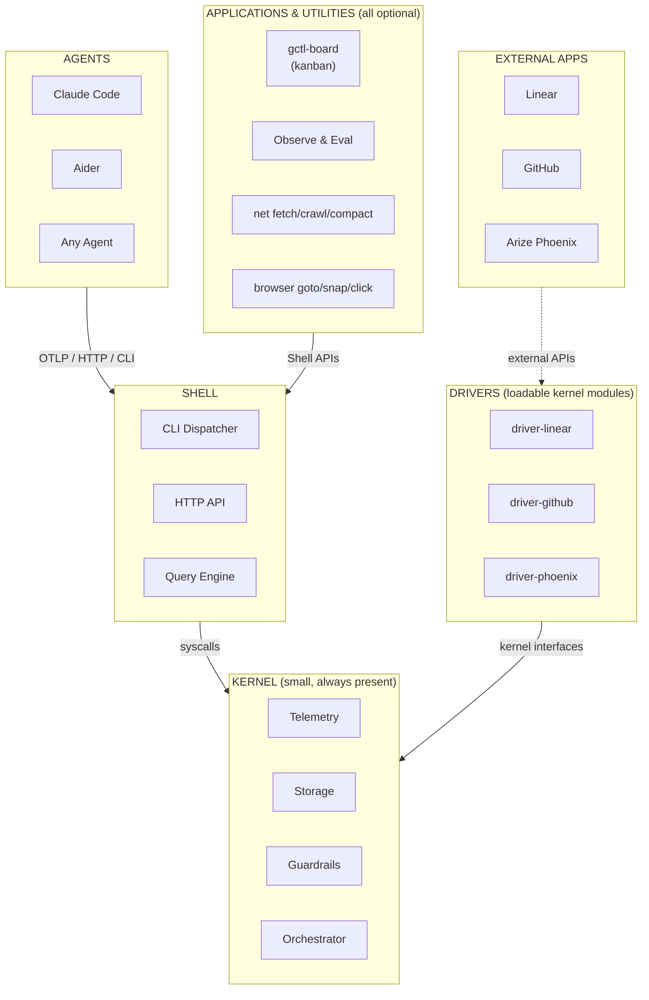

# GroundCtrl (gctl)

A small, local-first orchestration layer for human+agent teams, modeled after Unix.

Install, run `gctl serve`, and you have a working ground control station. No config files, no cloud accounts, no Docker.

## Why

- **Unix philosophy.** The kernel is four small primitives (telemetry, storage, guardrails, orchestrator). Applications and utilities are all optional — use what you need, ignore the rest. Loadable kernel modules (drivers) connect to the tools you already use (Linear, Notion, Obsidian, Arize Phoenix) instead of replacing them.
- **Individual workflow is personal.** Team workflows like Scrum are often similar across organizations, but how an individual developer works with their agents is highly personalized. gctl gives you the primitives to build *your* workflow, not a prescribed one.
- **Malleable by design.** Prompts (AGENTS.md, WORKFLOW.md) are the first-class extension surface. Load drivers, add CLI commands, or rewrite policies — without forking. A gentle slope from user to creator.

Read more at [specs/principles.md](specs/principles.md).

## Quick Start

```sh
cargo build
cargo run -- serve           # OTel receiver on :4318
cargo run -- status          # health check
cargo run -- sessions        # list agent sessions
```

## Architecture



```
Kernel:       telemetry, storage, guardrails, orchestrator + drivers (loadable kernel modules)
Shell:        CLI dispatcher, HTTP API, query engine
Apps/Utils:   gctl-board, observe & eval, net fetch/crawl/compact, ...
```

See [specs/architecture/](specs/architecture/), [specs/comparison.md](specs/comparison.md), and [AGENTS.md](AGENTS.md) for the full knowledge base.
