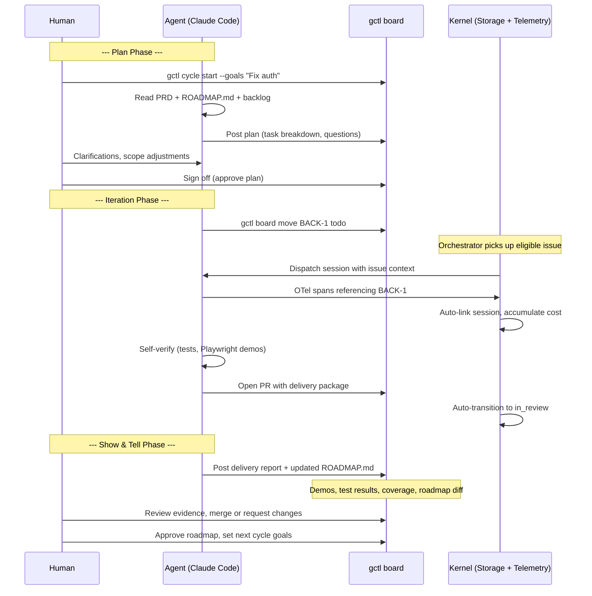

# gctl-board — Workflow

How work flows through gctl-board, from issue creation to completion.

## Issue Lifecycle (Kanban)

Follows the [issue lifecycle spec](specs/workflows/issue-lifecycle.md).

```
backlog → todo → in_progress → in_review → done
                                              ↑
              any non-terminal ──────→ cancelled
```

### Transition Rules

| From | To | Required |
|------|----|----------|
| backlog | todo | — |
| todo | in_progress | At least one acceptance criterion (planned) |
| in_progress | in_review | Linked PR (planned) |
| in_review | done | — |
| any non-terminal | cancelled | — |
| done, cancelled | (nothing) | Terminal — no further transitions |

Transitions are validated at the Rust storage layer. Invalid transitions return an error.

### Auto-Transitions

| Trigger | Transition |
|---------|-----------|
| Agent session starts referencing issue key | Link session; if `todo`, move to `in_progress` |
| PR opened referencing issue key | Move to `in_review` |
| PR merged | Move to `done` |
| All blockers resolved | Move blocked issue to `todo` |

## Agent Dispatch Flow

See [product-cycle.md](specs/workflows/product-cycle.md) for the full cycle spec.



## Setup Runbook

Required steps before the board is fully operational. Run from the repo root.

### 1. Start the kernel daemon

```sh
cargo run -p gctl-cli -- serve          # uses ~/.local/share/gctl/gctl.duckdb
# or for a fresh instance:
cargo run -p gctl-cli -- --db :memory: serve
```

### 2. Seed personas (required for agent dispatch)

```sh
gctl persona seed                        # reads specs/team/personas.md
# or via tsx if the CLI isn't built:
npx tsx shell/gctl-shell/src/main.ts persona seed
```

Verify: `gctl persona list` should show 7 personas (engineer, pm, ux, qa, devsecops, security, tech-lead).

### 3. Create a project and link GitHub (required for sync)

```sh
gctl board projects create --name "Board" --key BOARD
gctl board link-github <project-id> --repo OpenHackersClub/gctrl
```

### 4. Start the web UI

```sh
cd apps/gctl-board && pnpm dev           # http://localhost:4200
```

### 5. Verify dispatch works

Drag any issue to **In Progress** — you should see a toast "Dispatched engineer on BOARD-X" and a dispatch comment on the issue with the agent prompt.

### Prerequisites summary

| Step | Required for | Command |
|------|-------------|---------|
| Kernel running | Everything | `cargo run -p gctl-cli -- serve` |
| Personas seeded | Agent dispatch (drag-to-in_progress) | `gctl persona seed` |
| Project created | Issue tracking | `gctl board projects create` |
| GitHub linked | 2-way sync | `gctl board link-github` |

## CLI Commands

| Command | Description |
|---------|-------------|
| `gctl board create-project <name> <key>` | Create a project (e.g. Backend, BACK) |
| `gctl board projects` | List projects |
| `gctl board create <project> <title>` | Create an issue (auto-generates BACK-1 ID) |
| `gctl board list [--project X] [--status X]` | List issues with filters |
| `gctl board show <id>` | Show issue details, events, comments, sessions |
| `gctl board move <id> <status>` | Move issue (validates transitions) |
| `gctl board assign <id> <name> [--type agent]` | Assign to human or agent |
| `gctl board comment <id> <body>` | Add a comment |

## HTTP API

| Method | Route | Description |
|--------|-------|-------------|
| GET/POST | `/api/board/projects` | List/create projects |
| GET/POST | `/api/board/issues` | List/create issues |
| GET | `/api/board/issues/{id}` | Get issue |
| POST | `/api/board/issues/{id}/move` | Move issue (validated) |
| POST | `/api/board/issues/{id}/assign` | Assign issue |
| POST | `/api/board/issues/{id}/comment` | Add comment |
| GET | `/api/board/issues/{id}/events` | List events |
| GET | `/api/board/issues/{id}/comments` | List comments |
| POST | `/api/board/issues/{id}/link-session` | Link session + cost |

## Project Keys

| Project | Key | Description |
|---------|-----|-------------|
| Backend | BACK | Kernel, storage, CLI, HTTP API |
| Board | BOARD | gctl-board application itself |
| Infra | INFRA | CI/CD, deployment, cloud sync |

## Agent Personas for Board Work

| Persona | Capabilities | Typical Issues |
|---------|-------------|----------------|
| `claude-code` | read, write, bash, dispatch | Feature implementation, bug fixes |
| `reviewer-bot` | read, comment | Code review, spec review |
| `docs-bot` | read, write | Documentation updates, spec maintenance |

## Web UI Implementation

### Stack

| Layer | Choice |
|-------|--------|
| Framework | React 19 + TypeScript |
| Bundler | Vite |
| Styling | Tailwind CSS v4 |
| Components | **shadcn/ui** — copy-paste Radix primitives, not a library dependency. Use `npx shadcn@latest add <component>` to add components into `web/src/components/ui/`. |
| Drag-and-drop | @dnd-kit/core |
| API | Fetch-based client proxied through Vite to kernel `:4318` |

### shadcn/ui Guidelines

- All UI primitives (Button, Dialog, Select, DropdownMenu, Sheet, Tabs, Badge, etc.) MUST come from shadcn/ui.
- Components live in `web/src/components/ui/` — they are owned source code, not node_modules.
- Customize via Tailwind — do not wrap shadcn components in unnecessary abstractions.
- Use shadcn's dark theme tokens; the board uses a dark zinc-950 base with emerald-500 accent.
- For new components, always check if shadcn has a primitive before building from scratch.

### Design Tokens

| Token | Value | Usage |
|-------|-------|-------|
| Background | `zinc-950` | App base |
| Surface | `zinc-900` | Cards, panels |
| Border | `zinc-800` | Dividers, card borders |
| Accent | `emerald-500` | Primary actions, status "done" |
| Display font | Chakra Petch | Headers, branding |
| Body font | Outfit | Body text |
| Mono font | JetBrains Mono | Issue IDs, data, code |

## Code Location

| Component | Path |
|-----------|------|
| Effect-TS schemas | `apps/gctl-board/src/schema/` |
| Effect-TS services | `apps/gctl-board/src/services/` |
| Effect-TS adapters | `apps/gctl-board/src/adapters/` |
| Web UI entry | `apps/gctl-board/web/` (Vite root, `pnpm dev`) |
| Web UI components | `apps/gctl-board/web/src/components/` |
| Web UI shadcn primitives | `apps/gctl-board/web/src/components/ui/` |
| Web API client | `apps/gctl-board/web/src/api/client.ts` |
| Rust storage (DuckDB) | `crates/gctl-storage/src/duckdb_store.rs` (board methods) |
| Rust HTTP routes | `crates/gctl-otel/src/receiver.rs` (board handlers) |
| Rust CLI commands | `crates/gctl-cli/src/commands/board.rs` |
| DuckDB table DDL | `crates/gctl-storage/src/schema.rs` (`board_*` tables) |
| Domain types | `crates/gctl-core/src/types.rs` (`BoardIssue`, `BoardProject`, etc.) |
| Architecture spec | `specs/architecture/apps/gctl-board.md` |
| Tracker spec | `specs/architecture/apps/tracker.md` |
