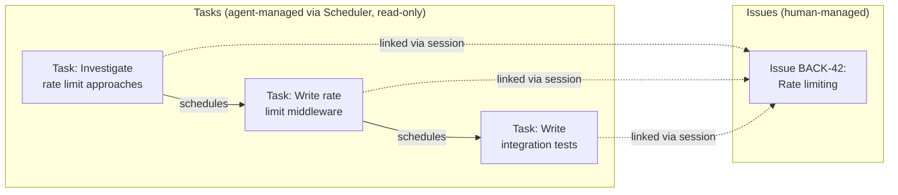

# Application: gctl-board (Kanban)

gctl-board is the first shipped application — a kanban system for tracking issues and tasks planned and executed by both humans and agents. It is the primary dogfooding surface: we use gctl-board to manage gctl development itself.

## What It Tracks

| Work Item | Actor | Source of Truth | Description |
|-----------|-------|----------------|-------------|
| **Issue** | Human (primary) | Tracker kernel interface | Committed, trackable work visible to the team. Synced bidirectionally with GitHub Issues. Humans create, triage, and manage Issues directly. Lifecycle: `backlog → todo → in_progress → in_review → done` (or `cancelled`). |
| **Task** | Agent (read-only for humans) | Scheduler kernel primitive | A unit of work created and managed by agents via the Scheduler. The board surfaces Tasks read-only — humans observe agent work breakdown but do not create, edit, or delete Tasks. Lifecycle defined by the Scheduler. |

**Interaction model:**
1. Humans work exclusively with Issues — creating, prioritizing, assigning, and closing them.
2. Agents create and manage Tasks via the **Scheduler**. The board visualizes these Tasks as a live audit trail of agent execution progress.
3. Tasks are read-only in the board UI — the Scheduler is the write surface for Tasks, not the board.
4. Issues and Tasks are separate work item types. Tasks do NOT promote to Issues. An agent that determines follow-up team-visible work is needed creates a new Issue directly.

## Agent Integration

1. **Auto-linking**: When an agent session emits spans referencing an Issue key (e.g., `BACK-42`), the kernel's telemetry links the session to that Issue. Cost and token usage accumulate automatically.
2. **Agent assignment**: Agents can claim Issues, triggering a transition to `in_progress`.
3. **PR lifecycle**: When a PR referencing an Issue is opened, the Issue auto-transitions to `in_review`. On merge, it transitions to `done`.
4. **Session context**: Every Issue tracks linked agent sessions with cost, model, and outcome.

## Board Visualization

The board renders two lanes:

1. **Issues lane** — human-managed work items with full kanban controls.
2. **Tasks lane** — Scheduler Tasks surfaced read-only, grouped by the Issue they are linked to (via the span/session that referenced the Issue key).

- Tasks are linked to Issues via telemetry: when an agent session references an Issue key (e.g. `BACK-42`), its Scheduler Tasks are surfaced under that Issue on the board.
- Task dependency ordering (which Task runs before which) is managed by the Scheduler, not the board.
- The board MUST NOT allow humans to create, edit, reorder, or delete Tasks.

## Kernel Primitives Used

| Primitive | How gctl-board uses it |
|-----------|----------------------|
| **Storage** | Namespaced tables for issues and projects (`board_*`) |
| **Telemetry** | Session-to-Issue linking, cost/token accumulation |
| **Scheduler** | Source of truth for Tasks — board reads Tasks from the Scheduler for visualization; also used for recurring external sync and scheduled status reports |
| **Cloud Sync** | Issue data synced for cross-device access |
| **Shell (CLI)** | `gctl board` subcommands (Issues only); Tasks surfaced via `gctl board tasks --issue BACK-42` read-only |
| **Shell (HTTP)** | `/api/board/*` routes |

## Related Docs

- `specs/gctl/workflows` — Full Task → Issue lifecycle, external sync rules, PR review conventions
- `specs/architecture/domain-model.md` — Board schemas (DuckDB DDL + Effect-TS types)
- `specs/implementation/apps/components.md` — gctl-board implementation details (Effect-TS, tsup, vitest)
