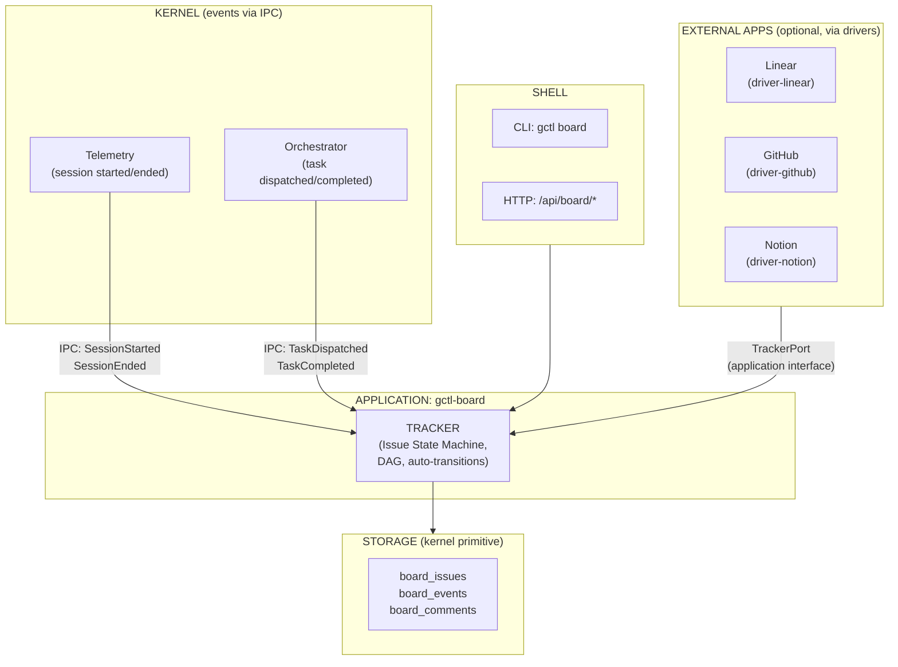
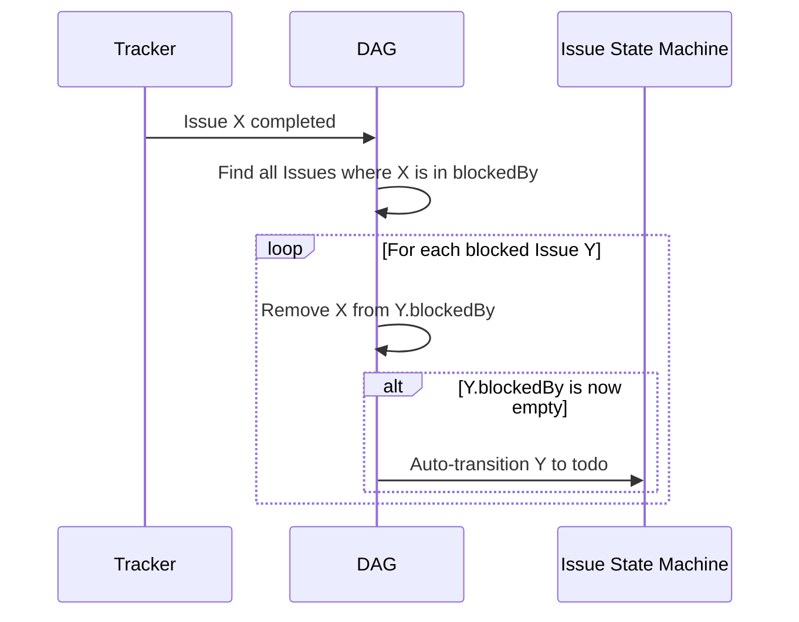

# Tracker — Issue Lifecycle Management

The Tracker is an **application component of gctl-board** — not a kernel primitive. It manages the lifecycle of Issues, their dependency graph (DAG), and auto-transitions driven by kernel IPC events. The kernel (Orchestrator, Telemetry) works exclusively with Tasks and Sessions; the Tracker observes those events and updates Issues accordingly.

## Scope

The Tracker owns:

1. **Issue lifecycle** — status transitions, validation rules, and auto-transitions as defined in [issue-lifecycle.md](../../gctl/workflows/issue-lifecycle.md).
2. **Issue dependency graph (DAG)** — the directed acyclic graph of `blockedBy` / `blocking` relationships across Issues.
3. **Graph integrity** — cycle detection, auto-unblock propagation, and topological ordering.

The Tracker does NOT own:

- **Task lifecycle** — Tasks are owned and lifecycled by the **Scheduler** kernel primitive. The Tracker observes Task completion events via kernel IPC but MUST NOT mutate Task state.
- **Orchestration dispatch** — the Orchestrator dispatches Sessions to execute Tasks. The Tracker is not in the dispatch path. It reacts to Orchestrator events via kernel IPC (e.g., task done → update linked Issue).
- **Telemetry linkage** — session-to-issue linking is handled by the kernel's Telemetry primitive; the Tracker consumes the resulting events via kernel IPC.
- **External sync** — bidirectional sync with Linear/GitHub/Notion is handled by drivers that implement the `TrackerPort` application interface.

## Relationship to Other Components



## Issue State Machine

> States, transitions, forward-only ordering, terminal convergence, and universal cancel are defined below.

The Tracker enforces the kanban lifecycle: `backlog` → `todo` → `in_progress` → `in_review` → `done`, with `cancelled` reachable from any non-terminal state. See the Lean source for the complete `step` function and `stateOrd` ranking.

Key verified properties: `forward_only` (non-cancel transitions strictly increase), `no_backward` (no transition decreases order), `all_nonterminal_can_cancel`.

### Transition Side-Effects (Application-Level)

These side-effects are enforced by the Tracker at the application level (not in the formal spec):

1. `todo → in_progress` — MUST have at least one acceptance criterion.
2. `in_progress → in_review` — MUST have a linked PR.
3. `* → cancelled` — MUST include a reason note in the event log.

### Auto-Transitions

The Tracker MUST subscribe to kernel IPC events and apply auto-transitions:

| Event Source | Event | Auto-Transition |
|-------------|-------|-----------------|
| Telemetry (IPC) | `SessionStarted` referencing issue key | Link session to issue; if issue is `todo`, move to `in_progress` |
| Orchestrator (IPC) | `TaskCompleted` linked to issue | If no tasks remain open, consider moving to `in_review` |
| GitHub driver | PR opened referencing issue key | Move to `in_review` |
| GitHub driver | PR merged | Move to `done` |
| DAG | All blockers resolved | Move from effectively-blocked issue to `todo` |

## Tasks (Read-Only View from Scheduler)

Tasks are owned and lifecycled by the **Scheduler** kernel primitive. The Tracker reads Task state for board visualization only — grouping Tasks under the Issue they are linked to via telemetry session-issue associations.

The Tracker MUST NOT create, update, or delete Tasks. All Task mutations go through the Scheduler.

See `../kernel/scheduler.md` for the Task lifecycle definition.

## Dependency Graph (DAG)

> Acyclicity via topological ordering MUST be enforced by the Tracker.

The Tracker maintains a DAG of Issue dependencies. Issues declare `blockedBy` / `blocking` relationships; the Tracker enforces acyclicity and propagates unblocking.

### Graph Operations

| Operation | Verified Property |
|-----------|-------------------|
| **Add edge** (`A blocks B`) | `add_edge_preserves_acyclic` — MUST reject if adding the edge would create a cycle |
| **Remove edge** | `subgraph_acyclic` — removing edges preserves acyclicity |
| **Complete node** | `empty_all_ready` / `IsReady` — propagate unblocking to dependents |
| **Ready set** | `IsReady` predicate — all Issues with zero unresolved blockers |

### Cycle Detection

The formal spec proves cycle prevention via topological ordering: `topological_order_implies_acyclic` shows that any graph with a topological order has no cycles, and `add_edge_preserves_order` shows that adding an edge where `ord(blocker) < ord(blocked)` preserves the ordering. Implementation SHOULD use depth-first search from the target node to check reachability before inserting the edge.

### Auto-Unblock Propagation

When an Issue completes:



## Tracker Application Interface (TrackerPort)

The Tracker exposes an application interface trait that external app drivers and the shell consume. This is the single entry point for all Issue mutations — external app drivers (Linear, GitHub) and CLI commands both go through this interface.

> **Note:** This is an **application-level** interface, not a kernel interface trait. It lives in the gctl-board package, not in `gctl-core`. External app drivers that implement it are connecting to the application, not the kernel.

```rust
#[async_trait]
pub trait TrackerPort: Send + Sync {
    // --- Issues ---
    async fn create_issue(&self, input: CreateIssueInput) -> Result<Issue, TrackerError>;
    async fn move_issue(&self, id: &IssueId, status: IssueStatus, note: Option<&str>) -> Result<Issue, TrackerError>;
    async fn assign_issue(&self, id: &IssueId, assignee: Assignee) -> Result<Issue, TrackerError>;
    async fn list_issues(&self, filter: IssueFilter) -> Result<Vec<Issue>, TrackerError>;
    async fn get_issue(&self, id: &IssueId) -> Result<Issue, TrackerError>;

    // --- Dependency Graph ---
    async fn add_dependency(&self, blocker: IssueId, blocked: IssueId) -> Result<(), CyclicDependencyError>;
    async fn remove_dependency(&self, blocker: IssueId, blocked: IssueId) -> Result<(), TrackerError>;
    async fn get_graph(&self, root: Option<IssueId>) -> Result<DependencyGraph, TrackerError>;

    // --- Telemetry integration ---
    async fn link_session(&self, issue_id: &IssueId, session_id: &str, cost: f64, tokens: u64) -> Result<(), TrackerError>;
    async fn link_pr(&self, issue_id: &IssueId, pr_number: u32) -> Result<(), TrackerError>;
}
```

### Error Types

```rust
pub enum TrackerError {
    NotFound { id: String },
    InvalidTransition { from: String, to: String, reason: String },
    MissingAcceptanceCriteria { issue_id: String },
    MissingLinkedPr { issue_id: String },
    MissingCancellationReason { issue_id: String },
    CyclicDependency { path: Vec<String> },
    StorageError(String),
}
```

## Storage

The Tracker reads and writes to DuckDB tables in the `board_*` namespace via the Shell (HTTP API or direct DuckDB access for Rust-compiled apps). See [domain-model.md](../domain-model.md) § 5.5 for DDL. The Tracker owns `board_issues`, `board_events`, and `board_comments`. Task storage is owned by the Scheduler.

### DAG Storage

Dependency edges are stored inline as JSON arrays (`blocked_by`, `blocking`) on `board_issues`. The Tracker reconstructs the in-memory DAG from these columns on startup and maintains it incrementally.

## Integration Points

### With Orchestrator (via kernel IPC)

The Tracker does NOT expose a query interface to the Orchestrator. Instead:

1. Orchestrator emits `TaskDispatched` and `TaskCompleted` events via kernel IPC.
2. Tracker subscribes to these events and updates the linked Issue's status (e.g., first Task dispatched for an Issue → move Issue to `in_progress`; all Tasks completed → consider moving Issue to `in_review`).

### With Telemetry (via kernel IPC)

The kernel's Telemetry primitive emits events when spans reference issue keys. The Tracker subscribes to `SessionStarted` / `SessionEnded` events and calls `link_session` to accumulate cost and token data on the issue.

### With External App Drivers

Drivers (driver-linear, driver-github, driver-notion) implement bidirectional sync through `TrackerPort`:

- **Pull**: Driver reads from external API, calls `create_issue` / `move_issue` to mirror state locally.
- **Push**: Driver subscribes to Tracker events (issue created, status changed, session linked) and writes back to the external API.

Drivers MUST NOT write to `board_*` tables directly — they MUST go through `TrackerPort`.

## Related Docs

- [issue-lifecycle.md](../../gctl/workflows/issue-lifecycle.md) — Kanban status definitions and transition rules
- [gctl-board.md](gctl-board.md) — Application-level view of the board (agent integration, kernel primitives used)
- [domain-model.md](../domain-model.md) — Storage schema DDL and Effect-TS type definitions
- [../kernel/scheduler.md](../kernel/scheduler.md) — Task lifecycle (owned by Scheduler, visualized on board)
