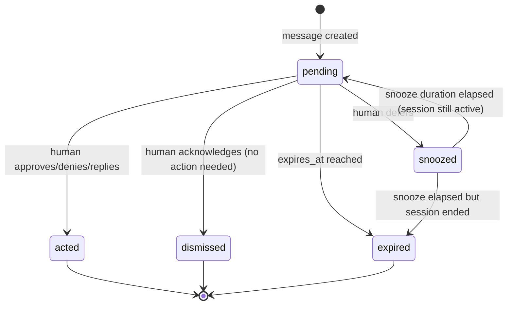
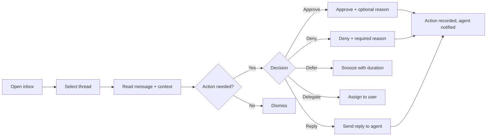
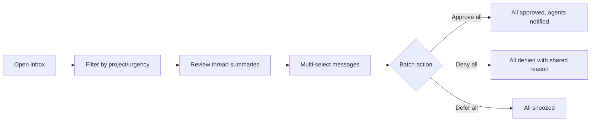

# gctl-inbox Workflow

## Message Lifecycle



**Snooze reconciliation:** When a snoozed message's duration elapses, the system MUST check whether the originating session (if any) is still active. If the session has ended, the message transitions to `expired` instead of `pending`.

### Status Definitions

| Status | Description | Terminal? |
|--------|-------------|-----------|
| `pending` | Awaiting human attention | No |
| `acted` | Human took a decisive action (approve, deny, reply, delegate) | Yes |
| `dismissed` | Human acknowledged, no action required | Yes |
| `snoozed` | Deferred — returns to `pending` after duration | No |
| `expired` | Time-sensitive request expired before action | Yes |

## Urgency Levels

| Level | Meaning | Examples | Expected Response |
|-------|---------|----------|-------------------|
| `critical` | Agent blocked, cannot continue | Budget exceeded, destructive command blocked | ASAP — agent is waiting |
| `high` | Agent blocked on specific operation | Permission request for protected branch, auth-gated command | Within current work session |
| `medium` | Agent can continue but needs input | Clarification request, review request, budget warning at 80% | Within hours |
| `low` | Informational, minor action possible | Status update, eval score available, agent completed task | When convenient |
| `info` | No action needed, awareness only | Session started, issue moved, PR merged | Optional viewing |

## Thread Auto-Grouping

Messages auto-group into threads based on context fields, evaluated in priority order:

1. **Issue thread** — if `context.issue_key` is present → thread keyed by `(issue, BACK-42)`
2. **Session thread** — if `context.session_id` is present (no issue) → thread keyed by `(session, sess_abc123)`
3. **Project thread** — if `context.project_key` is present (no issue/session) → thread keyed by `(project, BACK)`
4. **Agent thread** — if `context.agent_name` is present only → thread keyed by `(agent, claude-code)`

Thread is created on first message matching the key. Subsequent messages with the same context join the existing thread.

### Thread Title Generation

| Context Type | Title Pattern | Example |
|-------------|---------------|---------|
| `issue` | `{issue_key}: {issue_title}` | `BACK-42: Fix auth middleware` |
| `session` | `Session {session_id_short} ({agent_name})` | `Session abc1 (claude-code)` |
| `project` | `Project {project_key}` | `Project BACK` |
| `agent` | `Agent: {agent_name}` | `Agent: claude-code` |

## Triage Flow

### Single-Item Triage



### Batch Triage



**Batch action rules:**
1. Batch approve MUST only apply to messages with `requires_action: true` and `kind: permission_request`
2. Batch deny MUST require a reason (shared across all messages)
3. Each message in the batch is validated independently. Non-pending messages are skipped (not failed). The response MUST include per-message results: `{ message_id, result: "success" | "skipped", skip_reason? }`
4. Each message in the batch gets its own `inbox_actions` record (same `reason`, different `message_id`)
5. Batch actions MAY span multiple threads. Thread `pending_count` and `latest_urgency` MUST be updated for each affected thread
6. Actions MUST only be recorded against messages with status `pending`. Concurrent actions on the same message use first-writer-wins

## CLI Commands

### Quick Status

```sh
# Pending count (integrates with shell prompts, tmux status bars, scripting)
gctl inbox count                    # → "5 pending (2 critical, 1 high)"
gctl inbox count --urgency high     # → "3 pending (high+)"
```

### Listing and Viewing

```sh
# List pending messages (default: pending only, sorted by urgency)
gctl inbox list
gctl inbox list --urgency high --kind permission_request
gctl inbox list --project BACK --pending
gctl inbox list --all  # include acted/dismissed/expired

# View single message with full context
gctl inbox view msg_abc123

# View thread with all messages
gctl inbox thread thr_def456
```

### Actions

```sh
# Approve a permission request
gctl inbox approve msg_abc123
gctl inbox approve msg_abc123 --reason "verified branch is safe to force-push"

# Deny with required reason
gctl inbox deny msg_abc123 --reason "use rebase instead of force-push"

# Acknowledge informational message
gctl inbox acknowledge msg_abc123

# Defer for later
gctl inbox defer msg_abc123 --until 2h
gctl inbox defer msg_abc123 --until "2026-04-03T18:00:00Z"

# Delegate to another user
gctl inbox delegate msg_abc123 --to alice

# Reply to agent question
gctl inbox reply msg_abc123 --body "Use the v2 API endpoint instead"

# Batch approve multiple messages
gctl inbox batch-approve msg_abc123 msg_def456 msg_ghi789
gctl inbox batch-approve msg_abc123 msg_def456 --reason "approved in batch review"
```

### Audit and Stats

```sh
# List actions taken
gctl inbox actions
gctl inbox actions --actor alice --since 7d
gctl inbox actions --thread thr_def456

# Inbox statistics
gctl inbox stats
gctl inbox stats --since 30d
```

### Subscriptions

```sh
# List current subscriptions
gctl inbox subscriptions

# Subscribe to project-level messages
gctl inbox subscribe --filter project=BACK

# Subscribe to all high+ urgency messages
gctl inbox subscribe --filter urgency_gte=high

# Unsubscribe
gctl inbox unsubscribe sub_xyz789
```

## HTTP API Routes

All routes are on the kernel HTTP API at `:4318`.

### Messages

| Method | Path | Description |
|--------|------|-------------|
| `GET` | `/api/inbox/messages` | List messages. Query: `urgency`, `kind`, `project`, `status`, `requires_action`, `limit`, `offset` |
| `GET` | `/api/inbox/messages/{id}` | Get single message with context |
| `POST` | `/api/inbox/messages` | Create message (kernel/driver internal use) |

### Threads

| Method | Path | Description |
|--------|------|-------------|
| `GET` | `/api/inbox/threads` | List threads. Query: `project`, `context_type`, `has_pending`, `limit` |
| `GET` | `/api/inbox/threads/{id}` | Get thread with all messages |

### Actions

| Method | Path | Description |
|--------|------|-------------|
| `POST` | `/api/inbox/actions` | Record action: `{ message_id, action_type, reason?, metadata? }` |
| `POST` | `/api/inbox/batch-action` | Batch action: `{ message_ids[], action_type, reason? }` |
| `GET` | `/api/inbox/actions` | List actions. Query: `actor`, `since`, `thread_id`, `limit` |

### Subscriptions

| Method | Path | Description |
|--------|------|-------------|
| `POST` | `/api/inbox/subscriptions` | Create subscription |
| `GET` | `/api/inbox/subscriptions` | List user's subscriptions |
| `DELETE` | `/api/inbox/subscriptions/{id}` | Remove subscription |

### Real-Time

| Method | Path | Description |
|--------|------|-------------|
| `GET` | `/api/inbox/sse` | SSE stream. Events: `message_created`, `thread_updated`, `action_recorded` |

### Stats

| Method | Path | Description |
|--------|------|-------------|
| `GET` | `/api/inbox/stats` | Inbox statistics. Query: `since` |

## Kernel Event → Inbox Message Mapping

| Kernel Event | Inbox Kind | Urgency | Requires Action |
|-------------|------------|---------|-----------------|
| `GuardrailDenied` (policy indicates human review) | `permission_request` | `critical` or `high` | Yes |
| `BudgetThreshold` at 80% | `budget_warning` | `medium` | No |
| `BudgetExceeded` at 100% | `budget_exceeded` | `critical` | Yes |
| `SessionPaused` with reason `needs_input` | `agent_question` | `medium` | Yes |
| `SessionCompleted` | `status_update` | `info` | No |
| `SessionFailed` | `status_update` | `low` | No |
| `PRReviewRequested` (driver-github) | `review_request` | `medium` | Yes |
| `CIFailed` (driver-github) | `status_update` | `low` | No |
| `IssueCommented` (driver-github) | `status_update` | `info` | No |
| `ReviewRequested` (board via kernel IPC) | `eval_request` | `low` | Yes |
| `IssueUnblocked` (board via kernel IPC) | `status_update` | `medium` | No |

> **Note:** The inbox subscribes to kernel events and creates messages. The kernel does not call inbox APIs directly (per Invariant #4). Kernel IPC (event bus) is [planned] — see PRD Open Question #6 for bootstrap strategy.

## Board Integration Points

All cross-app data flows through **kernel IPC events**. gctl-inbox and gctl-board MUST NOT call each other's APIs directly or join each other's tables.

### Inbox → Kernel → Board

Inbox emits kernel events; board subscribes to them.

| Inbox Emits Event | Board Subscribes & Creates |
|-------------------|---------------------------|
| `PermissionGranted` (human approves) | Board event `permission_granted` on linked issue |
| `PermissionDenied` (human denies) | Board event `permission_denied` on linked issue |
| `ClarificationProvided` (human replies) | Board event `clarification_provided` on linked issue |

### Board → Kernel → Inbox

Board emits kernel events; inbox subscribes to them.

| Board Emits Event | Inbox Subscribes & Creates |
|-------------------|---------------------------|
| `ReviewRequested` | `review_request` message in issue thread |
| `IssueClosed` | Thread auto-archived |
| `IssueAssigned` | User auto-subscribed to issue thread |
| `IssueUnblocked` | `status_update` message in issue thread |

## Storage Schema

Tables use `inbox_` prefix per Invariant #3.

```sql
CREATE TABLE IF NOT EXISTS inbox_messages (
    id              VARCHAR PRIMARY KEY,
    thread_id       VARCHAR NOT NULL,
    source          VARCHAR NOT NULL,
    kind            VARCHAR NOT NULL,
    urgency         VARCHAR NOT NULL DEFAULT 'medium',
    title           VARCHAR NOT NULL,
    body            VARCHAR,
    context         JSON NOT NULL DEFAULT '{}',
    status          VARCHAR NOT NULL DEFAULT 'pending',
    requires_action BOOLEAN NOT NULL DEFAULT false,
    payload         JSON,
    duplicate_count INTEGER DEFAULT 0,
    snoozed_until   VARCHAR,
    expires_at      VARCHAR,
    created_at      VARCHAR NOT NULL,
    updated_at      VARCHAR NOT NULL
);

CREATE TABLE IF NOT EXISTS inbox_threads (
    id              VARCHAR PRIMARY KEY,
    context_type    VARCHAR NOT NULL,
    context_ref     VARCHAR NOT NULL,
    title           VARCHAR NOT NULL,
    project_key     VARCHAR,
    pending_count   INTEGER DEFAULT 0,
    latest_urgency  VARCHAR DEFAULT 'info',
    created_at      VARCHAR NOT NULL,
    updated_at      VARCHAR NOT NULL
);

CREATE TABLE IF NOT EXISTS inbox_actions (
    id              VARCHAR PRIMARY KEY,
    message_id      VARCHAR NOT NULL,
    thread_id       VARCHAR NOT NULL,
    actor_id        VARCHAR NOT NULL,
    actor_name      VARCHAR NOT NULL,
    action_type     VARCHAR NOT NULL,
    reason          VARCHAR,
    metadata        JSON,
    created_at      VARCHAR NOT NULL
);

CREATE TABLE IF NOT EXISTS inbox_subscriptions (
    id              VARCHAR PRIMARY KEY,
    user_id         VARCHAR NOT NULL,
    filter_type     VARCHAR NOT NULL,
    filter_value    VARCHAR NOT NULL,
    enabled         BOOLEAN DEFAULT true,
    created_at      VARCHAR NOT NULL
);
```

### Indexes

```sql
CREATE INDEX IF NOT EXISTS idx_inbox_messages_thread ON inbox_messages(thread_id);
CREATE INDEX IF NOT EXISTS idx_inbox_messages_status ON inbox_messages(status);
CREATE INDEX IF NOT EXISTS idx_inbox_messages_urgency ON inbox_messages(urgency);
CREATE INDEX IF NOT EXISTS idx_inbox_messages_kind ON inbox_messages(kind);
CREATE INDEX IF NOT EXISTS idx_inbox_threads_context ON inbox_threads(context_type, context_ref);
CREATE INDEX IF NOT EXISTS idx_inbox_threads_project ON inbox_threads(project_key);
CREATE INDEX IF NOT EXISTS idx_inbox_actions_message ON inbox_actions(message_id);
CREATE INDEX IF NOT EXISTS idx_inbox_actions_actor ON inbox_actions(actor_id);
CREATE INDEX IF NOT EXISTS idx_inbox_subscriptions_user ON inbox_subscriptions(user_id);
```

## Project Key

`INBOX` — for tracking gctl-inbox's own development issues on gctl-board.
