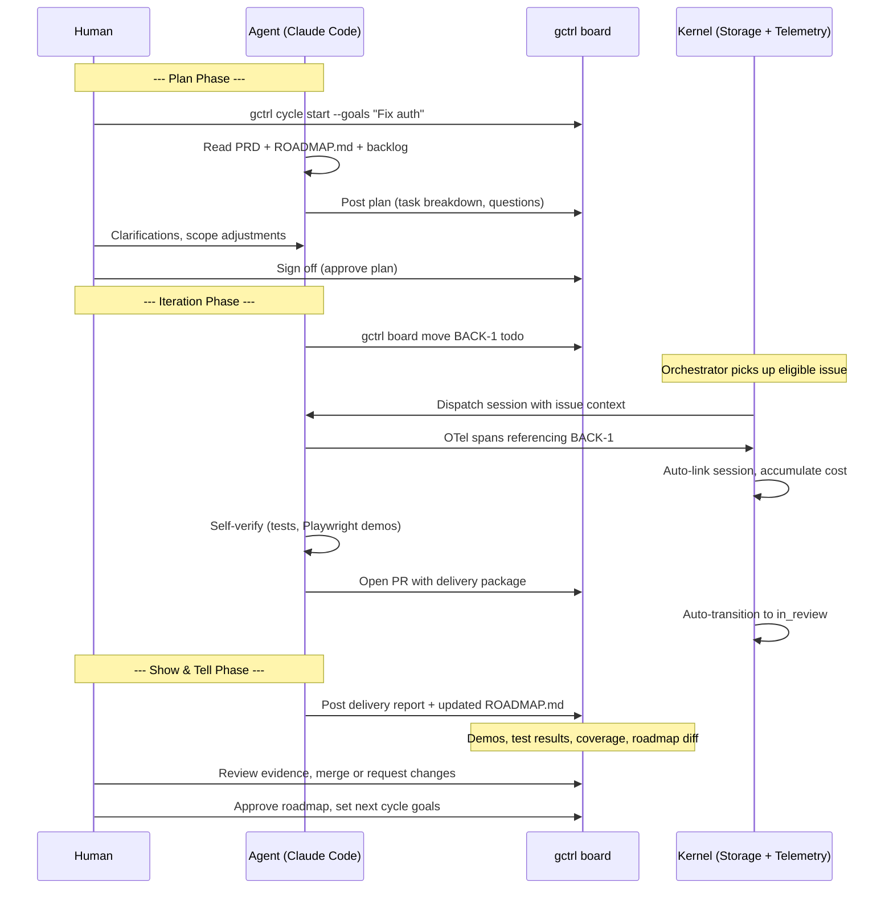

# gctrl-board — Workflow

How work flows through gctrl-board, from issue creation to completion.

## Issue Lifecycle (Kanban)

Follows the [issue lifecycle spec](specs/workflows/issue-lifecycle.md).

```
backlog → todo → in_progress → in_review → done
                                              ↑
              any non-terminal ──────→ cancelled
```

### Transition Rules

| From | To | Required |
|------|----|----------|
| backlog | todo | — |
| todo | in_progress | At least one acceptance criterion (planned) |
| in_progress | in_review | Linked PR (planned) |
| in_review | done | — |
| any non-terminal | cancelled | — |
| done, cancelled | (nothing) | Terminal — no further transitions |

Transitions are validated at the Rust storage layer. Invalid transitions return an error.

### Auto-Transitions

| Trigger | Transition |
|---------|-----------|
| Agent session starts referencing issue key | Link session; if `todo`, move to `in_progress` |
| PR opened referencing issue key | Move to `in_review` |
| PR merged | Move to `done` |
| All blockers resolved | Move blocked issue to `todo` |

## Agent Dispatch Flow

See [product-cycle.md](specs/workflows/product-cycle.md) for the full cycle spec.



## CLI Commands

| Command | Description |
|---------|-------------|
| `gctrl board create-project <name> <key>` | Create a project (e.g. Backend, BACK) |
| `gctrl board projects` | List projects |
| `gctrl board create <project> <title>` | Create an issue (auto-generates BACK-1 ID) |
| `gctrl board list [--project X] [--status X]` | List issues with filters |
| `gctrl board show <id>` | Show issue details, events, comments, sessions |
| `gctrl board move <id> <status>` | Move issue (validates transitions) |
| `gctrl board assign <id> <name> [--type agent]` | Assign to human or agent |
| `gctrl board comment <id> <body>` | Add a comment |

## HTTP API

| Method | Route | Description |
|--------|-------|-------------|
| GET/POST | `/api/board/projects` | List/create projects |
| GET/POST | `/api/board/issues` | List/create issues |
| GET | `/api/board/issues/{id}` | Get issue |
| POST | `/api/board/issues/{id}/move` | Move issue (validated) |
| POST | `/api/board/issues/{id}/assign` | Assign issue |
| POST | `/api/board/issues/{id}/comment` | Add comment |
| GET | `/api/board/issues/{id}/events` | List events |
| GET | `/api/board/issues/{id}/comments` | List comments |
| POST | `/api/board/issues/{id}/link-session` | Link session + cost |

## Project Keys

| Project | Key | Description |
|---------|-----|-------------|
| Backend | BACK | Kernel, storage, CLI, HTTP API |
| Board | BOARD | gctrl-board application itself |
| Infra | INFRA | CI/CD, deployment, cloud sync |

## Agent Personas for Board Work

| Persona | Capabilities | Typical Issues |
|---------|-------------|----------------|
| `claude-code` | read, write, bash, dispatch | Feature implementation, bug fixes |
| `reviewer-bot` | read, comment | Code review, spec review |
| `docs-bot` | read, write | Documentation updates, spec maintenance |

## Deployment

### Architecture

The board deploys as a Cloudflare Worker that serves both the SPA frontend (static assets) and the D1-backed API from a single origin. The frontend uses relative paths (`/api/board/...`), so no kernel API URL configuration is needed — the Worker IS the API.

```
Browser → Cloudflare Worker (gctrl-board)
              ├── /api/*  → D1 database (board state)
              └── /*      → Static assets (Vite SPA)
```

### Environments

| Environment | Worker name | D1 database | Trigger |
|-------------|-------------|-------------|---------|
| **Production** | `gctrl-board` | `gctrl-board-db` | Merge to `main` (auto) or manual dispatch |
| **Preview** | `gctrl-board-preview` | `gctrl-board-preview-db` | PR touching `apps/gctrl-board/**` |

### Local development

```sh
# SPA dev server with hot reload (proxies /api/* to kernel on :4318)
pnpm dev

# Or use Wrangler for local Worker + D1 (closer to production)
wrangler dev
```

### Manual deploy

```sh
# Production
pnpm deploy

# Preview environment
pnpm deploy:preview
```

### CI/CD

- **PR opened/updated** → `deploy.yml` preview job builds web assets and deploys to `gctrl-board-preview` Worker. Preview URL is posted as a PR comment.
- **Merge to main** → CI passes → `deploy.yml` production job deploys to `gctrl-board` Worker with post-deploy health check.
- **Manual dispatch** → `deploy.yml` builds from scratch and deploys to production.

### Required secrets (GitHub Actions)

| Secret | Description |
|--------|-------------|
| `CLOUDFLARE_API_TOKEN` | Cloudflare API token with Workers + D1 permissions |
| `CLOUDFLARE_ACCOUNT_ID` | Cloudflare account ID |

### D1 migrations

Migrations live in `migrations/` and are applied automatically by `wrangler deploy`. To create a new migration:

```sh
wrangler d1 migrations create gctrl-board-db "<description>"
```

## Code Location

| Component | Path |
|-----------|------|
| Effect-TS schemas | `apps/gctrl-board/src/schema/` |
| Effect-TS services | `apps/gctrl-board/src/services/` |
| Effect-TS adapters | `apps/gctrl-board/src/adapters/` |
| Rust storage (DuckDB) | `crates/gctrl-storage/src/duckdb_store.rs` (board methods) |
| Rust HTTP routes | `crates/gctrl-otel/src/receiver.rs` (board handlers) |
| Rust CLI commands | `crates/gctrl-cli/src/commands/board.rs` |
| DuckDB table DDL | `crates/gctrl-storage/src/schema.rs` (`board_*` tables) |
| Domain types | `crates/gctrl-core/src/types.rs` (`BoardIssue`, `BoardProject`, etc.) |
| Architecture spec | `specs/architecture/apps/gctrl-board.md` |
| Tracker spec | `specs/architecture/apps/tracker.md` |
