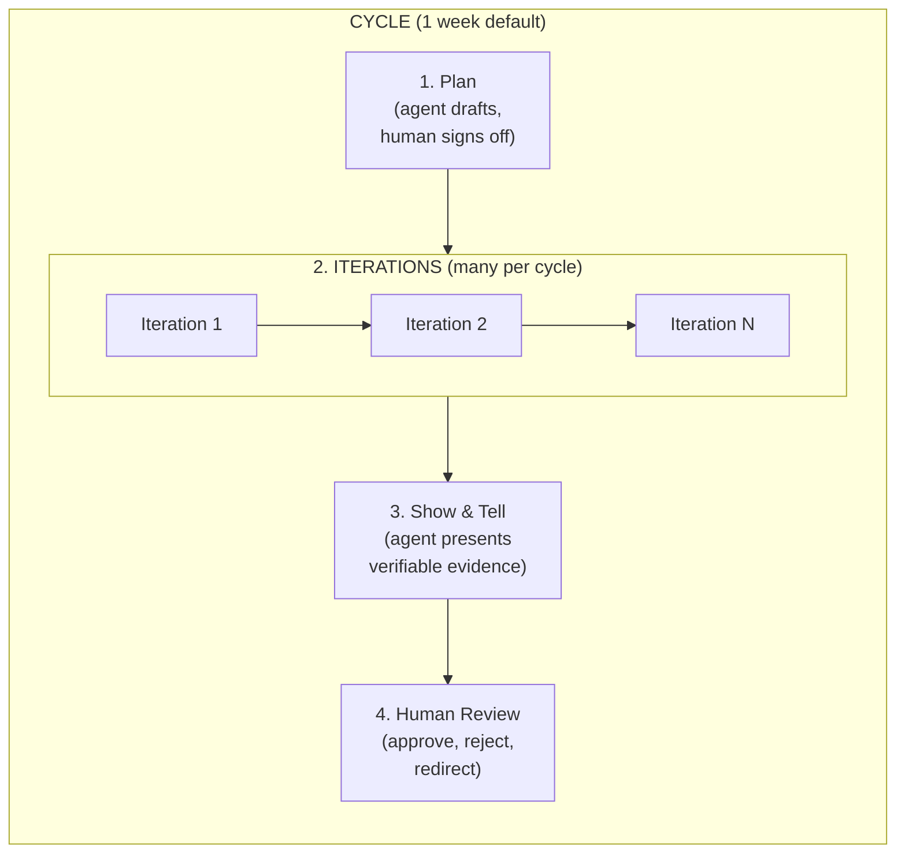
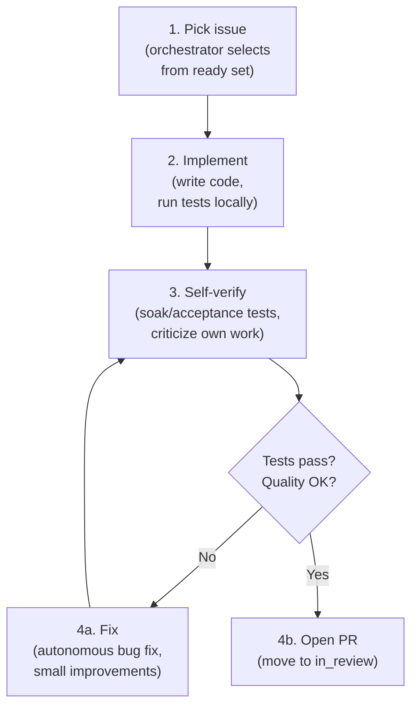

# Product Cycle (Sprint)

Defines the sprint cycle for human+agent teams. A cycle is a time-boxed period (default: 1 week) containing multiple **iterations** — short loops where agents autonomously pick up, work on, and complete issues.

The core loop: **human sets goals → agent drafts plan → human signs off → agent ships verifiable work → agent presents results → human reviews and decides next**.

Related specs: [issue-lifecycle.md](issue-lifecycle.md), [pr-review.md](pr-review.md). Orchestration is a kernel primitive — see [specs/architecture/kernel/orchestrator.md](../../../../specs/architecture/kernel/orchestrator.md).

---

## 1. Cycle Structure



| Phase | Who | Duration | What happens |
|-------|-----|----------|-------------|
| **Plan** | Agent drafts, human signs off | Start of cycle | Agent reads PRD + roadmap, proposes plan with task breakdown. Human asks questions, adjusts scope, approves. |
| **Iterations** | Agent (autonomous) | Bulk of cycle | Agents pick up approved issues, implement, test, open PRs — multiple iterations per cycle |
| **Show & Tell** | Agent presents | End of iteration or cycle | Agent produces verifiable evidence: demos, test results, coverage, updated roadmap |
| **Human Review** | Human decides | After Show & Tell | Human reviews evidence, merges or requests changes, updates priorities |

---

## 2. Plan Phase (Agent-Drafted, Human-Approved)

The agent proposes; the human decides. No work begins until the plan is signed off.

### 2.1 Agent Reads Context

The agent MUST read these inputs before drafting a plan:

1. **PRD** — problem statement, goals, design principles, what we're building.
2. **ROADMAP.md** — current milestone, shipped vs remaining tasks, open questions.
3. **Backlog** — `gctrl board list --status backlog` — what's available.
4. **Existing specs** — architecture and implementation docs relevant to the work.

### 2.2 Agent Drafts Plan

The agent produces a **plan document** (posted as a gctrl-board comment or PR) containing:

1. **Goal** — one sentence: what this cycle delivers and why it matters (traced to PRD).
2. **Task breakdown** — ordered list of issues to create or claim, with acceptance criteria for each.
3. **Dependencies** — which tasks block others, what needs to be done first.
4. **Risks and open questions** — anything the agent is uncertain about, with specific questions for the human.
5. **Estimated scope** — rough sizing (small/medium/large per task) to help the human gauge feasibility.

```sh
# Agent reads context
gctrl board list --status backlog
gctrl board list --status todo
# Agent posts plan as a comment on the cycle issue
gctrl board comment CYCLE-3 "$(cat .tmp/cycle-plan.md)"
```

### 2.3 Human Reviews and Signs Off

The human MUST review the plan before work begins:

1. **Ask clarifications** — push back on assumptions, challenge scope, surface constraints the agent missed.
2. **Adjust scope** — add, remove, or reprioritize tasks. Move items to backlog if the cycle is overloaded.
3. **Sign off** — explicit approval (comment or status change). The agent MUST NOT begin implementation until sign-off.

If the human requests changes, the agent revises the plan and resubmits. This loop repeats until sign-off.

### 2.4 Promote to Issues

After sign-off, the agent creates or moves issues to `todo`:

```sh
gctrl board move BACK-42 todo
gctrl board move BACK-43 todo
gctrl task decompose BACK-44 --sub "Schema migration" --sub "API endpoint" --sub "Tests"
```

Each `todo` issue MUST have acceptance criteria before agents can claim it.

---

## 3. Iteration Phase (Agent-Autonomous)

An iteration is one pass of the agent autonomy loop. A cycle contains many iterations — each iteration targets one issue or a small batch of related issues.

### Agent Autonomy Loop



### 3.1 Pick Up Issues

The orchestrator (see [specs/architecture/kernel/orchestrator.md](../../../../specs/architecture/kernel/orchestrator.md)) selects the next issue from the ready set:

1. Issue MUST be `todo` with zero unresolved blockers.
2. Issue MUST have acceptance criteria.
3. Orchestrator claims the issue, transitions to `in_progress`, and launches the agent.

Agents MUST NOT cherry-pick issues. The orchestrator enforces priority order, concurrency limits, and per-state slot limits.

### 3.2 Implement

The agent works autonomously toward the acceptance criteria:

1. Read relevant specs and source code before writing.
2. Write code, following existing patterns and conventions.
3. Run `cargo test` / `pnpm run test` continuously during implementation.
4. Keep changes focused — one issue, one concern.

### 3.3 Self-Verify (Criticize Own Work)

Before opening a PR, the agent MUST verify its own work:

1. **Run the full test suite.** `cargo test` and any relevant integration tests MUST pass.
2. **Run soak/acceptance tests** where applicable — e.g., load tests for API changes, browser tests for UI changes.
3. **Self-review the diff.** Read the diff as if reviewing someone else's code. Look for:
   - Missing edge cases
   - Broken invariants (see `specs/principles.md`)
   - Unnecessary complexity
   - Missing or stale specs
4. **Log what changed.** Update relevant specs if the implementation changes behavior documented in `specs/`. Add a note in the PR body listing which spec files were updated and why.

### 3.4 Autonomous Fixes

For bug fixes and small improvements discovered during self-verification:

1. Fix the issue directly — do NOT wait for human approval on trivial fixes.
2. **Track the work.** Create a task or issue in gctrl-board so the fix is visible:
   ```sh
   gctrl task create "Fix: off-by-one in pagination query"
   gctrl task done TASK-N --note "Found during self-review of BACK-42"
   ```
3. **Update specs minimally.** If the fix changes documented behavior, update the relevant spec file. Keep the change minimal — match the scope of the fix.
4. Re-run verification after the fix.

### 3.5 Open PR

When self-verification passes:

1. Open a PR referencing the issue (e.g., `Closes #42`).
2. Issue auto-transitions to `in_review`.
3. PR body MUST include:
   - What changed and why
   - Which spec files were updated (if any)
   - Test results summary
4. The agent's iteration for this issue is complete. The orchestrator MAY dispatch the agent to the next issue while the PR awaits review.

---

## 4. Show & Tell Phase (Verifiable Delivery)

Every delivery MUST be verifiable. The agent produces a **delivery package** — concrete evidence that the work is done, not just a claim that it is. The human reviews evidence, not prose.

Show & Tell happens at two levels:
- **Per-issue** — when an agent completes an issue and opens a PR.
- **Per-cycle** — at the end of the cycle, summarizing all work.

### 4.1 Per-Issue Delivery Package

When an agent opens a PR, the PR body MUST include a delivery package:

1. **UI Demo (when applicable)** — Playwright screenshots or video recording showing the feature working. For CLI changes, a terminal recording or annotated output. The demo MUST exercise the acceptance criteria, not just show a happy path.
   ```sh
   # Example: Playwright video capture for a board UI feature
   pnpm exec playwright test --project=chromium --reporter=html tests/acceptance/board-kanban.spec.ts
   # Attach video/screenshot artifacts to the PR
   ```

2. **Test results** — full test suite output. MUST include:
   - Number of tests: total, passed, failed, skipped.
   - New tests added for this issue.
   - Coverage delta (if coverage tooling is configured).
   ```sh
   cargo test 2>&1 | tail -5       # Rust summary
   pnpm run test -- --reporter=verbose  # Effect-TS summary
   ```

3. **Implementation status checklist** — a checklist mapping each acceptance criterion to the evidence that it's met:
   ```markdown
   ## Acceptance Criteria
   - [x] Issues can be moved to `in_progress` — see test `move_issue_lifecycle`
   - [x] Invalid transitions return 400 — see test `reject_backward_transition`
   - [x] Events emitted on every status change — see Playwright video at 0:42
   - [ ] Auto-unblock on blocker completion — deferred to BACK-45
   ```

4. **Spec changes** — which spec files were added or updated, with a one-line reason for each.

### 4.2 Per-Cycle Delivery Report

At the end of the cycle, the agent produces a **cycle report** combining all per-issue evidence into a single document:

1. **Roadmap update** — the agent MUST update `ROADMAP.md` to reflect what shipped, what moved, and what's next. The diff is part of the delivery:
   ```sh
   # Agent updates ROADMAP.md, commits, includes diff in report
   git diff HEAD~1 -- specs/gctrl/ROADMAP.md
   ```

2. **Issues completed** — table with titles, PR links, cost, and a link to each PR's delivery package.

3. **Aggregate demo** — if the cycle delivered a cohesive feature, a Playwright end-to-end recording exercising the full user journey. For CLI-only features, a terminal walkthrough.

4. **Metrics** — total cost, total tokens, sessions count, error rate, test count delta, coverage delta.

5. **Issues remaining** — what was planned but not completed, and why (blocked, descoped, ran out of time).

### 4.3 Suggestions and Clarifications

The agent SHOULD surface suggestions and unresolved questions alongside the delivery report:

1. **Spec gaps** — areas where specs were missing or ambiguous and the agent had to make assumptions.
2. **Risks discovered** — patterns of failures, flaky tests, or architectural concerns found during implementation.
3. **Backlog candidates** — new issues to add based on work done this cycle.
4. **Open questions** — decisions made under uncertainty that need human confirmation. Conflicting specs that need resolution.

Format suggestions as actionable proposals:

```
### Suggestion: Add integration test for session cost aggregation
**Why:** During BACK-42, I found that session cost totals can drift when spans
arrive out of order. The current unit tests don't cover this.
**Proposed action:** Add an integration test in `crates/gctrl-otel/tests/` that
inserts spans in random order and asserts aggregate correctness.
```

### 4.4 Human Review and Next Cycle

The human reviews the delivery package and decides next steps:

1. **Review evidence** — watch demos, check test results, verify acceptance criteria checklist. Approve or request changes on PRs.
2. **Review roadmap update** — confirm the ROADMAP.md diff accurately reflects reality. Adjust priorities.
3. **Act on suggestions** — approve, reject, or defer. Approved suggestions become backlog issues.
4. **Resolve open questions** — answer clarifications so the agent doesn't carry forward uncertainty.
5. **Kick off next cycle** — new Plan phase begins. The agent reads the updated roadmap and PRD to draft the next plan.

---

## 5. Iteration Cadence

A cycle contains many iterations. The iteration cadence is determined by the orchestrator's poll interval and the complexity of issues.

| Cycle Length | Typical Iterations | Issue Size |
|-------------|-------------------|------------|
| 1 week | 10-30 | Small (1-4 hours agent time) |
| 2 weeks | 20-60 | Mix of small and medium |

### What counts as one iteration

1. Agent picks up an issue.
2. Agent implements, self-verifies, and opens a PR (or gets stuck and requests help).
3. One iteration = one issue attempted.

An agent MAY complete multiple iterations per day. The orchestrator manages concurrency — multiple agents MAY work in parallel on different issues.

---

## 6. Agent Responsibilities Summary

| Responsibility | When | Autonomous? |
|---------------|------|-------------|
| Read PRD + roadmap, draft cycle plan | Plan phase | Yes (agent drafts) |
| Seek clarifications, surface open questions | Plan phase | Yes |
| Wait for human sign-off before starting work | Plan phase | No (human approves) |
| Pick up next issue from ready set | Each iteration | Yes (orchestrator selects) |
| Implement to acceptance criteria | Each iteration | Yes |
| Run tests, soak tests, acceptance tests | Before opening PR | Yes |
| Self-review and criticize own work | Before opening PR | Yes |
| Produce per-issue delivery package (demos, tests, checklist) | Before opening PR | Yes |
| Fix trivial bugs found during self-review | During iteration | Yes |
| Create tasks/issues for discovered work | During iteration | Yes |
| Update specs when behavior changes | During iteration | Yes |
| Open PR with delivery package | End of iteration | Yes |
| Produce cycle report with updated roadmap | Show & Tell | Yes |
| Record Playwright demos / terminal walkthroughs | Show & Tell | Yes |
| Surface suggestions and clarifications | Show & Tell | Yes |
| Prioritize backlog | Plan phase | No (human decides) |
| Merge PRs | After review | No (human approves) |
| Set cycle goals | Plan phase | No (human decides) |

---

## 7. CLI Surface

```sh
# --- Plan Phase ---
gctrl cycle start --length 1w --goals "Ship rate limiting" "Fix auth bug"
gctrl board list --status backlog     # agent reads backlog
gctrl board comment CYCLE-3 --body-file .tmp/cycle-plan.md  # agent posts plan
# Human reviews, comments, signs off

# --- Iteration Phase ---
gctrl board list --status todo        # see what's ready
gctrl board assign BACK-42 --agent claude-code
gctrl board move BACK-42 in_progress
gctrl tree <session_id>               # inspect own trace
gctrl analytics cost                  # check spend

# Track autonomous fixes
gctrl task create "Fix: <description>"
gctrl task done TASK-N --note "Found during BACK-42"

# --- Show & Tell Phase ---
gctrl cycle status                    # current cycle progress
gctrl cycle summary                   # generate delivery report

# Playwright demos (agent runs during verification)
pnpm exec playwright test --project=chromium --reporter=html
# Agent updates ROADMAP.md, commits, presents diff
```
