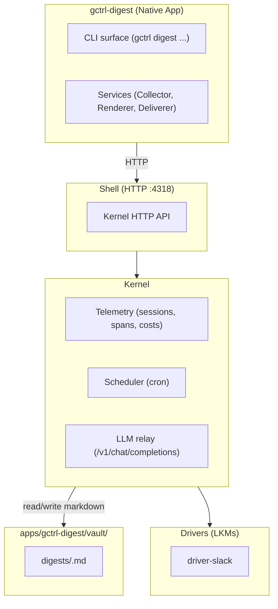

# gctrl-digest — Product Requirements Document (EXAMPLE)

> Worked example illustrating the [PRD template](prd-template.md). The app described here (`gctrl-digest`, a daily activity digester) is **fictional** — this file exists only to ground LLM-drafted PRDs in concrete tone, depth, and section shape. Do not treat as a real roadmap.
>
> Drafts new PRDs should match this depth: every section filled, mermaid diagrams where they clarify, MUST/MUST NOT language in Principles, and a Roadmap that maps directly to gctrl-board issues.

## Architectural Position

gctrl-digest is a **native application** in the gctrl Unix layer model. It rides on the shell and kernel — it does not access DuckDB, LLMs, or external APIs directly.

- **Table namespace:** `digest_*`
- **External delivery:** via kernel drivers only (no direct Slack/email SDKs in the app)
- **Vault is source of truth:** rendered digests live as markdown in `apps/gctrl-digest/vault/digests/`; SQLite holds an index with `vault_path` + `content_hash`

## Problem

1. **No daily summary of agent activity.** Sessions, costs, and PRs are scattered across `gctrl sessions list`, `gctrl analytics`, and individual board issues. A team lead must manually aggregate "what shipped today?" every morning.
2. **Cost trends are invisible without manual queries.** The kernel records per-session cost, but spotting a 30% week-over-week spike requires writing SQL against `analytics`. Most teams never catch the drift until the monthly bill arrives.
3. **Standup blockers are buried in Slack.** Humans say "I'm blocked on X" in chat threads that scroll past. Agents emit blocked-status events that nobody reads. Both belong in a single morning surface.
4. **No durable record.** Slack history rolls off; daily standup notes live in random Notion docs. There is no per-day, queryable, vault-tracked record of "this is what the team and its agents did."

## Our Take

> A daily digest is not a notification — it is a **filed artifact**. Render it once as a markdown file in the vault, then deliver the *same* file to N channels. The vault is the canonical record; channels are stateless windows onto it.

The non-obvious bets:

1. **Vault-as-data.** Each digest is `apps/gctrl-digest/vault/digests/<YYYY-MM-DD>.md`. Re-running the same date is idempotent (same `content_hash`). Querying yesterday's digest is a file read, not a database call.
2. **Dogfooding gctrl.** The Collector reads kernel telemetry via shell HTTP, the Renderer's LLM call is a kernel session with spans, the Deliverer routes through `driver-slack`. No service-account credentials in the app.
3. **One render, many channels.** CLI, Slack post, and email use the same vault file — so a fix to the renderer fixes every surface in one shot.

## Principles

1. **Markdown is the source of truth.** Digests live on disk. The `digest_*` SQLite tables hold `vault_path` + `content_hash` only. Deleting the database MUST be recoverable by re-indexing the vault.
2. **Idempotent delivery.** Sending today's digest twice to the same channel MUST NOT duplicate. Channel state lives in `digest_deliveries`, keyed on `(digest_id, channel)`.
3. **No external API calls from the app.** Slack, email, and any future channel MUST go through a kernel driver. The app MUST NOT import an HTTP SDK for these services.
4. **Cost-visible.** Each digest shows the LLM cost it incurred. A digest that exceeds the configured per-day budget pauses the next render and surfaces an inbox alert — never silently truncates.
5. **Cron is the kernel's job.** Scheduling lives in the kernel Scheduler; the app exposes `gctrl digest render` and lets the kernel decide when to call it.

## Target Users

### Primary: Team lead running an agent-augmented engineering team

| Need | Surface | Solution |
|------|---------|----------|
| "What did the team and agents ship yesterday?" | Slack | Morning digest at 09:00 with sessions, PRs, board moves, blockers |
| "Are we trending over budget?" | CLI | `gctrl digest cost --since 7d` shows daily LLM spend |
| "Re-render yesterday with the new template" | CLI | `gctrl digest render --date 2026-05-01 --force` |
| "Find the digest from the day BACK-42 was closed" | Vault | Open `apps/gctrl-digest/vault/digests/<date>.md` in any editor |

### Secondary: Solo developer using gctrl as a personal productivity loop

| Need | Surface | Solution |
|------|---------|----------|
| "What did I work on this week?" | CLI | `gctrl digest list --since 7d` |
| "Export the last month for a status report" | CLI | `gctrl digest export --since 30d --format markdown` |

## Use Cases

### UC-1: Daily Digest Render and Deliver

**Problem:** Team lead wakes up, wants the 5-minute readout before 09:00 standup.

**Solution:** Kernel Scheduler fires `digest.daily` at 08:30 local. Collector queries `/api/sessions`, `/api/analytics`, and `/api/board/events` for the prior 24h. Renderer issues an LLM call (model `claude-opus-4-7`) to compose a digest. Output is written atomically to `apps/gctrl-digest/vault/digests/<date>.md`. Deliverer reads the file and posts to Slack via `driver-slack`. Idempotency is keyed on `(digest_id, channel)` in `digest_deliveries`.

**Success metric:** Digest delivered to Slack within 60s of schedule on ≥95% of weekdays.

### UC-2: Re-render After Template Change

**Problem:** Renderer template was wrong yesterday — digest missed the agent-blocked count.

**Solution:** `gctrl digest render --date 2026-05-01 --force` re-runs the pipeline for the named date. The vault file is overwritten; `content_hash` changes; the next delivery picks up the new content (existing deliveries are NOT auto-resent — the user re-runs `gctrl digest deliver` if they want the channels updated).

**Success metric:** Re-render is idempotent on input; differs on output only when source data or template changed.

### UC-3: Cost Anomaly Surfacing

**Problem:** A new agent variant burned 3× the usual LLM cost overnight; nobody noticed for a week.

**Solution:** Each digest computes `cost_delta_pct` vs the trailing 7-day mean. If `cost_delta_pct > 50%`, the digest's leading section flags the anomaly with a link to the offending sessions. An inbox message of urgency `high` is also created.

**Success metric:** Cost anomalies >50% above the 7-day mean surface in the next morning's digest.

## What We're Building

### CLI

- `gctrl digest render [--date YYYY-MM-DD] [--force]` — render one day's digest
- `gctrl digest list [--since 7d]` — list recent digests with `vault_path`, cost, delivery state
- `gctrl digest show <date>` — print the rendered digest
- `gctrl digest deliver <date> [--channel slack|email|all]` — fan out delivery
- `gctrl digest cost [--since 30d]` — daily LLM cost trend

### HTTP API

Routes under `/api/digest/*` on the kernel: `GET /api/digest`, `GET /api/digest/{date}`, `POST /api/digest/render`, `POST /api/digest/deliver`. Same surface the CLI uses.

### Vault Layout

- `apps/gctrl-digest/vault/digests/<YYYY-MM-DD>.md` — rendered digests (gitignored, R2-synced)
- `apps/gctrl-digest/vault/templates/<name>.md` — Renderer prompt templates (git-tracked, user-authored)

### Storage

`digest_renders`, `digest_deliveries`, `digest_anomalies` — all SQLite, all index-only (`vault_path` + `content_hash`).

### Drivers Needed

| Driver | Purpose | Status |
|--------|---------|--------|
| `driver-slack` | Post message to a Slack channel | Planned (blocks M1) |
| `driver-email` | Send digest by email | Planned (M2) |

## Roadmap

### Shipped

| Feature | Description | Status |
|---------|-------------|--------|
| (none yet — pre-M0) | | |

### Next

| Feature | Priority | Issue |
|---------|----------|-------|
| Collector (sessions + analytics + board events for one day) | P0 | TBD |
| Renderer (LLM call → vault markdown file, atomic write) | P0 | TBD |
| `gctrl digest render` + `gctrl digest show` CLI | P0 | TBD |
| `digest_renders` SQLite index with `vault_path` + `content_hash` | P0 | TBD |
| Scheduler integration (cron `digest.daily`) | P1 | TBD |
| `driver-slack` + Deliverer with idempotency | P1 | TBD |
| Cost anomaly detection + inbox surfacing | P1 | TBD |
| `driver-email` | P2 | TBD |

### Backlog

- Per-team digests (filter by board project)
- Weekly + monthly rollups
- Custom Renderer templates per delivery channel
- Score digests in `eval_scores` (signal/noise, length, accuracy)

## Non-Goals

- **Not a notification system.** No streaming alerts, no real-time pushes — daily cadence only. Use `gctrl-inbox` for actionable alerts.
- **Not an analytics dashboard.** No charts, no UI. The digest is text. Use the kernel's analytics endpoints if you need a dashboard.
- **Not a project management tool.** Board state lives in `gctrl-board`. The digest reads from it; it does not own issue state.
- **Not a chatbot.** No conversational surface. The digest is a render target, not a query interface.

## Success Criteria

1. **Daily delivery.** Digest reaches Slack within 60s of schedule on ≥95% of weekdays over a 30-day window.
2. **Vault portability.** Deleting the SQLite database and re-running `gctrl digest reindex` reproduces the same `digest_renders` rows from the vault files.
3. **Cost bounded.** Daily LLM cost stays ≤ configured budget; overspend pauses the next render and surfaces an inbox alert.
4. **Anomalies caught.** A deliberate 3× cost spike is flagged in the next morning's digest, not after a week.
5. **Idempotent re-render.** `gctrl digest render --date X --force` produces a byte-identical file when source data and template are unchanged.

## Open Questions

- [ ] Should `gctrl digest deliver` auto-fire after a forced re-render, or stay manual? — needed by M1
- [ ] Where does the Renderer template live for multi-tenant setups (per-vault override vs. shared)? — needed by M2
- [ ] Do we record per-channel delivery failures with retry, or fail-fast and surface via inbox? — needed by M1
