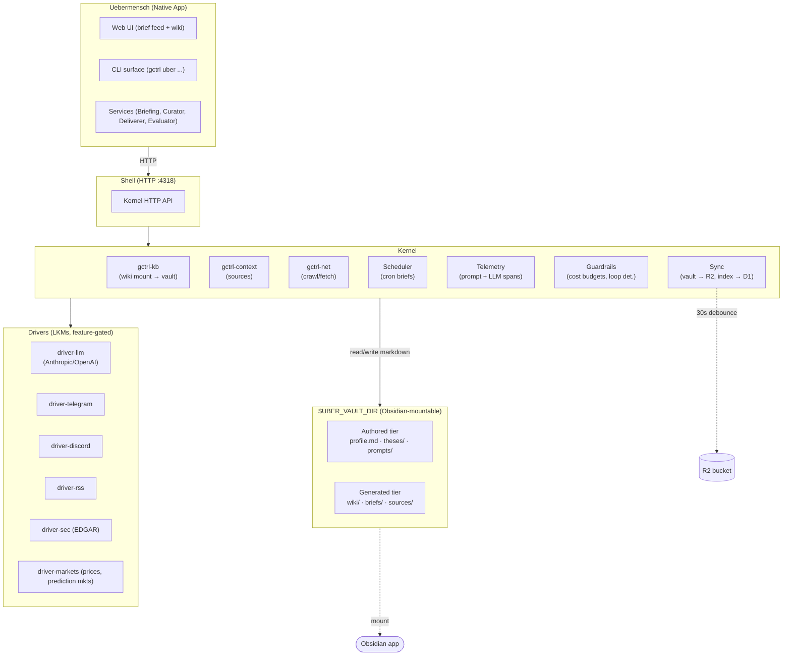

# Uebermensch — Product Requirements Document

> Personal Chief of Staff for investors. Watches the topics you care about, files them into a Karpathy-style knowledge wiki stored as a plain-markdown Obsidian vault, syncs the vault across devices via R2, and delivers timely briefs + long-horizon analyses to the App, Telegram, and Discord. A native gctrl application.
>
> Instantiates the [PRD template](../gctrl-board/specs/workflows/prd-template.md).

## Architectural Position

Uebermensch is a **native application** in the gctrl Unix layer model. It rides on the shell and kernel — it does not access DuckDB, LLMs, or external APIs directly.

- **Table namespace:** `uber_*` (see Invariant #3 in [principles.md](../../specs/principles.md))
- **Wiki infrastructure:** reuses `gctrl-kb` mounted at `$UBER_VAULT_DIR/wiki/` — see [knowledgebase.md](../../specs/architecture/kernel/knowledgebase.md)
- **External data:** via kernel drivers only (LLM, Telegram, Discord, RSS, SEC, markets). App MUST NOT call external APIs directly — see [os.md § Dependency Direction](../../specs/architecture/os.md#dependency-direction-invariant)
- **Vault = Profile:** `$UBER_VAULT_DIR` (default `~/uebermensch-vault`) is both the portable profile git repo AND the Obsidian-mountable markdown vault. Briefs, wiki pages, and sources are plain markdown files. SQLite holds only an index (`vault_path` + `content_hash`). R2 sync makes the vault multi-device. See [specs/profile.md](specs/profile.md).
- **Related apps:** subsumes the [researcher-market](../../specs/architecture/apps/researcher-market.md) and [researcher-agentic](../../specs/architecture/apps/researcher-agentic.md) patterns, adding daily briefings, action items, and multi-channel delivery

## Problem

1. **Signal is buried in noise.** An investor running a fund needs to track dozens of topics (AI infra, prediction markets, regulatory shifts, earnings). Twitter, RSS, and newsletters produce 1000× the volume of actionable signal. Manual triage every morning is unsustainable.
2. **Nothing compounds.** Reading a great essay today doesn't connect it to the thesis you wrote three months ago. Notes apps don't cross-reference; RAG re-derives synthesis every query. Knowledge evaporates.
3. **Short-horizon tools ignore long-horizon bets.** News aggregators optimise for today. Investment theses play out over years. The same system SHOULD serve "what moved overnight?" and "has my AI capex thesis held up against the last 6 months of data?"
4. **Hype contaminates deep analysis.** Most summarisers reproduce whatever is loudest — announcement posts, launch tweets, analyst hot takes. A Chief of Staff must filter *against* hype, weighting primary sources (filings, papers, transcripts) over secondary commentary.
5. **Delivery is scattered.** Morning coffee → phone; commute → messaging app; deep-work → desktop. A single brief MUST reach the user where they are: App when at desk, Telegram on the go, Discord for collaborative rooms.
6. **LLM and scrape pipelines are unobservable.** When a brief misses a story or surfaces a false one, there's no way to trace back which prompt, which source, which scrape pass failed. Prompt regressions ship silently; stale selectors return empty briefs without alerts.
7. **Profile lock-in.** The interests, theses, watchlists that make the assistant useful are the user's IP. They MUST live outside any single app, portable across tools and shareable with future team members.

## Our Take

> A Chief of Staff is not a summariser. It is a **curator plus correspondent**: it reads everything, files it into a persistent knowledge base scoped to the user's theses, and surfaces exactly the few items that matter — backed by citations the user can verify in one click.

The non-obvious bets:

1. **Knowledge wiki, not RAG feed.** Following [Karpathy's LLM KB pattern](https://gist.github.com/karpathy/442a6bf555914893e9891c11519de94f) and Vannevar Bush's Memex, Uebermensch writes every ingest into a persistent, cross-linked markdown wiki governed by a schema. The LLM maintains; the human curates. Synthesis compounds.
2. **Vault-as-data.** Topics, theses, watchlists, style-guides, avoid-lists, wiki pages, and rendered briefs all live as plain markdown + YAML in an Obsidian-mountable git repo (`uebermensch-profile` = `$UBER_VAULT_DIR`). The app reads and writes through it — never owns the bytes. Open the vault in Obsidian to browse the graph, curate wiki pages, and edit theses by hand. Swap vaults to impersonate another investor; share vaults with teammates. SQLite is just an index over the files.
3. **Dogfooding gctrl.** Every LLM call is a kernel Session with spans; every prompt is versioned in `prompt_versions`; every scrape is a `TrafficRecord`. Eval scores on briefs flow into the kernel `scores` table. Cost budgets are enforced by guardrails. Observability is not an add-on — it is the bedrock.
4. **Deliverer, not pusher.** Daily brief is a *render target* produced once (as a markdown file in the vault) and delivered to N channels (App, Telegram, Discord). Channels are drivers; adding a new one means writing a driver, not re-building the pipeline.
5. **Short-horizon and long-horizon share a backbone.** The same knowledge base powers the 08:00 "what changed overnight?" brief and the monthly "is my AI infra thesis still intact?" deep-dive. Differences are query shape and delivery cadence, not data model.

## Principles

1. **Vault is portable and Obsidian-mountable.** `$UBER_VAULT_DIR` is a git-versioned Obsidian vault outside the gctrl repo, readable without Uebermensch running. Every file is CommonMark markdown with YAML frontmatter; wikilinks use plain `[[slug]]` form (typed prefixes like `[[thesis:slug]]` are forbidden — they break Obsidian's resolver). The app MUST NOT write to the authored tier (profile.md, theses/, prompts/) without explicit user confirmation.
2. **Markdown is the source of truth.** Briefs, wiki pages, sources, and theses live on disk as markdown files. SQLite tables (`uber_briefs`, `uber_brief_items`, …) hold `vault_path` + `content_hash` only — pure index. Opening the vault in Obsidian MUST show everything; deleting SQLite MUST be recoverable by re-indexing.
3. **Wiki compounds.** Every ingest MUST file at least one wiki page (source summary) and update relevant entity/topic pages. Drop-and-forget ingestion is a bug, not a feature.
4. **Primary sources over commentary.** The curator MUST weight SEC filings, earnings transcripts, primary research, and official announcements above secondary commentary. Hype-tagged sources are tracked but never lead a brief.
5. **Cite everything.** Every claim in a brief MUST link back to a source page in the wiki. No unsourced statements. "The LLM said so" is not a source.
6. **Delivery is idempotent.** Sending the same brief twice to the same channel MUST NOT duplicate. Channel delivery state lives in kernel storage, not in messages.
7. **Eval is continuous.** Every brief produced MUST be scoreable by the human (thumbs up/down, dimension scores) and by automated evaluators (citation coverage, hype ratio, scrape health). Scores flow into the kernel `scores` table and close the loop on prompt improvement. Evaluators read the brief markdown from the vault and pin results with `content_hash` so scores survive later edits.
8. **Local-first, cloud-optional.** Briefs render locally, to the local vault. Vault sync to R2 is a first-class feature (not opt-in by M1) so a second device can mount the same vault; the local daemon is still authoritative and the user MUST be able to read yesterday's brief offline.
9. **Agent-native.** Every surface (ingest, query, brief, deliver, score) MUST be reachable via CLI and HTTP API, so agents can run Uebermensch workflows and gctrl-board can dispatch Uebermensch tasks.
10. **Cost-visible.** Each brief shows its accumulated LLM cost. A daily brief that exceeds the configured budget is paused, not silently truncated.
11. **No opinion without a thesis.** Briefs tag items as `aligns-with`, `contradicts`, or `unrelated` to the user's active theses. An item that doesn't map to any thesis is either filed under "watch" or demoted from the brief.

## Target Users

### Primary: Investor running a fund (initial user: profile owner)

| Need | Surface | Solution |
|------|---------|----------|
| "What changed in my topics overnight?" | App + Telegram | Morning brief (default 08:00 local) with 5–10 items, each ≤120 words with citation chips |
| "Is my AI-infra thesis still intact after Q1 earnings?" | App | On-demand deep-dive — reads all wiki pages tagged with the thesis, synthesises an update, files as `wiki/synthesis/thesis-ai-infra-2026-q1.md` |
| "Add this post to my knowledge base without reading it now" | CLI / Telegram bot | `gctrl uber ingest --url <x>` or `/ingest <url>` in Telegram; shows in inbox when filed |
| "What do I believe about prediction markets?" | App | Query surface returns synthesis page plus last-updated date; stale → flag |
| "Don't surface any more hype posts about GPT-5" | CLI / App | Add `avoid: hype-about: gpt-5` to profile; curator demotes matching sources |
| "Tell me when Polymarket shifts >10% on a topic I follow" | Telegram / Discord | Alert rule on `driver-markets` traffic → brief item with urgency `high` |
| "How much am I spending on this assistant per day?" | App | Budget widget showing daily LLM + scrape cost, reading from kernel `analytics` |
| "Review this week's briefs and score them" | App | Brief archive with inline scoring form (quality, signal/noise, citation-coverage) |

### Secondary: Analyst / chief of staff on the investor's team

| Need | Surface | Solution |
|------|---------|----------|
| "Run Uebermensch with my own vault" | Filesystem | Point `UBER_VAULT_DIR` at a different path (also works as the Obsidian vault to open) |
| "Hand off a draft thesis the investor should read" | App / Obsidian | Write `theses/thesis-x.md` directly in Obsidian → VaultWatcher reindexes, flagged in next brief |
| "Audit how the investor's theses evolved this quarter" | App | Thesis history view — git log on `$UBER_VAULT_DIR` + wiki page versions |

### Tertiary: Any knowledge worker who wants a Chief of Staff

Uebermensch is profile-parameterised. An ML researcher, policy wonk, or clinician can swap in a profile scoped to their topics and reuse the same pipeline.

## Use Cases

### UC-1: Morning Brief (short-horizon)

**Problem:** Investor wakes at 07:45, needs the 10-minute read before stand-up at 08:30.

**Solution:**
1. Kernel Scheduler fires `uber.brief.daily` at 07:30 local (configured in profile).
2. Briefing pipeline reads active topics from profile, queries wiki for items tagged with topics, ingested in last 24 h.
3. Curator LLM call (with prompt versioned in `prompt_versions`) selects and summarises 5–10 items; each cites its wiki source page via bare `[[slug]]`.
4. Brief rendered atomically to `$UBER_VAULT_DIR/briefs/<YYYY-MM-DD>.md` with YAML frontmatter; `uber_briefs` index row inserted with `vault_path` + `content_hash`.
5. Deliverer reads the vault markdown and sends to all active channels: App (web feed), Telegram (message), Discord (webhook post).
6. Each channel delivery logged in `uber_deliveries` — idempotency key `(brief_id, channel)`.
7. Brief visible in App inbox, in Obsidian (open the file / follow backlinks); Telegram/Discord receive formatted message with "View full brief" link.

**Success metric:** 08:00 brief delivered to at least one channel on 95% of mornings, within 60 s of schedule, accumulated cost ≤ configured daily budget.

### UC-2: Thesis Deep-Dive (long-horizon)

**Problem:** User writes "is my AI-infra capex thesis still intact?" at 14:00.

**Solution:**
1. User runs `gctrl uber deepdive "ai-infra-capex"` or clicks thesis card in app.
2. Pipeline reads the thesis page from the authored tier (`theses/ai-infra-capex.md`), extracts its claims and prior citations.
3. Queries wiki for evidence pages ingested since thesis `updated_at` that link to the same entities/topics.
4. LLM call (separate prompt template `deepdive.md`) produces a "thesis update" — what new evidence supports, contradicts, or extends each claim.
5. Output filed as `wiki/synthesis/thesis-ai-infra-capex-update-2026-04-18.md` with backlinks.
6. Rendered into brief, delivered to App (primary channel for long-form).

**Success metric:** Deep-dive reads ≥80% of evidence pages linked to the thesis, cites every claim, surfaces at least one "new since last update" item.

### UC-3: Action Items

**Problem:** Brief mentions "NVDA Q1 guidance raise" — user wants to convert that into an action: "rebalance, call advisor, update model".

**Solution:**
1. Each brief item carries an optional `action` field generated by the curator (or suggested by a follow-up LLM pass).
2. User clicks "convert to action" in app → creates a gctrl-board issue in project `UBER` via kernel HTTP API (`/api/board/issues`).
3. Issue keeps backlink to the brief item (`source_brief_id`) and wiki page.
4. User tracks follow-through in gctrl-board; Uebermensch queries open `UBER-*` issues and reminds in next brief if past due.

**Success metric:** Actions created from briefs are closeable within gctrl-board with zero manual context re-entry; stale actions surface in the next brief until resolved.

### UC-4: Inbound Ingestion from Telegram/Discord

**Problem:** User reading on phone sees a good post; wants to add to KB without context switching.

**Solution:**
1. User forwards link / message to `@uebermensch_bot` in Telegram or uses `/ingest <url>` in a Discord DM.
2. `driver-telegram` / `driver-discord` receives webhook, creates traffic record, emits kernel IPC event.
3. Uebermensch subscribes, invokes `gctrl kb ingest --url <x>` via shell HTTP API — writes `$UBER_VAULT_DIR/wiki/sources/<slug>.md`.
4. On success, responds in same chat: "Filed as `sources/<slug>.md`, linked to `[[<entity>]]`, `[[<topic>]]`."
5. Next day's brief considers this source among ingest-since-yesterday items; the new file appears in Obsidian's graph on the next vault pull.

**Success metric:** <30 s from user forward to "filed" confirmation; source appears in next morning's brief if it matches active topics.

### UC-5: Prompt Regression Detection

**Problem:** A prompt change silently makes briefs 30% shorter and drops citations.

**Solution:**
1. Every brief pipeline run emits OTel spans for each LLM call, tagged with `prompt_hash`.
2. Automated evaluator runs on each new brief: `citation_coverage = cited_claims / total_claims`, `hype_ratio`, `avg_item_length`, `avg_cost_per_brief`.
3. Scores written to the kernel `scores` table with `target_type='uber_brief'`, `target_id=<brief_id>`.
4. Alert rule: if `citation_coverage` drops >20% vs 7-day rolling mean, fire kernel alert → inbox message urgency `high` linked to the new `prompt_hash`.
5. User sees inbox item, opens prompt diff in app, rolls back or fixes.

**Success metric:** Citation-coverage regressions caught in the next brief (not after a week of silent degradation).

### UC-6: Scrape Quality Monitoring

**Problem:** A news site changes its HTML; scraper returns empty content; briefs lose a source without noise.

**Solution:**
1. Each scrape (via `gctrl net fetch` / `gctrl net crawl`) emits a `TrafficRecord` and a computed `content_quality` score (word count, readability success, readability-to-full ratio).
2. Scrape eval pipeline aggregates per-domain success rate daily.
3. When a domain's 7-day success rate drops below threshold (default 60%), fire inbox alert.
4. Affected briefs are annotated: "source <domain> unavailable; 3 items missed".

**Success metric:** Scrape failures surface within 24 h, not "user notices two weeks later."

## What We're Building

### Vault (external, Obsidian-mountable)

A single directory at `$UBER_VAULT_DIR` (default `~/uebermensch-vault`) holding:

- **Authored tier** (git-tracked): `profile.md`, `topics.md`, `sources.md`, `theses/<slug>.md`, `prompts/*.md`, `.obsidian/` — edited by the user in Obsidian or any editor.
- **Generated tier** (gitignored, R2-synced): `wiki/**` (`wiki/sources/<slug>.md`, `wiki/synthesis/<slug>.md`, entities, topics, questions) + `briefs/<YYYY-MM-DD>.md` — written by the kernel + Uebermensch services.

Every file is CommonMark + YAML frontmatter. Wikilinks use plain `[[slug]]` — Obsidian and `gctrl-kb` share one resolver. A `VaultWatcher` fiber watches `fs.watch` events so user edits are reindexed without a restart. Full format in [specs/profile.md](specs/profile.md).

### Knowledge Base (investment-scoped)

Extends `gctrl-kb` with investment-specific page types (Thesis, Company, Sector, Macro-theme, Market, Person, Source, Deep-dive) and a `kb-schema.md` governing conventions. Mounted at `$UBER_VAULT_DIR/wiki/` (generated) and `$UBER_VAULT_DIR/theses/` (authored). Human curates; LLM maintains. Full spec in [specs/knowledge-base.md](specs/knowledge-base.md).

### Briefing Pipeline

1. **Ingest loop** — subscribes to `kb.source.ingested` events + scheduled RSS/markets/EDGAR polls. Triggers wiki maintenance.
2. **Curator** — LLM call ranks recent wiki updates against active topics, produces a brief (short-horizon) or deep-dive (long-horizon).
3. **Deliverer** — renders brief to each active channel, idempotent per `(brief_id, channel)`.
4. **Evaluator** — scores brief (automated + human).

See [specs/briefing-pipeline.md](specs/briefing-pipeline.md).

### Delivery Channels

- **App** — web UI served by Uebermensch on a distinct port (mirrors gctrl-board pattern). Brief feed, wiki explorer, thesis tracker, prompt/eval dashboards.
- **Telegram** — via `driver-telegram` kernel LKM. Bot commands: `/brief`, `/ingest`, `/deepdive <thesis>`, `/score`.
- **Discord** — via `driver-discord` kernel LKM. Webhook posts + slash commands in configured channels.

Full spec in [specs/delivery.md](specs/delivery.md).

### Eval & Monitoring

- **LLM prompts** — every call versioned via `prompt_versions`; every brief scored on citation-coverage, hype-ratio, length, cost, human-thumbs.
- **Scrape quality** — per-domain success rate, content quality, staleness. Alerts on regressions.
- **Knowledge-base health** — orphan rate, stale theses, contradiction count (reuses `gctrl kb lint`).

Full spec in [specs/eval.md](specs/eval.md).

### Drivers Needed (kernel LKMs)

| Driver | Purpose | Kernel interface | Status |
|--------|---------|------------------|--------|
| `driver-llm` | Unified LLM interface (Anthropic, OpenAI) — every call = Session + spans | `LlmPort` (new) | Planned (blocks M0) |
| `driver-telegram` | Bot webhook + send API | `MessagingPort` (new) | Planned (blocks M2) |
| `driver-discord` | Webhook + slash commands | `MessagingPort` | Planned (blocks M2) |
| `driver-rss` | Scheduled RSS polling → source ingest | `SourcePort` (new) | Planned (blocks M1) |
| `driver-sec` | SEC EDGAR filings polling | `SourcePort` | Planned (M3) |
| `driver-markets` | Prices + prediction market (Polymarket) | `MarketDataPort` (new) | Planned (M3) |

Driver definitions live in new kernel crates (`kernel/crates/gctrl-driver-<name>/`), feature-gated. See [os.md § 5](../../specs/architecture/os.md) for the driver/adapter distinction. Uebermensch MUST NOT ship its own HTTP clients for these services.

## Roadmap

See [ROADMAP.md](ROADMAP.md) for the milestone → task breakdown.

## Non-Goals

1. **Not a portfolio manager.** No position tracking, P&L, or broker integration. The wiki tracks theses about the world; execution lives in brokerage accounts.
2. **Not a quant signal generator.** Uebermensch does not backtest strategies or produce buy/sell signals. It surfaces primary-source evidence for the human to reason over.
3. **Not a replacement for Bloomberg/FactSet.** Structured market data is out of scope beyond whatever `driver-markets` integrates. Uebermensch operates on unstructured primary-source text.
4. **Not a social network.** No feeds, followers, reactions. Delivery is 1-to-1 (user ↔ channels).
5. **Not a chatbot.** The App is not a chat UI. Conversation with the knowledge base happens via `gctrl kb query`; briefs are rendered, not chatted.
6. **Not a general-purpose summariser.** Uebermensch refuses sources outside the user's topics/theses — scope-creep is a failure mode, not a feature.
7. **Not profile-less.** Running Uebermensch without a profile is unsupported. The profile is the policy; without it the app has nothing to filter against.

## Success Criteria

1. **Brief delivered on schedule.** Daily brief reaches at least one channel within 60 s of scheduled time on ≥95% of days over a 30-day window.
2. **Citation coverage ≥90%.** Every brief item links to at least one wiki source page in 90%+ of items. Uncited items are explicit exceptions (e.g., profile-declared "user commentary"). Typed wikilink prefixes (`[[type:slug]]`) in any rendered brief fail the brief.
3. **Wiki compounds monotonically.** Over any 7-day window, the vault gains entity/topic markdown files and link density; orphan rate stays below 10%.
4. **Cost stays bounded.** Daily LLM + scrape cost stays ≤ configured budget in profile; overspend pauses the next brief and alerts the user, never silently continues.
5. **Prompt regressions caught.** A deliberate prompt regression (e.g., strip citations) is detected by the evaluator within the next brief cycle. Eval results are pinned to the `content_hash` of the brief markdown file and survive later vault edits.
6. **Vault portability.** Switching `UBER_VAULT_DIR` to a second vault produces different topics/brief without touching app code or data. Opening either vault directly in Obsidian MUST show the same content the app sees.
7. **Multi-device via R2.** A fresh device running `gctrl uber vault pull --from r2` for the same `identity.name` mounts an identical vault and can render today's brief from the same inputs.
8. **Three channels live.** App, Telegram, Discord each deliver the same brief idempotently. A user acts on an action item in any channel; other channels reflect the updated state within one brief cycle.
9. **Deep-dive utility.** At least one thesis deep-dive per month produces a `wiki/synthesis/thesis-*-update-<date>.md` vault file with ≥3 new evidence citations.
10. **Scrape health visible.** The app shows per-domain scrape success over 7/30-day windows; any domain below 60% surfaces in the inbox.

## Open Questions

1. **LLM driver shape.** Should `driver-llm` proxy all LLM traffic through the kernel (for central cost accounting and prompt caching) or should Uebermensch hold the key itself? **Leaning:** kernel proxy, to match the "external APIs go through drivers" invariant. Needed by M0.
2. **Authored-tier write-back.** When the curator suggests refining a thesis, does it write to the authored tier (`theses/<slug>.md`, with user confirmation via a PR-style diff) or only to the generated tier (`wiki/` incl. `wiki/synthesis/`, `briefs/`)? **Leaning:** generated tier only; authored edits are user-driven in Obsidian or via git. Needed by M1.
3. **Channel authentication.** How does the Telegram/Discord bot verify "this inbound ingest request is from the profile owner"? **Leaning:** per-user token stored in profile, bot checks sender ID. Needed by M2.
4. **Alerting granularity.** Should alerts (prediction market moves, earnings surprises) push immediately or batch into the next brief? **Leaning:** configurable per-topic in profile; default batch, opt-in to immediate push. Needed by M3.
5. **Multi-user / multi-device model.** Single-vault-per-daemon is clear, but is a shared team vault in R2 allowed (multiple daemons pulling the same `identity.name`)? **Leaning:** single-profile per daemon; two devices for the same user is fine (local-wins conflict policy); team mode is N daemons with N vaults and cross-links by agreement. Needed by M4.
6. **Prediction-market data source.** Polymarket has terms that may restrict automated scraping; Kalshi has an API. **Leaning:** start with Kalshi via API (`driver-markets`); Polymarket is best-effort public endpoint only. Needed by M3.
7. **Profile schema migrations.** When the profile YAML schema changes, how do user vaults migrate? **Leaning:** ship a `gctrl uber profile migrate` command that rewrites the authored-tier files in place with a preview diff; the command is idempotent so running it twice is a no-op. Needed by M2.
8. **Vault conflict UX.** R2 sync emits `<name>.conflict-<device>-<ts>.md` files on divergence. Does Uebermensch surface these in the App inbox, or is Obsidian's file browser enough? **Leaning:** App inbox item per conflict file + `gctrl uber vault conflicts` CLI. Needed by M1.
