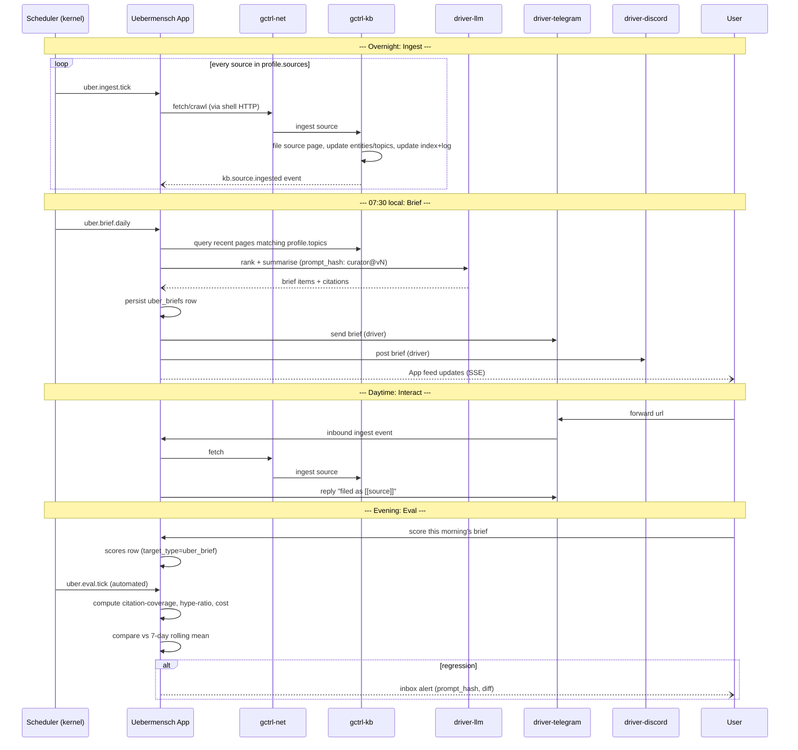

# Uebermensch — Workflow

How work flows through Uebermensch, from source ingestion to delivered brief.

## Daily Cycle

## Ingest Lifecycle

| Stage | Actor | Storage | Notes |
|-------|-------|---------|-------|
| **Source arrives** | driver-rss / user forward / scheduled crawl | `traffic` (kernel) | Raw HTTP capture; domain, URL, bytes, timestamp |
| **Page rendered** | `gctrl-net` | filesystem `~/.local/share/gctrl/spider/<domain>/` | Markdown via readability; quality gate (min-words); pre-vault staging |
| **Source filed** | `gctrl kb ingest` (agent workflow) | `context_entries` (kernel index) + `$UBER_VAULT_DIR/wiki/sources/*.md` (markdown) | Source summary page; provenance preserved; appears in Obsidian graph immediately |
| **Entities/topics updated** | LLM ingest pass | `$UBER_VAULT_DIR/wiki/entities/*.md`, `$UBER_VAULT_DIR/wiki/topics/*.md` | Cross-links added; contradictions flagged |
| **Index + log updated** | LLM ingest pass | `$UBER_VAULT_DIR/wiki/index.md`, `$UBER_VAULT_DIR/wiki/log.md` | Catalog + chronological audit |
| **Brief-eligible** | curator query | read-only | Page enters the next brief candidate set if tagged with an active topic and updated within the brief window |

## Briefing Lifecycle

| Stage | Actor | Storage | Notes |
|-------|-------|---------|-------|
| `pending` | Scheduler creates row | `uber_briefs` (SQLite) | Triggered by cron or on-demand (`gctrl uber brief`) |
| `curating` | Curator LLM run | `sessions` + `spans` | prompt_hash recorded; cost accumulates |
| `rendered` | Renderer writes vault markdown + SQLite index | `$UBER_VAULT_DIR/briefs/<YYYY-MM-DD>.md` + `uber_briefs.vault_path`, `.content_hash` | Citations verified — unresolved bare `[[slug]]` fails the render |
| `delivered` | Deliverer fans out to channels (reads vault file) | `uber_deliveries` | One row per (brief_id, channel); idempotent |
| `scored` | Human + automated evaluators (read vault file) | `scores` | Human score optional; automated scores always written |
| `archived` | After retention window | no-op | Vault file stays (R2-retained); SQLite row gets `archived_at` |
| `failed` | Any step may transition here on error | `uber_briefs.status='failed'`, `failed_reason`, `failed_at` | Terminal. Curator/renderer/deliverer errors all land here; `scored → archived` never fails |

The full state machine is enumerated in [domain-model.md § 2.1](specs/domain-model.md#21-brief). Invalid transitions (e.g., `delivered → pending`, `failed → anything`) MUST be rejected at the storage layer.

## CLI Commands

| Command | Description |
|---------|-------------|
| `gctrl uber profile validate` | Validate the authored tier of `$UBER_VAULT_DIR` against the profile schema |
| `gctrl uber topics` | List active topics from profile |
| `gctrl uber theses` | List active theses + last-update |
| `gctrl uber ingest --url <url>` | Ingest a single URL through the KB pipeline |
| `gctrl uber brief [--date YYYY-MM-DD]` | Generate a brief (today by default) |
| `gctrl uber briefs list [--since 7d]` | List briefs |
| `gctrl uber briefs show <id>` | Show a brief (markdown or JSON) |
| `gctrl uber deepdive <thesis-slug>` | Produce a thesis deep-dive |
| `gctrl uber deliver <brief-id> --channel <name>` | Force-send a brief to a channel |
| `gctrl uber score <brief-id> --name quality --value 0.9` | Human score for a brief |
| `gctrl uber eval run` | Run automated evaluators across recent briefs |
| `gctrl uber scrape-health` | Per-domain success rates |
| `gctrl uber actions` | Open action items (queries `gctrl board list --project UBER`) |

## HTTP API

Served by the Uebermensch app on a distinct port (separate from kernel `:4318`). Routes prefixed `/api/uber/*` proxied via the kernel when needed; app-owned routes live on the app's port.

| Method | Route | Description |
|--------|-------|-------------|
| GET | `/api/uber/profile` | Current profile (read-only view) |
| POST | `/api/uber/ingest` | Queue a URL for ingest |
| GET | `/api/uber/briefs` | List briefs (filter by date, channel, score) |
| GET | `/api/uber/briefs/{id}` | Get a brief |
| POST | `/api/uber/briefs` | Trigger a brief on demand |
| POST | `/api/uber/briefs/{id}/deliver` | Force deliver to a channel |
| POST | `/api/uber/briefs/{id}/score` | Human score |
| GET | `/api/uber/deepdives` | List deep-dives |
| POST | `/api/uber/deepdives` | Run a thesis deep-dive |
| GET | `/api/uber/eval/summary` | Eval rollup (citation-coverage, hype-ratio, cost) |
| GET | `/api/uber/scrape-health` | Domain-level scrape stats |
| GET | `/api/uber/sse` | Server-Sent Events stream (new-brief, new-ingest, eval-alert) |

## Project Keys (for gctrl-board integration)

| Project | Key | Description |
|---------|-----|-------------|
| Uebermensch actions | `UBER` | Action items converted from brief items; tracked in gctrl-board |
| Uebermensch app dev | `UBERDEV` | Engineering work on Uebermensch itself (separate from UBER) |

## Agent Personas

Uebermensch runs LLM work via kernel personas. Defaults configured in profile under `delivery.personas`:

| Persona | Capabilities | Default Use |
|---------|-------------|-------------|
| `uber-curator` | read (kb, context), generation | Curator LLM pass — ranks and summarises for brief |
| `uber-ingest` | read, write (wiki pages), generation | Ingest pipeline — creates source summaries, updates entities |
| `uber-deepdive` | read, generation | Long-form thesis deep-dive synthesis |
| `uber-evaluator` | read (briefs, sources), generation | LLM-as-judge eval over briefs |

Each persona maps to a `prompt_versions` row templated under `apps/uebermensch/prompts/<persona>.md` with vault overrides from `$UBER_VAULT_DIR/prompts/<persona>.md` (authored tier) taking precedence.

## Dispatch Flow (Agent Work on Uebermensch)

When an engineer dispatches work on Uebermensch itself (fix a prompt, add a driver), it flows through gctrl-board in project `UBERDEV` — the same cycle as any other gctrl-board project. See [product-cycle.md](../gctrl-board/specs/workflows/product-cycle.md).

Briefs are neither Issues nor Tasks — they are app-owned `uber_briefs` rows. A brief MAY be converted to an Issue (via UC-3) in any project the user chooses.

## Deployment

Uebermensch runs in two modes:

| Mode | Description | Primary target |
|------|-------------|----------------|
| **Local daemon + Obsidian vault** | Runs alongside the gctrl kernel on the user's machine. Reads the vault at `$UBER_VAULT_DIR` (default `~/workspaces/debuggingfuture/uebermensch-profile`). Obsidian opens the same directory — no ETL, no export step. Vault syncs to R2 via `sync.vault.uber` mount (see [profile.md § Sync (R2)](specs/profile.md#sync-r2)). | Default. Dev, single-user, multi-device via R2 pull. |
| **Cloudflare Worker** (planned M4) | Runs as a Worker backed by D1 (`uber_*` index) + R2 (vault content). Profile's authored tier continues to git-sync from the external repo; the Worker serves read-only views of the R2-hosted vault. | Team/shared deploy. |

Local daemon + vault is always the source of truth during development. Cloud deploy mirrors the pattern in [gctrl-board/WORKFLOW.md — Deployment](../gctrl-board/WORKFLOW.md#deployment) with the additional R2 vault mount.

### Obsidian bootstrap

1. Install Obsidian (desktop / mobile).
2. "Open folder as vault" → select `$UBER_VAULT_DIR`.
3. First-run banner: "This vault is managed by Uebermensch. Authored files (`profile.md`, `theses/`, `prompts/`) are yours; generated files (`wiki/`, `briefs/`) are updated by the daemon — edit with care." — shipped via `README.md` at the vault root.
4. Obsidian workspace state is per-machine (gitignored, not R2-synced) — each device has its own pinned notes and pane layout.

### Multi-device via R2

1. On device A, run Uebermensch daemon locally — it pushes vault changes to R2 debounced at 30s.
2. On device B, `gctrl uber vault pull --from r2` bootstraps `$UBER_VAULT_DIR` from the R2 prefix keyed to the same `identity.name`.
3. Both devices now sync bidirectionally; conflict files land as `<name>.conflict-<device>-<ts>.md` when both edit the same file between syncs. User resolves in Obsidian.

## Required Secrets (kernel-managed)

Secrets MUST live in kernel driver configs, NOT in the Uebermensch app or profile. Per [os.md](../../specs/architecture/os.md), the shell and apps MUST NOT hold external API keys.

| Secret | Consumer driver |
|--------|----------------|
| `ANTHROPIC_API_KEY` / `OPENAI_API_KEY` | `driver-llm` |
| `TELEGRAM_BOT_TOKEN` | `driver-telegram` |
| `DISCORD_BOT_TOKEN` / `DISCORD_WEBHOOK_URL` | `driver-discord` |
| `KALSHI_API_KEY` (optional) | `driver-markets` |

Profile references drivers by name; drivers read their own secrets from the kernel config / env.

## Code Location (planned)

| Component | Path |
|-----------|------|
| Effect-TS schemas | `apps/uebermensch/src/schema/` |
| Effect-TS services | `apps/uebermensch/src/services/` (BriefingService, CuratorService, DelivererService, EvaluatorService) |
| Effect-TS adapters | `apps/uebermensch/src/adapters/` (KernelClient, ProfileReader) |
| Web UI | `apps/uebermensch/web/` (Vite SPA) |
| Prompt templates | `apps/uebermensch/prompts/` (overridable by profile) |
| Rust storage (DuckDB / SQLite) | `kernel/crates/gctrl-storage/src/` (add `uber_*` tables to schema.rs) |
| Rust HTTP routes (proxy to app) | `kernel/crates/gctrl-otel/src/receiver.rs` (if kernel surfaces routes) |
| Rust driver-llm | `kernel/crates/gctrl-driver-llm/` |
| Rust driver-telegram | `kernel/crates/gctrl-driver-telegram/` |
| Rust driver-discord | `kernel/crates/gctrl-driver-discord/` |
| Rust driver-rss | `kernel/crates/gctrl-driver-rss/` |
| Rust driver-markets | `kernel/crates/gctrl-driver-markets/` |
| Architecture spec | `apps/uebermensch/specs/architecture.md` |
| Domain model | `apps/uebermensch/specs/domain-model.md` |
| Profile schema | `apps/uebermensch/specs/profile.md` |
| KB extensions | `apps/uebermensch/specs/knowledge-base.md` |
| Briefing pipeline | `apps/uebermensch/specs/briefing-pipeline.md` |
| Delivery | `apps/uebermensch/specs/delivery.md` |
| Eval | `apps/uebermensch/specs/eval.md` |
