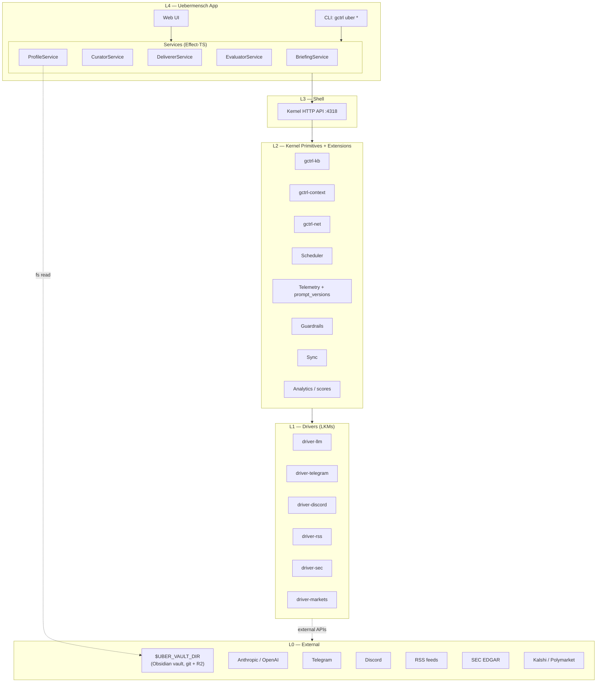
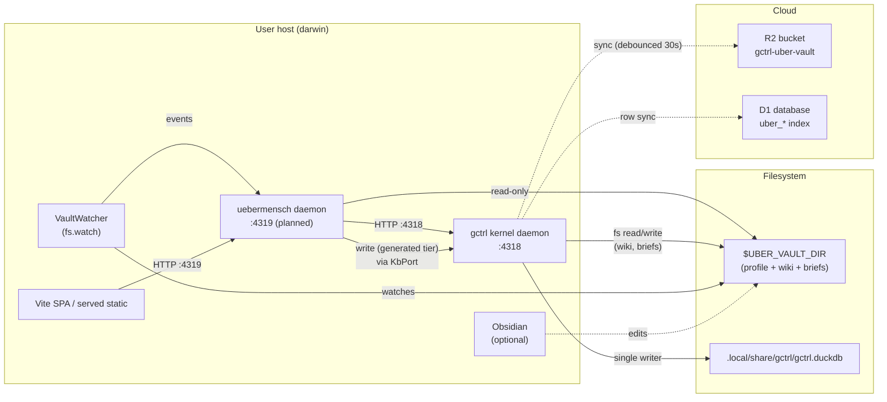

# Uebermensch — Architecture

> One-sentence summary: Uebermensch is a native gctrl application that turns a portable user profile + gctrl-kb into a daily Chief-of-Staff brief delivered across App, Telegram, and Discord, with end-to-end LLM and scrape observability.

See [PRD.md](../PRD.md) for the problem and goals. This document defines **how** the pieces fit together.

## 1. Layered Position

Uebermensch sits in the **Native Application** layer of the gctrl Unix model (see [os.md § Layer Overview](../../../specs/architecture/os.md#layer-overview)).



Dependencies MUST flow inward only (see [principles.md § Architectural Invariants #1](../../../specs/principles.md#architectural-invariants)). Uebermensch app code MUST NOT import kernel crates directly, MUST NOT open DuckDB, and MUST NOT call external APIs directly.

## 2. Responsibility Map

| Concern | Layer | Component | Notes |
|---------|-------|-----------|-------|
| User topics, theses, delivery prefs (authored tier) | L0 filesystem | `$UBER_VAULT_DIR/{profile.yaml,topics.yaml,sources.yaml,theses/,prompts/}` | Git-versioned, Obsidian-mountable, portable — see [profile.md](profile.md) |
| Generated pages + briefs (generated tier) | L0 filesystem | `$UBER_VAULT_DIR/{wiki/,briefs/}` (`wiki/` contains `sources/`, `synthesis/`, `entities/`, `topics/`, `questions/`) | Gitignored, R2-synced, reproducible from sources |
| Parse + validate profile | L4 | `ProfileService` | Effect-TS `Schema` over markdown/YAML |
| Raw source capture | L2 extension | `gctrl-net`, `gctrl-context` | Reuses kernel primitives — no new storage |
| Knowledge graph | L2 extension | `gctrl-kb` mounted at `$UBER_VAULT_DIR/wiki/` | Investment page types, `kb-schema.md` authored in vault |
| Scheduling | L2 extension | `Scheduler` + in-process adapter | Daemon registers `uber.*` jobs on startup |
| LLM invocation | L1 driver | `driver-llm` | Every call → Session, span, prompt_version |
| External messaging | L1 drivers | `driver-telegram`, `driver-discord` | Kernel holds tokens |
| External data ingestion | L1 drivers | `driver-rss`, `driver-sec`, `driver-markets` | Pull on schedule; kernel owns secrets |
| Brief curation | L4 | `CuratorService` + `BriefingService` | Orchestrates: query kb → rank → summarise → render |
| Brief delivery | L4 | `DelivererService` | Renders per channel, writes `uber_deliveries` |
| Eval (automated + human) | L4 + L2 | `EvaluatorService` + kernel `scores` table | Auto-runs after each brief |
| Cost budget enforcement | L2 | `Guardrails` policies | Daily budget = profile value; violation pauses sessions |
| Sync | L2 extension | `gctrl-sync` | `uber_*` SQLite → D1 (index); entire `$UBER_VAULT_DIR` → R2 (content, bidirectional) |

## 3. Process Model

Uebermensch runs as a **single daemon** alongside the gctrl kernel daemon. It exposes its own HTTP server (web UI + API) on a port separate from the kernel's `:4318`. All state-mutating operations travel kernel-ward via the kernel HTTP API. The daemon also runs a `VaultWatcher` fiber on `$UBER_VAULT_DIR` to detect authored-tier edits (including edits made in Obsidian) and trigger profile reloads / cache invalidations.



Enforced invariants:

1. Uebermensch daemon MUST NOT open `gctrl.duckdb`. Only the kernel daemon holds the DuckDB write lock (see [principles.md § Architectural Invariants #2](../../../specs/principles.md#architectural-invariants)).
2. Uebermensch daemon MAY read `$UBER_VAULT_DIR` (authored + generated tiers) directly for rendering performance, but MUST route every mutation through kernel HTTP routes (`KbPort` → wiki, `BriefingService` → briefs). Direct vault writes from the Uebermensch process are forbidden except for the `.gctrl-uber/` metadata dir.
3. Uebermensch daemon MUST NOT hold any external API key. All external calls go through kernel drivers.
4. Obsidian edits are first-class — the `VaultWatcher` cannot distinguish `$EDITOR`, `git checkout`, and Obsidian writes, and all three follow the same reload path.

## 4. Data Flow — Morning Brief

```mermaid
sequenceDiagram
    participant CronAdapter as Scheduler adapter
    participant KRouter as Kernel HTTP :4318
    participant Briefing as BriefingService
    participant Curator as CuratorService
    participant Llm as driver-llm
    participant KBAPI as /api/kb
    participant Vault as $UBER_VAULT_DIR
    participant Deliverer as DelivererService
    participant Tg as driver-telegram
    participant Web as App web feed (SSE)
    participant R2 as R2 (kernel sync)

    CronAdapter->>KRouter: POST /api/uber/briefs (triggered)
    KRouter->>Briefing: kick (HTTP)
    Briefing->>KBAPI: query wiki pages since 24h matching topics
    KBAPI-->>Briefing: page ids + metadata (vault paths)
    Briefing->>Curator: rank+summarise(pages, prompt@curator_vN)
    Curator->>KRouter: POST /api/llm/generate (driver-llm)
    KRouter->>Llm: generate
    Llm-->>KRouter: text + token counts
    KRouter-->>Curator: spans persisted; prompt_hash returned
    Curator-->>Briefing: brief items (JSON)
    Briefing->>Vault: write briefs/<date>.md (atomic rename)
    Briefing->>KRouter: POST /api/uber/briefs (vault_path + content_hash)
    Briefing->>Deliverer: deliver(brief)
    Deliverer->>Vault: read briefs/<date>.md
    Deliverer->>KRouter: POST /api/telegram/send (driver-telegram)
    KRouter->>Tg: send message
    Tg-->>KRouter: delivery id
    Deliverer->>KRouter: POST /api/uber/deliveries (idempotency key)
    Deliverer->>Web: SSE "new brief"
    KRouter-->>R2: debounced sync push (30s)
```

## 5. Hexagonal Layout (Effect-TS)

Mirrors the pattern used in gctrl-board and gctrl-inbox.

```
apps/uebermensch/
  src/
    domain/              # Pure types, errors, value objects
      brief.ts           # Brief, BriefItem, BriefStatus
      profile.ts         # Profile, Topic, Thesis, Watchlist
      delivery.ts        # Channel, Delivery, DeliveryKey
      eval.ts            # EvalScore, EvalDimension
      errors.ts          # TaggedError: BriefNotFound, ProfileInvalid, ...
    ports/               # Kernel-facing interfaces
      kb-port.ts         # Query + ingest wiki via shell
      llm-port.ts        # driver-llm facade
      messaging-port.ts  # Telegram + Discord driver facade
      sched-port.ts      # Scheduler facade
      profile-port.ts    # Profile read + watch
    adapters/
      http/              # HttpKernelClient, HttpLlm, HttpMessaging
      fs/                # FsProfileReader (reads $UBER_VAULT_DIR authored tier)
    services/
      briefing.ts        # BriefingService (orchestration)
      curator.ts         # CuratorService (LLM rank + summarise)
      deliverer.ts       # DelivererService (channel fan-out + idempotency)
      evaluator.ts       # EvaluatorService (auto + human scores)
    entrypoints/
      api/               # HTTP routes on app port
      cli/               # gctrl uber * command impls
  web/                   # Vite SPA
  prompts/               # Shipped prompt templates (overridable by profile)
  test/
    unit/                # Pure domain tests
    integration/         # Mock KernelClient layer
    acceptance/          # Playwright against local daemon
```

Service ports follow the [`arch-taste.md` Effect-TS pattern](../../../../debuggingfuture/arch-taste.md#effect-ts-patterns) — `Context.Tag` ports, `Layer` adapters, `Effect.gen` for orchestration, `Schema.TaggedError` for failure.

## 6. External Vault Integration

The **authored tier** of the vault is **read-only to the app**. The app watches the directory via `ProfileService`/`VaultWatcher`, which exposes a `Stream<ProfileChange>` to consumers. The **generated tier** (wiki, briefs, sources, synthesis) is writable by the kernel + Uebermensch services.

```ts
class ProfilePort extends Context.Tag("uber/ProfilePort")<ProfilePort, {
  readonly current: Effect.Effect<Profile, ProfileInvalid>
  readonly changes: Stream.Stream<ProfileChange, ProfileInvalid>
}>() {}
```

- `$UBER_VAULT_DIR` resolves to `~/workspaces/debuggingfuture/uebermensch-profile` by default but is overridable (legacy alias: `UBER_PROFILE_DIR`).
- The vault is Obsidian-mountable — every file is CommonMark + YAML frontmatter; wikilinks are bare `[[slug]]`.
- The app MUST fail-closed on a missing / invalid authored tier: no brief is produced, a clear error is surfaced to CLI + HTTP.
- Authored-tier writes happen only via `gctrl uber profile migrate` (idempotent, with preview diff) or by the user in Obsidian / their editor / git. No service MAY write to the authored tier in response to LLM output.

See [profile.md](profile.md) for the full format and [specs/knowledge-base.md](knowledge-base.md) for the vault layout.

## 7. Persistence

Two stores, with clear ownership:

| Store | Holds | Authoritative for | Sync target |
|-------|-------|-------------------|-------------|
| **Vault** (`$UBER_VAULT_DIR`) | Markdown + YAML — profile, theses, wiki pages, brief bodies, synthesis | Any content a human reads or edits | R2 (`gctrl-uber-vault`) |
| **SQLite / DuckDB** | Index + event log — `uber_*` rows, kernel `sessions`/`spans`/`scores` | Metadata, timings, deliveries, scores | D1 (row-level) |

Rebuilding SQLite from vault + kernel sessions MUST produce an equivalent index (see [domain-model.md § 10](domain-model.md#10-invariants) invariant #2). The reverse is not true — SQLite cannot reconstruct the vault.

### Kernel-owned tables (see [kernel sync.md § 6](../../../specs/architecture/kernel/sync.md#6-syncable-tables))

Re-used as-is:
- `sessions`, `spans`, `traffic` — every LLM call and scrape
- `prompt_versions`, `session_prompts` — prompt audit trail
- `scores` — brief + item scoring (kernel-owned; single evaluation table shared across apps)
- `context_entries` — source pages (projected from vault `wiki/**` markdown)
- `kb_links`, `kb_pages` — wiki graph (see [knowledgebase.md](../../../specs/architecture/kernel/knowledgebase.md))

### App-owned tables (namespace `uber_*`)

| Table | Store | Sync | Purpose |
|-------|-------|------|---------|
| `uber_briefs` | SQLite | D1 | Brief index (id, kind, status, generated_for, **vault_path**, content_hash, cost_usd, prompt_hash, session_id) — NOT the body |
| `uber_brief_items` | SQLite | D1 | Items within a brief (id, brief_id, position, title, summary_md, action, topic, thesis, source_page_ids JSON) — derived from the vault markdown's H2 structure, carried as an index for fast listing/search |
| `uber_deliveries` | SQLite | D1 | Per-channel delivery (id, brief_id, channel, external_id, status, delivered_at, error) — unique key (brief_id, channel) |
| `uber_alerts` | SQLite | D1 | Triggered alerts (id, kind, urgency, subject, payload JSON, related_brief_id, status, created_at) |
| `uber_sources_cfg` | SQLite | D1 | Rendered source config from profile (for audit / debug only; vault `sources.yaml` is authoritative) |

Rows MUST carry `device_id` + `updated_at` for sync. Transition rules enforced at the storage layer (`pending → curating → rendered → delivered → scored → archived`).

### Vault layout (summary)

Full layout in [profile.md § Vault Layout](profile.md#vault-layout). The brief-relevant paths:

```
$UBER_VAULT_DIR/
├── profile.yaml, topics.yaml, sources.yaml   # authored tier (git-tracked)
├── theses/<slug>.md                          # authored tier
├── briefs/
│   ├── <YYYY-MM-DD>.md                       # daily brief (generated; R2-synced)
│   └── deepdive/thesis-<slug>-<date>.md      # deepdive (generated)
└── wiki/                                     # generated tier — sources, entities, topics, synthesis
```

The kernel `gctrl-kb` crate is configured with `context_root = $UBER_VAULT_DIR, wiki_subpath = "wiki"` — there is no separate `~/.local/share/gctrl/context/wiki/` path when running under an Uebermensch workspace.

### Filesystem artifacts

- `$UBER_VAULT_DIR/` — the one true mount. Authoritative for every readable artifact.
- `$UBER_VAULT_DIR/.gctrl-uber/` — daemon-local metadata (lock, vault index, tombstones). Gitignored; R2-synced except for `lock.json`.
- `~/.local/share/gctrl/uber/briefs/<id>.html` — optional rendered HTML cache for App web UI. Derived from the vault markdown; safe to delete.
- `~/.local/share/gctrl/gctrl.duckdb` — kernel index + event log. Held by the kernel daemon.

## 8. Cross-App Interaction

Uebermensch exchanges state with gctrl-board via kernel IPC events + HTTP API, NEVER by direct table joins (see [principles.md § Design Principles #2](../../../specs/principles.md#design-principles)).

| From | To | Mechanism | Payload |
|------|----|-----------|---------|
| User action on brief item | gctrl-board | `POST /api/board/issues` | Creates `UBER-N` issue with backlink to brief_id + source_page_ids |
| gctrl-board | Uebermensch | `IssueClosed` kernel event | Uebermensch drops the action from stale-reminder set |
| gctrl-kb | Uebermensch | `kb.source.ingested`, `kb.page.updated` | Feeds curator candidate set |
| Uebermensch | gctrl-inbox | `POST /api/inbox/messages` | Eval regression or scrape-health alerts |
| gctrl-inbox | Uebermensch | `PermissionGranted` (if a brief was held for approval) | Resume brief delivery |

## 9. Failure Modes & Degradation

| Failure | Detection | Behaviour |
|---------|-----------|-----------|
| LLM unavailable | `driver-llm` timeout | Brief falls back to extractive summary (top-N recent wiki updates) + inbox alert |
| Channel delivery fails | Driver error | Retry with exponential backoff (1s, 4s, 16s); persist `uber_deliveries.status=failed` after 3; next brief includes previous failure |
| Daily budget exceeded | Guardrail `Deny` | Next LLM call blocked; open inbox alert; daily brief skipped if pre-brief budget is already spent |
| Profile invalid | `ProfileService` decode error | All Uebermensch endpoints return 503 with error message; CLI exits non-zero with error pointing at file+line |
| Wiki lint broken | Uebermensch queries `gctrl kb lint` | Degraded: brief still produced; warnings surface in app eval dashboard |
| No candidates for brief | Empty candidate set | Brief rendered with "no new items in tracked topics" note + scrape-health summary |

## 10. Security

1. **Secrets** — kernel drivers hold all external tokens (LLM, Telegram, Discord, EDGAR, Kalshi). Uebermensch daemon env has no external secrets.
2. **Auth** — app HTTP port secured by a bearer token configured in profile (`delivery.app.bearer_token_env`). CORS locked to localhost by default.
3. **Prompt injection** — ingest pipeline wraps source text in `<source>...</source>` sentinels before templating into prompts; curator prompts refuse to follow instructions inside source tags.
4. **Outbound exfiltration** — guardrails allowlist outbound domains via `gctrl-net` proxy; drivers restricted to their declared endpoints.
5. **Vault sharing** — vaults may contain watchlists and theses the user considers sensitive. `$UBER_VAULT_DIR` is user-owned; Uebermensch MUST NOT log authored-tier content at INFO level. R2 sync MUST use a per-user scoped bucket prefix `vault/<identity.slug>/` (see [profile.md § Sync (R2)](profile.md#sync-r2) for the full key layout) to prevent cross-user reads.

## 11. Open Interfaces (new kernel ports)

New kernel traits required to support Uebermensch. Definitions live in `gctrl-core`; adapters in per-driver crates.

```rust
// driver-llm
#[async_trait]
pub trait LlmPort: Send + Sync {
    async fn generate(&self, req: LlmRequest) -> Result<LlmResponse, LlmError>;
    async fn embed(&self, req: EmbedRequest) -> Result<EmbedResponse, LlmError>;
}

// driver-telegram, driver-discord
#[async_trait]
pub trait MessagingPort: Send + Sync {
    async fn send(&self, channel: ChannelRef, msg: Message) -> Result<MessageId, MessagingError>;
    fn inbound(&self) -> BoxStream<'static, InboundEvent>;
}

// driver-rss, driver-sec
#[async_trait]
pub trait SourcePort: Send + Sync {
    async fn poll(&self, cfg: SourceConfig) -> Result<Vec<SourceRef>, SourceError>;
}

// driver-markets
#[async_trait]
pub trait MarketDataPort: Send + Sync {
    async fn quote(&self, id: MarketId) -> Result<Quote, MarketError>;
    async fn snapshot(&self, filter: MarketFilter) -> Result<Vec<MarketPoint>, MarketError>;
}
```

Each request/response type carries a `correlation_id` that Uebermensch propagates as an OTel span attribute, so trace trees stay continuous across the app-driver boundary.

See [domain-model.md](domain-model.md) for the full Effect-TS + DDL shapes.

## 12. Non-Goals (architectural)

1. **No new wiki layer.** Uebermensch extends `gctrl-kb` with investment-specific page types. It does NOT introduce a parallel knowledge store.
2. **No direct OTel export from the app.** The app emits spans to the kernel, which forwards to configured exporters. No direct OTLP out of the app process.
3. **No UI-only features.** Every capability exposed in the web UI has a CLI + HTTP counterpart (Unix philosophy #5, #10).
4. **No embedded LLM inference.** Uebermensch MUST NOT ship or spawn a local model; `driver-llm` is the sole entry point, even for locally-served models.
