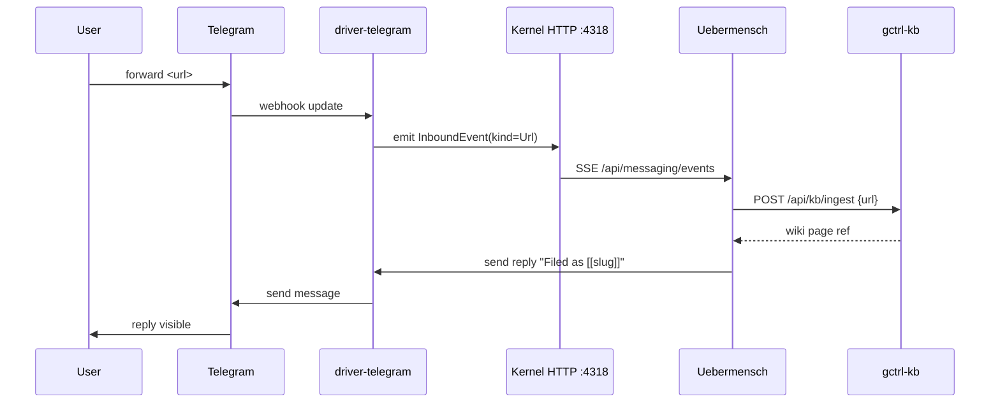

# Uebermensch — Delivery

> How a rendered brief reaches the user across App (web UI + SSE), Telegram, Discord, and (future) email — with idempotent per-channel writes, profile-driven routing, and inbound URL ingestion.
>
> See [briefing-pipeline.md](briefing-pipeline.md) for what produces `Brief`; [domain-model.md § 2.3](domain-model.md#23-delivery) for the `Delivery` shape; [architecture.md § 11](architecture.md#11-open-interfaces-new-kernel-ports) for the `MessagingPort` trait.

## Responsibilities

`DelivererService` (Effect-TS, `apps/uebermensch/src/services/deliverer.ts`):

1. Given `brief_id`, load the `uber_briefs` row + items, then read the brief markdown from `uber_briefs.vault_path` (e.g. `$UBER_VAULT_DIR/briefs/2026-04-18.md`).
2. Consult `profile.delivery.channels` → compute the set of channels to deliver to now.
3. For each channel:
   - Render channel-specific payload from the vault markdown + items.
   - Call kernel driver via `MessagingPort` (HTTP proxy to driver LKM).
   - Write `uber_deliveries` row with `(brief_id, channel)` idempotency key.
4. Emit `SSE new-brief` event to App subscribers.
5. Mark `uber_briefs.status = delivered` once ≥ 1 channel succeeded.

Non-responsibilities (explicit):

- MUST NOT author markdown bodies — the BriefingService has already written the vault file at `uber_briefs.vault_path`. Deliverer only transcodes for channel-specific renderers.
- MUST NOT write to the vault. Deliverer opens the vault markdown read-only.
- MUST NOT retry on the app process for longer than 60s — long-tail retries are Scheduler-owned via `uber.delivery.retry.<delivery_id>`.
- MUST NOT call Telegram/Discord APIs directly. Every outbound call goes through kernel drivers.

## Channel Router

Input: `Brief`, `Profile.delivery.channels`, `now_utc`.

```
for (name, cfg) in profile.delivery.channels:
  if not cfg.enabled: skip
  if not in_window(now_utc, cfg.window): defer to start of next window
  if cfg.silent and brief.kind == "daily": deliver with driver silent flag
  enqueue(channel = name, driver = cfg.driver, target = cfg.target_ref)
```

**Window handling:**

- `window.start_local` / `window.end_local` in `window.tz` — clamped to same-day window.
- If `now < start` → schedule delivery at start (via `SchedPort.scheduleOnce`).
- If `now > end` → defer to next day's start; if `brief.kind == alert` and `urgency == page` → bypass window (pages ignore quiet hours).
- Channel-specific `silent: true` tells the driver to use Telegram's `disable_notification` or Discord's `@silent` prefix.

**Fallback chain** (profile-tunable; default below):

```yaml
delivery:
  brief:
    fallback_order: [app, telegram_primary, discord_feed]
```

If all enabled channels fail → brief stays at `status: rendered` (not `delivered`), and an `uber_alerts` row with `kind: scrape_health` (ironically repurposed) or a new `kind: delivery_stalled` is written.

## Per-Channel Rendering

Each driver gets a `Message` matching [domain-model.md § 7.2](domain-model.md#72-driver-telegram-driver-discord). Every renderer reads the vault markdown at `uber_briefs.vault_path` once and transcodes it for its channel — no channel-specific markdown is authored here.

### App (SSE + HTTP)

- Payload: raw `Brief` + `BriefItem[]` JSON (via `/api/uber/briefs/{id}`).
- SSE event: `{ type: "new-brief", brief_id, generated_for, vault_path }`.
- The web UI fetches `GET /api/uber/briefs/{id}/body` — the app reads the vault markdown file and returns sanitized inline HTML (see [architecture.md § 10](architecture.md#10-security)). Body HTML is cached under `~/.local/share/gctrl/uber/briefs/<id>.html` but the vault markdown is the source of truth.
- Rich features: click citation chip → hover preview of wiki page; "convert to action" button → `POST /api/board/issues`.

### Telegram

- Driver: `driver-telegram` (`gctrl-driver-telegram` LKM).
- Source: vault markdown at `uber_briefs.vault_path`.
- Rendering target: **MarkdownV2** — Telegram's native format with forced escaping of special chars.
- Long briefs: split across messages at natural boundaries (item boundaries), with continuation markers `(1/3)` etc.
- `[[slug]]` → bare URL `https://<app-host>/wiki/<slug>` (or app deep link `uber://wiki/<slug>` if custom scheme configured). Citations resolve by the target's frontmatter `page_type` — theses get bolded labels, sources get domain chips (see Link Rendering below).
- Quick-replies (inline keyboard):
  - `/ack <brief_id>` — mark read
  - `/score <brief_id> good|meh|bad` — human score (see [eval.md](eval.md))
  - `/open <brief_id>` — deep-link back to app
- Attachments: none in M2. M4+ may add voice/TTS as an attachment.

Example rendered Telegram message (MarkdownV2-escaped):

```
*Morning Brief — 2026\-04\-18*

1\. *Anthropic ships Claude Opus 4\.7*

   Major model release with improved tool\-use and 15% faster output\. Aligns with *Thesis:* [LLM tooling consolidation](https://uber/wiki/llm-tooling-consolidation)\. Source: [anthropic\.com](https://uber/wiki/2026-04-18--anthropic-opus-47)

   \[Score ▸\] \[Open in App ▸\]
```

### Discord

- Driver: `driver-discord` (`gctrl-driver-discord` LKM).
- Source: vault markdown at `uber_briefs.vault_path`, parsed into Discord's markdown subset.
- Rendering target: **Discord embeds** — richer cards, color-coded by `kind`.
- Brief = 1 embed per item (up to 10 per message; overflow splits across messages).
- Embed fields:
  - Title: item title
  - Description: `summary_md` translated to Discord-flavored markdown
  - Footer: "Brief {brief_id} · {generated_for}"
  - Color: green (news), blue (update), orange (action), red (alert)
- Buttons (interactions v2): same quick-replies as Telegram, wired via Discord webhook → `/api/uber/webhooks/discord`.
- Embeds do NOT support raw HTML — the vault markdown file is the source, parsed into Discord's subset.

### Link Rendering (all channels)

Wikilinks in the vault markdown are bare `[[slug]]` (see [knowledge-base.md § Wikilink Conventions](knowledge-base.md#wikilink-conventions)). Renderers MUST resolve them by reading the target page's frontmatter and applying per-page-type styling:

| `page_type` | Rendered as |
|-------------|-------------|
| `thesis` | `*Thesis:* [<title>](<url>)` (Telegram / App) or bold label + link (Discord) |
| `source` | `[<domain>](<url>)` |
| `entity` / `topic` / `synthesis` / `question` | `[<title>](<url>)` |

The display transformation happens at channel-send time; the vault markdown stays canonical bare-slug form and stays Obsidian-readable.

### Email (future — M4+)

- Driver: `driver-email` (not yet spec'd).
- Source: vault markdown + rendered HTML cache (multipart).
- One email per daily brief; deepdives as attachments.
- Deferred — no one-liner email integration worth the complexity until M4.

## Idempotency

Primary key is `UNIQUE (brief_id, channel)` on `uber_deliveries`. The DelivererService:

1. Before driver call: `SELECT * FROM uber_deliveries WHERE brief_id=? AND channel=?`.
2. If existing row with `status IN ('sent','failed')` AND `attempt < max_retries` → retry. Else short-circuit.
3. After driver call: INSERT ON CONFLICT DO UPDATE — set `status`, `external_id`, `attempt`, `delivered_at`, `error`.

**External id** (Telegram message id, Discord message id) enables edit/delete flows — e.g. `uber brief edit <id>` (future) can re-render and call driver's edit API with the stored `external_id`.

**Retry policy** (per delivery):

| Attempt | Delay | Max |
|---------|-------|-----|
| 1 | 0s | immediate |
| 2 | 4s | on transient error |
| 3 | 30s | on transient error |
| 4+ | n/a | give up; `status: failed` |

Transient errors: `MessagingError::{RateLimited, Unreachable}` + `503/429/502`.
Non-transient: `MessagingError::Invalid` + `400/404` → fail immediately, no retry.

## Inbound Flow

Incoming messages land via driver webhooks → kernel → Uebermensch.



Supported inbound shapes:

| Shape | Handler |
|-------|---------|
| Forward message with URL | Queue ingest; reply with wiki slug |
| Text: `/brief` | Trigger adhoc brief |
| Text: `/ack <brief_id>` | Mark brief acked (per-channel) |
| Text: `/score <brief_id> <val>` | Write human eval score |
| Text: `/thesis` | List active theses |
| Text: `/thesis <slug>` | Show thesis summary |
| Text: `/search <query>` | `kb query` result, inline |
| Text (free) | Ignored by default; profile-settable passthrough to `uber-curator` as Q&A (M3+) |
| Button callback | Decoded by payload; same handlers |

All inbound responses are written through the same `MessagingPort.send` — so they become `uber_deliveries` rows with `kind: reply` (new enum variant). This keeps the audit trail unified.

## Authentication & Authorization

Profile binds channels to targets; the user is the only authorized caller.

- Telegram: `target_ref: tg:chat:<user_chat_id>`. Driver MUST verify inbound updates come from this chat id; other chats → ignore (log warning).
- Discord: `target_ref: dc:webhook:...` for outbound, `dc:interactions:<application_id>` for inbound. Inbound signature verified (Ed25519 per Discord docs) by the driver.
- App: bearer token from `profile.delivery.app.bearer_token_env` — validated by the Uebermensch HTTP server before serving any `/api/uber/*` route.
- Webhook endpoints (`/api/uber/webhooks/{telegram,discord}`) live on the Uebermensch app port (not kernel) — kernel driver forwards payloads on a local channel; Uebermensch verifies its own secret.

Multi-user note: M2 is single-user. Multi-user support requires mapping inbound `from` → `user_id` and per-user target ref — deferred to post-M4.

## Delivery Pipeline Stages

```
┌──────┐  ┌──────────┐  ┌──────────┐  ┌───────────┐  ┌─────────┐
│Load  │─▶│Route     │─▶│Render    │─▶│Driver call│─▶│Persist  │
│Brief │  │(per ch)  │  │(per ch)  │  │(HTTP)     │  │Delivery │
└──────┘  └──────────┘  └──────────┘  └───────────┘  └─────────┘
```

Stages 2–5 run in parallel across channels (Effect fiber per channel), then joined. A single slow channel MUST NOT delay others.

## Error Handling & Surfacing

| Error | Brief status | Alert? | Next action |
|-------|--------------|--------|-------------|
| All channels `MessagingError::Invalid` | `rendered` (no `delivered` transition) | `kind=delivery_stalled, urgency=warn` | User inspects profile config |
| One channel fails, others succeed | `delivered` | none (row error_message captured) | Next brief retries failed channel; if 3 briefs in a row fail → alert |
| Target unreachable for > 6h | `delivered` (earlier) | `kind=delivery_stalled, urgency=warn` | Check driver connectivity |
| Driver LKM process dead | no deliveries | `kind=delivery_stalled, urgency=page` | Kernel restarts driver; user notified |

All alerts land in `uber_alerts` and surface as `inbox_messages` via kernel inbox (see [gctrl-inbox PRD](../../gctrl-inbox/PRD.md)).

## Force-Deliver + Replay

Operational hooks:

```sh
gctrl uber deliver <brief_id>                 # re-run fan-out
gctrl uber deliver <brief_id> --channel app   # one channel only
gctrl uber deliver <brief_id> --channel telegram_primary --force  # bypass idempotency guard (new row, external_id null)
```

`--force` is reserved for debugging; it bypasses the `(brief_id, channel)` unique constraint by suffixing channel name with `:retry-<ts>` (creating a parallel delivery row with the suffixed channel). The retry row is counted in eval but hidden from the app feed.

## HTTP Routes (Uebermensch-owned)

Served by the Uebermensch daemon on its own port (`:4319`).

| Method | Route | Handler |
|--------|-------|---------|
| GET | `/api/uber/briefs/{id}/deliveries` | List deliveries for a brief |
| POST | `/api/uber/briefs/{id}/deliver` | Trigger fan-out (idempotent unless `force=true` body) |
| POST | `/api/uber/briefs/{id}/deliver/{channel}` | Single-channel deliver |
| GET | `/api/uber/sse` | SSE stream (new-brief, new-alert) |
| POST | `/api/uber/webhooks/telegram` | Driver-authenticated inbound forwarder |
| POST | `/api/uber/webhooks/discord` | Driver-authenticated inbound forwarder |

Kernel-owned driver routes used (via kernel `:4318`):

| Route | Used for |
|-------|----------|
| `POST /api/telegram/send` | Outbound Telegram messages |
| `POST /api/discord/send` | Outbound Discord messages |
| `GET /api/messaging/events` (SSE) | Inbound event stream from drivers |

## Observability

Spans:

| Span | Attributes |
|------|------------|
| `uber.delivery.fan_out` | brief_id, channel_count |
| `uber.delivery.channel` | channel, driver, target_ref, attempt |
| `uber.delivery.driver_call` | driver, correlation_id, status_code |

Metrics (derived from spans):

- `uber_delivery_success_rate{channel}` (7-day rolling)
- `uber_delivery_latency_p95{channel}`
- `uber_delivery_fail_rate{channel}`

Surface in the App eval dashboard.

## Privacy & Retention

- `uber_deliveries` rows kept for `profile.delivery.retention.briefs_days` (default 180).
- `external_id` (Telegram message id etc.) MAY be nulled after 30 days per user request — kernel's retention pass handles it.
- No brief content is sent to any service other than the profile-declared channels.

## Related

- [architecture.md § 4](architecture.md#4-data-flow--morning-brief) — end-to-end sequence
- [domain-model.md § 2.3](domain-model.md#23-delivery) — Delivery schema
- [domain-model.md § 7.2](domain-model.md#72-driver-telegram-driver-discord) — `MessagingPort` trait
- [briefing-pipeline.md § Persist + Score](briefing-pipeline.md#5-persist--score) — upstream handoff
- [eval.md § Delivery Health](eval.md#delivery-health) — downstream metrics
