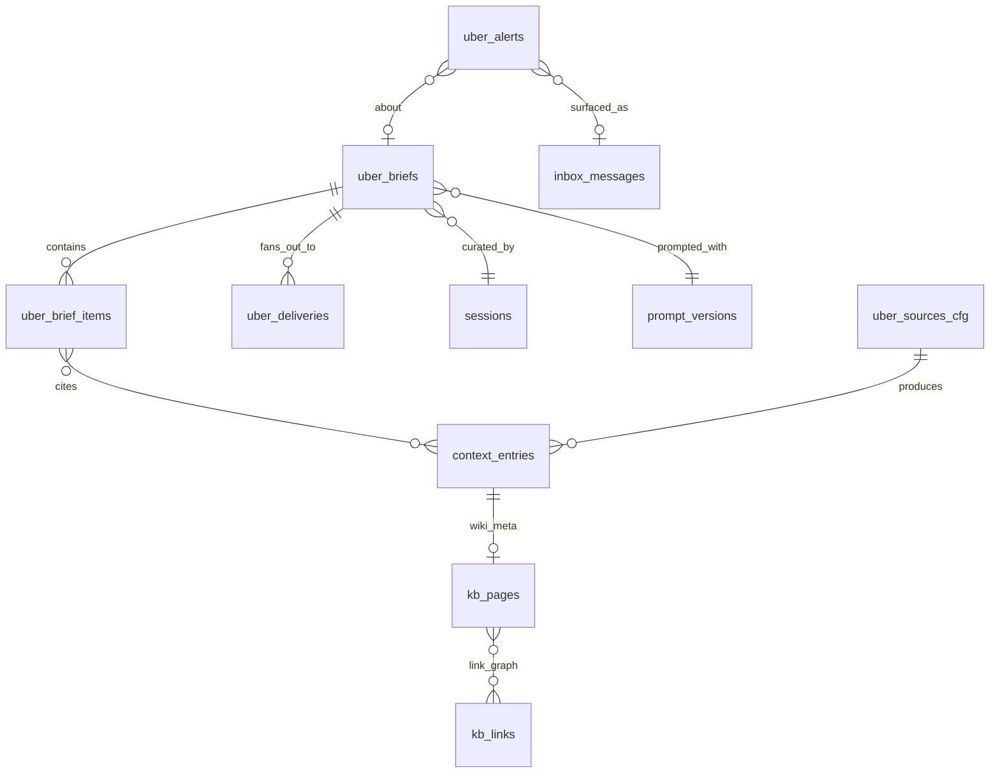

# Uebermensch — Domain Model

> The canonical data shapes for Uebermensch. See [architecture.md](architecture.md) for how the pieces fit together, [PRD.md](../PRD.md) for the problem.
>
> **Policy** (per [principles.md § Architectural Invariants](../../../specs/principles.md#architectural-invariants)): kernel-owned types live in `specs/architecture/domain-model.md`; this document defines only Uebermensch-owned additions. Where we need a new kernel-facing type (e.g. `LlmRequest`), it is declared here and promoted into kernel specs when the first driver lands.

---

## 1. Identifiers

Branded TypeScript strings via `Schema.brand(...)`; Rust newtypes over `String` with `Serialize`/`Deserialize`. See [arch-taste.md](../../../../debuggingfuture/arch-taste.md) for the branding pattern.

| Type | Scope | Shape |
|------|-------|-------|
| `BriefId` | uber | `"brief_" <ulid>` |
| `BriefItemId` | uber | `"bi_" <ulid>` |
| `DeliveryId` | uber | `"del_" <ulid>` |
| `AlertId` | uber | `"alert_" <ulid>` |
| `ChannelName` | uber | free-form string keyed by `delivery.channels.<name>` in profile |
| `TopicSlug` | uber | kebab-case slug; MUST match a topic declared in profile |
| `ThesisSlug` | uber | kebab-case slug; MUST match `theses/<slug>.md` in profile |
| `SourceId` | kernel (reuse) | see `context_entries.id` |
| `WikiPageId` | kernel (reuse) | see `context_entries.id` — wiki page entries |
| `PromptHash` | kernel (reuse) | SHA-256 of rendered prompt — see `prompt_versions` |
| `SessionId`, `SpanId` | kernel (reuse) | see kernel domain-model |

ULIDs MUST be used for `BriefId` / `BriefItemId` / `DeliveryId` / `AlertId` (monotonic + sortable).

---

## 2. Core Domain Types (Effect-TS)

Defined under `apps/uebermensch/src/domain/`. All types are `Schema.Struct({...})` with `Schema.Literal(...)` for enumerations.

### 2.1 Brief

Represents one generated brief — daily, deep-dive, or ad-hoc.

```ts
export const BriefKind = Schema.Literal("daily", "deepdive", "adhoc")
export type BriefKind = typeof BriefKind.Type

export const BriefStatus = Schema.Literal(
  "pending",    // row created, work not started
  "curating",   // LLM call in flight
  "rendered",   // vault file written atomically; content_hash set; citations verified
  "delivered",  // fan-out to at least one channel succeeded
  "scored",     // automated + optional human scores recorded
  "archived",   // past retention window
  "failed"      // terminal — curator or renderer errored
)
export type BriefStatus = typeof BriefStatus.Type

export const Brief = Schema.Struct({
  id: BriefId,
  kind: BriefKind,
  status: BriefStatus,
  generatedFor: Schema.String,      // ISO date (YYYY-MM-DD) — the brief's subject day
  topicScope: Schema.Array(TopicSlug),
  thesisScope: Schema.Array(ThesisSlug),
  vaultPath: Schema.String,         // canonical: vault-relative path, e.g. "briefs/2026-04-18.md"
  contentHash: Schema.optional(Schema.String),  // sha256 of vault file bytes at render time
  bodyHtmlCachePath: Schema.optional(Schema.String), // optional rendered HTML cache
  sessionId: Schema.optional(Schema.String),   // curator session
  promptHash: Schema.optional(Schema.String),  // FK → prompt_versions.hash
  costUsd: Schema.Number,
  inputTokens: Schema.Number,
  outputTokens: Schema.Number,
  createdAt: Schema.String,
  renderedAt: Schema.optional(Schema.String),
  archivedAt: Schema.optional(Schema.String),
  failedAt: Schema.optional(Schema.String),
  failedReason: Schema.optional(Schema.String), // curator / renderer / deliverer error message
})
export type Brief = typeof Brief.Type
```

**Body storage policy.** Brief markdown is authored in the vault at `$UBER_VAULT_DIR/<vaultPath>` (typically `briefs/<YYYY-MM-DD>.md` for daily briefs, `briefs/deepdive/thesis-<slug>-<date>.md` for deepdives). The `uber_briefs` row is an index over that file — it never stores the body text. Renderers and evaluators read the vault file; deliveries transcode it per channel. `contentHash` pins the version used at render time so eval results are reproducible even if the user edits the file later in Obsidian.

**State transitions** (enforced by the storage layer):

```
pending  → curating | failed
curating → rendered | failed
rendered → delivered | failed
delivered → scored | failed
scored   → archived
```

Reverse transitions (`delivered → pending`, etc.) MUST be rejected.

### 2.2 BriefItem

One ranked item within a brief. Citations are resolved against the wiki.

```ts
export const BriefItemKind = Schema.Literal(
  "news",       // short-horizon news hit
  "update",     // update on an active thesis
  "action",     // proposed action for the user
  "alert"       // market-move or prompt-regression inlined alert
)

export const BriefItem = Schema.Struct({
  id: BriefItemId,
  briefId: BriefId,
  position: Schema.Number,              // 0-indexed render order
  kind: BriefItemKind,
  title: Schema.String,
  summaryMd: Schema.String,             // 1-3 paragraphs, wiki-linked
  topic: Schema.optional(TopicSlug),
  thesis: Schema.optional(ThesisSlug),
  sourcePageIds: Schema.Array(Schema.String),  // wiki page entry ids
  suggestedAction: Schema.optional(Schema.String),  // free-form; materialises as UBER-N issue on accept
  scoreHint: Schema.optional(Schema.Number),   // 0..1 curator confidence
})
export type BriefItem = typeof BriefItem.Type
```

`sourcePageIds` MUST resolve to existing `context_entries` rows with `kb_pages.page_type IN ('source','entity','topic','thesis','synthesis')` — the renderer rejects unresolved references.

### 2.3 Delivery

One (brief_id, channel) fan-out record. Idempotency key: `(brief_id, channel)`.

```ts
export const DeliveryStatus = Schema.Literal(
  "queued", "sent", "failed", "skipped"
)

export const Delivery = Schema.Struct({
  id: DeliveryId,
  briefId: BriefId,
  channel: ChannelName,
  status: DeliveryStatus,
  externalId: Schema.optional(Schema.String),  // Telegram message id, Discord msg id, etc.
  attempt: Schema.Number,                      // 1-based
  deliveredAt: Schema.optional(Schema.String),
  error: Schema.optional(Schema.String),
})
export type Delivery = typeof Delivery.Type
```

### 2.4 Alert

User-facing alert surfaced via gctrl-inbox (eval regression, scrape-health, market move).

```ts
export const AlertKind = Schema.Literal(
  "eval_regression",
  "scrape_health",
  "budget_exceeded",
  "market_move",
  "profile_invalid"
)

export const AlertUrgency = Schema.Literal("info", "warn", "page")

export const Alert = Schema.Struct({
  id: AlertId,
  kind: AlertKind,
  urgency: AlertUrgency,
  subject: Schema.String,               // human-readable title
  payload: Schema.Unknown,              // kind-specific; see § 5
  relatedBriefId: Schema.optional(BriefId),
  relatedThesis: Schema.optional(ThesisSlug),
  createdAt: Schema.String,
  inboxMessageId: Schema.optional(Schema.String),  // FK → inbox_messages
  status: Schema.Literal("open", "ack", "resolved"),
})
```

### 2.5 Profile (read-only projection)

Defined fully in [profile.md](profile.md). A `Profile` Schema is the in-memory projection after parsing the authored tier of `$UBER_VAULT_DIR` (profile.yaml, topics.yaml, sources.yaml, theses/, prompts/).

```ts
export const Topic = Schema.Struct({
  slug: TopicSlug,
  title: Schema.String,
  horizon: Schema.Literal("short", "long", "both"),
  weight: Schema.Number,                // 0..1 — used as rank prior
  watchlist: Schema.Array(Schema.String),
})

export const Thesis = Schema.Struct({
  slug: ThesisSlug,
  title: Schema.String,
  stance: Schema.Literal("long", "short", "watch", "avoid"),
  conviction: Schema.Literal("high", "medium", "low"),
  openedAt: Schema.String,
  lastReviewedAt: Schema.optional(Schema.String),
  topics: Schema.Array(TopicSlug),
  bodyMd: Schema.String,
})

export const ChannelConfig = Schema.Struct({
  enabled: Schema.Boolean,
  driver: Schema.Literal("telegram", "discord", "app", "email"),
  targetRef: Schema.String,             // chat id, webhook url, etc. — resolved by driver
  window: Schema.optional(Schema.Struct({
    startLocal: Schema.String,          // "08:00"
    endLocal: Schema.String,            // "22:00"
    tz: Schema.String,
  })),
  silent: Schema.optional(Schema.Boolean),
})

export const Budgets = Schema.Struct({
  dailyUsd: Schema.Number,
  perBriefUsd: Schema.Number,
  maxTokensPerBrief: Schema.Number,
})

export const Profile = Schema.Struct({
  identity: Schema.Struct({
    name: Schema.String,
    tz: Schema.String,
    lang: Schema.String,
  }),
  topics: Schema.Array(Topic),
  theses: Schema.Array(Thesis),
  avoid: Schema.Array(Schema.String),
  sources: Schema.Array(Schema.Struct({
    slug: Schema.String,
    driver: Schema.Literal("rss", "sec", "markets", "manual"),
    url: Schema.optional(Schema.String),
    cadence: Schema.String,             // cron string
    topics: Schema.Array(TopicSlug),
  })),
  delivery: Schema.Struct({
    channels: Schema.Record({ key: ChannelName, value: ChannelConfig }),
    brief: Schema.Struct({
      cron: Schema.String,               // e.g. "0 30 7 * * *"
      format: Schema.Literal("long", "short", "digest"),
    }),
    personas: Schema.Record({ key: Schema.String, value: Schema.String }), // persona → prompt override path
  }),
  budgets: Budgets,
})
export type Profile = typeof Profile.Type
```

### 2.6 EvalScore (kernel-owned, reused)

Uebermensch writes to the kernel `scores` table with `target_type IN ('uber_brief','uber_brief_item','prompt_version')`. Wiki pages are not directly scored — quality signals about wiki pages attach to the brief that cites them (via `uber_brief_item`). No new schema.

See [eval.md](eval.md) for the dimensions.

---

## 3. Domain Errors (Schema.TaggedError)

Defined in `apps/uebermensch/src/domain/errors.ts`. Exhaustive pattern-match via `Effect.catchTags`.

```ts
export class ProfileInvalid extends Schema.TaggedError<ProfileInvalid>()(
  "ProfileInvalid",
  { path: Schema.String, reason: Schema.String }
) {}

export class BriefNotFound extends Schema.TaggedError<BriefNotFound>()(
  "BriefNotFound",
  { briefId: Schema.String }
) {}

export class CitationUnresolved extends Schema.TaggedError<CitationUnresolved>()(
  "CitationUnresolved",
  { briefId: Schema.String, link: Schema.String }
) {}

export class BudgetExceeded extends Schema.TaggedError<BudgetExceeded>()(
  "BudgetExceeded",
  { dailyUsd: Schema.Number, spentUsd: Schema.Number }
) {}

export class DeliveryFailed extends Schema.TaggedError<DeliveryFailed>()(
  "DeliveryFailed",
  { channel: Schema.String, reason: Schema.String, attempt: Schema.Number }
) {}

export class LlmPortError extends Schema.TaggedError<LlmPortError>()(
  "LlmPortError",
  { driver: Schema.String, reason: Schema.String }
) {}

export class InvalidStateTransition extends Schema.TaggedError<InvalidStateTransition>()(
  "InvalidStateTransition",
  { from: Schema.String, to: Schema.String }
) {}
```

---

## 4. Storage Schema (SQLite, synced to D1)

All app-owned tables live in the **SQLite** path (row-level sync target is Cloudflare D1 — see [kernel/sync.md § 6](../../../specs/architecture/kernel/sync.md#6-syncable-tables)). Per [principles.md § Architectural Invariants #3](../../../specs/principles.md#architectural-invariants), every app table carries the `uber_` namespace prefix.

Tables MUST be added to `kernel/crates/gctrl-storage/src/schema.rs` as `CREATE_UBER_*_TABLE` constants; the kernel owns the write lock.

```sql
CREATE TABLE IF NOT EXISTS uber_briefs (
    id                VARCHAR PRIMARY KEY,
    kind              VARCHAR NOT NULL DEFAULT 'daily',  -- daily | deepdive | adhoc
    status            VARCHAR NOT NULL DEFAULT 'pending',
    generated_for     VARCHAR NOT NULL,                  -- ISO date
    topic_scope       JSON DEFAULT '[]',
    thesis_scope      JSON DEFAULT '[]',
    vault_path            VARCHAR NOT NULL,              -- vault-relative markdown path, e.g. "briefs/2026-04-18.md"
    content_hash          VARCHAR,                       -- sha256 of vault file at render time
    body_html_cache_path  VARCHAR,                       -- optional cached HTML path (absolute filesystem path)
    session_id            VARCHAR,                       -- FK → sessions.id
    prompt_hash           VARCHAR,                       -- FK → prompt_versions.hash
    cost_usd              DOUBLE NOT NULL DEFAULT 0,
    input_tokens          INTEGER NOT NULL DEFAULT 0,
    output_tokens         INTEGER NOT NULL DEFAULT 0,
    device_id             VARCHAR NOT NULL,
    created_at            VARCHAR NOT NULL,
    rendered_at           VARCHAR,
    archived_at           VARCHAR,
    failed_at             VARCHAR,
    failed_reason         VARCHAR,
    updated_at            VARCHAR NOT NULL,
    synced                BOOLEAN DEFAULT FALSE,
    UNIQUE (vault_path)
);

CREATE TABLE IF NOT EXISTS uber_brief_items (
    id                VARCHAR PRIMARY KEY,
    brief_id          VARCHAR NOT NULL REFERENCES uber_briefs(id) ON DELETE CASCADE,
    position          INTEGER NOT NULL,
    kind              VARCHAR NOT NULL DEFAULT 'news',
    title             VARCHAR NOT NULL,
    summary_md        TEXT NOT NULL,
    topic             VARCHAR,
    thesis            VARCHAR,
    source_page_ids   JSON DEFAULT '[]',
    suggested_action  TEXT,
    score_hint        DOUBLE,
    device_id         VARCHAR NOT NULL,
    created_at        VARCHAR NOT NULL,
    updated_at        VARCHAR NOT NULL,
    synced            BOOLEAN DEFAULT FALSE,
    UNIQUE (brief_id, position)
);

CREATE TABLE IF NOT EXISTS uber_deliveries (
    id                VARCHAR PRIMARY KEY,
    brief_id          VARCHAR NOT NULL REFERENCES uber_briefs(id) ON DELETE CASCADE,
    channel           VARCHAR NOT NULL,
    status            VARCHAR NOT NULL DEFAULT 'queued',
    external_id       VARCHAR,
    attempt           INTEGER NOT NULL DEFAULT 1,
    delivered_at      VARCHAR,
    error             TEXT,
    device_id         VARCHAR NOT NULL,
    created_at        VARCHAR NOT NULL,
    updated_at        VARCHAR NOT NULL,
    synced            BOOLEAN DEFAULT FALSE,
    UNIQUE (brief_id, channel)    -- idempotency
);

CREATE TABLE IF NOT EXISTS uber_alerts (
    id                VARCHAR PRIMARY KEY,
    kind              VARCHAR NOT NULL,                 -- see AlertKind
    urgency           VARCHAR NOT NULL DEFAULT 'info',
    subject           VARCHAR NOT NULL,
    payload           JSON NOT NULL,
    related_brief_id  VARCHAR,
    related_thesis    VARCHAR,
    status            VARCHAR NOT NULL DEFAULT 'open',
    inbox_message_id  VARCHAR,                          -- FK → inbox_messages.id
    device_id         VARCHAR NOT NULL,
    created_at        VARCHAR NOT NULL,
    updated_at        VARCHAR NOT NULL,
    synced            BOOLEAN DEFAULT FALSE
);

CREATE TABLE IF NOT EXISTS uber_sources_cfg (
    slug              VARCHAR PRIMARY KEY,
    driver            VARCHAR NOT NULL,                 -- rss | sec | markets | manual
    url               VARCHAR,
    cadence           VARCHAR NOT NULL,
    topics            JSON DEFAULT '[]',
    last_seen_at      VARCHAR,
    device_id         VARCHAR NOT NULL,
    created_at        VARCHAR NOT NULL,
    updated_at        VARCHAR NOT NULL,
    synced            BOOLEAN DEFAULT FALSE
);
```

### Indexes

```sql
CREATE INDEX IF NOT EXISTS idx_uber_briefs_status       ON uber_briefs(status, generated_for DESC);
CREATE INDEX IF NOT EXISTS idx_uber_briefs_created      ON uber_briefs(created_at DESC);
CREATE INDEX IF NOT EXISTS idx_uber_brief_items_brief   ON uber_brief_items(brief_id, position);
CREATE INDEX IF NOT EXISTS idx_uber_deliveries_brief    ON uber_deliveries(brief_id, channel);
CREATE INDEX IF NOT EXISTS idx_uber_alerts_status       ON uber_alerts(status, urgency, created_at DESC);
CREATE INDEX IF NOT EXISTS idx_uber_alerts_brief        ON uber_alerts(related_brief_id);
```

### Sync policy

Per [kernel/sync.md](../../../specs/architecture/kernel/sync.md):

- All five tables carry `device_id` and `updated_at` — eligible for row-level SQLite → D1 sync.
- Brief bodies are NOT in SQLite — they live in the vault at `uber_briefs.vault_path`. Vault files sync to R2 via the `sync.vault.uber` mount (see [profile.md § Sync (R2)](profile.md#sync-r2)), so the body replication is orthogonal to the index row replication.
- `uber_briefs` rows are tiny (metadata + hashes); row-level D1 sync carries negligible payload.
- Wiki pages themselves live under `context_entries` and ALSO appear in the vault at `wiki/**`; they follow the same vault R2 sync path, with `context_entries` as the kernel-facing index.

---

## 5. Alert Payload Shapes

`uber_alerts.payload` is JSON; shape depends on `kind`. Consumers MUST decode via the matching `Schema.Struct`.

```ts
export const EvalRegressionPayload = Schema.Struct({
  dimension: Schema.Literal("citation_coverage", "hype_ratio", "length", "cost"),
  current: Schema.Number,
  baseline7d: Schema.Number,
  threshold: Schema.Number,
  promptHash: Schema.String,
})

export const ScrapeHealthPayload = Schema.Struct({
  domain: Schema.String,
  successRate7d: Schema.Number,
  fails24h: Schema.Number,
  lastError: Schema.optional(Schema.String),
})

export const BudgetExceededPayload = Schema.Struct({
  window: Schema.Literal("daily", "per_brief"),
  limitUsd: Schema.Number,
  spentUsd: Schema.Number,
  lastSessionId: Schema.String,
})

export const MarketMovePayload = Schema.Struct({
  marketId: Schema.String,
  venue: Schema.Literal("kalshi", "polymarket"),
  direction: Schema.Literal("up", "down"),
  delta: Schema.Number,
  price: Schema.Number,
  ruleId: Schema.String,
})

export const ProfileInvalidPayload = Schema.Struct({
  path: Schema.String,
  file: Schema.optional(Schema.String),
  line: Schema.optional(Schema.Number),
  reason: Schema.String,
})
```

---

## 6. Wiki Extensions (gctrl-kb)

Uebermensch extends `gctrl-kb` with a single new `WikiPageType` variant — no new tables.

```rust
// kernel/crates/gctrl-core/src/types.rs — WikiPageType
pub enum WikiPageType {
    Index, Log, Entity, Topic, Source, Synthesis, Question,
    Thesis,   // NEW — one page per active thesis; parent of synthesis updates
}
```

Thesis pages live at `wiki/theses/<thesis-slug>.md` with required frontmatter:

```yaml
---
page_type: thesis
slug: <ThesisSlug>
topics: [<TopicSlug>, ...]
stance: long|short|watch|avoid
conviction: high|medium|low
opened_at: 2026-01-15
last_reviewed_at: 2026-04-05
sources: [<source-page-id>, ...]
---
```

Full page-type catalog + frontmatter + lint rules in [knowledge-base.md](knowledge-base.md).

---

## 7. Rust Kernel Types (new)

These types support the new kernel ports declared in [architecture.md § 11](architecture.md#11-open-interfaces-new-kernel-ports). They MUST live in `gctrl-core`; driver crates re-export.

### 7.1 driver-llm

```rust
// kernel/crates/gctrl-core/src/llm.rs  (new)
pub struct LlmRequest {
    pub correlation_id: String,         // propagated from app OTel span
    pub persona: String,                // e.g. "uber-curator"
    pub model: Option<String>,          // null = driver default
    pub messages: Vec<LlmMessage>,
    pub tools: Vec<LlmToolSpec>,
    pub max_output_tokens: Option<u32>,
    pub temperature: Option<f32>,
    pub prompt_hash: Option<String>,    // pre-registered in prompt_versions
    pub budget_hint_usd: Option<f64>,   // soft ceiling per call
}

pub struct LlmMessage {
    pub role: LlmRole,                  // system | user | assistant | tool
    pub content: String,                // MAY include source tags for injection guard
}

pub enum LlmRole { System, User, Assistant, Tool }

pub struct LlmToolSpec {
    pub name: String,
    pub description: String,
    pub json_schema: serde_json::Value,
}

pub struct LlmResponse {
    pub correlation_id: String,
    pub session_id: String,             // created by driver
    pub text: String,
    pub input_tokens: u32,
    pub output_tokens: u32,
    pub cost_usd: f64,
    pub prompt_hash: String,
    pub finish_reason: LlmFinishReason,
    pub tool_calls: Vec<LlmToolCall>,
}

pub enum LlmFinishReason { Stop, Length, ToolUse, ContentFilter, Error }

pub struct LlmToolCall {
    pub id: String,
    pub name: String,
    pub arguments: serde_json::Value,
}

pub struct EmbedRequest {
    pub correlation_id: String,
    pub model: Option<String>,
    pub inputs: Vec<String>,
}

pub struct EmbedResponse {
    pub correlation_id: String,
    pub vectors: Vec<Vec<f32>>,
    pub model: String,
    pub input_tokens: u32,
    pub cost_usd: f64,
}

#[derive(thiserror::Error, Debug)]
pub enum LlmError {
    #[error("driver unavailable: {0}")] Unavailable(String),
    #[error("rate limited; retry in {0}s")] RateLimited(u64),
    #[error("budget exceeded: {0}")] BudgetExceeded(String),
    #[error("invalid request: {0}")] Invalid(String),
    #[error("driver error: {0}")] Driver(String),
}
```

### 7.2 driver-telegram, driver-discord

```rust
// kernel/crates/gctrl-core/src/messaging.rs (new)
pub struct ChannelRef {
    pub driver: String,                 // "telegram" | "discord"
    pub target: String,                 // chat id | channel id | webhook url
}

pub struct Message {
    pub correlation_id: String,
    pub kind: MessageKind,
    pub title: Option<String>,
    pub body_md: String,
    pub body_html: Option<String>,
    pub attachments: Vec<Attachment>,
    pub quick_replies: Vec<QuickReply>,
    pub silent: bool,
}

pub enum MessageKind { Brief, Alert, Reply, Ack }

pub struct Attachment { pub mime: String, pub bytes: Vec<u8>, pub filename: String }
pub struct QuickReply { pub label: String, pub payload: String }
pub struct MessageId(pub String);

pub enum InboundEvent {
    Command { from: String, channel: ChannelRef, cmd: String, args: Vec<String> },
    Url     { from: String, channel: ChannelRef, url: String },
    Text    { from: String, channel: ChannelRef, text: String },
    Callback{ from: String, channel: ChannelRef, payload: String },
}

#[derive(thiserror::Error, Debug)]
pub enum MessagingError {
    #[error("channel not reachable: {0}")] Unreachable(String),
    #[error("invalid message: {0}")] Invalid(String),
    #[error("rate limited; retry in {0}s")] RateLimited(u64),
    #[error("driver error: {0}")] Driver(String),
}
```

### 7.3 driver-rss, driver-sec

```rust
// kernel/crates/gctrl-core/src/source.rs (new)
pub struct SourceConfig {
    pub slug: String,
    pub driver: String,                 // "rss" | "sec"
    pub url: Option<String>,
    pub topics: Vec<String>,
    pub since: Option<chrono::DateTime<chrono::Utc>>,
}

pub struct SourceRef {
    pub url: String,
    pub title: Option<String>,
    pub published_at: Option<chrono::DateTime<chrono::Utc>>,
    pub authors: Vec<String>,
    pub domain: String,
    pub summary: Option<String>,
    pub raw: serde_json::Value,         // driver-specific extras (e.g. filing type)
}

#[derive(thiserror::Error, Debug)]
pub enum SourceError {
    #[error("fetch failed: {0}")] Fetch(String),
    #[error("feed parse error: {0}")] Parse(String),
    #[error("driver error: {0}")] Driver(String),
}
```

### 7.4 driver-markets

```rust
// kernel/crates/gctrl-core/src/markets.rs (new)
pub struct MarketId { pub venue: String, pub symbol: String }

pub struct Quote {
    pub id: MarketId,
    pub ts: chrono::DateTime<chrono::Utc>,
    pub last: f64,                      // 0..1 for prediction markets; price for spot
    pub bid: Option<f64>,
    pub ask: Option<f64>,
    pub volume_24h: Option<f64>,
}

pub struct MarketFilter {
    pub venue: Option<String>,
    pub symbols: Vec<String>,
    pub topics: Vec<String>,
}

pub struct MarketPoint {
    pub id: MarketId,
    pub quote: Quote,
    pub topics: Vec<String>,
}

#[derive(thiserror::Error, Debug)]
pub enum MarketError {
    #[error("market not found: {0:?}")] NotFound(MarketId),
    #[error("fetch failed: {0}")] Fetch(String),
    #[error("rate limited; retry in {0}s")] RateLimited(u64),
    #[error("driver error: {0}")] Driver(String),
}
```

### 7.5 Correlation ID invariant

Every request/response type declared above carries `correlation_id`. Uebermensch services MUST:

1. Create `correlation_id = <session_id>:<span_id>` for each LLM / messaging / source / market call.
2. Include it on outbound requests AND assert it on responses.
3. Propagate it as an OTel span attribute `gctrl.correlation_id`.

This keeps trace trees continuous across the app-driver boundary (see [architecture.md § 11](architecture.md#11-open-interfaces-new-kernel-ports)).

---

## 8. Effect-TS Port Shapes (TypeScript mirrors)

Each Rust port has a TypeScript facade in `apps/uebermensch/src/ports/` — the app never calls drivers directly; it calls kernel HTTP routes that proxy to drivers.

```ts
// src/ports/llm-port.ts
export class LlmPort extends Context.Tag("uber/LlmPort")<LlmPort, {
  readonly generate: (req: LlmRequest) => Effect.Effect<LlmResponse, LlmPortError>
  readonly embed:    (req: EmbedRequest) => Effect.Effect<EmbedResponse, LlmPortError>
}>() {}

// src/ports/messaging-port.ts
export class MessagingPort extends Context.Tag("uber/MessagingPort")<MessagingPort, {
  readonly send: (ch: ChannelRef, msg: Message) => Effect.Effect<MessageId, DeliveryFailed>
  readonly inbound: Stream.Stream<InboundEvent, never>
}>() {}

// src/ports/kb-port.ts
export class KbPort extends Context.Tag("uber/KbPort")<KbPort, {
  readonly queryRecent: (since: string, topics: ReadonlyArray<TopicSlug>)
    => Effect.Effect<ReadonlyArray<WikiPageRef>, KbPortError>
  readonly getPage:     (id: string) => Effect.Effect<WikiPage, KbPortError>
  readonly ingestUrl:   (url: string) => Effect.Effect<WikiPageRef, KbPortError>
  readonly linksFor:    (pageId: string) => Effect.Effect<ReadonlyArray<string>, KbPortError>
}>() {}

// src/ports/sched-port.ts  (thin facade over Scheduler)
export class SchedPort extends Context.Tag("uber/SchedPort")<SchedPort, {
  readonly registerRecurring: (name: string, cron: string, task: TaskSpec)
    => Effect.Effect<ScheduleId, SchedPortError>
  readonly triggerOnce: (name: string) => Effect.Effect<TaskId, SchedPortError>
}>() {}

// src/ports/profile-port.ts
export class ProfilePort extends Context.Tag("uber/ProfilePort")<ProfilePort, {
  readonly current: Effect.Effect<Profile, ProfileInvalid>
  readonly changes: Stream.Stream<ProfileChange, ProfileInvalid>
}>() {}
```

Adapters (Layers) — one per port, wired at the entrypoint:

| Port | Adapter | Concrete |
|------|---------|----------|
| `LlmPort` | `LlmHttpLive` | `POST /api/llm/generate`, `POST /api/llm/embed` |
| `MessagingPort` | `MessagingHttpLive` | `POST /api/{telegram,discord}/send`; SSE `/api/messaging/events` |
| `KbPort` | `KbHttpLive` | `GET /api/kb/*`, `POST /api/kb/ingest` |
| `SchedPort` | `SchedHttpLive` | `POST /api/scheduler/*` |
| `ProfilePort` | `ProfileFsLive` | reads authored tier of `$UBER_VAULT_DIR` + `fs.watch` (VaultWatcher fiber) |

---

## 9. Relationships



---

## 10. Invariants

1. **Citation resolvability.** A brief with status ≥ `rendered` MUST have every `[[slug]]` in its vault markdown file (`$UBER_VAULT_DIR/<vault_path>`) resolve to an existing file under `$UBER_VAULT_DIR/{wiki,theses,briefs}/**/<slug>.md` (and therefore to an existing `context_entries.id` where `kb_pages.page_type != 'question'`). Enforced at render time — unresolved links fail the transition. Typed prefixes (`[[type:slug]]`) are never valid output.
2. **Vault-authoritative bodies.** The `uber_briefs` row MUST NOT store brief body text. The vault file at `vault_path` is canonical; `content_hash` pins the bytes used for render/eval. Reconstructing SQLite from scratch using vault files + kernel sessions MUST produce an equivalent index.
3. **Idempotent delivery.** `(brief_id, channel)` is UNIQUE. A re-run of `deliver` MUST NOT produce a second `uber_deliveries` row; it MAY update `status`, `attempt`, and `error`.
4. **Transition monotonicity.** Brief status is monotonic along the lattice in § 2.1. Any write that violates it MUST be rejected at the storage layer with `InvalidStateTransition`.
5. **Prompt audit.** Every LLM call has a `prompt_hash` stored on both `sessions`/`spans` (via `session_prompts`) and the originating `uber_briefs` row.
6. **Profile authored-tier read-only.** No Uebermensch service MAY write inside the authored tier of `$UBER_VAULT_DIR` (see [profile.md § Read vs. Write Capabilities](profile.md#read-vs-write-capabilities)) in response to LLM output. Generated-tier writes (`wiki/**`, `briefs/**`) go through `KbPort` / `BriefingService`. Only `gctrl uber profile migrate` may write authored-tier files — and only with `--preview-diff` accepted by the user.
7. **Namespace discipline.** Uebermensch MUST NOT write to any non-`uber_*` table except: `sessions`, `spans`, `context_entries`, `kb_links`, `kb_pages`, `prompt_versions`, `session_prompts`, `scores`, `inbox_messages`, `board_issues` (the latter via `/api/board/issues` — never direct).
