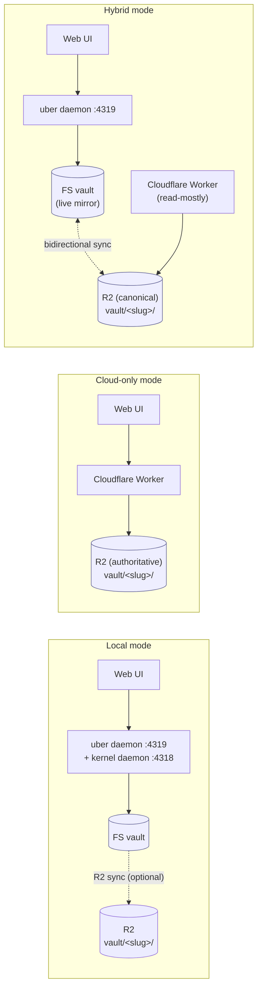
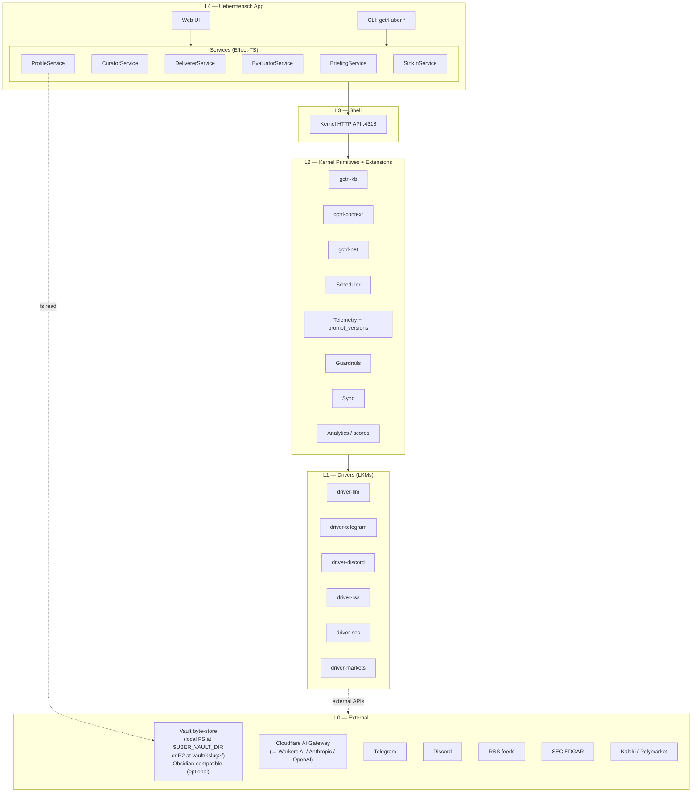
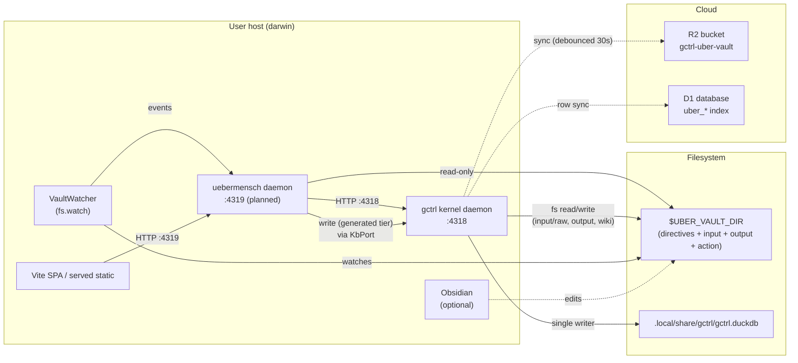

# Uebermensch — Architecture

> One-sentence summary: Uebermensch is a native gctrl application that turns a portable user profile + gctrl-kb into a daily Chief-of-Staff brief delivered across Web, Telegram, and Discord, with end-to-end LLM and scrape observability — runnable as a local daemon, a hosted Cloudflare Worker, or both.

See [PRD.md](../PRD.md) for the problem and goals. See [§ Deployment Modes](#0-deployment-modes) for the three supported topologies (local / cloud-only / hybrid). This document defines **how** the pieces fit together.

## 0. Deployment Modes

Uebermensch supports three deployment topologies. They share the same data model (markdown + YAML in a `vault/<identity.slug>/` tree), the same layered position, and the same hexagonal services. They differ in **where the vault bytes live, who writes to them, and where channel secrets are stored**.

| Mode | Vault byte-store | Single writer | Channel secrets | Web UI host | Obsidian | Daemon required |
|------|------------------|----------------|-----------------|-------------|----------|------------------|
| **Local** (default) | Local FS at `$UBER_VAULT_DIR` | Uebermensch daemon (`:4319`) — single writer per process pair (kernel + uber daemon) | Kernel driver LKMs (`driver-telegram`, `driver-discord`) | Uebermensch daemon | Optional mount | Yes |
| **Cloud-only** | R2 at `vault/<identity.slug>/` | Hosted Cloudflare Worker — single writer per slug | Worker secret store (`wrangler secret`); same shape as kernel driver tokens | Worker | Not installed | No |
| **Hybrid** | R2 (canonical) + local FS (live mirror) | Local Uebermensch daemon (writes go FS-first then `gctrl-sync` pushes to R2 within 30s); the Worker, when present, is read-mostly and may **only** mutate the **generated tier** during scheduled jobs | Kernel driver LKMs preferred; Worker secret store when the Worker is the active sender | Either | Optional mount | Yes (and a Worker if you want it) |

### Cross-mode invariants

1. **One byte-store wins per identity slug at any moment.** Two daemons MUST NOT write to the same `vault/<identity.slug>/` concurrently. In hybrid mode the local daemon is authoritative for authored-tier writes; cloud-only and local modes are mutually exclusive at the *active-writer* level. Mode handoff is by `gctrl uber vault pull --from r2` / `gctrl uber vault push --to r2` — file copies, not migrations.
2. **Same write protocol everywhere.** Authored-tier writes are atomic markdown rewrites (`<path>.tmp` → fsync → rename in local mode; `R2.put` with `If-Match: <etag>` in cloud-only mode), each followed by a `vault.updated` event that triggers index re-read. The Web UI, the CLI, and Obsidian all funnel into this single write path; none of them edits markdown out-of-band.
3. **Channel tokens NEVER live in the vault.** They live in the kernel secret store (local mode) or the Worker secret store (cloud-only mode). The vault stores only `target_ref` (e.g. `tg:chat:<id>`) — the binding that lets a driver look up a token in its own secret namespace.
4. **The web UI is mode-symmetric.** The same React build is served by the Uebermensch daemon (local) or the Cloudflare Worker (cloud-only). Routes diverge only at the `Vault*` ports — `FsVault` adapter on the daemon, `R2Vault` adapter in the Worker. The onboarding wizard, brief feed, channel-config, and scoring UI are byte-identical across modes.



The remainder of this document describes the **local mode** by default (it is the richest topology); cloud-only differences are called out in each section under a *Cloud-only:* note.

## 1. Layered Position

Uebermensch sits in the **Native Application** layer of the gctrl Unix model (see [os.md § Layer Overview](../../../../vault/specs/architecture/os.md#layer-overview)).



Dependencies MUST flow inward only (see [principles.md § Architectural Invariants #1](../../../../vault/specs/principles.md#architectural-invariants)). Uebermensch app code MUST NOT import kernel crates directly, MUST NOT open DuckDB, and MUST NOT call external APIs directly.

## 2. Responsibility Map

| Concern | Layer | Component | Notes |
|---------|-------|-----------|-------|
| User topics, theses, delivery prefs (authored tier) | L0 filesystem | `$UBER_VAULT_DIR/directives/{profile.md,topics.md,sources.md,theses/,personas/,me.md,projects.md,avoid.md}` + `$UBER_VAULT_DIR/directives/prompts/` + `$UBER_VAULT_DIR/action/events/` | Git-versioned, Obsidian-mountable, portable — see [profile.md](profile.md). `directives/personas/` holds per-persona prompt overrides; `directives/prompts/` holds user-authored research queries processed by `gctrl uber prompts process`. |
| Generated pages, briefs, reports, raw fetches (generated tier) | L0 filesystem | `$UBER_VAULT_DIR/{input/wiki/,input/briefs/,input/reports/,input/raw/,action/events/generated/}` (`input/wiki/` contains `entities/`, `topics/`, `synthesis/`, `questions/`, `index.md`, `log.md`; `input/briefs/` holds daily briefs; `input/reports/` holds deep-dives; `input/raw/` holds driver-fetched content; `action/events/generated/` holds driver-pulled events) | Gitignored, R2-synced, reproducible from sources |
| Parse + validate profile | L4 | `ProfileService` | Effect-TS `Schema` over markdown/YAML |
| Raw source capture | L2 extension | `gctrl-net`, `gctrl-context` | Reuses kernel primitives — no new storage |
| Knowledge graph | L2 extension | `gctrl-kb` mounted at `$UBER_VAULT_DIR/wiki/` | Investment page types, `kb-schema.md` authored in vault |
| Scheduling | L2 extension | `gctrl-scheduler` with `target_kind: exec` | Vault-defined in `directives/schedules.md`; reconciled to kernel via `gctrl uber schedule sync`. Kernel scheduler exec's `uber run-daily` on cron — no uber HTTP daemon. See [scheduling.md](scheduling.md) and [kernel scheduler.md § exec target kind](../../../../vault/specs/architecture/kernel/scheduler.md#exec-target-kind). |
| LLM invocation | L1 driver | `driver-llm` | Every call → Session, span, prompt_version |
| External messaging | L1 drivers | `driver-telegram`, `driver-discord` | Kernel holds tokens |
| External data ingestion | L1 drivers | `driver-rss`, `driver-sec`, `driver-markets` | Pull on schedule; kernel owns secrets |
| External calendar mirror | L1 driver | `driver-gcal` | Read-only by default; opt-in write-back; OAuth via kernel — see [calendar.md](calendar.md) |
| Brief curation | L4 | `CuratorService` + `BriefingService` | Orchestrates: query kb → rank → summarise → render |
| Brief delivery | L4 | `DelivererService` | Renders per channel, writes `uber_deliveries`; reused by calendar reminders |
| Wiki introspection | L4 | `SinkInService` | Weekly: surveys wiki → gaps → questions + connections; also powers `gctrl uber query` |
| Calendar | L4 + L2 + L1 | `CalendarService` + `uber_calendar` index + `driver-markets`/`driver-sec`/`driver-gcal` producers | Vault-first events filterable by source/kind; today's events surface in brief; reminders fan-out via `DelivererService` — see [calendar.md](calendar.md) |
| Timeboxes | L4 | `TimeboxService` + `uber_timeboxes` index + new `timebox_slug`/`step`/`step_total`/`step_units` columns on `uber_calendar` | Multi-event practice plans: parent goal under `calendar/timeboxes/<slug>.md` owns N child events. Deterministic and LLM-assisted planner; coaching nudges reuse `uber_calendar_reminders`; stalled-timebox alert via daily check — see [calendar-timeboxes.md](calendar-timeboxes.md) |
| Eval (automated + human) | L4 + L2 | `EvaluatorService` + kernel `scores` table | Auto-runs after each brief |
| Cost budget enforcement | L2 | `Guardrails` policies | Daily budget = profile value; violation pauses sessions |
| Sync | L2 extension | `gctrl-sync` | `uber_*` SQLite → D1 (index); entire `$UBER_VAULT_DIR` → R2 (content, bidirectional) |

## 3. Process Model

Two process shapes, one per supported mode (hybrid combines them):

**Local mode** — Uebermensch runs as a **single daemon** alongside the gctrl kernel daemon. It exposes its own HTTP server (web UI + API) on a port separate from the kernel's `:4318`. All state-mutating operations travel kernel-ward via the kernel HTTP API. The daemon also runs a `VaultWatcher` fiber on `$UBER_VAULT_DIR` to detect authored-tier edits (including edits made in Obsidian, the Web UI's onboarding wizard, or any text editor) and trigger profile reloads / cache invalidations.

**Cloud-only mode** — Uebermensch runs as a **single Cloudflare Worker** with R2 as the byte-store, D1 for the index, Durable Objects for the per-slug write coordinator (the equivalent of "single writer per identity slug"), and Worker Cron Triggers for the schedule. The same `VaultWatcher`-equivalent — `R2VaultWatcher` — fires after every successful R2 write, derived from the write path itself rather than from filesystem events. Channel secrets live in `wrangler secret`s scoped per-slug; outbound calls to `driver-llm` / `driver-telegram` / `driver-discord` are made directly by the Worker's HTTP clients, replicating the kernel-driver invariant inside a single process.



Enforced invariants (apply to whichever process is the active writer for a slug):

1. **Local mode:** Uebermensch daemon MUST NOT open `gctrl.duckdb`. Only the kernel daemon holds the DuckDB write lock (see [principles.md § Architectural Invariants #2](../../../../vault/specs/principles.md#architectural-invariants)).  **Cloud-only mode:** the Worker's index is D1, not DuckDB; D1 is held by the Worker per binding.
2. **Local mode:** Uebermensch daemon MAY read `$UBER_VAULT_DIR` (authored + generated tiers) directly for rendering performance, but MUST route every mutation through kernel HTTP routes (`KbPort` → wiki, `BriefingService` → briefs). Direct vault writes from the Uebermensch process are forbidden except for the `.gctrl-uber/` metadata dir.  **Cloud-only mode:** the Worker MAY read R2 directly via the bound `R2Bucket`, but every mutation goes through the per-slug Durable Object that serialises writes and emits the `vault.updated` event.
3. Uebermensch daemon MUST NOT hold any external API key in **local mode** — all external calls go through kernel drivers. In **cloud-only mode** the Worker holds tokens scoped per slug in `wrangler secret`s; the same allowlist + correlation-id discipline as the LKM driver applies.
4. Obsidian edits are first-class — the `VaultWatcher` cannot distinguish `$EDITOR`, `git checkout`, **the Web UI onboarding wizard**, and Obsidian writes, and all of them follow the same reload path. In cloud-only mode the equivalent "Web UI wizard / API call" path is the *only* entry, so this invariant collapses to "every mutation triggers exactly one `vault.updated`."
5. **Mode mutual exclusion.** No more than one writer (local daemon OR Worker) holds the active-writer role for a given `identity.slug` at the same time. Mode handoff is explicit: `gctrl uber vault pull --from r2` (cloud → local) or `gctrl uber vault push --to r2` (local → cloud) flips the writer atomically by transferring the `.gctrl-uber/lock.json` (FS) or the per-slug Durable Object lease (R2).

## 4. Data Flow — Morning Brief

```mermaid
sequenceDiagram
    participant CronAdapter as Scheduler adapter
    participant KRouter as Kernel HTTP :4318
    participant Briefing as BriefingService
    participant Curator as CuratorService
    participant Llm as driver-llm
    participant KBAPI as /api/kb
    participant Vault as $UBER_VAULT_DIR
    participant Deliverer as DelivererService
    participant Tg as driver-telegram
    participant Web as App web feed (SSE)
    participant R2 as R2 (kernel sync)

    CronAdapter->>KRouter: POST /api/uber/briefs (triggered)
    KRouter->>Briefing: kick (HTTP)
    Briefing->>KBAPI: query wiki pages since 24h matching topics
    KBAPI-->>Briefing: page ids + metadata (vault paths)
    Briefing->>Curator: rank+summarise(pages, prompt@curator_vN)
    Curator->>KRouter: POST /api/llm/generate (driver-llm)
    KRouter->>Llm: generate
    Llm-->>KRouter: text + token counts
    KRouter-->>Curator: spans persisted; prompt_hash returned
    Curator-->>Briefing: brief items (JSON)
    Briefing->>Vault: write input/briefs/<date>.md (atomic rename)
    Briefing->>KRouter: POST /api/uber/briefs (vault_path + content_hash)
    Briefing->>Deliverer: deliver(brief)
    Deliverer->>Vault: read input/briefs/<date>.md
    Deliverer->>KRouter: POST /api/telegram/send (driver-telegram)
    KRouter->>Tg: send message
    Tg-->>KRouter: delivery id
    Deliverer->>KRouter: POST /api/uber/deliveries (idempotency key)
    Deliverer->>Web: SSE "new brief"
    KRouter-->>R2: debounced sync push (30s)
```

## 5. Hexagonal Layout (Effect-TS)

Mirrors the pattern used in gctrl-board and gctrl-inbox.

```
apps/uebermensch/
  src/
    domain/              # Pure types, errors, value objects
      brief.ts           # Brief, BriefItem, BriefStatus
      profile.ts         # Profile, Topic, Thesis, Watchlist
      delivery.ts        # Channel, Delivery, DeliveryKey
      eval.ts            # EvalScore, EvalDimension
      errors.ts          # TaggedError: BriefNotFound, ProfileInvalid, ...
    ports/               # Kernel-facing interfaces
      kb-port.ts         # Query + ingest wiki via shell
      llm-port.ts        # driver-llm facade
      messaging-port.ts  # Telegram + Discord driver facade
      sched-port.ts      # Scheduler facade
      profile-port.ts    # Profile read + watch
    adapters/
      http/              # HttpKernelClient, HttpLlm, HttpMessaging
      fs/                # FsProfileReader (reads $UBER_VAULT_DIR authored tier)
    services/
      briefing.ts        # BriefingService (orchestration)
      curator.ts         # CuratorService (LLM rank + summarise)
      deliverer.ts       # DelivererService (channel fan-out + idempotency)
      evaluator.ts       # EvaluatorService (auto + human scores)
      sinkin.ts          # SinkInService (wiki gap pass, answer pass, query filing)
    entrypoints/
      api/               # HTTP routes on app port
      cli/               # gctrl uber * command impls
  web/                   # Vite SPA
  personas/              # Shipped persona prompt templates (overridable by profile)
  test/
    unit/                # Pure domain tests
    integration/         # Mock KernelClient layer
    acceptance/          # Playwright against local daemon
```

Service ports follow the [`arch-taste.md` Effect-TS pattern](../../../../debuggingfuture/arch-taste.md#effect-ts-patterns) — `Context.Tag` ports, `Layer` adapters, `Effect.gen` for orchestration, `Schema.TaggedError` for failure.

## 6. External Vault Integration

The **authored tier** of the vault (`directives/**`, `output/**`, `action/**` excl. `action/events/generated/**`) is **only writable through user-confirmed surfaces**: the CLI, an editor (Obsidian or `$EDITOR`), or the Web UI's onboarding wizard / profile editor (which produces atomic markdown rewrites confirmed by the user, not by an LLM). The app watches the byte-store via `ProfileService`/`VaultWatcher`, which exposes a `Stream<ProfileChange>` to consumers. The **generated tier** (`input/**`, `action/events/generated/**`) is writable by the kernel + Uebermensch services.

```ts
class ProfilePort extends Context.Tag("uber/ProfilePort")<ProfilePort, {
  readonly current: Effect.Effect<Profile, ProfileInvalid>
  readonly changes: Stream.Stream<ProfileChange, ProfileInvalid>
}>() {}

// New port — emits the same kind of write whether the source is FS or R2.
class VaultWriterPort extends Context.Tag("uber/VaultWriterPort")<VaultWriterPort, {
  readonly writeAuthored: (path: VaultPath, body: string, expected: ContentHash | "new") => Effect.Effect<ContentHash, VaultWriteError>
  readonly writeGenerated: (path: VaultPath, body: string) => Effect.Effect<ContentHash, VaultWriteError>
}>() {}
```

Two adapters:

- `FsVaultWriter` (local mode) — atomic-rename writer; emits `vault.updated` after fsync.
- `R2VaultWriter` (cloud-only mode) — `R2.put` with conditional `If-Match: <etag>` for optimistic concurrency; emits `vault.updated` after a successful PUT.

The Web UI talks only to `VaultWriterPort`, so the onboarding wizard's "Save topics" button has the same semantics as a CLI write or an Obsidian save: atomic, hashed, idempotent, and instrumented.

- `$UBER_VAULT_DIR` resolves to `~/uebermensch-vault` by default in local mode (overridable; legacy alias `UBER_PROFILE_DIR`). In cloud-only mode the equivalent is the R2 prefix `vault/<identity.slug>/`, set per-slug at provisioning time.
- The vault is Obsidian-compatible — every file is CommonMark + YAML frontmatter; wikilinks are bare `[[slug]]` — but Obsidian is **never on the critical path**.
- The app MUST fail-closed on a missing / invalid authored tier: no brief is produced, a clear error is surfaced to CLI + HTTP, and (in cloud-only mode) the Web UI shows the onboarding wizard instead of a feed.
- Authored-tier writes happen via `gctrl uber profile migrate` (idempotent, with preview diff), the Web UI onboarding wizard (idempotent, with preview diff), the user in Obsidian / `$EDITOR` / git. **No service MAY write to the authored tier in response to LLM output.**

See [profile.md](profile.md) for the full format and [specs/knowledge-base.md](knowledge-base.md) for the vault layout.

## 7. Persistence

Two stores, with clear ownership. The **byte-store** for the vault is filesystem (local) or R2 (cloud-only); the **index** is DuckDB (local) or D1 (cloud-only). Both byte-stores hold identical bytes per vault path, and both indexes hold identical rows per `(brief_id, channel)`, so a vault produced in one mode is perfectly usable in the other after a `pull` / `push`.

| Store | Holds | Authoritative for | Sync target |
|-------|-------|-------------------|-------------|
| **Vault byte-store** — local FS at `$UBER_VAULT_DIR` (local mode) **or** R2 at `vault/<identity.slug>/` (cloud-only mode) | Markdown + YAML — profile, theses, wiki pages, brief bodies, synthesis | Any content a human reads or edits | R2 (`gctrl-uber-vault`) — push from local, native in cloud-only |
| **Index** — kernel DuckDB (local mode) **or** Cloudflare D1 (cloud-only mode) | Index + event log — `uber_*` rows, kernel `sessions`/`spans`/`scores` | Metadata, timings, deliveries, scores | D1 (row-level) — native in cloud-only, sync target from local |

Rebuilding the index from vault + kernel sessions MUST produce an equivalent set of rows (see [domain-model.md § 10](domain-model.md#10-invariants) invariant #2) regardless of mode. The reverse is not true — the index cannot reconstruct the vault.

### Kernel-owned tables (see [kernel sync.md § 6](../../../../vault/specs/architecture/kernel/sync.md#6-syncable-tables))

Re-used as-is:
- `sessions`, `spans`, `traffic` — every LLM call and scrape
- `prompt_versions`, `session_prompts` — prompt audit trail
- `scores` — brief + item scoring (kernel-owned; single evaluation table shared across apps)
- `context_entries` — source pages (projected from vault `wiki/**` and `input/raw/**` markdown)
- `kb_links`, `kb_pages` — wiki graph (see [knowledgebase.md](../../../../vault/specs/architecture/kernel/knowledgebase.md))

### App-owned tables (namespace `uber_*`)

| Table | Store | Sync | Purpose |
|-------|-------|------|---------|
| `uber_briefs` | SQLite | D1 | Brief index (id, kind, status, generated_for, **vault_path**, content_hash, cost_usd, prompt_hash, session_id) — NOT the body |
| `uber_brief_items` | SQLite | D1 | Items within a brief (id, brief_id, position, title, summary_md, action, topic, thesis, source_page_ids JSON) — derived from the vault markdown's H2 structure, carried as an index for fast listing/search |
| `uber_deliveries` | SQLite | D1 | Per-channel delivery (id, brief_id, channel, external_id, status, delivered_at, error) — unique key (brief_id, channel) |
| `uber_alerts` | SQLite | D1 | Triggered alerts (id, kind, urgency, subject, payload JSON, related_brief_id, status, created_at) |
| `uber_sources_cfg` | SQLite | D1 | Rendered source config from profile (for audit / debug only; vault `sources.md` is authoritative) |

Rows MUST carry `device_id` + `updated_at` for sync. Transition rules enforced at the storage layer (`pending → curating → rendered → delivered → scored → archived`).

### Vault layout (summary)

Full layout in [profile.md § Vault Layout](profile.md#vault-layout). The four canonical roots, brief-relevant paths:

```
$UBER_VAULT_DIR/
├── directives/                               # authored — user config + research stance
│   ├── profile.md, topics.md, sources.md, avoid.md, me.md, projects.md, personas.md
│   ├── personas/, theses/<slug>.md
│   └── prompts/<slug>.md                     # authored — research queries (→ input/reports/)
├── input/
│   ├── raw/                                  # generated — driver-fetched URL summaries
│   ├── wiki/                                 # generated — entities, topics, synthesis, questions, index, log
│   ├── briefs/<YYYY-MM-DD>.md               # generated — daily brief
│   ├── briefs/deepdive/thesis-<slug>-<date>.md
│   └── reports/<slug>.md                     # generated — consolidated answers to prompts
├── output/                                   # user's writing; CoS reviews + suggests
└── action/
    ├── events/                               # authored personal events
    │   ├── generated/                        # generated — driver-pulled events
    │   └── recurring/                        # authored recurring events (RFC 5545 RRULE)
    └── strategies/, plans/, tasks/           # authored — awaiting user greenlight
```

The kernel `gctrl-kb` crate is configured with `context_root = $UBER_VAULT_DIR, wiki_subpath = "input/wiki"`, plus a secondary `raw_subpath = "input/raw"` mount for ingested source pages — there is no separate `~/.local/share/gctrl/context/wiki/` path when running under an Uebermensch workspace.

### Filesystem artifacts (local + hybrid modes)

- `$UBER_VAULT_DIR/` — the one true mount. Authoritative for every readable artifact.
- `$UBER_VAULT_DIR/.gctrl-uber/` — daemon-local metadata (lock, vault index, tombstones). Gitignored; R2-synced except for `lock.json`.
- `~/.local/share/gctrl/uber/briefs/<id>.html` — optional rendered HTML cache for the Web UI. Derived from the vault markdown; safe to delete.
- `~/.local/share/gctrl/gctrl.duckdb` — kernel index + event log. Held by the kernel daemon.

### Cloud-only artifacts (Worker)

- `vault/<identity.slug>/**` (R2) — authoritative bytes. Object metadata: `content-sha256`, `device-id` (always `worker-<region>` here), `updated-at`. Same key layout as [profile.md § Sync (R2)](profile.md#sync-r2) so a `pull` produces an identical FS layout.
- `vault/<identity.slug>/.gctrl-uber/` (R2) — `lock.json` is replaced by a per-slug **Durable Object lease** (no lock object in R2); `tombstones.jsonl` and `index.jsonl` live in R2 the same as in local mode.
- D1 database — `uber_*` rows + the kernel `sessions` / `spans` / `scores` rows that would otherwise be in DuckDB. Schema is the same; the kernel `sync` crate emits the migrations to D1 from a single source.
- KV / Cache for HTML rendered briefs (bounded TTL) — derivative, safe to evict.

## 8. Cross-App Interaction

Uebermensch exchanges state with gctrl-board via kernel IPC events + HTTP API, NEVER by direct table joins (see [principles.md § Design Principles #2](../../../../vault/specs/principles.md#design-principles)).

| From | To | Mechanism | Payload |
|------|----|-----------|---------|
| User action on brief item | gctrl-board | `POST /api/board/issues` | Creates `UBER-N` issue with backlink to brief_id + source_page_ids |
| gctrl-board | Uebermensch | `IssueClosed` kernel event | Uebermensch drops the action from stale-reminder set |
| gctrl-kb | Uebermensch | `kb.source.ingested`, `kb.page.updated` | Feeds curator candidate set |
| Uebermensch | gctrl-inbox | `POST /api/inbox/messages` | Eval regression or scrape-health alerts |
| gctrl-inbox | Uebermensch | `PermissionGranted` (if a brief was held for approval) | Resume brief delivery |

## 9. Failure Modes & Degradation

| Failure | Detection | Behaviour |
|---------|-----------|-----------|
| LLM unavailable | `driver-llm` timeout | Brief falls back to extractive summary (top-N recent wiki updates) + inbox alert |
| Channel delivery fails | Driver error | Retry with exponential backoff (1s, 4s, 16s); persist `uber_deliveries.status=failed` after 3; next brief includes previous failure |
| Daily budget exceeded | Guardrail `Deny` | Next LLM call blocked; open inbox alert; daily brief skipped if pre-brief budget is already spent |
| Profile invalid | `ProfileService` decode error | All Uebermensch endpoints return 503 with error message; CLI exits non-zero with error pointing at file+line |
| Wiki lint broken | Uebermensch queries `gctrl kb lint` | Degraded: brief still produced; warnings surface in app eval dashboard |
| No candidates for brief | Empty candidate set | Brief rendered with zero items (no placeholder/process commentary in body). A scrape-health alert surfaces in `uber_alerts` (out-of-band) so the user knows ingest is quiet without polluting the brief itself. |

## 10. Security

1. **Secrets** —
   - **Local mode:** kernel drivers hold all external tokens (LLM, Telegram, Discord, EDGAR, Kalshi). Uebermensch daemon env has no external secrets.
   - **Cloud-only mode:** the Worker holds external tokens in `wrangler secret`s, scoped per `identity.slug` (one secret namespace per tenant). Token rotation is via `wrangler secret put` + a slug-scoped invalidation event. The Worker MUST NOT echo tokens into vault writes, response bodies, or logs.
2. **Auth** — Web UI is secured by a bearer token configured in profile (`delivery.app.bearer_token_env`) for local mode, or by the Worker's identity-provider session (signed cookie + `identity.slug` claim) for cloud-only mode. CORS locked to the configured host (localhost or the Worker's hostname); never `*`.
3. **Prompt injection** — ingest pipeline wraps source text in `<source>...</source>` sentinels before templating into prompts; curator prompts refuse to follow instructions inside source tags. Equally enforced in both modes.
4. **Outbound exfiltration** — guardrails allowlist outbound domains via `gctrl-net` proxy (local mode) or via the Worker's `fetch` allowlist binding (cloud-only mode); drivers / Worker clients are restricted to their declared endpoints.
5. **Vault sharing** — vaults may contain watchlists and theses the user considers sensitive. R2 storage MUST use a per-user scoped bucket prefix `vault/<identity.slug>/` (see [profile.md § Sync (R2)](profile.md#sync-r2) for the full key layout) to prevent cross-user reads. Uebermensch MUST NOT log authored-tier content at INFO level. In cloud-only mode the Worker MUST verify the session's `identity.slug` claim matches the slug of every vault key it reads or writes — multi-tenancy is enforced at the request boundary, not at the bucket boundary.
6. **Channel onboarding (web)** — the Telegram and Discord onboarding flows MUST issue short-lived (≤10 min) one-time tokens encoded into the bot deep-link / OAuth `state` parameter, redeemable exactly once against the Worker's `/api/uber/onboard/{channel}/callback` endpoint. The tokens are scoped to the user's `identity.slug` so a leaked link cannot bind a stranger's account to a different slug.

## 11. Open Interfaces (new kernel ports)

New kernel traits required to support Uebermensch. Definitions live in `gctrl-core`; adapters in per-driver crates.

```rust
// driver-llm
#[async_trait]
pub trait LlmPort: Send + Sync {
    async fn generate(&self, req: LlmRequest) -> Result<LlmResponse, LlmError>;
    async fn embed(&self, req: EmbedRequest) -> Result<EmbedResponse, LlmError>;
}

// driver-telegram, driver-discord
#[async_trait]
pub trait MessagingPort: Send + Sync {
    async fn send(&self, channel: ChannelRef, msg: Message) -> Result<MessageId, MessagingError>;
    fn inbound(&self) -> BoxStream<'static, InboundEvent>;
}

// driver-rss, driver-sec
#[async_trait]
pub trait SourcePort: Send + Sync {
    async fn poll(&self, cfg: SourceConfig) -> Result<Vec<SourceRef>, SourceError>;
}

// driver-markets
#[async_trait]
pub trait MarketDataPort: Send + Sync {
    async fn quote(&self, id: MarketId) -> Result<Quote, MarketError>;
    async fn snapshot(&self, filter: MarketFilter) -> Result<Vec<MarketPoint>, MarketError>;
}
```

Each request/response type carries a `correlation_id` that Uebermensch propagates as an OTel span attribute, so trace trees stay continuous across the app-driver boundary.

See [domain-model.md](domain-model.md) for the full Effect-TS + DDL shapes.

## 12. Non-Goals (architectural)

1. **No new wiki layer.** Uebermensch extends `gctrl-kb` with investment-specific page types. It does NOT introduce a parallel knowledge store.
2. **No direct OTel export from the app.** The app emits spans to the kernel, which forwards to configured exporters. No direct OTLP out of the app process.
3. **No UI-only features.** Every capability exposed in the web UI has a CLI + HTTP counterpart (Unix philosophy #5, #10).
4. **No embedded LLM inference.** Uebermensch MUST NOT ship or spawn a local model; `driver-llm` is the sole entry point, even for locally-served models.
