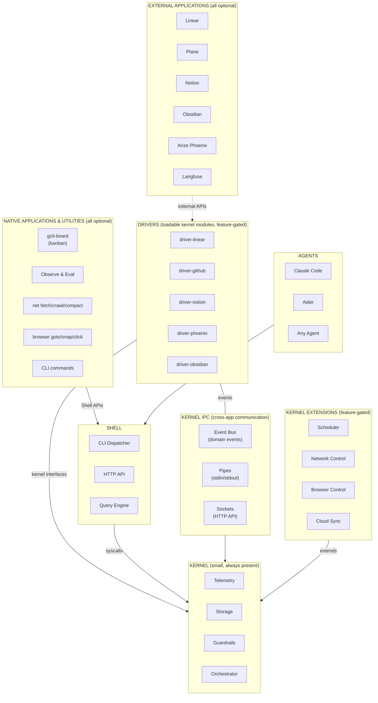
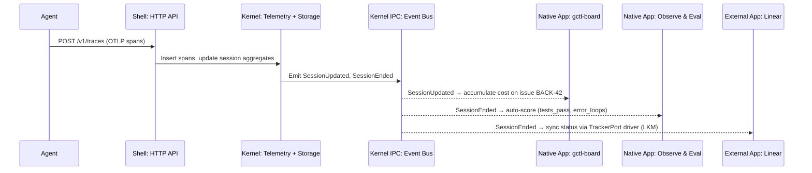
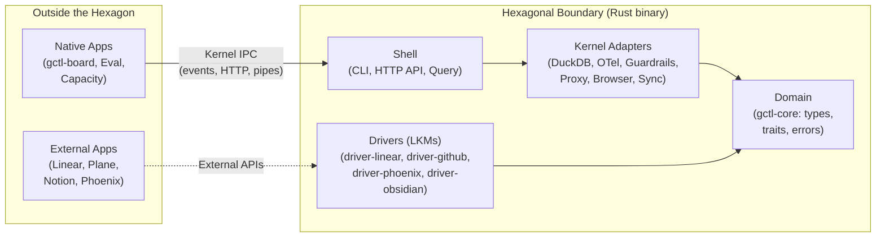

# gctl Architecture

GroundCtrl (gctl) is a small, local-first operating system for human+agent teams. Usable out of the box by an individual developer or a small team.

gctl follows the **Unix philosophy** — both the layered model and the design tenets articulated by McIlroy, Pike, Kernighan, and Gancarz:

> *Small is beautiful. Make each program do one thing well. Build a prototype as soon as possible. Choose portability over efficiency. Store data in flat text files. Use software leverage to your advantage. Use shell scripts to increase leverage and portability. Avoid captive user interfaces. Make every program a filter.*
> — Mike Gancarz, *The Unix Philosophy*

### How gctl Applies These Tenets

| Tenet | How gctl Applies It |
|-------|-------------------|
| **Small is beautiful** | The kernel has four core primitives. Everything else is optional. A solo developer gets a working system with zero config. |
| **Make each program do one thing well** | Each crate is one primitive. Each CLI command is one verb. `gctl net fetch` fetches. `gctl net compact` compacts. No combined super-commands. |
| **Build a prototype as soon as possible** | Stub crates (`gctl-proxy`, `gctl-sync`) ship with clear interfaces before full implementation. Feature-gated code allows incomplete work to coexist. |
| **Choose portability over efficiency** | Scheduler uses a trait/driver pattern: tokio (local), launchd (macOS), DO Alarms (Cloudflare). DuckDB runs everywhere. |
| **Store data in flat text files** | WORKFLOW.md, AGENTS.md, and specs/ are plain Markdown — editable with any tool. DuckDB stores structured data but exports to flat Parquet/CSV. Traffic logs are JSONL. |
| **Use software leverage** | External tools (Linear, Plane, Notion, Obsidian, Phoenix) are applications installed on the OS — connected via drivers and kernel IPC, not rebuilt. The kernel multiplies the value of every installed app. |
| **Use shell scripts to increase leverage** | The CLI is the primary interface. Agents compose `gctl` commands in scripts. WORKFLOW.md prompt templates generate agent prompts. Hooks are shell scripts. |
| **Avoid captive user interfaces** | No mandatory GUI. Every feature is CLI/API-first and automatable. Obsidian, web dashboards, and other UIs are optional external apps, not requirements. |
| **Make every program a filter** | Utilities accept stdin and produce stdout where practical. `--format json` on every command. Output pipes to `jq`, `grep`, other `gctl` commands. |

See `specs/principles.md` for the full Unix philosophy mapping and design principles.

## Architecture Index

```
specs/architecture/
├── README.md          ← this file — system overview, Unix philosophy, data flow
├── os.md              ← layer guide: kernel, shell, apps, utilities, external apps
├── domain-model.md    ← domain types, storage schema (DDL), Effect-TS schemas
│
├── kernel/            ← kernel primitives and extensions (Tasks + Sessions only)
│   ├── orchestrator.md    claim states, dispatch eligibility, retry/backoff
│   ├── scheduler.md       Task lifecycle, interface trait, platform implementations
│   └── browser.md         CDP daemon, ref system, tab management
│
├── shell/             ← shell layer (CLI dispatcher, HTTP API, query engine)
│
└── apps/              ← native applications and utilities (Issues live here)
    ├── gctl-board.md      kanban — issues, board visualization, agent integration
    └── tracker.md         Issue lifecycle, DAG, auto-transitions, TrackerPort
```

| Document | Scope |
|----------|-------|
| This file | System layers, Unix philosophy, internal code architecture, data flow |
| [domain-model.md](domain-model.md) | Domain types, traits, storage schema (DDL), Effect-TS schemas |
| [os.md](os.md) | Unix layers in depth — kernel, shell, applications, utilities, drivers (loadable kernel modules), and how to extend each |
| [kernel/orchestrator.md](kernel/orchestrator.md) | Orchestrator kernel primitive — Task claim states, dispatch eligibility, retry/backoff, concurrency control |
| [kernel/scheduler.md](kernel/scheduler.md) | Scheduler kernel primitive — Task lifecycle, interface trait, platform implementations |
| [kernel/browser.md](kernel/browser.md) | Browser control kernel extension — CDP daemon, ref system, tab management |
| [apps/gctl-board.md](apps/gctl-board.md) | Kanban application — Issues, board visualization, agent integration |
| [apps/tracker.md](apps/tracker.md) | Tracker application component — Issue lifecycle, DAG, auto-transitions, TrackerPort |

---

## System Layers

### Unix-Inspired Architecture



### Layer Responsibilities

#### Kernel (Small, Always Present)

Four core primitives. Agent-agnostic and use-case-agnostic. Makes no assumptions about applications. This is all you get with `gctl serve` — and it is enough for a solo developer.

| Primitive | What It Does |
|-----------|-------------|
| **Telemetry** | OTLP span ingestion, session tracking, cost attribution |
| **Storage** | Embedded DuckDB with schema migrations, retention policies |
| **Guardrails** | Policy engine (cost limits, loop detection, command gateway) |
| **Orchestrator** | Agent-agnostic dispatch, retry, reconciliation ([details](kernel/orchestrator.md)) |

#### Kernel Extensions (Feature-Gated, Optional)

| Extension | What It Does | When to Enable |
|-----------|-------------|----------------|
| **Scheduler** | Deferred and recurring task execution ([details](kernel/scheduler.md)) | Timed triggers beyond the orchestrator |
| **Network Control** | Traffic interception, domain allowlists, traffic logging | Network visibility needed |
| **Browser Control** | Persistent browser automation, ref system, tab management | Browser automation needed |
| **Cloud Sync** | Export, device-partitioned sync, knowledge store | Multi-device or team sync |

#### Shell

Mediates all access to the kernel — like Unix shells mediate access to syscalls. The shell is the *dispatcher*, not the commands themselves.

| Interface | What It Does |
|-----------|-------------|
| **CLI Dispatcher** | Parses arguments, routes to the right command |
| **HTTP API** | REST endpoints, SSE for live feeds |
| **Query Engine** | Guardrailed structured queries |

#### Applications & Utilities (All Optional)

Domain-specific tools built on kernel + shell. CLI subcommands live at this layer — they are programs that *run through* the shell, not part of the shell itself.

- **Applications**: [gctl-board](apps/gctl-board.md) (kanban for agent+human issues & tasks), Observe & Eval (scoring, analytics), Capacity Engine (forecasting)
- **Utilities**: net fetch/crawl/compact (web scraping), browser goto/snapshot/click (browser control), sessions, analytics, etc.

#### Drivers (Loadable Kernel Modules)

Drivers are **loadable kernel modules** — feature-gated crates compiled into the kernel binary that bridge external applications (Linear, Plane, Notion, Obsidian, Arize Phoenix, Langfuse) to gctl's internal event/data model. Like Unix LKMs (`insmod`/`modprobe`), they run in kernel space, implement kernel interface traits, and are independently optional.

External applications have their own state and logic but communicate through drivers inside the kernel, not through direct coupling. Cross-app communication — e.g., a Linear issue syncing to gctl-board, or traces exporting to Phoenix — always flows through kernel IPC, never app-to-app directly.

| IPC Mechanism | Unix Analogy | gctl Implementation | Example |
|---------------|-------------|---------------------|---------|
| **Event Bus** | Signals / named pipes | Domain events (`SessionEnded`, `IssueCreated`) | Telemetry emits `SessionEnded` → Eval auto-scores → Phoenix driver exports |
| **Pipes** | stdin/stdout | CLI output piped between commands | `gctl sessions --format json \| gctl analytics cost` |
| **Sockets** | Unix sockets / TCP | HTTP API endpoints | Driver polls `/api/sessions` or receives webhook callbacks |

| Kernel Interface | Driver (LKM) | External App |
|-----------------|--------|----------------|
| `TrackerPort` | `driver-linear`, `driver-github`, `driver-notion` | Linear, Plane, GitHub Issues, Notion |
| `ObservabilityExportPort` | `driver-phoenix`, `driver-langfuse`, `driver-signoz` | Arize Phoenix, Langfuse, SigNoz |
| `KnowledgeSourcePort` | `driver-obsidian` | Obsidian |

**Cross-app isolation rule**: Applications (native or external) MUST NOT talk to each other directly. All cross-app data flows through kernel IPC — domain events, shell APIs, or pipe composition. This keeps applications independently installable and removable.

### Data Flow (Span Ingestion → Cross-App via Kernel IPC)



All cross-app communication flows through kernel IPC (event bus, shell APIs, pipes). Native apps and external apps are peers — neither talks directly to the other.

---

## Hexagonal Architecture (Kernel + Shell Only)

Hexagonal architecture (ports and adapters) governs the **internal structure of the Kernel and Shell** — the Rust binary. It does NOT extend to external applications (Linear, Plane, Notion, etc.) or native applications (gctl-board). Those are **applications installed on the OS** that communicate through kernel IPC, not through hexagonal port/adapter wiring.



Dependencies flow inward: Shell → Adapters → Domain, never reverse.

- **Domain** (`gctl-core`): Pure types, errors, business rules. Aggregates (Session, TrafficRecord), value objects (SpanId, SessionId), domain errors. See [domain-model.md](domain-model.md).
- **Ports** (`gctl-core` traits): Abstract interfaces — storage port, guardrail policy trait, scheduler trait, browser port, sync engine.
- **Adapters** (kernel crates): Concrete implementations — DuckDB storage, OTel receiver, guardrail policies, scheduler adapters, network proxy, browser daemon, cloud sync.
- **Shell** (`gctl-cli`, `gctl-otel` HTTP routes, `gctl-query`): Dispatches to adapters — CLI routing, HTTP API routing, query execution.

### What lives inside vs. outside the hexagon

**Inside the hexagon (kernel binary):**
1. **Kernel adapters** — internal implementations (DuckDB, OTel, Guardrails, Proxy, Browser, Sync)
2. **Drivers (LKMs)** — loadable kernel modules (`driver-linear`, `driver-github`, `driver-phoenix`, `driver-obsidian`) that implement kernel interface traits. Feature-gated, independently optional.
3. **Utilities** (net fetch, browser goto) — compiled into the binary, access kernel adapters directly.

**Outside the hexagon:**
1. **Native applications** (gctl-board, Observe & Eval, Capacity Engine) communicate through shell APIs (HTTP endpoints, CLI subprocess calls) and kernel IPC (domain events). They are peers of the kernel, not internals of it.
2. **External applications** (Linear, Plane, Notion, Phoenix) live entirely outside the binary. Drivers (LKMs) inside the kernel bridge the gap.

---

## Implementation Details

For languages, frameworks, crate/package structure, dependency graphs, and code patterns, see `specs/implementation/kernel/components.md`.
