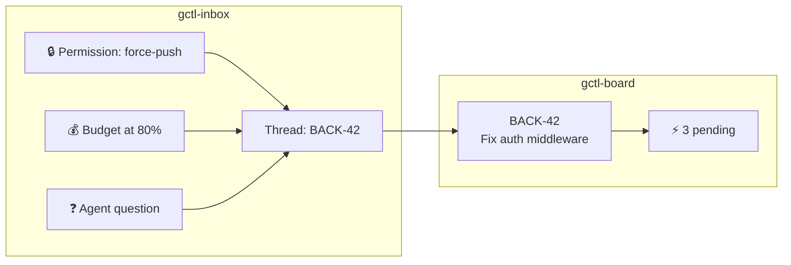

# Application: gctl-inbox (Human Action Center)

gctl-inbox is a **native application** — the structured I/O channel between agents and humans. It aggregates requests, alerts, and notifications into context-grouped threads, enabling humans to triage and batch-act on agent needs without per-message context switching.

Unix analogy: `/dev/tty` + `mail` + signal handling. Agents are processes that occasionally need human input (`read(stdin)`), guardrails emit signals (`SIGSTOP`), and the inbox is the terminal where the operator responds.

## Architectural Position

gctl-inbox is a **native application** in the Unix layer model, peer to gctl-board.

```
App (gctl-inbox) → Shell (HTTP API :4318) → Kernel (Storage, Guardrails, Orchestrator)
```

- **Depends on the shell** — reads/writes data via kernel HTTP API (`:4318`). MUST NOT access DuckDB directly or import kernel crates.
- **Never depended on by the shell or kernel** — removing the app breaks nothing below it.
- **Has its own web server** — serves the inbox feed and thread views on its own port (separate from kernel `:4318` and gctl-board).
- **Has a CLI surface** — `gctl inbox` commands live in the shell package and call kernel HTTP endpoints directly.
- **Companion to gctl-board** — inbox handles time-sensitive requests ("what needs my attention now"); board handles strategic planning ("what's the plan"). They share issue context but are independently optional.

See [os.md — Dependency Direction](../os.md) for the full invariant.

## Scope

### Owns

1. **Message lifecycle** — creation, delivery, status transitions (`pending → acted/dismissed/snoozed/expired`)
2. **Thread auto-grouping** — grouping messages by issue key, session, project, or agent context
3. **Action recording** — structured human decisions (approve, deny, defer, delegate, reply) with audit trail
4. **Subscription management** — per-user control over what enters the inbox
5. **Batch actions** — atomic multi-message operations
6. **Board integration** — pending count badges on issues, cross-linked threads, bidirectional events

### Does NOT Own

1. **Guardrail policies** — kernel guardrail engine decides when to block; inbox only receives the notification
2. **Agent dispatch/resume** — orchestrator manages agent lifecycle; inbox emits `PermissionGranted`/`PermissionDenied` events via kernel IPC
3. **External notifications** — drivers (GitHub, Linear) produce events; inbox receives and groups them
4. **Issue lifecycle** — board/tracker owns issue status transitions; inbox actions may trigger board events but don't directly mutate issue state
5. **Notification delivery** — inbox does not push to email, SMS, Slack. External delivery is a driver concern.

## Message Sources

| Source | Description | Examples |
|--------|-------------|---------|
| `kernel` | Orchestrator lifecycle events | Session started/completed/failed, task retry |
| `guardrail` | Policy enforcement events | Permission blocked, budget warning, budget exceeded |
| `agent` | Agent-initiated messages | Clarification requests, questions |
| `board` | Board-originated requests | Review requests, eval requests |
| `driver-github` | GitHub events via kernel driver | PR review requested, CI failed, issue comment |
| `driver-linear` | Linear events via kernel driver | [deferred] |

## Message Kinds

| Kind | Requires Action | Description |
|------|----------------|-------------|
| `permission_request` | Yes | Agent needs approval for gated operation |
| `budget_warning` | No | Cost threshold approaching |
| `budget_exceeded` | Yes | Cost limit reached, agent blocked |
| `agent_question` | Yes | Agent needs clarification |
| `clarification` | Yes | Ambiguous spec or acceptance criteria |
| `review_request` | Yes | PR or work ready for human review |
| `eval_request` | Yes | Work completed, needs eval scoring |
| `status_update` | No | Informational: session completed, issue moved |
| `custom` | Varies | Driver or user-defined messages |

## Interaction with Board



All cross-app data flows through **kernel IPC events**. gctl-inbox and gctl-board MUST NOT call each other's APIs directly or join each other's tables.

- **Issue cards show inbox badge** — board fetches pending count via kernel API (`GET /api/inbox/threads?context_type=issue&context_ref={key}`)
- **Inbox threads link to issues** — inbox enriches display by fetching issue metadata via kernel API (`GET /api/board/issues/{key}`)
- **Actions emit kernel events** — approving a permission emits `PermissionGranted` via kernel IPC; board subscribes and creates a board event
- **Board emits events** — `ReviewRequested`, `IssueClosed`, `IssueAssigned`, `IssueUnblocked` flow through kernel IPC; inbox subscribes and creates/archives threads
- **Assignment creates subscription** — board emits `IssueAssigned`; inbox subscribes and auto-creates a subscription for the user

## Kernel Integration

The kernel MUST NOT create inbox messages directly (per Invariant #4). The kernel emits domain events; the inbox subscribes and creates its own messages.

> **Note:** Kernel IPC (event bus) is [planned]. Until implemented, inbox uses webhook callback registration or HTTP polling. See PRD Open Question #6.

### Inbound (Kernel Events → Inbox Subscribes)

1. **`GuardrailDenied`** — inbox creates `permission_request` message
2. **`BudgetThreshold` / `BudgetExceeded`** — inbox creates `budget_warning` or `budget_exceeded` message
3. **`SessionPaused`** with reason `needs_input` — inbox creates `agent_question` message
4. **Alert rules** can target inbox as delivery channel

### Outbound (Inbox Emits → Kernel Events)

1. **`PermissionGranted`** — emitted via kernel IPC when human approves; orchestrator subscribes and resumes session
2. **`PermissionDenied`** — emitted via kernel IPC when human denies; orchestrator subscribes and terminates/adjusts session
3. **`ClarificationProvided`** — human reply delivered to agent context via kernel IPC

## Runtime

- **Application logic:** Effect-TS (same stack as gctl-board)
- **Web UI:** React 19 + Tailwind CSS + shadcn/ui (shared component library with gctl-board)
- **Testing:** Vitest (unit), Playwright (E2E)

## Storage

Four DuckDB tables with `inbox_` prefix (per Invariant #3):

| Table | Purpose | Key Columns |
|-------|---------|-------------|
| `inbox_messages` | Individual notifications/requests | `id`, `thread_id`, `source`, `kind`, `urgency`, `status`, `requires_action`, `context` (JSON) |
| `inbox_threads` | Context-grouped conversations | `id`, `context_type`, `context_ref`, `project_key`, `pending_count`, `latest_urgency` |
| `inbox_actions` | Human decision audit trail | `id`, `message_id`, `actor_id`, `action_type`, `reason` |
| `inbox_subscriptions` | Per-user notification filters | `id`, `user_id`, `filter_type`, `filter_value`, `enabled` |

Indexes on: thread_id, status, urgency, kind (messages); context_type+context_ref, project_key (threads); message_id, actor_id (actions); user_id (subscriptions).

## Surfaces

| Surface | Description |
|---------|-------------|
| **Web UI: Inbox Feed** | Threads sorted by urgency, filter sidebar, batch action bar. Served by gctl-inbox's own HTTP server. |
| **Web UI: Thread View** | Chronological messages with inline action buttons, context panel (linked issue, session, cost). |
| **Web UI: Board Widget** | Inbox panel embedded in gctl-board's issue detail page (pending messages for that issue). |
| **Shell CLI** | `gctl inbox` subcommands for list, view, approve, deny, batch-approve, actions, stats, subscriptions. |
| **Shell HTTP** | `/api/inbox/*` routes in the kernel — data API consumed by web UI and CLI. |
| **SSE** | `/api/inbox/sse` for real-time updates to web UI (no polling). |

## Related Docs

- `apps/gctl-inbox/PRD.md` — Full product requirements, use cases, roadmap
- `apps/gctl-inbox/WORKFLOW.md` — Message lifecycle, triage flow, CLI reference, storage DDL
- `specs/architecture/apps/gctl-board.md` — Companion app for project management
- `specs/architecture/kernel/orchestrator.md` — Agent dispatch and permission gates
- `specs/architecture/domain-model.md` — Shared domain types
