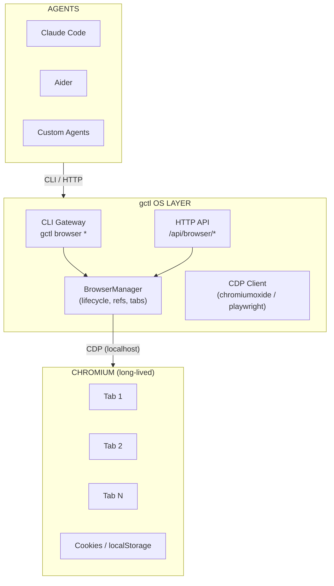
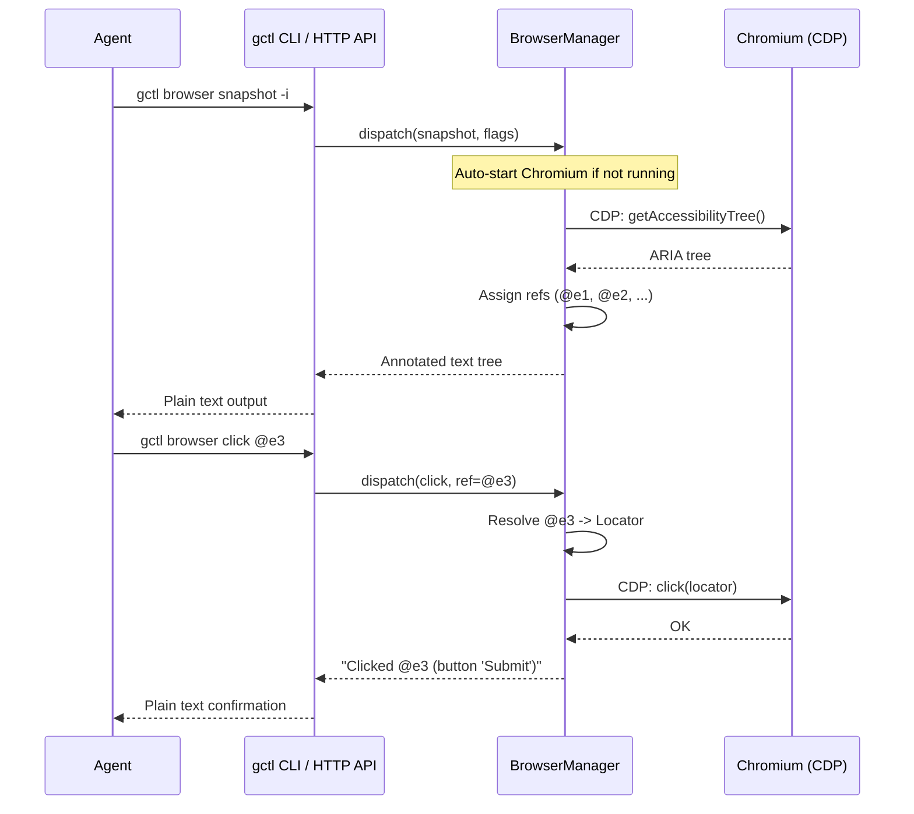
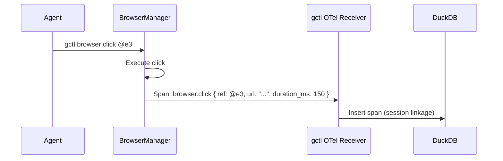

# Browser Control (gctl-browser)

> Agents talk to gctl to make use of persistent browser instances via Chrome DevTools Protocol (CDP).

---

## Problem

AI agents frequently need browser access for QA, testing, form filling, scraping authenticated pages, and verifying deployments. Today this requires either:

1. **Cold-starting a browser per command** -- 3-5s startup, no state persistence, cookies/sessions lost between calls.
2. **External browser-as-a-service** -- network latency, cloud dependency, breaks local-first principle.

gctl already provides network control (fetch, crawl, proxy). Browser control is the natural next primitive: a long-lived, agent-addressable Chromium instance managed by the OS layer.

---

## Architecture

Inspired by [gstack](https://github.com/garrytan/gstack)'s daemon model: a persistent Chromium process managed by gctl, accessible to agents via HTTP API and CLI.

### System Diagram



### Request Flow



---

## Daemon Model

Following gstack's key insight: **sub-second latency requires a persistent browser**. Cold-starting Chromium per command is too slow for multi-step agent workflows.

### Lifecycle

1. **Auto-start on first use.** `gctl browser <cmd>` checks for a running daemon; if none, spawns Chromium and the browser manager.
2. **Persistent state.** Cookies, localStorage, open tabs survive across commands. Log in once, stay logged in.
3. **Idle shutdown.** Auto-terminate after configurable idle timeout (default: 30 minutes). No process babysitting.
4. **Crash recovery.** If Chromium crashes, the manager exits. Next CLI invocation detects the dead process and restarts cleanly. No self-healing complexity.

### State File

The daemon writes a state file at `~/.local/share/gctl/browser.json`:

```json
{
  "pid": 12345,
  "port": 34567,
  "token": "uuid-v4",
  "started_at": "2026-03-23T10:00:00Z",
  "version": "abc123"
}
```

- CLI reads this file to locate the daemon. If missing, stale, or PID is dead, CLI spawns a new one.
- **Bearer token auth** on every HTTP request (token from state file, file mode 0o600).
- **Random port** (10000-60000) to support multiple workspaces without port conflicts.
- **Version auto-restart**: if the gctl binary version doesn't match the daemon's version, kill and restart.

### Security

- **Localhost only.** The daemon binds to `127.0.0.1`, not `0.0.0.0`.
- **Bearer token auth.** Random UUID per session, state file is owner-read-only (0o600).
- **No cookie values in logs.** Cookie metadata (domain, name, expiry) is logged; values are never exposed.

---

## Ref System (Element Addressing)

Agents need to address page elements without writing CSS selectors or XPath. gstack's ref system solves this elegantly.

### How It Works

1. Agent runs `gctl browser snapshot -i`
2. Manager calls Chromium's accessibility tree via CDP
3. Parser walks the ARIA tree, assigns sequential refs: `@e1`, `@e2`, `@e3`...
4. For each ref, builds a locator: `getByRole(role, { name }).nth(index)`
5. Returns annotated tree as plain text

Later:
6. Agent runs `gctl browser click @e3`
7. Manager resolves `@e3` to locator, executes click via CDP

### Why Locators, Not DOM Mutation

Injecting `data-ref` attributes into the DOM breaks on:
- **CSP** -- production sites block DOM modification
- **Framework hydration** -- React/Vue/Svelte can strip injected attributes
- **Shadow DOM** -- can't reach inside shadow roots

Locators are external to the DOM. They use the accessibility tree (maintained by Chromium internally) and role-based queries.

### Ref Lifecycle

- Refs are **cleared on navigation** (`framenavigated` event). After navigation, all locators are stale -- agent must `snapshot` again.
- **Staleness detection** for SPAs: before using any ref, the manager checks element existence (~5ms). Stale refs fail fast with an actionable error instead of timing out.

### Cursor-Interactive Refs (@c)

Elements styled with `cursor: pointer` or `onclick` but missing from the ARIA tree get `@c1`, `@c2` refs in a separate namespace. Catches custom components rendered as `<div>` that are actually buttons.

---

## Commands

### Category: READ (no side effects)

| Command | Description |
|---------|-------------|
| `snapshot` | Capture accessibility tree with refs. `-i` for interactive elements, `-C` for cursor-interactive. |
| `screenshot` | Capture viewport as PNG. |
| `text` | Extract visible text content. |
| `html` | Get page HTML (full or selector). |
| `links` | List all links on page. |
| `console` | Show browser console log. |
| `network` | Show network request log. |
| `cookies` | List cookies (metadata only, no values). |
| `tabs` | List open tabs. |
| `url` | Get current page URL. |

### Category: WRITE (mutates page state)

| Command | Description |
|---------|-------------|
| `goto <url>` | Navigate to URL. |
| `click <ref>` | Click element by ref. |
| `fill <ref> <value>` | Fill input field by ref. |
| `select <ref> <value>` | Select dropdown option by ref. |
| `press <key>` | Press keyboard key. |
| `scroll <direction>` | Scroll page up/down. |
| `tab <id>` | Switch to tab by ID. |
| `newtab [url]` | Open new tab. |
| `closetab [id]` | Close tab. |
| `back` | Navigate back. |
| `forward` | Navigate forward. |
| `wait <ms>` | Wait for specified milliseconds. |

### Category: META

| Command | Description |
|---------|-------------|
| `status` | Show daemon status (PID, port, uptime, tabs). |
| `start` | Explicitly start the daemon. |
| `stop` | Stop the daemon and Chromium. |

---

## CLI Interface

```sh
# Inspect page state
gctl browser goto https://example.com
gctl browser snapshot -i
gctl browser screenshot --output /tmp/page.png

# Interact with elements
gctl browser click @e3
gctl browser fill @e7 "search query"
gctl browser press Enter

# Tab management
gctl browser tabs
gctl browser newtab https://staging.example.com
gctl browser tab 2

# Daemon lifecycle
gctl browser status
gctl browser stop
```

## HTTP API

All endpoints under `/api/browser/*`, protected by the daemon's bearer token.

```
POST /api/browser/command    { "command": "snapshot", "args": ["-i"] }
GET  /api/browser/status
GET  /api/browser/screenshot
POST /api/browser/stop
```

Response format: plain text for agent consumption (minimal token overhead). Errors include actionable guidance.

---

## Error Philosophy

Errors are for AI agents, not humans. Every error message must be actionable:

| Raw Error | Agent-Friendly Error |
|-----------|---------------------|
| Element not found | `Element not found. Run 'gctl browser snapshot -i' to see available elements.` |
| Ref @e5 stale | `Ref @e5 is stale -- element no longer exists. Run 'snapshot' to get fresh refs.` |
| Navigation timeout | `Navigation timed out after 30s. The page may be slow or the URL may be wrong.` |
| Chromium crashed | `Browser process died. It will auto-restart on next command.` |

---

## Telemetry Integration

Browser commands emit OTLP spans into the standard gctl telemetry pipeline:



- Each browser command creates a span with `span.type = "tool"` and `operation_name = "browser.<command>"`
- Spans are linked to the agent's session via session ID propagation
- Network requests made by the browser page are captured and correlated with the traffic table (same as MITM proxy records)
- Screenshots can be stored as span attributes (base64) or as file references

### Span Attributes

```json
{
  "browser.command": "click",
  "browser.ref": "@e3",
  "browser.url": "https://staging.example.com/login",
  "browser.tab_id": 1,
  "browser.element.role": "button",
  "browser.element.name": "Submit"
}
```

---

## Configuration

In `~/.config/gctl/config.toml`:

```toml
[browser]
headless = true              # default: true (set false for debugging)
idle_timeout_seconds = 1800  # default: 30 minutes
viewport_width = 1280
viewport_height = 720
# user_data_dir = "~/.local/share/gctl/browser-profile"
# chromium_path = "/usr/bin/chromium"  # auto-detected if omitted
```

---

## Implementation Strategy

### Crate: `gctl-browser`

New crate in `crates/gctl-browser/`, feature-gated in the workspace Cargo.toml (`feature: browser`).

**Dependencies:**
- `chromiumoxide` -- Rust CDP client (async, tokio-based)
- `tokio` -- async runtime (already in workspace)
- `serde` / `serde_json` -- command serialization
- `uuid` -- token generation

**Internal structure:**

```
crates/gctl-browser/
  src/
    lib.rs              # Public API
    daemon.rs           # Lifecycle: start, stop, health check, state file
    manager.rs          # BrowserManager: tab management, ref system, command dispatch
    refs.rs             # Ref assignment, resolution, staleness detection
    commands/
      mod.rs            # Command enum, dispatch
      read.rs           # snapshot, screenshot, text, html, links, console, network, cookies
      write.rs          # goto, click, fill, select, press, scroll, tab management
      meta.rs           # status, start, stop
    error.rs            # Agent-friendly error types
```

### CLI Integration

New subcommand group in `gctl-cli`:

```rust
#[derive(Subcommand)]
enum BrowserCommand {
    Goto { url: String },
    Snapshot { #[arg(short)] interactive: bool },
    Click { ref_id: String },
    Fill { ref_id: String, value: String },
    // ... etc
    Status,
    Stop,
}
```

### HTTP API Routes

Mounted under `/api/browser/*` on the existing axum server:

```rust
Router::new()
    .route("/api/browser/command", post(handle_browser_command))
    .route("/api/browser/status", get(handle_browser_status))
    .route("/api/browser/screenshot", get(handle_browser_screenshot))
    .route("/api/browser/stop", post(handle_browser_stop))
```

---

## Relationship to Existing OS Primitives

| OS Primitive | Browser Integration |
|---|---|
| **Telemetry** | Browser commands emit spans; page network requests become traffic records |
| **Storage** | Browser state file in gctl data dir; screenshots optionally stored |
| **Guardrails** | `DomainAllowlistPolicy` -- restrict which URLs the browser can visit; `BrowserBudgetPolicy` -- limit commands per session |
| **Network** | Page requests visible in `gctl net logs/stats`; proxy integration for MITM inspection of browser traffic |
| **CLI Gateway** | `gctl browser <cmd>` subcommand group |
| **HTTP API** | `/api/browser/*` endpoints |

---

## What's Intentionally Not Here

- **No MCP protocol.** Plain HTTP + plain text is lighter on tokens and easier to debug. MCP adds schema overhead per request.
- **No WebSocket streaming.** HTTP request/response is simpler and fast enough for the command model.
- **No multi-user browser sharing.** One daemon per workspace, one user.
- **No iframe ref crossing.** Refs don't cross frame boundaries (can be added later).
- **No cookie import from host browser.** Unlike gstack, gctl doesn't decrypt host browser cookies. Agents log in through the controlled browser or cookies are set via the API.
