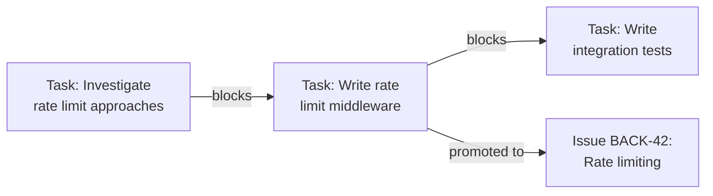

# Application: gctl-board (Kanban)

gctl-board is the first shipped application — a kanban system for tracking issues and tasks planned and executed by both humans and agents. It is the primary dogfooding surface: we use gctl-board to manage gctl development itself.

## What It Tracks

| Work Item | Description | Lifecycle |
|-----------|-------------|-----------|
| **Task** | Local planning artifact for decomposition and dependency modeling before committing to an Issue. Not synced externally. | `created → decomposed → promoted / archived` |
| **Issue** | Committed, trackable work visible to the team. Synced bidirectionally with GitHub Issues. | `backlog → todo → in_progress → in_review → done` (or `cancelled`) |

Tasks are lightweight and local — they let agents and humans break down vague goals before creating Issues. When a Task is ready, it is **promoted** to an Issue, preserving dependency edges.

## Agent Integration

1. **Auto-linking**: When an agent session emits spans referencing an Issue key (e.g., `BACK-42`), the kernel's telemetry links the session to that Issue. Cost and token usage accumulate automatically.
2. **Agent assignment**: Agents can claim Issues, triggering a transition to `in_progress`.
3. **PR lifecycle**: When a PR referencing an Issue is opened, the Issue auto-transitions to `in_review`. On merge, it transitions to `done`.
4. **Session context**: Every Issue tracks linked agent sessions with cost, model, and outcome.

## Task Graph (DAG)

Tasks and Issues form a directed acyclic graph of dependencies:

- Dependencies MUST be acyclic — cycles are rejected.
- When a blocking item completes, blocked items auto-transition to `todo`.

## Kernel Primitives Used

| Primitive | How gctl-board uses it |
|-----------|----------------------|
| **Storage** | Namespaced tables for issues, tasks, projects |
| **Telemetry** | Session-to-Issue linking, cost/token accumulation |
| **Scheduler** | Recurring external sync, scheduled status reports |
| **Cloud Sync** | Issue and task data synced for cross-device access |
| **Shell (CLI)** | `gctl board`, `gctl task` subcommands |
| **Shell (HTTP)** | `/api/board/*` routes |

## Related Docs

- `specs/workflow.md` — Full Task → Issue lifecycle, external sync rules, PR review conventions
- `specs/architecture/domain-model.md` — Board schemas (DuckDB DDL + Effect-TS types)
- `specs/implementation/components.md` — gctl-board implementation details (Effect-TS, tsup, vitest)
