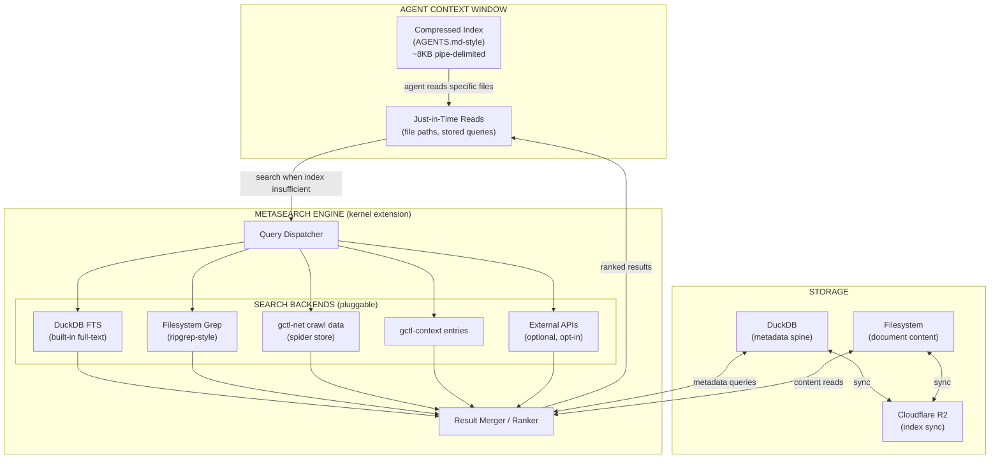
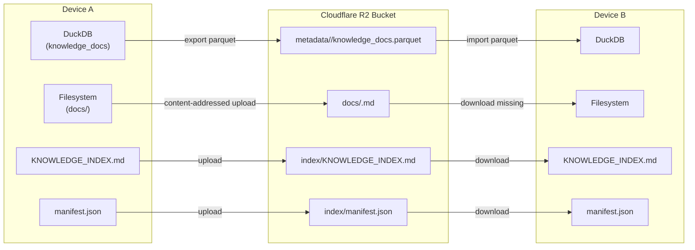

# Knowledge Index — World Knowledge for Agent Context

> **Status: Planned.** No knowledge index crate exists yet. This document describes the target architecture.

The Knowledge Index is a **kernel extension** that stores, indexes, and retrieves world knowledge for agent context. It pairs a **DuckDB metadata spine** with a **homegrown metasearch engine** (SearXNG-inspired) and a **compressed passive index** (AGENTS.md pattern). The index syncs across devices via **Cloudflare R2**.

**Why kernel extension, not a utility or application:**
- Needs **direct write access** to `knowledge_docs` DuckDB table (ingest, compact) — utilities are stateless and don't own tables
- Needs **direct read access** to other kernel tables (`context_entries`, spider filesystem) as search backends — applications can only access kernel via HTTP
- Is **agent-agnostic and application-agnostic** — any app or agent benefits from indexed knowledge
- Provides a **mechanism** (store, index, search), not a policy (what to search for, how to use results)

CLI commands (`gctl knowledge ...`) are owned by this kernel extension and registered with the shell's CLI framework. Each command is a thin client that calls the kernel HTTP API.

**Design principles:**
- No vendor lock-in to any single search engine (no Tantivy, no Meilisearch, no Elasticsearch dependency)
- Metasearch federation: pluggable search backends, merged ranking — like SearXNG for code/docs
- Passive context beats active retrieval (Vercel finding: 100% vs 53% baseline)
- Just-in-time loading with lightweight handles (Anthropic context engineering)
- DuckDB is the single structured store; no competing embedded databases (no LMDB)
- Index is a syncable artifact — R2 as the transport layer

---

## 1. Architecture Overview



---

## 2. Why Metasearch over Embedded Search Engine

### Approaches Evaluated

| Approach | Model | Pros | Cons | Verdict |
|----------|-------|------|------|---------|
| **Tantivy** (segmented inverted index) | Embedded Rust library, mmap'd segments, FST term dictionaries | Sub-10ms lookup, Rust-native, columnar fast fields | Vendor lock-in to one engine, single-writer lock, no vector search, segment format is opaque | **Rejected** — lock-in |
| **Meilisearch/milli** (LMDB + OBKV) | Embedded LMDB store, Roaring bitmaps, typo-tolerant FSTs | Typo tolerance, faceted search, compact OBKV format | LMDB is a second mmap'd store competing with DuckDB, disk never reclaimed after deletes, C dependency | **Rejected** — competing store |
| **AGENTS.md** (passive compressed index) | 8KB pipe-delimited index in system prompt, full docs on filesystem | 100% pass rate in Vercel evals (vs 53% baseline), no retrieval decision point, always available | Static — needs rebuild on content change, limited to ~8KB compressed | **Adopted** — passive tier |
| **Context engineering** (just-in-time + compaction) | Lightweight handles upfront, full content fetched via tools, sub-agent deep dives | Anthropic-validated, matches gctl's sub-agent architecture | Requires well-designed search tooling | **Adopted** — active tier |
| **Metasearch** (SearXNG-inspired federation) | Pluggable backends, merged ranking, no single-engine dependency | Zero vendor lock-in, leverages existing stores (DuckDB, filesystem, gctl-net), incrementally extensible | Must build ranking/merging logic, latency of slowest backend | **Adopted** — search engine |

### SearXNG Analogy

[SearXNG](https://github.com/searxng/searxng) is a metasearch engine that federates queries across 70+ search backends (Google, Bing, DuckDuckGo, etc.) without depending on any single one. gctl applies the same pattern to **local knowledge**:

| SearXNG | gctl Knowledge Index |
|---------|---------------------|
| Search engines (Google, Bing, …) | Search backends (DuckDB FTS, filesystem grep, spider store, context store) |
| Engine plugins (YAML config) | Backend trait implementations (Rust, feature-gated) |
| Result merger with scoring | Result merger with recency, relevance, source-weight scoring |
| No user tracking | Local-first, no external API calls by default |
| Self-hosted | Embedded in kernel binary |

---

## 3. Storage Design

### 3.1 DuckDB Metadata Spine

DuckDB is the **single structured store** for all knowledge metadata. No LMDB, no SQLite, no second embedded database.

```sql
-- Knowledge document metadata
CREATE TABLE IF NOT EXISTS knowledge_docs (
    doc_id          VARCHAR PRIMARY KEY,
    path            VARCHAR NOT NULL UNIQUE,  -- filesystem path (relative to knowledge root)
    title           VARCHAR,
    domain          VARCHAR,                  -- source domain (e.g. 'docs.effect.website')
    doc_type        VARCHAR NOT NULL,         -- 'crawl', 'context', 'manual', 'snapshot'
    source          VARCHAR,                  -- origin URL or import path
    tags            VARCHAR[],
    token_count     INTEGER,                  -- estimated token count for context budgeting
    content_hash    VARCHAR NOT NULL,         -- SHA-256, for sync change detection
    created_at      TIMESTAMP DEFAULT now(),
    updated_at      TIMESTAMP DEFAULT now()
);

-- DuckDB built-in full-text search extension
INSTALL 'fts';
LOAD 'fts';

-- FTS index over document content (rebuilt on ingest)
PRAGMA create_fts_index(
    'knowledge_docs', 'doc_id', 'title', 'domain', 'tags',
    stemmer = 'english',
    stopwords = 'english'
);

-- Compressed passive index (materialized view for AGENTS.md generation)
CREATE TABLE IF NOT EXISTS knowledge_index (
    domain          VARCHAR NOT NULL,
    path            VARCHAR NOT NULL,
    title           VARCHAR,
    token_count     INTEGER,
    updated_at      TIMESTAMP
);

-- Indexes
CREATE INDEX IF NOT EXISTS idx_knowledge_domain ON knowledge_docs(domain);
CREATE INDEX IF NOT EXISTS idx_knowledge_type ON knowledge_docs(doc_type);
CREATE INDEX IF NOT EXISTS idx_knowledge_updated ON knowledge_docs(updated_at);
```

### 3.2 Filesystem Content

Documents stored as markdown with YAML frontmatter, colocated with existing gctl stores:

```
~/.local/share/gctl/
├── knowledge/
│   ├── index/                    # Generated artifacts
│   │   ├── KNOWLEDGE_INDEX.md    # Compressed passive index (AGENTS.md-style)
│   │   └── manifest.json         # Sync manifest (doc_id → content_hash)
│   └── docs/                     # Full document content
│       ├── crawl/                # From gctl-net crawl
│       ├── context/              # From gctl-context
│       ├── manual/               # User-added documents
│       └── snapshot/             # Point-in-time snapshots
├── spider/                       # Existing gctl-net store (source, not duplicated)
└── context/                      # Existing gctl-context store (source, not duplicated)
```

**No duplication rule:** `crawl/` and `context/` directories are **symlinks or views** into the existing `spider/` and `context/` stores. The knowledge index adds metadata in DuckDB and the compressed index artifact — it does not copy content.

### 3.3 Compressed Passive Index

Generated as a build artifact by `gctl knowledge compact`. Based on Vercel's finding that an 8KB compressed index in the system prompt achieved 100% pass rate vs 53% baseline.

Format (pipe-delimited, sorted by domain then path):

```
# gctl Knowledge Index — auto-generated, do not edit
# Domains: 12 | Docs: 847 | Tokens: ~2.1M | Updated: 2026-04-03T10:00:00Z
#
# domain|path|title|tokens
docs.effect.website|getting-started.md|Getting Started|1200
docs.effect.website|effect/effect.md|The Effect Type|3400
developer.mozilla.org|api/fetch.md|Fetch API|2800
...
```

Agents see this index in their system prompt and read specific files on demand — no retrieval decision point, no skill invocation failure mode.

---

## 4. Metasearch Engine

### 4.1 Backend Trait

```rust
/// A pluggable search backend — the gctl analogue of a SearXNG engine.
#[async_trait]
pub trait SearchBackend: Send + Sync {
    /// Unique backend identifier (e.g. "duckdb_fts", "fs_grep", "spider")
    fn id(&self) -> &str;

    /// Execute a search query, returning scored results.
    async fn search(&self, query: &SearchQuery) -> Result<Vec<SearchResult>, SearchError>;

    /// Whether this backend is available (e.g. feature-gated, requires config)
    fn available(&self) -> bool { true }
}

pub struct SearchQuery {
    pub text: String,
    pub domain: Option<String>,      // filter by domain
    pub doc_type: Option<String>,    // filter by type
    pub tags: Vec<String>,           // filter by tags
    pub since: Option<DateTime<Utc>>,// recency filter
    pub limit: usize,
}

pub struct SearchResult {
    pub doc_id: String,
    pub path: String,
    pub title: Option<String>,
    pub snippet: String,             // matching excerpt
    pub score: f64,                  // backend-local relevance score
    pub source_backend: String,      // which backend produced this
}
```

### 4.2 Built-in Backends

| Backend | Source | What It Searches | Feature Gate |
|---------|--------|-----------------|--------------|
| `DuckDbFts` | `knowledge_docs` table | Title, domain, tags via DuckDB FTS extension | Always available |
| `FsGrep` | `~/.local/share/gctl/knowledge/docs/` | Full-text content via ripgrep-style pattern matching | Always available |
| `SpiderStore` | `~/.local/share/gctl/spider/` | Crawled web pages (existing gctl-net data) | Always available |
| `ContextStore` | `~/.local/share/gctl/context/` | Context entries (existing gctl-context data) | Always available |
| `ExternalApi` | Configurable URLs | Federated search to external services (opt-in) | `--features external-search` |

### 4.3 Result Merging & Ranking

The merger combines results from all backends using weighted scoring, inspired by SearXNG's result aggregation:

```
final_score = Σ (backend_weight × normalized_score × recency_boost × source_trust)
```

| Factor | Description |
|--------|-------------|
| `backend_weight` | Configurable per-backend (default 1.0). DuckDB FTS and context may be weighted higher than spider crawl data. |
| `normalized_score` | Backend scores normalized to [0, 1] range for cross-backend comparability. |
| `recency_boost` | Exponential decay: `e^(-λ × age_days)`. Newer documents rank higher. |
| `source_trust` | Manual > context > crawl. User-authored content outranks scraped content. |

**Deduplication:** Results matching the same `doc_id` (or `content_hash`) across backends are merged, keeping the highest score and combining snippets.

---

## 5. R2 Sync — Index as a Syncable Artifact

The knowledge index is designed as a **syncable artifact** from the start. Cloudflare R2 is the transport layer, consistent with gctl's planned Cloud Sync kernel extension (`gctl-sync`).

> **Dependency: Cloud Sync (`gctl-sync`) must be implemented first.** Knowledge sync reuses Cloud Sync's R2 credentials, Parquet export, and device-partitioned upload patterns. Without Cloud Sync, all Knowledge Index features work locally (ingest, search, compact) — only `gctl knowledge sync` is unavailable.

### 5.1 What Syncs



| Artifact | R2 Key Pattern | Sync Strategy |
|----------|---------------|---------------|
| DuckDB metadata | `metadata/<device_id>/knowledge_docs.parquet` | Export rows as Parquet, device-partitioned (same pattern as `gctl-sync`) |
| Document content | `docs/<content_hash>.md` | **Content-addressed** — `content_hash` (SHA-256) is the R2 key. Deduplicates identical content across devices. Upload only if hash is new. |
| Compressed index | `index/KNOWLEDGE_INDEX.md` | Overwrite on each `gctl knowledge compact --sync`. Lightweight (~8KB). |
| Sync manifest | `index/manifest.json` | Maps `doc_id → content_hash`. Used for diff-based sync — only fetch docs whose hash changed. |

### 5.2 Sync Protocol

```
1. LOCAL EXPORT
   - Export knowledge_docs to Parquet (device-partitioned)
   - Hash each doc's content → content_hash
   - Upload new/changed docs to R2 (content-addressed, skip if hash exists)
   - Upload metadata Parquet
   - Regenerate and upload KNOWLEDGE_INDEX.md + manifest.json

2. REMOTE IMPORT
   - Download manifest.json from R2
   - Diff against local manifest → list of missing/changed content_hashes
   - Download only missing docs from R2 (content-addressed fetch)
   - Import metadata Parquet, merge into local DuckDB (upsert by doc_id)
   - Regenerate local KNOWLEDGE_INDEX.md from merged state
```

### 5.3 Why R2

| Requirement | R2 Fit |
|-------------|--------|
| No egress fees | R2 has zero egress — critical for frequent sync of many small docs |
| S3-compatible API | Standard `aws-sdk-s3` Rust crate works; no proprietary SDK |
| Content-addressed storage | R2 supports arbitrary key patterns; SHA-256 keys deduplicate naturally |
| Pairs with gctl-sync | Cloud Sync extension already plans R2 for Parquet export; knowledge index reuses the same bucket/credentials |
| No vendor lock-in | S3-compatible API means migration to any S3-compatible store (MinIO, Backblaze B2, Tigris) is a config change |

---

## 6. Agent Integration — Two-Tier Retrieval

Based on findings from Vercel (AGENTS.md) and Anthropic (context engineering):

### Tier 1: Passive Compressed Index (Always Available)

The `KNOWLEDGE_INDEX.md` file is included in the agent's system prompt or CLAUDE.md. It contains a compressed directory of all indexed knowledge (~8KB). The agent **always** has this context — no retrieval decision point, no skill invocation that might fail.

**Why this works** (Vercel eval data):
- AGENTS.md: **100% pass rate** (build/lint/test)
- Skills with explicit instructions: 79%
- Skills default: 53% (same as no docs)
- Skills were never invoked in **56% of cases**

The passive index eliminates the "should I look this up?" decision entirely.

### Tier 2: Just-in-Time Search (On Demand)

When the passive index points to a relevant doc, the agent reads it via filesystem tools. When the agent needs something not in the index, it invokes `gctl knowledge search` — which dispatches to the metasearch engine.

**Why this works** (Anthropic context engineering):
- Lightweight handles (paths, stored queries) upfront, full content fetched just-in-time
- Sub-agents can deep-dive (10k+ tokens) and return 1-2k token summaries
- Context is a finite resource with diminishing returns — load only what's needed

```
Agent receives KNOWLEDGE_INDEX.md (always in context)
  │
  ├─ Finds relevant entry → reads file directly (Tier 1, fast)
  │
  └─ Needs something not indexed → gctl knowledge search "query"
       │
       ├─ DuckDB FTS backend
       ├─ Filesystem grep backend
       ├─ Spider store backend
       └─ Context store backend
            │
            └─ Merged, ranked results → agent reads top result
```

---

## 7. Kernel HTTP API Routes

The Knowledge Index registers routes on the kernel HTTP API (`:4318`). All requests are instrumented as OTel spans — tracking what agents search for, how often, and which results they use.

| Route | Method | Description |
|-------|--------|-------------|
| `/api/knowledge/search` | `GET` | Metasearch across all backends, return ranked results |
| `/api/knowledge/docs` | `GET` | List indexed documents (from DuckDB metadata) |
| `/api/knowledge/docs` | `POST` | Import/ingest a document into the knowledge store |
| `/api/knowledge/docs/:doc_id` | `GET` | Show a specific document with content |
| `/api/knowledge/compact` | `POST` | Regenerate `KNOWLEDGE_INDEX.md` from current state |
| `/api/knowledge/stats` | `GET` | Index statistics (doc count, total tokens, backend health) |
| `/api/knowledge/sync` | `POST` | R2 sync (push, pull, or bidirectional via `?direction=` param) |

**OTel instrumentation:** Every search query emits a span with attributes `knowledge.query`, `knowledge.backend_count`, `knowledge.result_count`, and `knowledge.latency_ms`. This lets operators see what context agents request most and where search latency is highest.

## 8. CLI Commands

CLI commands are **owned by the Knowledge Index kernel extension** and registered with the shell's CLI framework. Each command handler calls the kernel HTTP API — the CLI is a thin client.

| Command | Kernel HTTP Route | Description |
|---------|------------------|-------------|
| `gctl knowledge ingest <path>` | `POST /api/knowledge/docs` | Import a document or directory into the knowledge store |
| `gctl knowledge search <query>` | `GET /api/knowledge/search` | Metasearch across all backends, return ranked results |
| `gctl knowledge compact` | `POST /api/knowledge/compact` | Regenerate `KNOWLEDGE_INDEX.md` from current state |
| `gctl knowledge sync --push` | `POST /api/knowledge/sync?direction=push` | Export and upload to R2 |
| `gctl knowledge sync --pull` | `POST /api/knowledge/sync?direction=pull` | Download and merge from R2 |
| `gctl knowledge sync` | `POST /api/knowledge/sync` | Bidirectional sync (push then pull) |
| `gctl knowledge list` | `GET /api/knowledge/docs` | List indexed documents (from DuckDB metadata) |
| `gctl knowledge show <doc_id>` | `GET /api/knowledge/docs/:doc_id` | Display a specific document |
| `gctl knowledge stats` | `GET /api/knowledge/stats` | Index statistics (doc count, total tokens, backend health) |

---

## 9. Relationship to Existing Components

| Component | Relationship |
|-----------|-------------|
| **gctl-context** (`kernel/crates/gctl-context/`) | Knowledge index queries `context_entries` table directly (same DuckDB, same binary). Filesystem content is accessed via symlink — no duplication. |
| **gctl-net** (`kernel/crates/gctl-net/`) | Knowledge index queries spider store filesystem directly. Crawled pages appear as a search backend. No content duplication. |
| **gctl-sync** (`kernel/crates/gctl-sync/`) | Knowledge sync reuses the same R2 bucket, credentials, and Parquet export pattern as the general sync engine. **Dependency: Cloud Sync extension must be implemented first** — knowledge sync is not independently implementable. |
| **gctl-storage** (`kernel/crates/gctl-storage/`) | Knowledge metadata lives in DuckDB alongside all other kernel tables. As a kernel extension, it has direct `DuckDbStore` access (same binary) — no HTTP indirection needed for internal reads/writes. Uses the same migration system. |
| **Guardrails** (kernel core primitive) | Search queries are subject to guardrail enforcement (rate limits, cost budgets) at the kernel HTTP API layer — the same instrumentation that applies to all kernel routes. No separate query engine routing needed. |
| **Telemetry** (kernel core primitive) | All `/api/knowledge/*` requests are instrumented as OTel spans. Search telemetry (query text, result count, latency) is captured automatically. |
| **Cloud Sync extension** ([os.md § Kernel Extensions](../os.md)) | Knowledge sync depends on Cloud Sync for R2 transport. **Status: both are Planned.** If Cloud Sync doesn't exist yet, `gctl knowledge sync` is unavailable — ingest, search, and compact work locally without it. |

---

## 10. References

- [Vercel: AGENTS.md Outperforms Skills in Our Agent Evals](https://vercel.com/blog/agents-md-outperforms-skills-in-our-agent-evals) — passive compressed index achieves 100% pass rate
- [Anthropic: Effective Context Engineering for AI Agents](https://www.anthropic.com/engineering/effective-context-engineering-for-ai-agents) — just-in-time loading, compaction, sub-agent architecture
- [SearXNG](https://github.com/searxng/searxng) — metasearch engine design pattern: pluggable backends, merged ranking, no vendor lock-in
- [DuckDB Full-Text Search](https://duckdb.org/docs/extensions/full_text_search) — built-in FTS extension, no external dependency
- [specs/architecture/README.md](../README.md) — system architecture overview
- [specs/architecture/os.md](../os.md) — Unix layers, Cloud Sync extension
- [specs/architecture/domain-model.md](../domain-model.md) — domain types and storage schema
