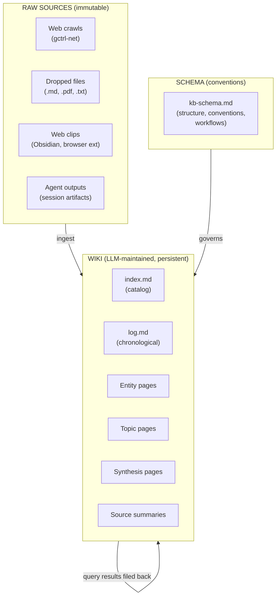

# Knowledgebase (gctrl-kb)

> Agents and humans incrementally build and maintain a persistent, interlinked wiki — a structured knowledge store that compounds over time. Inspired by [Karpathy's LLM knowledge base pattern](https://gist.github.com/karpathy/442a6bf555914893e9891c11519de94f) and Vannevar Bush's Memex.

---

## Problem

Current knowledge workflows are retrieval-oriented: drop documents into a corpus, retrieve chunks at query time, re-derive synthesis from scratch on every question. Nothing accumulates. RAG re-discovers connections between documents every time instead of building them up.

gctrl already has the primitives — `gctrl-context` for hybrid DuckDB+filesystem storage, `gctrl-net` for web crawling, and the board file watcher for reactive imports. What's missing is the **wiki layer**: persistent cross-references, hierarchical organization, incremental synthesis, and lint/health operations that keep the knowledge base coherent as it grows.

---

## Architecture

Three layers, mapping to gctrl's Unix model:



### Mapping to gctrl layers

| Karpathy Layer | gctrl Layer | Implementation |
|---|---|---|
| **Raw sources** | Kernel: `gctrl-context` (kind: `source`) + `gctrl-net` (crawls) | Immutable source documents, crawled pages. Never modified after ingest. |
| **Wiki** | Kernel: `gctrl-context` (kind: `wiki`) + filesystem `~/.local/share/gctrl/context/wiki/` | LLM-generated markdown files with `[[internal-links]]`, frontmatter metadata, cross-references. |
| **Schema** | Kernel: `gctrl-context` (kind: `config`, path: `kb-schema.md`) | Conventions doc governing wiki structure, ingestion workflows, page types. Co-evolved by human and LLM. |

---

## Data Model

### Extended ContextEntry

Build on the existing `ContextEntry` model. Wiki pages layer on a `WikiMeta` record with forward/backward link lists, a `WikiPageType` tag (`Index` | `Log` | `Entity` | `Topic` | `Source` | `Synthesis` | `Question`), hierarchy (`parent_id`), source provenance (`source_ids`), and a `last_lint` timestamp.

See [domain-model.md § 2 WikiMeta / WikiPageType](../domain-model.md#wikimeta--wikipagetype-specs-only) for the full type definitions.

### New DuckDB Tables

Two tables extend the context store:

- **`kb_links`** — bidirectional wiki-link graph between `context_entries` rows. Composite PK `(source_id, target_id, link_type)` supports multiple link kinds (`reference`, `parent`, `prerequisite`, `refines`, `contradicts`). Indexed on `target_id` for fast backlink lookups.
- **`kb_pages`** — wiki-specific metadata keyed by `entry_id` (FK → `context_entries.id`). Carries `page_type`, `parent_id`, `source_ids` (JSON), `last_lint`.

See [domain-model.md § 5.1](../domain-model.md#51-kernel-owned-tables-implemented) for the full DDL under "Spec-only extensions".

### Filesystem Layout

```
~/.local/share/gctrl/context/
  wiki/                          # Wiki pages (LLM-maintained)
    index.md                     # Catalog — all pages with summaries
    log.md                       # Chronological operations log
    entities/
      karpathy.md
      effect-ts.md
      cloudflare-workers.md
    topics/
      knowledge-management.md
      agent-orchestration.md
      hexagonal-architecture.md
    sources/
      karpathy-kb-gist.md       # Summary of the raw source
      effect-docs-crawl.md
    synthesis/
      llm-kb-vs-rag.md          # Cross-cutting analysis
      deployment-options.md
  sources/                       # Raw sources (immutable)
    karpathy-kb-gist.md
    effect-docs/
  config/
    kb-schema.md                 # Schema: conventions, page types, workflows
```

---

## Operations

### 1. Ingest

Add a raw source, extract knowledge, integrate into wiki.

```sh
# Ingest a single document
gctrl kb ingest --source sources/paper.md

# Ingest from a URL (crawl → source → wiki)
gctrl kb ingest --url https://docs.example.com/guide

# Ingest from crawled domain (already in gctrl-net)
gctrl kb ingest --crawl example.com

# Batch ingest a directory
gctrl kb ingest --dir sources/papers/
```

**Ingest workflow** (agent-executed, schema-governed):

1. Read the raw source
2. Create/update a source summary page in `wiki/sources/`
3. Extract entities → create/update entity pages in `wiki/entities/`
4. Extract topics → create/update topic pages in `wiki/topics/`
5. Update `wiki/index.md` with new/changed pages
6. Append entry to `wiki/log.md`
7. Update `kb_links` table with new cross-references
8. Flag contradictions with existing wiki content

A single source may touch 10-15 wiki pages. The LLM does all the grunt work.

### 2. Query

Ask questions against the wiki. Good answers get filed back as pages.

```sh
# Query the wiki
gctrl kb query "How does Effect-TS handle errors?"

# Query with output format
gctrl kb query "Compare RAG vs wiki approach" --format table

# File a query result as a new wiki page
gctrl kb query "Deployment architecture options" --file synthesis/deployment-options.md
```

**Query workflow:**

1. Read `wiki/index.md` to find relevant pages
2. Read relevant pages (follow links for context)
3. Synthesize answer with citations (`[[page-name]]`)
4. Optionally file the answer back as a new wiki page (synthesis or question type)

### 3. Lint

Health-check the wiki. Find stale content, broken links, gaps.

```sh
# Full lint pass
gctrl kb lint

# Lint specific areas
gctrl kb lint --check orphans        # Pages with no inbound links
gctrl kb lint --check contradictions # Conflicting claims across pages
gctrl kb lint --check stale          # Pages not updated since newer sources arrived
gctrl kb lint --check gaps           # Important concepts mentioned but lacking own page
gctrl kb lint --check links          # Broken [[wikilinks]]
```

**Lint output:** Markdown report with issues, suggestions for new sources to find, and pages to update.

### 4. Graph

Navigate the knowledge graph.

```sh
# Show backlinks for a page
gctrl kb backlinks entities/effect-ts.md

# Show link graph (outbound + inbound)
gctrl kb graph entities/effect-ts.md

# Show orphan pages
gctrl kb graph --orphans

# Show page hierarchy
gctrl kb tree
```

---

## Kernel Integration

### HTTP API Routes

```
# Wiki operations
POST   /api/kb/ingest              Ingest a source (body: {source_path | url | crawl_domain})
POST   /api/kb/query               Query the wiki (body: {question, format?, file_as?})
POST   /api/kb/lint                 Run lint checks (body: {checks?[]})

# Wiki CRUD (extends /api/context with wiki-specific features)
GET    /api/kb/pages                List wiki pages (filter by page_type, parent_id)
GET    /api/kb/pages/{id}           Get page with backlinks
GET    /api/kb/pages/{id}/backlinks Backlinks for a page
GET    /api/kb/pages/{id}/graph     Local link graph (1-hop)

# Link management
POST   /api/kb/links                Create a link (body: {source_id, target_id, link_type})
DELETE /api/kb/links                Remove a link
GET    /api/kb/links                Query links (filter by source_id, target_id, link_type)

# Index and log
GET    /api/kb/index                Read index.md
GET    /api/kb/log                  Read log.md (with optional since/limit)

# Stats
GET    /api/kb/stats                Wiki stats (page count by type, link count, orphans, last lint)
```

### Shell Commands

```sh
gctrl kb ingest [--source PATH | --url URL | --crawl DOMAIN | --dir DIR]
gctrl kb query QUESTION [--format markdown|table|json] [--file PATH]
gctrl kb lint [--check CHECK]
gctrl kb backlinks PATH
gctrl kb graph PATH [--depth N]
gctrl kb tree
gctrl kb stats
gctrl kb pages [--type TYPE] [--parent PATH]
```

### File Watcher Integration

The existing board file watcher pattern extends to wiki:

- Watch `~/.local/share/gctrl/context/wiki/` for changes
- On file create/modify: parse `[[wikilinks]]` from markdown content, update `kb_links` table
- Extract backlinks automatically (no manual link management needed)
- Re-compute orphan status on link graph changes

### Kernel IPC

Wiki updates emit events for cross-app consumption:

| Event | Payload | Consumers |
|---|---|---|
| `kb.page.created` | `{entry_id, page_type, title}` | Board (auto-link issues to wiki pages) |
| `kb.page.updated` | `{entry_id, changed_sections[]}` | Telemetry (track agent wiki maintenance) |
| `kb.source.ingested` | `{source_id, pages_touched[]}` | Log, notifications |
| `kb.lint.completed` | `{issues_found, suggestions[]}` | Inbox (surface lint issues as messages) |

---

## Wikilink Format

Wiki pages use `[[double-bracket]]` links:

```markdown
# Effect-TS Error Handling

[[effect-ts]] uses tagged errors via `Schema.TaggedError`.
See [[hexagonal-architecture]] for how errors flow through ports.
This contradicts the approach described in [[legacy-error-handling]].

## Sources
- [[src:karpathy-kb-gist]] — original knowledge base pattern
- [[src:effect-docs-crawl]] — official Effect documentation
```

**Link resolution:**
- `[[page-name]]` → resolves to `wiki/{type}/{page-name}.md` (search by filename)
- `[[src:name]]` → resolves to `wiki/sources/{name}.md`
- `[[entity:name]]` → explicit type prefix (optional, for disambiguation)

**Link extraction:** Parse markdown for `\[\[([^\]]+)\]\]` regex, resolve to entry IDs, upsert into `kb_links`.

---

## Index and Log

### index.md

Content-oriented catalog. Updated on every ingest.

```markdown
# Knowledge Base Index

## Entities (12)
- [[effect-ts]] — TypeScript framework for type-safe functional programming
- [[cloudflare-workers]] — Serverless compute at the edge
- [[karpathy]] — AI researcher, knowledge base pattern author

## Topics (8)
- [[knowledge-management]] — Patterns for building persistent knowledge stores
- [[agent-orchestration]] — Dispatching and managing AI agent work

## Sources (15)
- [[src:karpathy-kb-gist]] — LLM knowledge base pattern (2026-04-05)
- [[src:effect-docs-crawl]] — Effect-TS official docs, 45 pages (2026-03-20)

## Synthesis (3)
- [[llm-kb-vs-rag]] — Comparison of wiki approach vs RAG
```

### log.md

Chronological, append-only. Parseable with grep.

```markdown
# Knowledge Base Log

## [2026-04-05] ingest | Karpathy KB Gist
- Source: sources/karpathy-kb-gist.md (1,200 words)
- Created: entities/karpathy.md, topics/knowledge-management.md
- Updated: index.md (+3 entries)
- Links added: 8

## [2026-04-05] query | "How does wiki approach compare to RAG?"
- Pages consulted: topics/knowledge-management.md, sources/karpathy-kb-gist.md
- Filed as: synthesis/llm-kb-vs-rag.md

## [2026-04-05] lint | Full pass
- Orphans found: 2 (entities/legacy-tool.md, topics/outdated-pattern.md)
- Stale pages: 1 (sources/old-crawl.md — newer crawl available)
- Suggestions: crawl Effect-TS changelog for v3.21 updates
```

---

## Schema (kb-schema.md)

The schema is a config document that governs wiki conventions. Co-evolved by human and LLM. Example:

```markdown
# KB Schema — gctrl Knowledge Base Conventions

## Page Types
- **Entity**: one page per distinct thing (tool, person, org, API)
- **Topic**: one page per concept or domain area
- **Source**: one summary page per ingested raw source
- **Synthesis**: cross-cutting analysis combining multiple sources/topics

## Naming
- Filenames: kebab-case, no spaces (e.g. effect-ts.md)
- Titles: descriptive, max 80 chars
- Source pages: prefix with src: in wikilinks

## Frontmatter
Every wiki page must have:
- title, page_type, tags, created_at, updated_at, sources (list of source IDs)

## Ingest Workflow
1. Read source fully before making any wiki changes
2. Discuss key takeaways before filing
3. Create source summary first, then update entity/topic pages
4. Always update index.md and log.md last
5. Flag contradictions explicitly — never silently overwrite

## Quality Rules
- Every entity page must have at least one source citation
- Every topic page must link to at least 2 related topics
- Synthesis pages must cite all sources they draw from
- No orphan pages (every page must have at least one inbound link)
```

---

## Implementation Plan

### M0: Foundation (extends gctrl-context)

- Add `kb_links` and `kb_pages` tables to schema
- Add `WikiPageType` enum to `gctrl-core`
- Extend `ContextEntry` with optional `parent_id`
- Implement wikilink extraction (regex parser on markdown content)
- Implement backlink computation (query `kb_links` by target)
- Add HTTP routes: `/api/kb/pages`, `/api/kb/pages/{id}/backlinks`, `/api/kb/links`, `/api/kb/stats`
- Add shell commands: `gctrl kb pages`, `gctrl kb backlinks`, `gctrl kb stats`

### M1: Ingest + Query

- Implement `gctrl kb ingest` workflow (source → wiki page pipeline)
- Implement `gctrl kb query` (index-based page lookup + synthesis)
- Auto-update `index.md` and `log.md` on every operation
- File watcher on `wiki/` directory for link graph updates
- Shell commands: `gctrl kb ingest`, `gctrl kb query`

### M2: Lint + Graph

- Implement `gctrl kb lint` checks (orphans, stale, contradictions, gaps, broken links)
- Implement `gctrl kb graph` and `gctrl kb tree` visualization
- Kernel IPC events for wiki operations
- Integration with gctrl-inbox (lint issues as inbox messages)

### M3: Search + Scale

- Full-text search over wiki content (DuckDB FTS or external tool)
- Semantic search via embeddings (optional, local-first)
- Pagination for large wikis
- Cloud sync for wiki content (Parquet export to R2)

---

## Design Principles

1. **LLM writes, human curates.** The wiki is maintained by the LLM. Humans provide sources, ask questions, and review results.
2. **Knowledge compounds.** Every ingest, query, and lint pass makes the wiki richer. Good answers are filed back as pages.
3. **Build on gctrl-context.** The wiki is an evolution of context entries, not a parallel system. Same storage model, same sync, same APIs.
4. **Markdown is the interface.** Wiki pages are plain markdown with `[[wikilinks]]`. Readable in Obsidian, VS Code, or any text editor.
5. **Schema-governed.** The `kb-schema.md` config doc is the single source of truth for wiki conventions. It evolves with the knowledge base.
6. **Local-first.** Everything runs on-device. No cloud dependency for core operations. Cloud sync is optional and kernel-managed.
