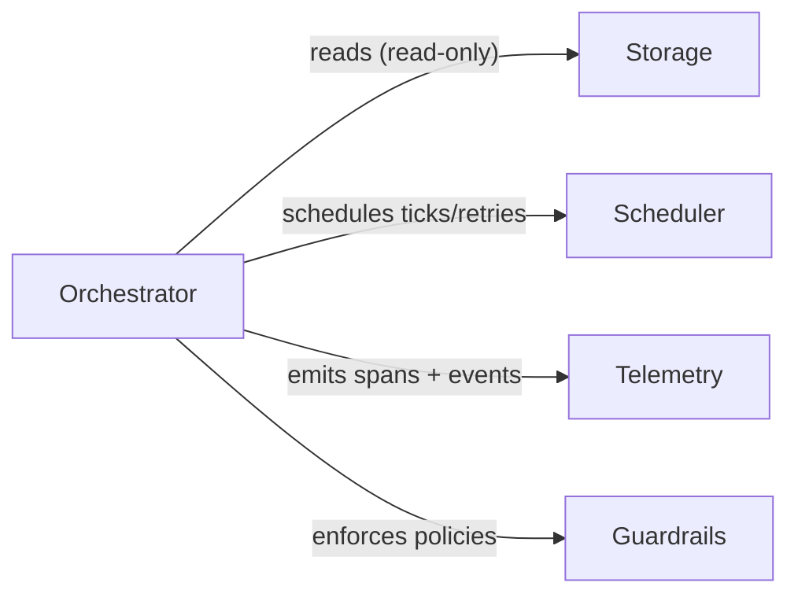

# Orchestrator

The orchestrator is a **kernel primitive** responsible for agent-agnostic dispatch, retry, and reconciliation of agentic work on **Tasks** (Scheduler primitives). It is the single authoritative source of claim state — no application or driver may mutate orchestrator state directly.

Issues are an application-level concept (gctl-board) and are NOT visible to the Orchestrator. The Orchestrator dispatches Sessions to execute Tasks; applications observe the resulting events via kernel IPC and update their own work items.

For implementation details (formal verification, crate structure, adapter wiring, tech stack), see [specs/implementation/orchestrator.md](../../implementation/kernel/orchestrator.md).

---

## Design Goals

1. Provide a single authoritative claim state for dispatch, retries, and reconciliation.
2. Work with any agent that accepts a prompt and produces artifacts (commits, PRs, comments).
3. Live in the kernel — applications observe orchestration state but MUST NOT mutate it directly.
4. Expose all state transitions via CLI for human and agent use.
5. Support restart recovery without requiring persistent orchestrator state (Scheduler + filesystem are the source of truth).
6. Enforce bounded concurrency and per-state, per-user limits.
7. State machine properties (determinism, reachability, liveness) MUST be formally verified before implementation.

---

## Kernel Placement

The orchestrator depends on:

- **Scheduler** — timer management for poll ticks and retry delays.
- **Storage** — reading Session state (read-only from this layer).
- **Telemetry** — emitting orchestration events.



Applications observe orchestration state through the shell (HTTP API or CLI queries). Cross-app communication follows the same kernel IPC rule as the rest of the OS — no direct app-to-orchestrator mutations.

---

## Orchestration States (Kernel Claim States)

> **Source of truth:** [`specs/formal/KernelSpec/Orchestrator.lean`](../../formal/KernelSpec/Orchestrator.lean)
> States, transitions, and all 6 required properties are machine-checked in Lean 4 (16 theorems, zero `sorry`).

These are the orchestrator's **internal claim states**, distinct from the Task lifecycle managed by the Scheduler. A Task's Scheduler state (`pending`, `running`, etc.) and its orchestration claim state are independent dimensions.

States: `Unclaimed` → `Claimed` → `Running` → `Released`, with `Paused` and `RetryQueued` as intermediate states. See the Lean source for the complete `step` function and all valid transitions.

### Important Nuances

1. A successful agent exit does not mean the Task is done. The orchestrator schedules a continuation check to verify the Task is still active.
2. After abnormal exit, the orchestrator schedules an exponential-backoff retry.
3. `Released` is not terminal for the Task — only for the current claim cycle. If the Task remains in an active Scheduler state, it becomes `Unclaimed` and re-eligible on the next poll tick (`full_cycle` theorem).

### Verified Properties

All properties below are machine-checked — see the Lean source for proof terms:

1. **No duplicate dispatch** — `dispatch_only_from_unclaimed`
2. **Reachability** — `all_reachable`
3. **Liveness** — `claimed_always_progresses`, `retryQueued_always_progresses`
4. **Determinism** — `deterministic`
5. **Terminal convergence** — `released_reachable_from_any`
6. **Pause/resume integrity** — `paused_integrity`, `paused_not_dispatchable`

---

## Run Attempt Lifecycle

> **Source of truth:** [`specs/formal/KernelSpec/RunAttempt.lean`](../../formal/KernelSpec/RunAttempt.lean)
> Phases, transitions, terminal states, and the `always_forward` termination proof are machine-checked (8 theorems).

Each dispatch of an agent for a Task is a **run attempt** — a linear pipeline from `PreparingWorkspace` through `BuildingPrompt`, `LaunchingAgent`, `StreamingWork`, `Finishing` to one of four terminal states: `Succeeded`, `Failed`, `TimedOut`, `Canceled`. Every phase can fail early to `Failed`.

The `always_forward` theorem proves every transition strictly increases phase ordering, guaranteeing termination (no cycles). See the Lean source for the complete `step` function and `phaseOrd` ranking.

---

## Transition Triggers

| Trigger | What Happens |
|---------|-------------|
| **Poll Tick** | Reconcile running Tasks, validate config, fetch candidates, sort by priority, dispatch until slots exhausted. |
| **Agent Exit (Normal)** | Remove from running set, record telemetry, schedule continuation check. |
| **Agent Exit (Abnormal)** | Remove from running set, record error telemetry, schedule exponential-backoff retry. |
| **Retry Timer Fired** | Re-fetch candidates, re-dispatch if still eligible, else release claim. |
| **Guardrail Suspend** | Guardrails engine emits suspend signal → running Session transitions to `Paused`. |
| **Human Pause** | Operator runs `gctl orchestrate pause` → running Session transitions to `Paused`. |
| **Human Resume** | Operator runs `gctl orchestrate resume` → `Paused` Session transitions back to `Running`. |
| **Reconciliation** | Detect stalls (elapsed > timeout → kill + retry). Refresh Scheduler Task state (terminal → release, active → update snapshot, fetch failure → keep running). Paused sessions are skipped. |

### Tick Sequence

1. **Reconcile** — check all running Tasks against Scheduler state.
2. **Validate** — verify configuration is loadable.
3. **Fetch candidates** — query active Tasks from Scheduler.
4. **Sort** — priority ascending, then `created_at` oldest first, then identifier.
5. **Dispatch** — claim and launch agents until concurrency slots are exhausted.

---

## Agent Port

The orchestrator is agent-agnostic. It communicates with agents through a **port** — an abstract interface that any executable can implement:

- Accepts a rendered prompt (via flag, stdin, or file).
- Runs in an isolated workspace directory.
- Exits with a status code when complete.

Built-in adapters ship for `claude-code`, `aider`, and `custom` (any executable). Agent kind is resolved at runtime from `WORKFLOW.md` configuration — the orchestrator never hardcodes a specific agent.

---

## Dispatch Eligibility

A Task is dispatch-eligible only if **all** conditions hold:

1. It has an identifier and state.
2. Its Scheduler state is active (not terminal — not `done`, `cancelled`).
3. It is not already `Claimed`, `Running`, or `Paused`.
4. Global concurrency slots are available.
5. Per-state concurrency slots are available.
6. If in `pending` state, no blocker Task (from the dependency DAG) is non-terminal.
7. A `user_id` can be resolved — a configured persona in `WORKFLOW.md` or a default persona is set.
8. Per-user concurrency slots are available for the resolved `user_id`.

### Dispatch Ordering

1. Priority ascending (lower number = higher priority; null sorts last).
2. `created_at` oldest first.
3. Identifier lexicographic tie-breaker.

---

## Retry and Backoff

### Continuation Retry (Normal Exit)

- Fixed short delay.
- Purpose: re-check if the Task is still active and needs another agent session.
- If re-dispatched, the continuation prompt SHOULD be shorter than the initial prompt.

### Failure Retry (Abnormal Exit)

- Exponential backoff with configurable cap.
- Each retry cancels any existing timer for the same Task before scheduling.

### Retry Limits

- Continuation retries: bounded by max turns configuration.
- Failure retries: bounded by max failure retries configuration. After exhaustion, claim is released.

---

## Concurrency Control

### Global Limit

Total running agents MUST NOT exceed the configured maximum.

### Per-State Limit

Each Task state MAY have its own concurrency cap. States without explicit limits fall back to the global maximum.

### Per-User Limit

Each user (persona) MAY have its own concurrency cap, configured in `WORKFLOW.md` or guardrails config. Per-user limits are enforced after global and per-state limits — all three must pass for dispatch to proceed.

### Blocker Rule

Tasks in `pending` state MUST NOT be dispatched if any blocker Task is non-terminal.

---

## Workspace Management

Each Task gets an isolated workspace directory. Workspaces persist across runs for the same Task. Successful runs do NOT auto-delete workspaces.

### Hooks

| Hook | When | Failure behavior |
|------|------|-----------------:|
| `after_create` | Workspace directory first created | Abort creation, fail attempt |
| `before_run` | Before each agent launch | Abort attempt, schedule retry |
| `after_run` | After each agent exit | Log warning, continue |
| `before_remove` | Before workspace deletion | Log warning, continue |

### Terminal Cleanup

- On startup: fetch terminal Tasks from Scheduler, remove their workspace directories.
- On reconciliation: if a running Task transitions to terminal, kill agent and clean workspace.

---

## Idempotency and Recovery

1. The orchestrator serializes all state mutations — no concurrent dispatch of the same Task.
2. `Claimed` and `Running` checks are required before launching any agent.
3. Reconciliation runs **before** dispatch on every tick.
4. Restart recovery is **Scheduler-driven + filesystem-driven**: scan workspaces on startup, cross-reference with Scheduler Task state, and resume or clean up.
5. No persistent orchestrator database required — state is reconstructed from the Scheduler and workspace filesystem.

---

## Observability

The orchestrator MUST emit structured telemetry for every state transition:

| Event | Fields |
|-------|--------|
| `orchestrator.claim` | `task_id`, `user_id`, `agent_kind`, `attempt` |
| `orchestrator.dispatch` | `task_id`, `user_id`, `agent_kind`, `pid`, `workspace` |
| `orchestrator.agent_exit` | `task_id`, `exit_code`, `duration_ms`, `tokens_used` |
| `orchestrator.retry_scheduled` | `task_id`, `attempt`, `delay_ms`, `reason` |
| `orchestrator.released` | `task_id`, `reason` |
| `orchestrator.reconciliation` | `running_count`, `stalled_count`, `terminal_count` |

---

## CLI Surface

```sh
# Start the orchestration loop
gctl orchestrate start
gctl orchestrate start --daemon

# Inspect state
gctl orchestrate status
gctl orchestrate list
gctl orchestrate list --state running
gctl orchestrate inspect <task-id>

# Manual control
gctl orchestrate dispatch <task-id>
gctl orchestrate pause   <task-id>   # suspend, await human review
gctl orchestrate resume  <task-id>   # approve continuation
gctl orchestrate cancel  <task-id>   # graceful stop
gctl orchestrate retry   <task-id>
gctl orchestrate release <task-id>

# Configuration
gctl orchestrate config
gctl orchestrate config --validate
```
