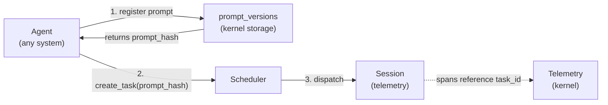
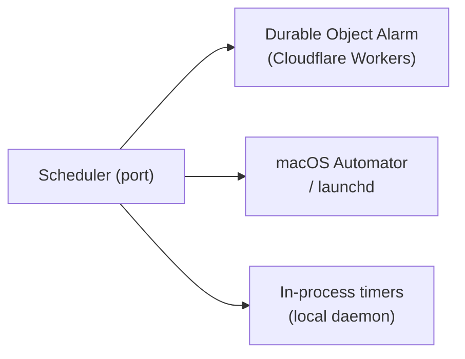

# Scheduler

The Scheduler is a kernel primitive with two responsibilities:

1. **Task tracking** — the kernel-level record of all work items created and executed by agents, normalized across agent systems (Claude Code, Codex, Aider, OpenAI, custom).
2. **Deferred and recurring execution** — scheduling Tasks to run at a point in time or on a recurring cadence.

Defined as a **kernel interface trait** with **platform-specific implementations** — the kernel defines *what* to schedule; each platform implementation decides *how*.

> **Terminology note:** "Adapter" here refers to internal kernel implementations (tokio timers, launchd, DO Alarms), not external app drivers. See [os.md § 5](../os.md) for the driver/adapter distinction.

---

## Tasks

A **Task** is the kernel's unit of agent work. Every agent — regardless of system (Claude Code, Codex, Aider, OpenAI API, custom) — creates Tasks through the Scheduler. The kernel tracks them uniformly.

### Why kernel-level?

Different agent systems have incompatible internal representations of work. The kernel normalizes them:

| Agent System | How work is represented internally | Kernel normalization |
|---|---|---|
| Claude Code | WORKFLOW.md prompt template + conversation | `Task` row with `prompt_hash`, `agent_kind = claude-code` |
| Codex (OpenAI) | Instructions + file context | `Task` row with `prompt_hash`, `agent_kind = codex` |
| Aider | Commit message + diff context | `Task` row with `prompt_hash`, `agent_kind = aider` |
| OpenAI API direct | System prompt + messages | `Task` row with `prompt_hash`, `agent_kind = openai` |
| Custom | Arbitrary | `Task` row with `prompt_hash`, `agent_kind = custom` |

By routing all agent work through the Scheduler, gctl gets a single queryable record of what every agent did, what prompt drove it, and what session it ran in — regardless of the agent system used.

### Task Domain Type

```rust
pub struct TaskId(pub String);

pub struct Task {
    pub id: TaskId,
    pub title: String,
    pub description: Option<String>,
    pub status: TaskStatus,
    pub agent_kind: AgentKind,          // which agent system executes this task
    pub session_id: Option<SessionId>,  // active or last session working on this task
    pub prompt_hash: Option<String>,    // FK → prompt_versions (rendered prompt)
    pub parent_task_id: Option<TaskId>, // sub-task of another task
    pub blocked_by: Vec<TaskId>,        // dependency DAG
    pub blocking: Vec<TaskId>,
    pub workspace: Option<String>,      // isolated workspace directory path
    pub created_by_id: String,
    pub created_by_kind: ActorKind,     // 'human' | 'agent'
    pub context: serde_json::Value,     // agent-system-specific metadata (see below)
    pub result: Option<serde_json::Value>, // artifacts produced (commits, PRs, file paths)
    pub created_at: DateTime<Utc>,
    pub updated_at: DateTime<Utc>,
}

// TaskStatus — see domain-model.md § Task
//   Pending | Running | Paused | Done (terminal) | Failed (retry) | Cancelled (terminal)

// AgentKind — see domain-model.md § Domain Types
//   ClaudeCode | Codex | Aider | OpenAI | Custom

// ActorKind — see domain-model.md § Domain Types
//   Human | Agent
```

### Context Field — Agent-System Metadata

The `context` JSON field stores agent-system-specific metadata, normalized at task creation time:

```json
// claude-code
{ "model": "claude-sonnet-4-6", "workflow_file": "WORKFLOW.md", "persona": "reviewer-bot" }

// codex
{ "model": "o1", "temperature": 1.0 }

// aider
{ "model": "gpt-4o", "auto_commits": true }

// custom
{ "executable": "/path/to/agent", "args": ["--prompt-file", "task.md"] }
```

Applications (gctl-board) MAY read `context` for display purposes but MUST NOT write to it.

---

## Scheduler Port

The Scheduler exposes a unified port for task management and scheduling. All agent systems that create Tasks MUST go through this interface.

```rust
#[async_trait]
pub trait SchedulerPort: Send + Sync {
    // --- Task management ---
    async fn create_task(&self, input: CreateTaskInput) -> Result<Task, SchedulerError>;
    async fn update_task_status(&self, id: &TaskId, status: TaskStatus) -> Result<Task, SchedulerError>;
    async fn complete_task(&self, id: &TaskId, result: serde_json::Value) -> Result<Task, SchedulerError>;
    async fn fail_task(&self, id: &TaskId, reason: &str) -> Result<Task, SchedulerError>;
    async fn cancel_task(&self, id: &TaskId, reason: &str) -> Result<Task, SchedulerError>;
    async fn get_task(&self, id: &TaskId) -> Result<Task, SchedulerError>;
    async fn list_tasks(&self, filter: TaskFilter) -> Result<Vec<Task>, SchedulerError>;
    async fn link_session(&self, task_id: &TaskId, session_id: &SessionId) -> Result<(), SchedulerError>;

    // --- Dependency graph (acyclicity MUST be enforced) ---
    async fn add_dependency(&self, blocker: TaskId, blocked: TaskId) -> Result<(), CyclicDependencyError>;
    async fn remove_dependency(&self, blocker: TaskId, blocked: TaskId) -> Result<(), SchedulerError>;
    async fn list_ready(&self) -> Result<Vec<Task>, SchedulerError>;

    // --- Deferred / recurring scheduling ---
    async fn schedule_once(&self, task: TaskId, at: DateTime<Utc>) -> Result<ScheduleId, SchedulerError>;
    async fn schedule_recurring(&self, task: TaskId, cron: &str) -> Result<ScheduleId, SchedulerError>;
    async fn cancel_schedule(&self, id: &ScheduleId) -> Result<(), SchedulerError>;
}
```

### CreateTaskInput

```rust
pub struct CreateTaskInput {
    pub title: String,
    pub description: Option<String>,
    pub agent_kind: AgentKind,
    pub prompt_hash: Option<String>,   // pre-register prompt via prompt_versions
    pub parent_task_id: Option<TaskId>,
    pub created_by_id: String,
    pub created_by_kind: ActorKind,
    pub context: serde_json::Value,
}
```

---

## Prompt Tracking

Every Task MAY reference a `prompt_hash` — the hash of the rendered prompt stored in `prompt_versions`. This gives a full audit trail of *what was asked* for every task, across all agent systems.



The `prompt_versions` table (see [domain-model.md](../domain-model.md) § 5.3) stores the rendered prompt content. Tasks reference it by hash — the same prompt used by multiple tasks is stored once.

---

## Storage

The Scheduler owns the `tasks` table (see [domain-model.md](../domain-model.md) § 5.1 for full DDL). Key design choices:

1. Dependency edges stored inline as JSON arrays (`blocked_by`, `blocking`) — avoids a separate edge table; `WHERE json_array_length(blocked_by) = 0` gives the ready set efficiently.
2. `context` is untyped JSON — agent-system-specific metadata doesn't belong in typed columns.
3. `prompt_hash` is nullable — not all tasks have a pre-registered prompt (e.g., continuation tasks).

---

## Platform Adapters



| Platform | Adapter | Durable? |
|----------|---------|----------|
| **Cloudflare Workers** | Durable Object Alarm | Yes — persists across restarts |
| **macOS** | launchd / Automator | Yes — OS-managed scheduling |
| **Local daemon** | In-process timers | No — lost on daemon restart |

---

## Design Constraints

1. The scheduler port lives in the domain — no platform dependencies.
2. Platform adapters live behind feature flags or in separate modules.
3. The in-process adapter is the default and requires no external setup.
4. Task payloads are serializable — they describe *what* to run, not *how*.
5. Durable adapters persist schedules across restarts. The in-process adapter does not — applications MUST handle re-registration on startup if durability is needed.
6. Only agents create and mutate Tasks through the Scheduler port. Human-facing interfaces (CLI `gctl board`, HTTP `/api/board/*`) expose Tasks as read-only.
7. Every agent system MUST create Tasks via `SchedulerPort.create_task` — MUST NOT write to the `tasks` table directly.
8. The Scheduler MUST emit kernel IPC events on every Task state transition so applications (gctl-board) can react.
