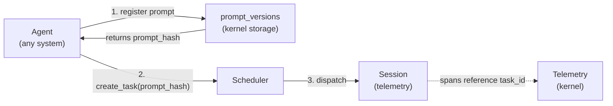
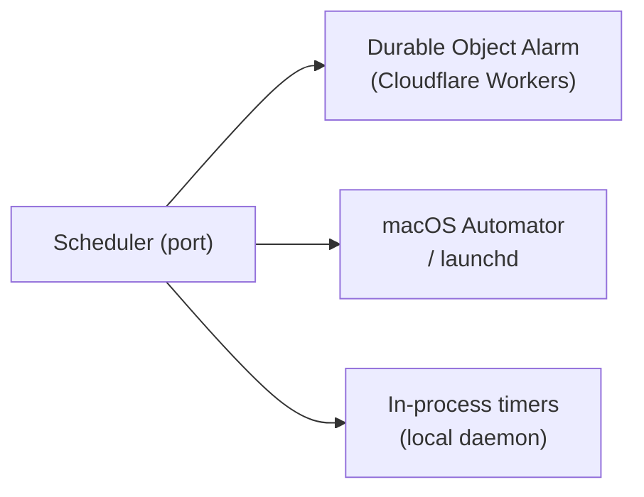

# Scheduler

The Scheduler is a kernel primitive with two responsibilities:

1. **Task tracking** — the kernel-level record of all work items created and executed by agents, normalized across agent systems (Claude Code, Codex, Aider, OpenAI, custom).
2. **Deferred and recurring execution** — scheduling Tasks to run at a point in time or on a recurring cadence.

Defined as a **kernel interface trait** with **platform-specific implementations** — the kernel defines *what* to schedule; each platform implementation decides *how*.

> **Terminology note:** "Adapter" here refers to internal kernel implementations (tokio timers, launchd, DO Alarms), not external app drivers. See [os.md § 5](../os.md) for the driver/adapter distinction.

---

## Tasks

A **Task** is the kernel's unit of agent work. Every agent — regardless of system (Claude Code, Codex, Aider, OpenAI API, custom) — creates Tasks through the Scheduler. The kernel tracks them uniformly.

### Why kernel-level?

Different agent systems have incompatible internal representations of work. The kernel normalizes them:

| Agent System | How work is represented internally | Kernel normalization |
|---|---|---|
| Claude Code | WORKFLOW.md prompt template + conversation | `Task` row with `prompt_hash`, `agent_kind = claude-code` |
| Codex (OpenAI) | Instructions + file context | `Task` row with `prompt_hash`, `agent_kind = codex` |
| Aider | Commit message + diff context | `Task` row with `prompt_hash`, `agent_kind = aider` |
| OpenAI API direct | System prompt + messages | `Task` row with `prompt_hash`, `agent_kind = openai` |
| Custom | Arbitrary | `Task` row with `prompt_hash`, `agent_kind = custom` |

By routing all agent work through the Scheduler, gctrl gets a single queryable record of what every agent did, what prompt drove it, and what session it ran in — regardless of the agent system used.

### Task Domain Type

See [domain-model.md § 2 Task](../domain-model.md#task-specs-only) for `TaskId` and `Task` struct. `TaskStatus` (`Pending` | `Running` | `Paused` | `Done` | `Failed` | `Cancelled`), `AgentKind` (`ClaudeCode` | `Codex` | `Aider` | `OpenAI` | `Custom`), and `ActorKind` (`Human` | `Agent`) are defined there.

### Context Field — Agent-System Metadata

The `context` JSON field stores agent-system-specific metadata, normalized at task creation time:

```json
// claude-code
{ "model": "claude-sonnet-4-6", "workflow_file": "WORKFLOW.md", "persona": "reviewer-bot" }

// codex
{ "model": "o1", "temperature": 1.0 }

// aider
{ "model": "gpt-4o", "auto_commits": true }

// custom
{ "executable": "/path/to/agent", "args": ["--prompt-file", "task.md"] }
```

Applications (gctrl-board) MAY read `context` for display purposes but MUST NOT write to it.

---

## Scheduler Port

The Scheduler exposes a unified port for task management and scheduling. All agent systems that create Tasks MUST go through this interface.

See [domain-model.md § 3 SchedulerPort](../domain-model.md#schedulerport-specs-only) for the full `SchedulerPort` trait and `CreateTaskInput` type.

The port covers three responsibility groups:

1. **Task management** — create / status / complete / fail / cancel / get / list, and `link_session` for binding a Task to its executing Session.
2. **Dependency graph** — `add_dependency` / `remove_dependency` (acyclicity enforced), `list_ready` for the dispatcher to poll.
3. **Deferred & recurring scheduling** — `schedule_once(at)`, `schedule_recurring(cron)`, `cancel_schedule`.

---

## Prompt Tracking

Every Task MAY reference a `prompt_hash` — the hash of the rendered prompt stored in `prompt_versions`. This gives a full audit trail of *what was asked* for every task, across all agent systems.



The `prompt_versions` table (see [domain-model.md](../domain-model.md) § 5.3) stores the rendered prompt content. Tasks reference it by hash — the same prompt used by multiple tasks is stored once.

---

## Storage

The Scheduler owns the `tasks` table (see [domain-model.md](../domain-model.md) § 5.1 for full DDL). Key design choices:

1. Dependency edges stored inline as JSON arrays (`blocked_by`, `blocking`) — avoids a separate edge table; `WHERE json_array_length(blocked_by) = 0` gives the ready set efficiently.
2. `context` is untyped JSON — agent-system-specific metadata doesn't belong in typed columns.
3. `prompt_hash` is nullable — not all tasks have a pre-registered prompt (e.g., continuation tasks).

---

## Platform Adapters



| Platform | Adapter | Durable? |
|----------|---------|----------|
| **Cloudflare Workers** | Durable Object Alarm | Yes — persists across restarts |
| **macOS** | launchd / Automator | Yes — OS-managed scheduling |
| **Local daemon** | In-process timers | No — lost on daemon restart |

---

## Design Constraints

1. The scheduler port lives in the domain — no platform dependencies.
2. Platform adapters live behind feature flags or in separate modules.
3. The in-process adapter is the default and requires no external setup.
4. Task payloads are serializable — they describe *what* to run, not *how*.
5. Durable adapters persist schedules across restarts. The in-process adapter does not — applications MUST handle re-registration on startup if durability is needed.
6. Only agents create and mutate Tasks through the Scheduler port. Human-facing interfaces (CLI `gctrl board`, HTTP `/api/board/*`) expose Tasks as read-only.
7. Every agent system MUST create Tasks via `SchedulerPort.create_task` — MUST NOT write to the `tasks` table directly.
8. The Scheduler MUST emit kernel IPC events on every Task state transition so applications (gctrl-board) can react.
