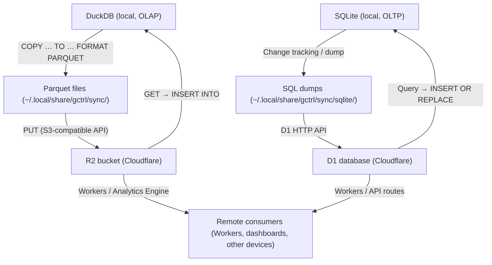

# Cloud Sync (Kernel Primitive)

> Canonical spec for gctrl's local-first sync engine. Supersedes scattered references in
> [os.md §12](../os.md), [domain-model.md §SyncEngine](../domain-model.md), and
> [ROADMAP.md M3](../../gctrl/ROADMAP.md).

## 1. Design Principles

1. **Local-first, cloud-optional.** The kernel MUST work fully offline. Sync is opt-in (`sync.enabled = true` in config). No feature degrades when R2/D1 is unreachable.
2. **Kernel owns all I/O.** Applications write rows through DuckDB or SQLite. The kernel handles serialization, partitioning, upload, and conflict resolution — apps never touch Parquet, R2, or D1 directly.
3. **Device-partitioned, conflict-free.** Each device writes to its own partition in R2. No concurrent writes to the same partition → no row-level merge needed.
4. **Append-friendly data model.** Spans and events are immutable after creation. Sessions and tasks are mutable but scoped to one device at a time.
5. **Dual local storage.** DuckDB for analytical/OLAP workloads (telemetry, spans, sessions). SQLite for transactional/OLTP workloads (board, tasks, app state). Both are file-based and sync to the cloud.

## 2. Data Flow



### Storage Mapping

| Local store | Cloud target | Format | Use case |
|-------------|-------------|--------|----------|
| **DuckDB** | **R2** | Parquet files | Telemetry, spans, sessions, analytics (OLAP) |
| **SQLite** | **D1** | SQL (row-level) | Board, tasks, app state (OLTP) |
| **Filesystem** (context markdown) | **R2** | Markdown files | Knowledge base, crawl results |

### 2.1 Push (Local → Cloud)

#### DuckDB → R2 (Parquet)

1. Query unsynced rows: `SELECT * FROM {table} WHERE synced = FALSE`
2. Export to Parquet: `COPY (...) TO '{staging_path}' (FORMAT PARQUET)`
3. Upload to R2 via S3-compatible PUT
4. On success, mark rows: `UPDATE {table} SET synced = TRUE WHERE id IN (...)`
5. Write manifest entry to `sync_manifest.json`

#### SQLite → D1 (Row-level)

1. Query unsynced rows: `SELECT * FROM {table} WHERE synced = 0`
2. Serialize as batch SQL statements (INSERT OR REPLACE)
3. Submit to D1 via Cloudflare HTTP API (`POST /client/v4/accounts/{account}/d1/database/{db}/query`)
4. On success, mark rows: `UPDATE {table} SET synced = 1 WHERE id IN (...)`
5. Write manifest entry with row counts and timestamps

### 2.2 Pull (Cloud → Local)

#### R2 → DuckDB (Parquet)

1. Read remote manifest to discover new Parquet files since last pull
2. Download Parquet files to staging directory
3. Insert into DuckDB: `INSERT OR IGNORE INTO {table} SELECT * FROM read_parquet('{path}')`
4. Update local manifest with pull watermark

#### D1 → SQLite (Row-level)

1. Query D1 for rows with `updated_at > {last_pull_watermark}` from other devices
2. Batch-fetch changed rows via D1 HTTP API
3. Insert into SQLite: `INSERT OR REPLACE INTO {table} ...`
4. Update local manifest with pull watermark

### 2.3 Context Sync (Filesystem)

Context entries have hybrid storage: DuckDB metadata + filesystem markdown content.

- **Push**: upload markdown files from `~/.local/share/gctrl/context/` to R2 `knowledge/context/`, keyed by `content_hash`. Mark `synced = TRUE` in DuckDB.
- **Pull**: download new/changed files by comparing remote manifest hashes against local `content_hash` values. Write to local filesystem + upsert DuckDB metadata.
- **Dedup**: content-addressable by SHA-256 hash — identical content is never re-uploaded.

## 3. Cloud Layout

### 3.1 R2 Path Layout (DuckDB + Filesystem data)

```
{bucket}/
  {workspace_id}/
    {device_id}/
      sessions/
        {YYYY-MM-DD}/
          {push_id}.parquet         # sessions exported in this push
      spans/
        {YYYY-MM-DD}/
          {push_id}.parquet
      traffic/
        {YYYY-MM-DD}/
          {push_id}.parquet
    knowledge/
      context/
        {content_hash}.md           # content-addressable markdown
      crawls/
        {domain}/
          {page_hash}.md
    manifest.json                   # workspace-level sync manifest
```

- **`push_id`**: UUID generated per push operation, ensuring unique filenames.
- **Date partitioning**: by the date of the push, not the row timestamp. Simplifies cleanup and retention.
- **`knowledge/`**: shared across devices (not device-partitioned) since content is content-addressable.

### 3.2 D1 Schema Layout (SQLite data)

D1 mirrors the local SQLite schema. Tables include a `device_id` column and `updated_at` timestamp for multi-device sync.

```
D1 database: gctrl_{workspace_id}
  board_projects       # kanban projects
  board_issues         # kanban issues / cards
  board_labels         # issue labels
  tasks                # task tracking
  sync_manifest        # per-device pull watermarks
```

- D1 is the **shared merge point** for SQLite data — all devices push to and pull from the same D1 database.
- Workers and API routes (e.g. `gctrl-board` Cloudflare Worker) read/write D1 directly for the remote UI.

## 4. Sync Manifest

The manifest tracks what has been pushed and pulled. Stored both locally (`~/.local/share/gctrl/sync/manifest.json`) and in R2 (`{workspace}/manifest.json`).

```json
{
  "workspace_id": "ws_abc",
  "device_id": "dev_123",
  "pushes": [
    {
      "push_id": "push_uuid",
      "device_id": "dev_123",
      "timestamp": "2026-04-06T12:00:00Z",
      "tables": {
        "sessions": { "row_count": 5, "path": "dev_123/sessions/2026-04-06/push_uuid.parquet" },
        "spans": { "row_count": 42, "path": "dev_123/spans/2026-04-06/push_uuid.parquet" }
      }
    }
  ],
  "last_pull": {
    "timestamp": "2026-04-06T11:00:00Z",
    "watermark": "push_uuid_from_other_device"
  },
  "context_hashes": ["sha256_abc", "sha256_def"]
}
```

## 5. Conflict Resolution

| Data type | Store | Strategy | Rationale |
|-----------|-------|----------|-----------|
| **Spans** | DuckDB→R2 | Append-only, `INSERT OR IGNORE` | Immutable after creation. Duplicate span_id = same span, skip. |
| **Sessions** | DuckDB→R2 | Last-write-wins by `ended_at` / `updated_at` | A session runs on one device at a time. If same ID appears from two devices, latest timestamp wins. |
| **Traffic** | DuckDB→R2 | Append-only, `INSERT OR IGNORE` | Immutable log entries. |
| **Context** | Filesystem→R2 | Content-addressable (SHA-256) | Same hash = same content, skip. Different hash for same path = latest `updated_at` wins. |
| **Board projects** | SQLite→D1 | Last-write-wins by `updated_at` | Single-owner edits. |
| **Board issues** | SQLite→D1 | Last-write-wins by `updated_at` | Same — an issue is edited on one device at a time. |
| **Tasks** | SQLite→D1 | Last-write-wins by `updated_at` | A task is actively worked by one agent on one device. |

**Tie-breaking**: if two rows have identical `updated_at`, the device with the lexicographically greater `device_id` wins. This is deterministic and rare (sub-second concurrent edits across devices).

## 6. Syncable Tables

All syncable tables include a `synced` flag (`BOOLEAN DEFAULT FALSE` in DuckDB, `INTEGER DEFAULT 0` in SQLite).

### DuckDB → R2 (Parquet)

| Table | Key | Mutable | Sync strategy |
|-------|-----|---------|---------------|
| `sessions` | `id` (VARCHAR) | Yes (status, cost, tokens) | Last-write-wins |
| `spans` | `span_id` (VARCHAR) | No | Append-only |
| `traffic` | `id` (VARCHAR) | No | Append-only |
| `context_entries` | `id` (VARCHAR) | Yes (content, tags) | Content-addressable |

### SQLite → D1 (Row-level)

| Table | Key | Mutable | Sync strategy |
|-------|-----|---------|---------------|
| `board_projects` | `id` (TEXT) | Yes (name, status) | Last-write-wins |
| `board_issues` | `id` (TEXT) | Yes (title, status, assignee) | Last-write-wins |
| `board_labels` | `id` (TEXT) | Yes (name, color) | Last-write-wins |
| `tasks` | `id` (TEXT) | Yes (status, result) | Last-write-wins |

## 7. SyncEngine Port

```rust
#[async_trait]
pub trait SyncEngine: Send + Sync {
    /// Push unsynced rows to the cloud.
    /// - DuckDB tables: export to Parquet → upload to R2
    /// - SQLite tables: batch INSERT OR REPLACE → D1 HTTP API
    async fn push(&self, tables: &[&str]) -> Result<SyncResult>;

    /// Pull new data from the cloud into local stores.
    /// - R2 → DuckDB: download Parquet → INSERT OR IGNORE
    /// - D1 → SQLite: query changed rows → INSERT OR REPLACE
    async fn pull(&self, tables: &[&str]) -> Result<SyncResult>;

    /// Show sync state: pending rows per store, last push/pull, R2+D1 connectivity.
    async fn status(&self) -> Result<SyncStatus>;
}
```

## 8. Configuration

```rust
pub struct SyncConfig {
    pub enabled: bool,              // default: false
    pub interval_seconds: u64,      // default: 300 (5 min)
    pub device_id: String,          // unique per device, auto-generated on first run

    // R2 (DuckDB sync target)
    pub r2_bucket: String,          // R2 bucket name
    pub r2_endpoint: String,        // S3-compatible endpoint URL
    pub r2_access_key_id: String,   // R2 API token (read from env or config)
    pub r2_secret_access_key: String,

    // D1 (SQLite sync target)
    pub d1_database_id: String,     // D1 database UUID
    pub d1_account_id: String,      // Cloudflare account ID
    pub d1_api_token: String,       // Cloudflare API token with D1 permissions
}
```

Credentials priority: CLI flags > env vars (`GCTRL_R2_ACCESS_KEY_ID`, `GCTRL_R2_SECRET_ACCESS_KEY`, `GCTRL_D1_DATABASE_ID`, `GCTRL_D1_ACCOUNT_ID`, `GCTRL_D1_API_TOKEN`) > config file.

## 9. CLI Commands

```sh
gctrl sync status                  # pending rows, last push/pull, R2 reachability
gctrl sync push                    # push all syncable tables
gctrl sync push --table sessions   # push specific table
gctrl sync pull                    # pull all tables from all devices
gctrl sync pull --since 7d         # pull only recent data
```

## 10. Scheduler Integration

When `sync.enabled = true` and `sync.interval_seconds > 0`:

- The kernel's scheduler runs `sync push` on the configured interval.
- Push also fires on session end (`status` transitions to `completed`/`failed`/`cancelled`).
- Pull is manual-only by default. Automatic pull can be enabled via `sync.auto_pull = true`.

## 11. Error Handling

- **Network failure**: push/pull retries 3 times with exponential backoff (1s, 4s, 16s). On exhaustion, logs warning and leaves rows as `synced = FALSE` for next attempt. Applies to both R2 and D1 calls.
- **Partial push (R2)**: if upload succeeds but marking synced fails (unlikely — local DB), the next push re-exports those rows. Duplicate Parquet files in R2 are harmless (append-only consumers use `INSERT OR IGNORE`).
- **Partial push (D1)**: D1 batch API is atomic per request. If the batch succeeds but local mark fails, re-push produces `INSERT OR REPLACE` which is idempotent.
- **Corrupt Parquet**: pull validates Parquet metadata before inserting. Corrupt files are skipped and logged.
- **D1 rate limits**: Cloudflare D1 HTTP API has rate limits. The sync engine respects 429 responses with retry-after headers.

## 12. Security

- R2 credentials are never stored in the DuckDB database or Parquet files.
- Optional: client-side encryption before upload (deferred — see Request.md Phase 4).
- Parquet files contain telemetry data (costs, tokens, operation names). Users should scope R2 bucket access to trusted team members.
