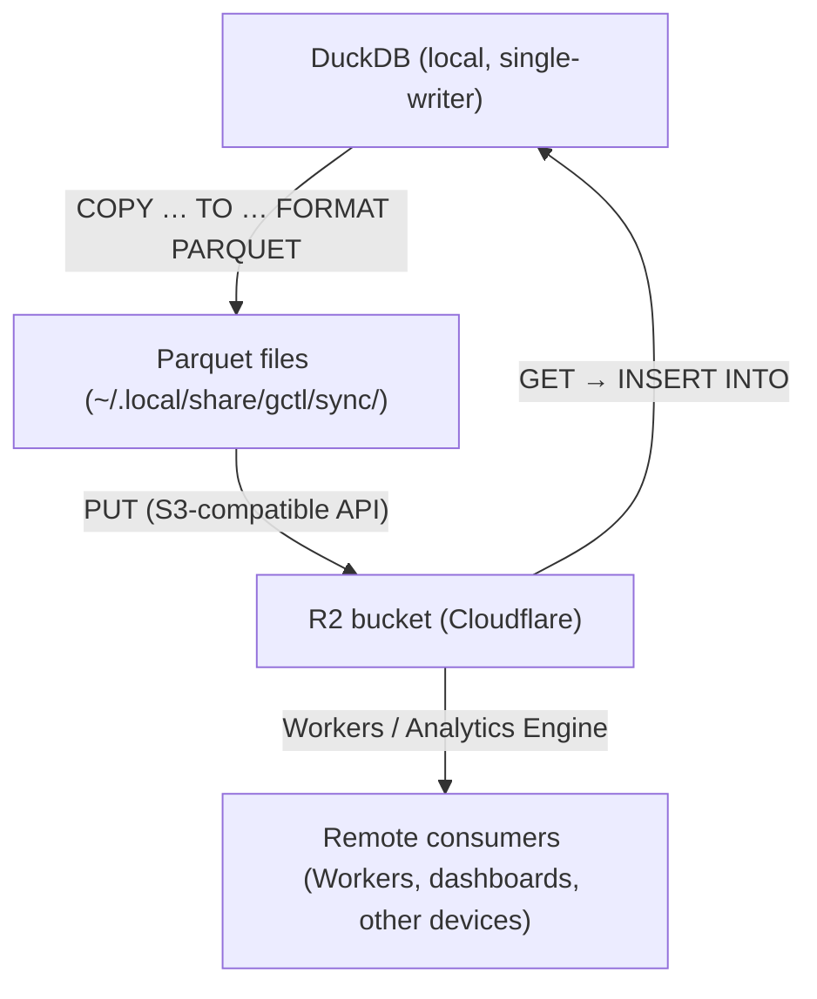

# Cloud Sync (Kernel Primitive)

> Canonical spec for gctl's local-first sync engine. Supersedes scattered references in
> [os.md §12](../os.md), [domain-model.md §SyncEngine](../domain-model.md), and
> [ROADMAP.md M3](../../gctl/ROADMAP.md).

## 1. Design Principles

1. **Local-first, cloud-optional.** The kernel MUST work fully offline. Sync is opt-in (`sync.enabled = true` in config). No feature degrades when R2 is unreachable.
2. **Kernel owns all I/O.** Applications write rows through DuckDB. The kernel handles serialization, partitioning, upload, and conflict resolution — apps never touch Parquet or R2.
3. **Device-partitioned, conflict-free.** Each device writes to its own partition in R2. No concurrent writes to the same partition → no row-level merge needed.
4. **Append-friendly data model.** Spans and events are immutable after creation. Sessions and tasks are mutable but scoped to one device at a time.

## 2. Data Flow



### 2.1 Push (Local → R2)

1. Query unsynced rows: `SELECT * FROM {table} WHERE synced = FALSE`
2. Export to Parquet: `COPY (...) TO '{staging_path}' (FORMAT PARQUET)`
3. Upload to R2 via S3-compatible PUT
4. On success, mark rows: `UPDATE {table} SET synced = TRUE WHERE id IN (...)`
5. Write manifest entry to `sync_manifest.json`

### 2.2 Pull (R2 → Local)

1. Read remote manifest to discover new Parquet files since last pull
2. Download Parquet files to staging directory
3. Insert into DuckDB: `INSERT OR IGNORE INTO {table} SELECT * FROM read_parquet('{path}')`
4. Update local manifest with pull watermark

### 2.3 Context Sync (Filesystem)

Context entries have hybrid storage: DuckDB metadata + filesystem markdown content.

- **Push**: upload markdown files from `~/.local/share/gctl/context/` to R2 `knowledge/context/`, keyed by `content_hash`. Mark `synced = TRUE` in DuckDB.
- **Pull**: download new/changed files by comparing remote manifest hashes against local `content_hash` values. Write to local filesystem + upsert DuckDB metadata.
- **Dedup**: content-addressable by SHA-256 hash — identical content is never re-uploaded.

## 3. R2 Path Layout

```
{bucket}/
  {workspace_id}/
    {device_id}/
      sessions/
        {YYYY-MM-DD}/
          {push_id}.parquet         # sessions exported in this push
      spans/
        {YYYY-MM-DD}/
          {push_id}.parquet
      traffic/
        {YYYY-MM-DD}/
          {push_id}.parquet
      tasks/
        {YYYY-MM-DD}/
          {push_id}.parquet
    knowledge/
      context/
        {content_hash}.md           # content-addressable markdown
      crawls/
        {domain}/
          {page_hash}.md
    manifest.json                   # workspace-level sync manifest
```

- **`push_id`**: UUID generated per push operation, ensuring unique filenames.
- **Date partitioning**: by the date of the push, not the row timestamp. Simplifies cleanup and retention.
- **`knowledge/`**: shared across devices (not device-partitioned) since content is content-addressable.

## 4. Sync Manifest

The manifest tracks what has been pushed and pulled. Stored both locally (`~/.local/share/gctl/sync/manifest.json`) and in R2 (`{workspace}/manifest.json`).

```json
{
  "workspace_id": "ws_abc",
  "device_id": "dev_123",
  "pushes": [
    {
      "push_id": "push_uuid",
      "device_id": "dev_123",
      "timestamp": "2026-04-06T12:00:00Z",
      "tables": {
        "sessions": { "row_count": 5, "path": "dev_123/sessions/2026-04-06/push_uuid.parquet" },
        "spans": { "row_count": 42, "path": "dev_123/spans/2026-04-06/push_uuid.parquet" }
      }
    }
  ],
  "last_pull": {
    "timestamp": "2026-04-06T11:00:00Z",
    "watermark": "push_uuid_from_other_device"
  },
  "context_hashes": ["sha256_abc", "sha256_def"]
}
```

## 5. Conflict Resolution

| Data type | Strategy | Rationale |
|-----------|----------|-----------|
| **Spans** | Append-only, `INSERT OR IGNORE` | Immutable after creation. Duplicate span_id = same span, skip. |
| **Sessions** | Last-write-wins by `ended_at` / `updated_at` | A session runs on one device at a time. If same ID appears from two devices, latest timestamp wins. |
| **Tasks** | Last-write-wins by `updated_at` | Same as sessions — a task is actively worked by one agent on one device. |
| **Traffic** | Append-only, `INSERT OR IGNORE` | Immutable log entries. |
| **Context** | Content-addressable (SHA-256) | Same hash = same content, skip. Different hash for same path = latest `updated_at` wins. |

**Tie-breaking**: if two rows have identical `updated_at`, the device with the lexicographically greater `device_id` wins. This is deterministic and rare (sub-second concurrent edits across devices).

## 6. Syncable Tables

Tables with `synced BOOLEAN DEFAULT FALSE`:

| Table | Key | Mutable | Sync strategy |
|-------|-----|---------|---------------|
| `sessions` | `id` (VARCHAR) | Yes (status, cost, tokens) | Last-write-wins |
| `spans` | `span_id` (VARCHAR) | No | Append-only |
| `traffic` | `id` (VARCHAR) | No | Append-only |
| `tasks` | `id` (VARCHAR) | Yes (status, result) | Last-write-wins |
| `context_entries` | `id` (VARCHAR) | Yes (content, tags) | Content-addressable |

## 7. SyncEngine Port

```rust
#[async_trait]
pub trait SyncEngine: Send + Sync {
    /// Export unsynced rows to Parquet, upload to R2, mark synced.
    async fn push(&self, tables: &[&str]) -> Result<SyncResult>;

    /// Download new Parquet files from R2, insert into local DuckDB.
    async fn pull(&self, tables: &[&str]) -> Result<SyncResult>;

    /// Show sync state: pending rows, last push/pull, R2 connectivity.
    async fn status(&self) -> Result<SyncStatus>;
}
```

## 8. Configuration

```rust
pub struct SyncConfig {
    pub enabled: bool,              // default: false
    pub r2_bucket: String,          // R2 bucket name
    pub r2_endpoint: String,        // S3-compatible endpoint URL
    pub r2_access_key_id: String,   // R2 API token (read from env or config)
    pub r2_secret_access_key: String,
    pub interval_seconds: u64,      // default: 300 (5 min)
    pub device_id: String,          // unique per device, auto-generated on first run
}
```

Credentials priority: CLI flags > env vars (`GCTL_R2_ACCESS_KEY_ID`, `GCTL_R2_SECRET_ACCESS_KEY`) > config file.

## 9. CLI Commands

```sh
gctl sync status                  # pending rows, last push/pull, R2 reachability
gctl sync push                    # push all syncable tables
gctl sync push --table sessions   # push specific table
gctl sync pull                    # pull all tables from all devices
gctl sync pull --since 7d         # pull only recent data
```

## 10. Scheduler Integration

When `sync.enabled = true` and `sync.interval_seconds > 0`:

- The kernel's scheduler runs `sync push` on the configured interval.
- Push also fires on session end (`status` transitions to `completed`/`failed`/`cancelled`).
- Pull is manual-only by default. Automatic pull can be enabled via `sync.auto_pull = true`.

## 11. Error Handling

- **Network failure**: push/pull retries 3 times with exponential backoff (1s, 4s, 16s). On exhaustion, logs warning and leaves rows as `synced = FALSE` for next attempt.
- **Partial push**: if upload succeeds but marking synced fails (unlikely — local DB), the next push re-exports those rows. Duplicate Parquet files in R2 are harmless (append-only consumers use `INSERT OR IGNORE`).
- **Corrupt Parquet**: pull validates Parquet metadata before inserting. Corrupt files are skipped and logged.

## 12. Security

- R2 credentials are never stored in the DuckDB database or Parquet files.
- Optional: client-side encryption before upload (deferred — see Request.md Phase 4).
- Parquet files contain telemetry data (costs, tokens, operation names). Users should scope R2 bucket access to trusted team members.
