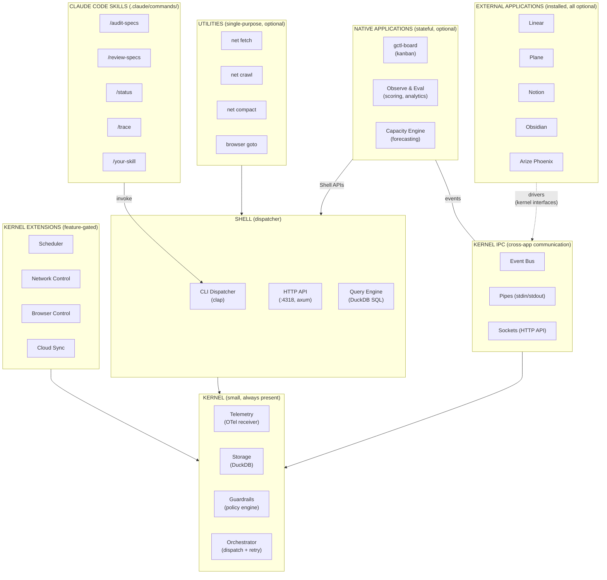
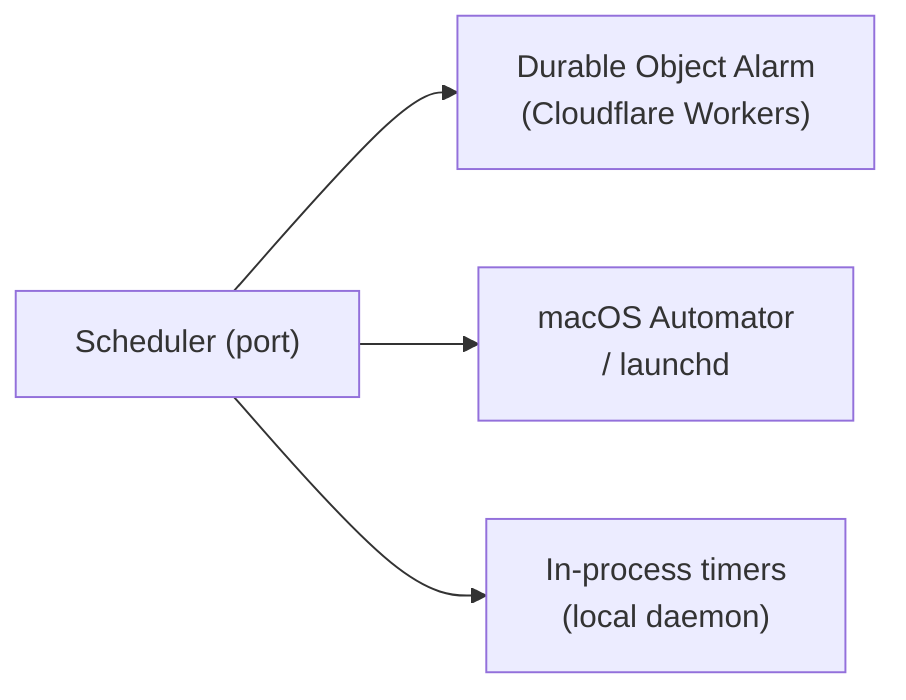
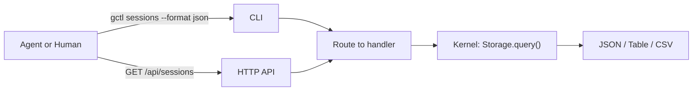
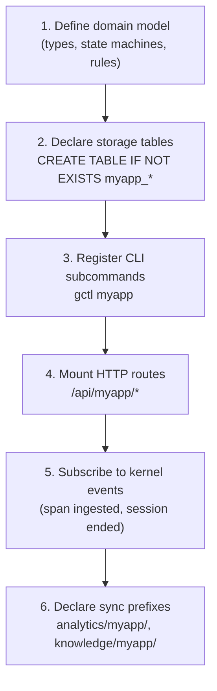
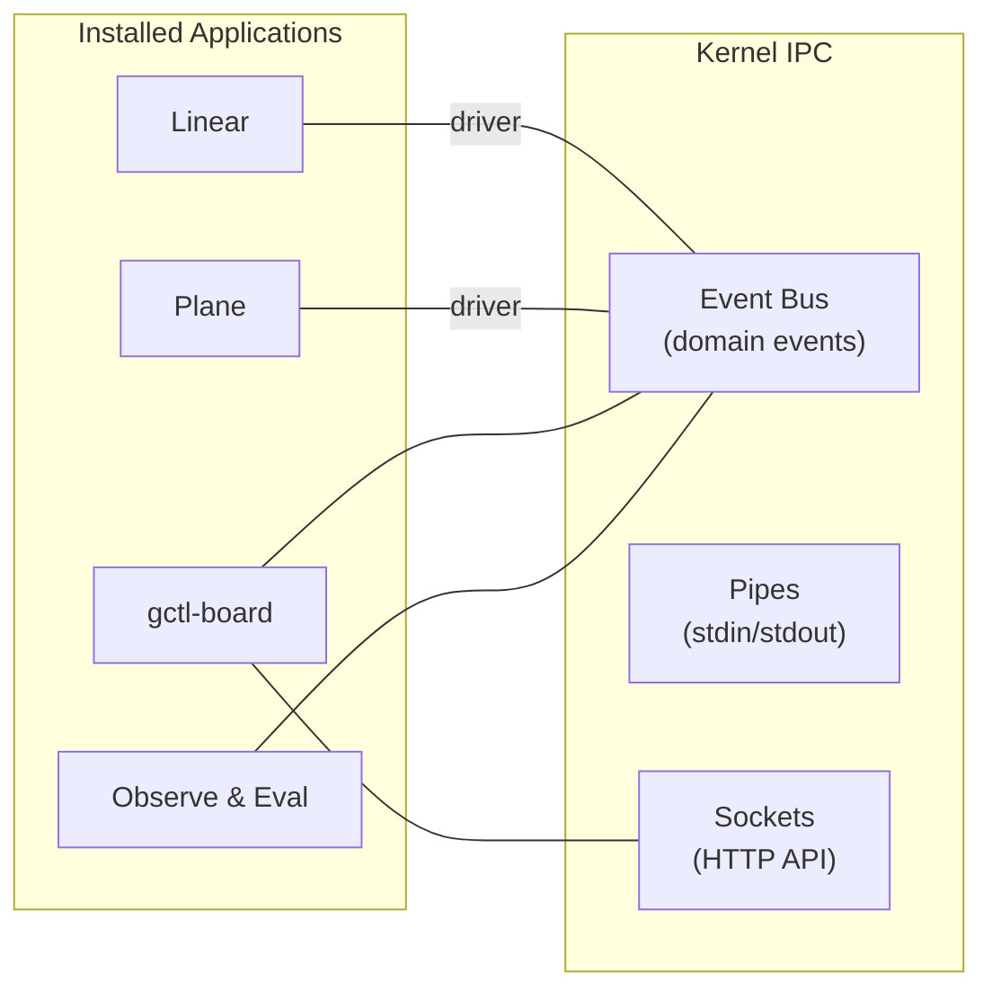
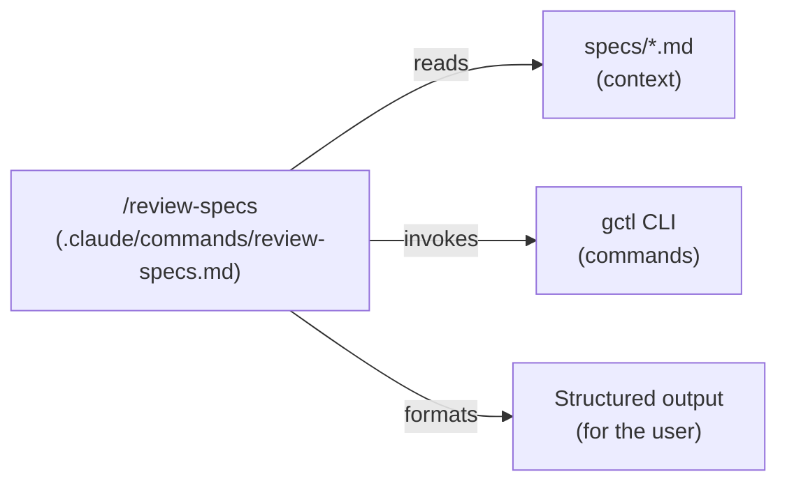

# Unix Architecture — Layers, Examples, and Extension Points

gctl is modeled after Unix. This document describes each architectural layer in detail — what belongs there, concrete examples, and how to extend each layer with new functionality.

For the high-level diagram and internal code architecture, see [README.md](README.md). For implementation details (crates, packages, code patterns), see [../implementation/components.md](../implementation/components.md).

---

## Terminology

gctl uses **Unix terminology** as the primary architectural language. Some terms overlap with hexagonal architecture (ports & adapters) — this glossary disambiguates.

| Term | Meaning | Unix Analogy | NOT to be confused with |
|------|---------|-------------|------------------------|
| **Kernel** | Core primitives (Telemetry, Storage, Guardrails, Orchestrator) | Linux kernel | — |
| **Shell** | CLI dispatcher, HTTP API, Query Engine | bash / zsh | — |
| **Native Application** | Stateful program built on gctl (gctl-board, Observe & Eval) | `vim`, `git` | — |
| **External Application** | Third-party tool installed on gctl (Linear, Plane, Notion, Phoenix) | External app accessed via device driver | "Adapter" (which means something else) |
| **Driver** | Kernel module connecting an external app (`driver-linear`, `driver-github`) | Device driver (`/dev/sda`) | "Adapter" in hexagonal architecture |
| **Kernel Interface** | Trait in `gctl-core` that drivers implement (`TrackerPort`, `ObservabilityExportPort`) | Driver interface / syscall interface | "Port" as a network port |
| **Kernel IPC** | Cross-app communication (event bus, pipes, sockets) | Unix IPC (pipes, signals, sockets) | — |
| **Adapter** | Internal kernel implementation of a trait (DuckDB storage, OTel receiver) — used only in [implementation specs](../implementation/components.md) | — | "Driver" (which connects external apps) |

**Rule:** In architecture specs and user-facing docs, use **driver** for external app connectors and **kernel interface** for the traits they implement. Reserve **adapter** for implementation-level discussion of internal kernel code only.

---

## Layer Overview



Dependencies flow **inward** — Shell depends on Kernel, Applications and Utilities depend on Shell, Adapters implement Kernel ports. Nothing in an inner layer knows about an outer layer.

---

## 1. Kernel — Mechanisms, Not Policy

The kernel provides small, focused primitives. It is agent-agnostic, application-agnostic, and use-case-agnostic. A solo developer running `gctl serve` gets a working system with just the kernel — no applications, no adapters, no configuration.

### Core Primitives (always present)

| Primitive | What It Does | Unix Analogy |
|-----------|-------------|--------------|
| **Telemetry** | OTLP span ingestion, session tracking, cost attribution | `/dev/log` — the system logging facility |
| **Storage** | Embedded DuckDB, schema migrations, retention policies | Filesystem — the shared data layer |
| **Guardrails** | Policy engine (cost limits, loop detection, command allowlists) | `ulimit` / `seccomp` — resource and security constraints |
| **Orchestrator** | Agent dispatch, retry with backoff, reconciliation | `init` / process manager — lifecycle management |

### Kernel Extensions (feature-gated, optional)

| Extension | What It Does | Unix Analogy |
|-----------|-------------|--------------|
| **Scheduler** | Deferred and recurring tasks via port/adapter pattern | `cron` / `at` |
| **Network Control** | MITM proxy, domain allowlists, traffic logging | `iptables` / packet filter |
| **Browser Control** | CDP daemon, persistent Chromium, tab management | Device driver for a display |
| **Cloud Sync** | R2 Parquet export, device-partitioned sync | `rsync` / NFS mount |

#### Scheduler — External Schedule Support

The scheduler is a kernel primitive for deferred and recurring task execution. It is defined as a **port** with **platform-specific adapters** — the kernel defines *what* to schedule; adapters decide *how* on a given platform. This means the OS supports external scheduling: launchd on macOS, Durable Object Alarms on Cloudflare Workers, or in-process timers for local development.



| Platform | Adapter | Durable? |
|----------|---------|----------|
| **Cloudflare Workers** | Durable Object Alarm | Yes — persists across restarts |
| **macOS** | launchd / Automator | Yes — OS-managed scheduling |
| **Local daemon** | In-process timers | No — lost on daemon restart |

**Design constraints:**

1. The scheduler port lives in the domain — no platform dependencies.
2. Adapters live behind feature flags or in separate modules.
3. The in-process adapter is the default and requires no external setup.
4. Task payloads are serializable — they describe *what* to run, not *how*.
5. Durable adapters persist schedules across restarts. The in-process adapter does not — applications MUST handle re-registration on startup if durability is needed.

### What does NOT belong in the kernel

- Business logic about what "good" looks like (that is application policy)
- Knowledge of any specific application's tables or domain types
- Direct references to external tools (Linear, GitHub, Obsidian)
- UI rendering or formatting (that is the shell or application layer)

### Extending the kernel

Add a new kernel primitive or extension when:

1. The capability is **agent-agnostic and application-agnostic** — any application could benefit from it.
2. It provides a **mechanism**, not a policy — it does not encode opinions about workflows.
3. It needs **direct access to storage or low-level system resources** (network sockets, process spawning).

To add a kernel extension:

1. Create a new Rust crate: `crates/gctl-{name}/`
2. Define the port trait in `gctl-core` (e.g., `trait Scheduler`)
3. Implement the adapter in the new crate
4. Feature-gate it in `gctl-cli/Cargo.toml` so it is opt-in
5. The new primitive MUST NOT know about any application

---

## 2. Shell — Dispatcher, Not Commands

The shell mediates **all** access to the kernel. It is the dispatcher — it parses input and routes to the right handler. The shell itself contains no business logic and no domain knowledge.

### Shell Components

| Component | What It Does | Unix Analogy |
|-----------|-------------|--------------|
| **CLI Dispatcher** | Parses `gctl <noun> <verb>` args, routes to command handlers | `bash` — the interpreter, not the commands |
| **HTTP API** | REST endpoints on `:4318`, SSE for live feeds | Network sockets / IPC |
| **Query Engine** | Guardrailed DuckDB queries, structured output | `awk` / `sed` for structured data |

### What belongs in the shell

- Argument parsing and validation
- HTTP route registration and request/response handling
- Output formatting (`--format json`, `--format table`)
- Authentication, rate limiting, caching (HTTP layer)
- Routing a request to the correct kernel primitive or application handler

### What does NOT belong in the shell

- Business logic (that is the application or kernel layer)
- Direct DuckDB queries beyond dispatching to the query engine
- Knowledge of external tools or adapters

### How the shell dispatches



CLI commands and HTTP endpoints are **not** part of the shell — they are applications and utilities that register themselves with the shell dispatcher. The shell just routes.

### Extending the shell

You rarely need to extend the shell itself. Instead, you register new commands or routes:

- **New CLI subcommand**: Add a file in `gctl-cli/src/commands/`, register in `mod.rs`
- **New HTTP route**: Mount under `/api/{app}/*` in the axum router

---

## 3. Applications — Stateful Domain Programs

Applications are larger, stateful programs that orchestrate kernel primitives through the shell to deliver domain-specific features. They own their table namespaces and may have their own domain model.

### Shipped Applications

| Application | Tables Owned | Kernel Primitives Used | Runtime |
|-------------|-------------|----------------------|---------|
| **gctl-board** | `board_issues`, `board_tasks` | Storage, Telemetry (session-issue linking), Orchestrator | Effect-TS |
| **Observe & Eval** | `eval_scores`, `eval_prompts` | Telemetry, Storage, Query Engine | Rust (compiled into binary) |
| **Capacity Engine** | `capacity_*` | Storage, Telemetry, Query Engine | Rust (compiled into binary) |

### What makes something an application (not a utility)

- It **owns state** — it has its own namespaced tables in DuckDB
- It **orchestrates multiple kernel primitives** — e.g., board reads from Telemetry and writes to Storage
- It has **domain logic** — state machines, validation rules, business rules
- It may have **its own domain model** — e.g., board has Issue, Task, DependencyGraph

### Application rules

1. **Table namespacing**: All tables MUST use `{app}_*` prefixes (`board_issues`, `eval_scores`)
2. **Kernel access via shell**: Applications access kernel primitives through CLI or HTTP API — not by importing kernel crates directly (except Rust apps compiled into the binary)
3. **Cross-app isolation**: Apps MUST NOT join across each other's tables. Cross-app data flows through kernel-level events
4. **Optional by default**: Every application MUST be independently disableable. A developer using gctl only for telemetry MUST NOT see board commands

### Extending with a new application



**Rust applications** are compiled into the `gctl` binary as feature-gated crates. They have direct access to `DuckDbStore` and register axum routes on the shared router.

**TypeScript applications** (like gctl-board) run as sidecar processes or are proxied through the Rust daemon. They communicate via the shell (HTTP API or CLI subprocess calls).

---

## 4. Utilities — Small, Single-Purpose Tools

Utilities are small tools that do one thing well and compose via stdin/stdout where practical. They are the `grep`, `curl`, `wget` of gctl.

### Shipped Utilities

| Utility | What It Does | Unix Analogy | Composes With |
|---------|-------------|--------------|---------------|
| `gctl net fetch <url>` | Fetch URL, convert to markdown | `curl` | Pipe to `gctl eval score` |
| `gctl net crawl <url>` | Crawl site, extract readable content | `wget -r` | Output feeds `net compact` |
| `gctl net compact <domain>` | Compact pages into LLM-ready context | `tar` / `cat` | Produces stdin-ready output |
| `gctl net list` | List crawled domains | `ls` | — |
| `gctl net show <domain>` | Show crawled content | `cat` | — |
| `gctl browser goto <url>` | Navigate browser to URL | headless Chrome | — |
| `gctl browser snapshot` | Capture page screenshot/DOM | `screencapture` | — |

### What makes something a utility (not an application)

- It is **stateless or minimally stateful** — it may cache to the filesystem but does not own DuckDB tables
- It does **one thing** — fetch, crawl, compact, snapshot
- It **composes** — accepts stdin, produces stdout, works in pipelines
- It has **no domain model** — no state machines, no business rules

### Utility rules

1. **One verb per command**: `gctl net fetch` fetches. `gctl net compact` compacts. No combined super-commands.
2. **Stdin/stdout where practical**: Output goes to stdout; metadata/errors go to stderr
3. **`--format json`**: Every utility that produces structured output MUST support JSON output
4. **No kernel coupling**: Utilities MAY use kernel primitives (e.g., net fetch logs to traffic table) but MUST NOT require the kernel to function for their core purpose

### Extending with a new utility

1. Create a Rust crate: `crates/gctl-{name}/` (or add to an existing utility crate if related)
2. Implement the core logic as a library (testable without CLI)
3. Register CLI subcommands in `gctl-cli/src/commands/`
4. Support `--format json` for structured output
5. Accept stdin and produce stdout where it makes sense

---

## 5. External Applications & Drivers — Installed Apps on the OS

Linear, Plane, Notion, Obsidian, Arize Phoenix, Langfuse, SigNoz — these are **external applications installed on gctl**, not mere connectors. Like applications on Unix, they have their own state and logic. Each connects through a **driver** — a kernel module that implements a kernel interface trait, translating between the external app's API and gctl's internal event/data model. This is the Unix device driver analogy: the kernel defines the interface; the driver implements it for a specific external system.

> **Terminology note:** gctl uses **"driver"** (not "adapter") for external app connectors to avoid confusion with hexagonal architecture adapters, which are internal kernel implementations (DuckDB storage, OTel receiver, etc.). See [README.md § Hexagonal Architecture](README.md#hexagonal-architecture-kernel--shell-only) for the distinction.

### The OS Metaphor

In Unix, applications do not talk to each other directly. They communicate through OS primitives: pipes, sockets, signals, shared files. gctl follows the same model:



Native apps (gctl-board, Observe & Eval) and external apps (Linear, Plane, Notion) are **peers** on the OS. Neither talks directly to the other — all cross-app data flows through kernel IPC.

### IPC Mechanisms

| Mechanism | Unix Analogy | gctl Implementation | Example |
|-----------|-------------|---------------------|---------|
| **Event Bus** | Signals / named pipes | Domain events (`SessionEnded`, `IssueCreated`) | Telemetry emits `SessionEnded` → Eval auto-scores → Phoenix driver exports |
| **Pipes** | stdin/stdout | CLI output piped between commands | `gctl sessions --format json \| gctl analytics cost` |
| **Sockets** | Unix sockets / TCP | HTTP API endpoints | Driver polls `/api/sessions` or receives webhook callbacks |

### Kernel Interfaces for External Apps

| Kernel Interface | What It Defines | Drivers | Installed Apps |
|-----------------|----------------|---------|----------------|
| `TrackerPort` | Bidirectional issue/task sync | `driver-linear`, `driver-github`, `driver-notion` | Linear, Plane, GitHub Issues, Notion |
| `ObservabilityExportPort` | Export traces/evals/scores | `driver-phoenix`, `driver-langfuse`, `driver-signoz` | Arize Phoenix, Langfuse, SigNoz |
| `KnowledgeSourcePort` | Mount external knowledge bases | `driver-obsidian` | Obsidian |

### Driver Rules

1. **Implement a kernel interface**: Every driver MUST implement a trait defined in `gctl-core`
2. **No direct table access**: Drivers MUST go through the kernel interface trait, never write to DuckDB directly
3. **Independently optional**: Each driver is a separate feature-gated crate
4. **Bidirectional where needed**: Pull from external API into gctl; push gctl events back to external API
5. **Cross-app isolation**: Drivers MUST NOT import or call other drivers or native apps. All cross-app communication flows through kernel IPC (events, shell APIs, pipes)

### Extending with a new external application

1. Define or reuse a kernel interface trait in `gctl-core` (e.g., `trait TrackerPort`)
2. Create a feature-gated crate: `crates/gctl-driver-{name}/`
3. Implement the interface trait with the external app's API
4. Register the driver at startup via configuration
5. The driver MUST NOT modify the kernel or shell — it plugs into existing kernel interfaces
6. Cross-app data flows through kernel IPC — the driver MUST NOT couple to other apps

---

## 6. Claude Code Skills — Thin Wrappers over gctl

gctl ships Claude Code slash commands (`.claude/commands/*.md`) as a first-class extension surface. Skills are the outermost layer — **opinionated prompts that invoke gctl CLI commands** and reference spec templates. They follow the same Unix philosophy as shell scripts: compose small tools into higher-level workflows.

### Relationship to Other Layers



Skills sit **outside** the gctl binary. They are Markdown prompt files that tell Claude what to do using gctl's existing capabilities. They are analogous to shell scripts that compose Unix commands — the script itself has no logic; the commands do the work.

### Skill Rules

1. **Skills MUST be thin wrappers.** A skill is a Markdown prompt that tells Claude *what to do* using `gctl` CLI commands, spec file references, and output formatting instructions. It MUST NOT contain substantial business logic.
2. **Logic lives in gctl.** If a skill needs computation, querying, or mutation, that capability MUST exist as a `gctl` CLI command or utility first. The skill invokes it; it does not reimplement it.
3. **Skills compose gctl commands.** A skill MAY chain multiple commands (e.g., `gctl sessions` then `gctl analytics overview` then `gctl tree`) and synthesize the results.
4. **Skills reference specs as context.** Skills SHOULD load relevant `specs/` files to ground Claude's behavior in the project's architecture and domain model.
5. **Skills are project-scoped.** Skill files live in `.claude/commands/` and are versioned with the repo. They evolve alongside the specs and CLI they reference.

### Anatomy of a Skill

```markdown
# .claude/commands/my-skill.md

One-line description of what the skill does.

## Instructions

### 1. Load Context
Read these files: `specs/architecture/README.md`, `specs/principles.md`, ...

### 2. Do the Work
Run `gctl <command>` to gather data.
Run `gctl <command>` to perform the action.
Analyze results against the loaded spec context.

### 3. Output Format
Format results as: ...

$ARGUMENTS
```

### Shipped Skills

| Skill | What It Does | gctl Commands / Specs Used |
|-------|-------------|---------------------------|
| `/audit-specs` | Check specs against principles and invariants | Reads `specs/`, applies `specs/principles.md` rules |
| `/review-specs` | Identify spec gaps, contradictions, ambiguities | Reads `specs/`, cross-references for completeness |
| `/status` | System health overview | `gctl status`, `gctl sessions`, `gctl analytics overview` |
| `/cost-report` | Summarize cost and token usage | `gctl analytics cost`, `gctl analytics cost-breakdown`, `gctl analytics daily` |
| `/trace` | Investigate a session's trace tree | `gctl tree <id>`, `gctl spans --session <id>` |
| `/dispatch` | Prepare dispatch recommendation for agent work | `gctl sessions`, `gctl status`, `gctl analytics overview` |

### Anti-Patterns

- **Fat skills**: A skill that parses DuckDB output, computes aggregates, or applies business rules inline. Move that logic into a `gctl` CLI command.
- **Duplicate logic**: A skill that reimplements what `gctl analytics` or `gctl query` already provides. Invoke the command instead.
- **Ungrounded skills**: A skill that does not load spec context and relies solely on Claude's training data for project-specific decisions. Always load the relevant specs.

### Extending with a new skill

1. Identify what gctl CLI commands and spec files the skill needs
2. If the skill requires computation that no command provides, **build the command first**
3. Create `.claude/commands/{skill-name}.md`
4. Structure: load context (spec files) → invoke gctl commands → format output
5. The skill MUST be a thin orchestration layer — all logic lives in gctl

---

## Layer Decision Guide

When adding new functionality, use this guide to decide where it belongs:

| Question | If Yes | Layer |
|----------|--------|-------|
| Is it agent-agnostic and provides a mechanism (not policy)? | Yes | **Kernel** |
| Does it dispatch, route, or format I/O? | Yes | **Shell** |
| Does it own state, have domain logic, and orchestrate multiple primitives? | Yes | **Native Application** |
| Does it do one thing, compose via pipes, and have no domain model? | Yes | **Utility** |
| Is it an external tool with its own state that connects via a kernel interface? | Yes | **External Application** (with driver) |
| Is it an opinionated prompt that invokes gctl commands? | Yes | **Skill** |

When in doubt, start as a utility. Promote to an application only when the utility accumulates its own state and domain rules. External tools are always external applications — they connect through drivers and communicate via kernel IPC, never through direct coupling.
