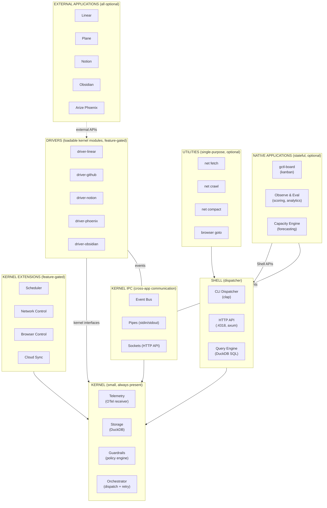
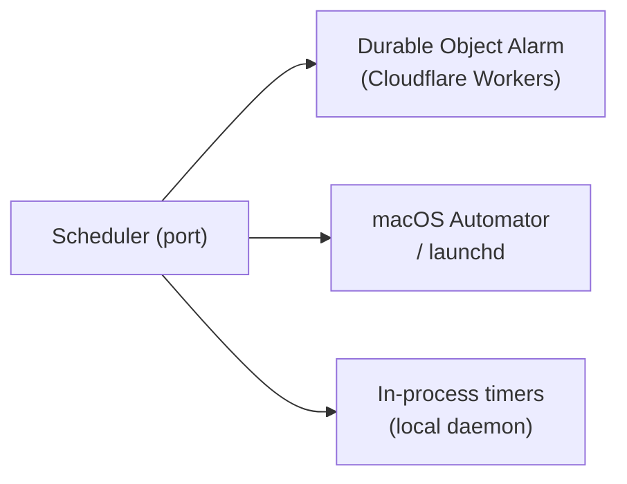
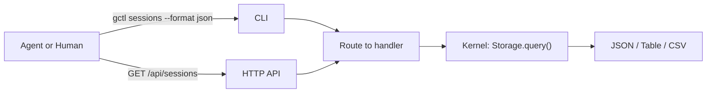
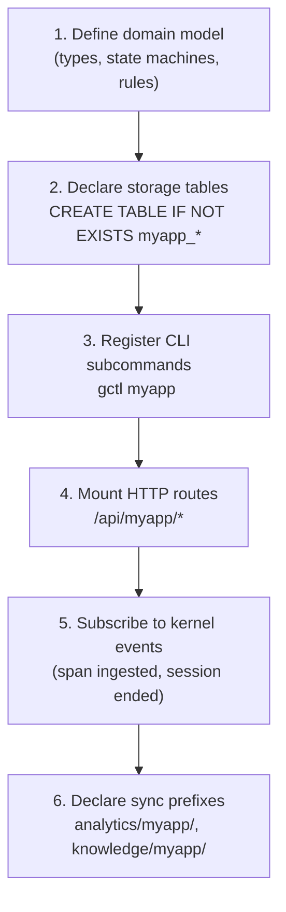
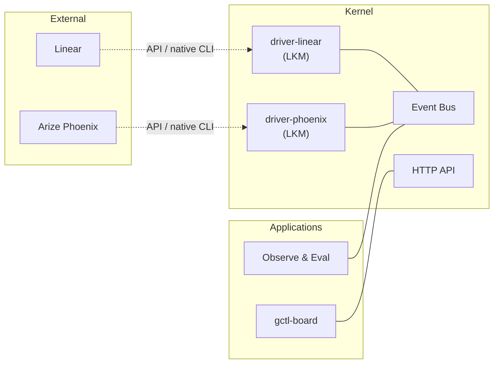
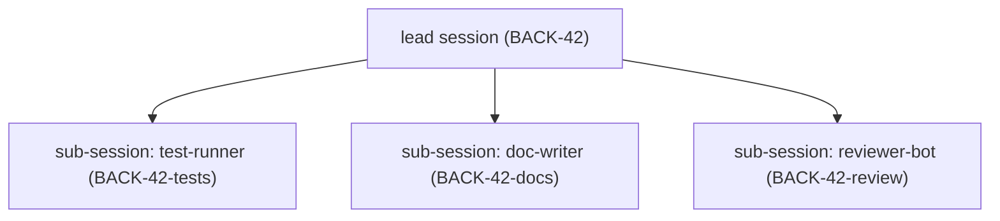
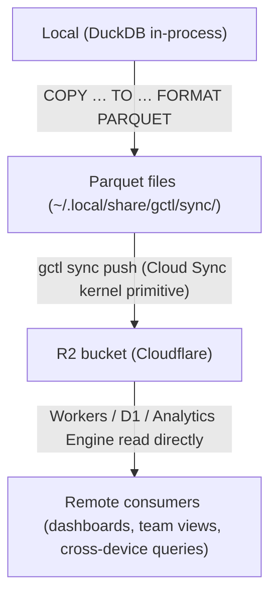

# Unix Architecture — Layers, Execution Model, and Extension Points

gctl is modeled after Unix. This document covers two complementary views:

1. **Layer structure** — what belongs in each architectural layer (Kernel, Shell, Apps, Utilities) and how to extend each layer. Drivers are loadable kernel modules, not a separate layer.
2. **Execution model** — how agent work is scheduled, who runs it, and how identity works in a world where humans and agents are first-class actors.

For the high-level diagram and internal code architecture, see [README.md](README.md). For implementation details (crates, packages, code patterns), see [../implementation/kernel/components.md](../implementation/kernel/components.md).

---

## Terminology

gctl uses **Unix terminology** as the primary architectural language. Some terms overlap with hexagonal architecture (ports & adapters) — this glossary disambiguates.

| Term | Meaning | Unix Analogy | NOT to be confused with |
|------|---------|-------------|------------------------|
| **Kernel** | Core primitives (Telemetry, Storage, Guardrails, Orchestrator) | Linux kernel | — |
| **Shell** | CLI dispatcher, HTTP API, Query Engine | bash / zsh | — |
| **Native Application** | Stateful program built on gctl (gctl-board, Observe & Eval) | `vim`, `git` | — |
| **External Application** | Third-party tool connected to gctl (Linear, Plane, Notion, Phoenix) | Hardware accessed via kernel module | "Adapter" (which means something else) |
| **Driver** | Loadable kernel module connecting an external app (`driver-linear`, `driver-github`). Feature-gated, independently optional. Lives inside the kernel. | Loadable kernel module (LKM) — `insmod`/`modprobe` | "Adapter" in hexagonal architecture |
| **Kernel Interface** | Trait in `gctl-core` that drivers implement (`TrackerPort`, `ObservabilityExportPort`) | Driver interface / syscall interface | "Port" as a network port |
| **Kernel IPC** | Cross-app communication (event bus, pipes, sockets) | Unix IPC (pipes, signals, sockets) | — |
| **Adapter** | Internal kernel implementation of a trait (DuckDB storage, OTel receiver) — used only in [implementation specs](../implementation/kernel/components.md) | — | "Driver" (which connects external apps) |

**Rule:** In architecture specs and user-facing docs, use **driver** for loadable kernel modules that connect external apps, and **kernel interface** for the traits they implement. Drivers live inside the kernel (like Unix LKMs), not as a separate layer. Reserve **adapter** for implementation-level discussion of internal kernel code only.

---

## Layer Overview



Dependencies flow **inward only** — this is the fundamental invariant of the gctl architecture.

### Dependency Direction (Invariant)

```
App → Shell → Kernel       (ALLOWED — outer depends on inner)
Kernel → Shell → App       (NEVER — inner must not know about outer)
```

| Rule | What it means | Violation example |
|------|--------------|-------------------|
| **Kernel depends on nothing above it** | Kernel crates MUST NOT import shell or app code. The kernel has no knowledge of gctl-board, gctl-eval, or any application. | Kernel crate importing a board schema type |
| **Shell depends on kernel, never on apps** | Shell consumes kernel HTTP API and crate interfaces. It MUST NOT import app code. | Shell importing `BoardService` from gctl-board |
| **Apps depend on shell, never the reverse** | Apps invoke kernel capabilities via the shell's HTTP API surface (`:4318`). They MUST NOT access DuckDB directly or import kernel crate internals. | App opening a DuckDB connection, or importing `gctl-storage` directly |
| **Apps are independently removable** | Any app (gctl-board, gctl-eval, etc.) can be uninstalled without breaking the kernel or shell. | Shell code that breaks if gctl-board package is removed |
| **External APIs go through kernel drivers** | The shell and apps MUST NOT call external APIs (GitHub, Linear, etc.) directly, nor hold secrets (PATs, API keys). External services are accessed through kernel drivers (LKMs) exposed via the kernel HTTP API. The kernel manages all secrets and injects them into drivers. | Shell importing an HTTP client for `api.github.com`, shell reading `GITHUB_TOKEN` from env, or app holding an API key |

**Enforcement:** The monorepo workspace config (`package.json` workspaces, `Cargo.toml` workspace members) encodes these boundaries. An app's `package.json` MUST NOT list kernel crates or shell packages as dependencies. Apps consume kernel data exclusively through HTTP.

> **CLI surface note:** The shell exposes `gctl board` CLI commands that call kernel HTTP endpoints directly. These are shell commands, not app code — they live in the shell package and do not import from `apps/gctl-board/`. The app's web UI is a separate process that also calls the same kernel HTTP endpoints.

---

## 1. Kernel — Mechanisms, Not Policy

The kernel provides small, focused primitives. It is agent-agnostic, application-agnostic, and use-case-agnostic. A solo developer running `gctl serve` gets a working system with just the kernel — no applications, no drivers, no configuration.

### Core Primitives (always present)

| Primitive | What It Does | Unix Analogy | Status |
|-----------|-------------|--------------|--------|
| **Telemetry** | OTLP span ingestion, session tracking, cost attribution | `/dev/log` — the system logging facility | Implemented |
| **Storage** | Embedded DuckDB, schema migrations, retention policies | Filesystem — the shared data layer | Implemented |
| **Guardrails** | Policy engine (cost limits, loop detection, command allowlists) | `ulimit` / `seccomp` — resource and security constraints | Implemented |
| **Orchestrator** | Agent dispatch, retry with backoff, reconciliation | `init` / process manager — lifecycle management | **Planned** |

### Kernel Extensions (feature-gated, optional)

| Extension | What It Does | Unix Analogy | Status |
|-----------|-------------|--------------|--------|
| **Scheduler** | Deferred and recurring tasks via port/adapter pattern | `cron` / `at` | **Planned** |
| **Network Control** | MITM proxy, domain allowlists, traffic logging | `iptables` / packet filter | Implemented |
| **Browser Control** | CDP daemon, persistent Chromium, tab management | Device driver for a display | **Planned** |
| **Cloud Sync** | R2 Parquet export, device-partitioned sync | `rsync` / NFS mount | **Planned** |

#### Scheduler — External Schedule Support

The scheduler is a kernel primitive for deferred and recurring task execution. It is defined as a **port** with **platform-specific adapters** — the kernel defines *what* to schedule; adapters decide *how* on a given platform. This means the OS supports external scheduling: launchd on macOS, Durable Object Alarms on Cloudflare Workers, or in-process timers for local development.



| Platform | Adapter | Durable? |
|----------|---------|----------|
| **Cloudflare Workers** | Durable Object Alarm | Yes — persists across restarts |
| **macOS** | launchd / Automator | Yes — OS-managed scheduling |
| **Local daemon** | In-process timers | No — lost on daemon restart |

**Design constraints:**

1. The scheduler port lives in the domain — no platform dependencies.
2. Adapters live behind feature flags or in separate modules.
3. The in-process adapter is the default and requires no external setup.
4. Task payloads are serializable — they describe *what* to run, not *how*.
5. Durable adapters persist schedules across restarts. The in-process adapter does not — applications MUST handle re-registration on startup if durability is needed.

### What does NOT belong in the kernel core

- Business logic about what "good" looks like (that is application policy)
- Knowledge of any specific application's tables or domain types
- UI rendering or formatting (that is the shell or application layer)

> **Note:** Drivers (loadable kernel modules) *do* reference external tools (Linear, GitHub, Obsidian) — that is their purpose. But they are feature-gated and independently optional. The kernel *core* (Telemetry, Storage, Guardrails, Orchestrator) has no knowledge of any external tool.

### Extending the kernel

Add a new kernel primitive or extension when:

1. The capability is **agent-agnostic and application-agnostic** — any application could benefit from it.
2. It provides a **mechanism**, not a policy — it does not encode opinions about workflows.
3. It needs **direct access to storage or low-level system resources** (network sockets, process spawning).

To add a kernel extension:

1. Create a new Rust crate: `crates/gctl-{name}/`
2. Define the port trait in `gctl-core` (e.g., `trait Scheduler`)
3. Implement the adapter in the new crate
4. Feature-gate it in `gctl-cli/Cargo.toml` so it is opt-in
5. The new primitive MUST NOT know about any application

---

## 2. Shell — Dispatcher, Not Commands

The shell mediates **all** access to the kernel. It is the dispatcher — it parses input and routes to the right handler. The shell itself contains no business logic and no domain knowledge.

### Shell Components

| Component | What It Does | Unix Analogy |
|-----------|-------------|--------------|
| **CLI Dispatcher** | Parses `gctl <noun> <verb>` args, routes to command handlers | `bash` — the interpreter, not the commands |
| **HTTP API** | REST endpoints on `:4318`, SSE for live feeds | Network sockets / IPC |
| **Query Engine** | Guardrailed DuckDB queries, structured output | `awk` / `sed` for structured data |

### What belongs in the shell

- Argument parsing and validation
- HTTP route registration and request/response handling
- Output formatting (`--format json`, `--format table`)
- Authentication, rate limiting, caching (HTTP layer)
- Routing a request to the correct kernel primitive or application handler

### What does NOT belong in the shell

- Business logic (that is the application or kernel layer)
- Direct DuckDB queries beyond dispatching to the query engine
- Knowledge of external tools or adapters
- **Direct calls to external APIs or CLIs** (GitHub, Linear, Notion, etc.) — external services are accessed through kernel drivers (LKMs) exposed via the kernel HTTP API. The shell MUST NOT import HTTP clients for external services, hold secrets (PATs, API keys), or shell out to native CLIs (e.g., `gh`). Secrets are managed exclusively by the kernel and injected into drivers. Example: `gctl gh issues` calls the kernel's `/api/github/issues` route → `driver-github` receives the PAT from the kernel, invokes `gh issue list` → kernel caches the result and emits an OTel span.

### How the shell dispatches



CLI commands and HTTP endpoints are **not** part of the shell — they are applications and utilities that register themselves with the shell dispatcher. The shell just routes.

### Extending the shell

You rarely need to extend the shell itself. Instead, you register new commands or routes:

- **New CLI subcommand**: Add a file in `gctl-cli/src/commands/`, register in `mod.rs`
- **New HTTP route**: Mount under `/api/{app}/*` in the axum router

---

## 3. Applications — Stateful Domain Programs

Applications are larger, stateful programs that orchestrate kernel primitives through the shell to deliver domain-specific features. They own their table namespaces and may have their own domain model.

### Shipped Applications

| Application | Tables Owned | Kernel Primitives Used | Runtime | Status |
|-------------|-------------|----------------------|---------|--------|
| **gctl-board** | `board_projects`, `board_issues`, `board_events`, `board_comments` | Storage, Telemetry (session-issue linking) | Effect-TS | Implemented |
| **Observe & Eval** | `scores` | Telemetry, Storage, Query Engine | Rust (compiled into binary) | Partial (auto-scoring implemented, no separate app boundary) |
| **Capacity Engine** | `capacity_*` | Storage, Telemetry, Query Engine | Rust (compiled into binary) | **Planned** |

> **Note:** `tasks`, `prompt_versions`, `tags`, `daily_aggregates`, `alert_rules`, `alert_events` are **kernel-owned** tables — they support kernel primitives (Scheduler, Telemetry, Guardrails) and do NOT carry application namespace prefixes. See [domain-model.md](domain-model.md) § 5.1 and § 5.3 for DDL.

### What makes something an application (not a utility)

- It **owns state** — it has its own namespaced tables in DuckDB
- It **orchestrates multiple kernel primitives** — e.g., board reads from Telemetry and writes to Storage
- It has **domain logic** — state machines, validation rules, business rules
- It may have **its own domain model** — e.g., board has Issue, Task, DependencyGraph

### Application rules

1. **Table namespacing**: All tables MUST use `{app}_*` prefixes (`board_issues`, `eval_scores`)
2. **Kernel access via shell**: Applications access kernel primitives through CLI or HTTP API — not by importing kernel crates directly (except Rust apps compiled into the binary)
3. **Cross-app isolation**: Apps MUST NOT join across each other's tables. Cross-app data flows through kernel-level events
4. **Optional by default**: Every application MUST be independently disableable. A developer using gctl only for telemetry MUST NOT see board commands

### Extending with a new application



**Rust applications** are compiled into the `gctl` binary as feature-gated crates. They have direct access to `DuckDbStore` and register axum routes on the shared router.

**TypeScript applications** (like gctl-board) run as sidecar processes or are proxied through the Rust daemon. They communicate via the shell (HTTP API or CLI subprocess calls).

---

## 4. Utilities — Small, Single-Purpose Tools

Utilities are small tools that do one thing well and compose via stdin/stdout where practical. They are the `grep`, `curl`, `wget` of gctl.

### Shipped Utilities

| Utility | What It Does | Unix Analogy | Composes With |
|---------|-------------|--------------|---------------|
| `gctl net fetch <url>` | Fetch URL, convert to markdown | `curl` | Pipe to `gctl eval score` |
| `gctl net crawl <url>` | Crawl site, extract readable content | `wget -r` | Output feeds `net compact` |
| `gctl net compact <domain>` | Compact pages into LLM-ready context | `tar` / `cat` | Produces stdin-ready output |
| `gctl net list` | List crawled domains | `ls` | — |
| `gctl net show <domain>` | Show crawled content | `cat` | — |
| `gctl browser goto <url>` | Navigate browser to URL | headless Chrome | — |
| `gctl browser snapshot` | Capture page screenshot/DOM | `screencapture` | — |
| `gctl spec audit` | Check specs against principles and documentation standards | `lint` | `gctl spec review` |
| `gctl spec review` | Identify spec gaps, contradictions, ambiguities | Linter + inspector | — |
| `gctl spec list` | List all spec files with metadata | `ls -la` | Pipe to `gctl spec refs` |
| `gctl spec refs` | Validate cross-references between spec files | Link checker | — |
| `gctl spec diff <base>` | Show spec changes since a git ref | `diff` | — |

### What makes something a utility (not an application)

- It is **stateless or minimally stateful** — it may cache to the filesystem but does not own DuckDB tables
- It does **one thing** — fetch, crawl, compact, snapshot
- It **composes** — accepts stdin, produces stdout, works in pipelines
- It has **no domain model** — no state machines, no business rules

### Utility rules

1. **One verb per command**: `gctl net fetch` fetches. `gctl net compact` compacts. No combined super-commands.
2. **Stdin/stdout where practical**: Output goes to stdout; metadata/errors go to stderr
3. **`--format json`**: Every utility that produces structured output MUST support JSON output
4. **No kernel coupling**: Utilities MAY use kernel primitives (e.g., net fetch logs to traffic table) but MUST NOT require the kernel to function for their core purpose

### Extending with a new utility

1. Create a Rust crate: `crates/gctl-{name}/` (or add to an existing utility crate if related)
2. Implement the core logic as a library (testable without CLI)
3. Register CLI subcommands in `gctl-cli/src/commands/`
4. Support `--format json` for structured output
5. Accept stdin and produce stdout where it makes sense

---

## 5. Drivers — Loadable Kernel Modules — **Planned**

> **Status: Planned.** No driver crates, kernel interface traits (`TrackerPort`, `ObservabilityExportPort`, `KnowledgeSourcePort`), or event bus infrastructure exist yet. This section describes the target architecture.

Drivers are **loadable kernel modules** — they live inside the kernel, not as a separate layer. Each driver connects an external application (Linear, GitHub, Notion, Obsidian, Arize Phoenix, Langfuse, SigNoz) to gctl by implementing a kernel interface trait, translating between the external app's API and gctl's internal event/data model.

This is the **Unix loadable kernel module (LKM) analogy**: like `insmod`/`modprobe` loading a device driver into the kernel, gctl drivers are feature-gated crates compiled into the kernel binary. They run in kernel space, have direct access to kernel interfaces, and are independently loadable/optional.

> **Terminology note:** gctl uses **"driver"** (not "adapter") for these loadable kernel modules to avoid confusion with hexagonal architecture adapters, which are internal kernel implementations (DuckDB storage, OTel receiver, etc.). See [README.md § Hexagonal Architecture](README.md#hexagonal-architecture-kernel--shell-only) for the distinction.

### The LKM Metaphor

In Unix, device drivers are loadable kernel modules — they run in kernel space, implement a standard interface, and bridge between external hardware and kernel internals. gctl drivers follow the same model: they are feature-gated crates that compile into the kernel binary, implement kernel interface traits, and bridge between external app APIs and gctl's event/data model.



Drivers live in kernel space. Native apps (gctl-board, Observe & Eval) live in user space. Neither talks directly to the other — all cross-app data flows through kernel IPC.

### IPC Mechanisms

| Mechanism | Unix Analogy | gctl Implementation | Example |
|-----------|-------------|---------------------|---------|
| **Event Bus** | Signals / named pipes | Domain events (`SessionEnded`, `IssueCreated`) | Telemetry emits `SessionEnded` → Eval auto-scores → Phoenix driver (LKM) exports |
| **Pipes** | stdin/stdout | CLI output piped between commands | `gctl sessions --format json \| gctl analytics cost` |
| **Sockets** | Unix sockets / TCP | HTTP API endpoints | Applications access kernel via HTTP API |

### Kernel Interfaces for External Apps

| Kernel Interface | What It Defines | Drivers | Installed Apps |
|-----------------|----------------|---------|----------------|
| `TrackerPort` | Bidirectional issue/task sync | `driver-linear`, `driver-github`, `driver-notion` | Linear, Plane, GitHub Issues, Notion |
| `ObservabilityExportPort` | Export traces/evals/scores | `driver-phoenix`, `driver-langfuse`, `driver-signoz` | Arize Phoenix, Langfuse, SigNoz |
| `KnowledgeSourcePort` | Mount external knowledge bases | `driver-obsidian` | Obsidian |

### Driver Rules

1. **Loadable kernel module**: Every driver is a feature-gated crate compiled into the kernel binary — like `insmod` loading a `.ko` into the Linux kernel
2. **Implement a kernel interface**: Every driver MUST implement a trait defined in `gctl-core`
3. **No direct table access**: Drivers MUST go through the kernel interface trait, never write to DuckDB directly
4. **Independently optional**: Each driver is independently feature-gated — zero drivers is the default; add as needed
5. **Bidirectional where needed**: Pull from external API into gctl; push gctl events back to external API
6. **Cross-module isolation**: Drivers MUST NOT import or call other drivers or native apps. All cross-component communication flows through kernel IPC (events, shell APIs, pipes)
7. **Prefer native CLIs**: Where a mature native CLI exists (e.g., `gh` for GitHub), drivers SHOULD delegate to it via subprocess rather than reimplementing the REST API client. This reuses the CLI's authentication, pagination, and format handling. The kernel wraps the subprocess call with **caching** (response-level, TTL-based) and **OTel instrumentation** (spans for each call, cost/latency attribution)

### Driver Execution Model — Kernel Responsibilities

When a shell command triggers a driver (e.g., `gctl gh issues` → kernel `/api/github/issues` → `driver-github`), the kernel provides cross-cutting concerns:

| Concern | Kernel handles | Driver handles |
|---------|---------------|----------------|
| **Caching** | Response-level TTL cache (like `ccli gh` caching). Cache key = route + query params. Invalidated on write operations. | Nothing — caching is transparent to the driver |
| **OTel instrumentation** | Wraps each driver call in a span (`driver.github.list_issues`), records latency, status, cache hit/miss | Nothing — instrumentation is transparent |
| **Secrets & authentication** | Resolves and injects credentials (PATs, API keys, OAuth tokens) from kernel secret store. For `driver-github`, the kernel provides the `GH_TOKEN` / PAT to the `gh` CLI subprocess via environment. The shell and apps MUST NOT hold or read secrets directly. | Receives credentials from the kernel — never reads env vars or config files for auth |
| **Error mapping** | Maps driver/subprocess errors to kernel error types | Returns raw errors from the native CLI |

**Example: `driver-github` using native `gh` CLI**

```
Shell: gctl gh issues --repo org/repo
  → KernelClient.get("/api/github/issues?repo=org/repo")
    → Kernel: check cache → miss
      → driver-github: subprocess `gh issue list --repo org/repo --json ...`
      → Kernel: wrap result in OTel span, store in cache (TTL)
    → Return cached/fresh response to shell
```

### Extending with a new driver (loadable kernel module)

1. Define or reuse a kernel interface trait in `gctl-core` (e.g., `trait TrackerPort`)
2. Create a feature-gated crate: `crates/gctl-driver-{name}/`
3. Implement the interface trait with the external app's API
4. Feature-gate it in `gctl-cli/Cargo.toml` — off by default, loaded when enabled (like `modprobe`)
5. The driver runs in kernel space but MUST NOT modify core kernel primitives — it plugs into existing kernel interfaces
6. Cross-component data flows through kernel IPC — the driver MUST NOT couple to other drivers or applications

---

## Layer Decision Guide

When adding new functionality, use this guide to decide where it belongs:

| Question | If Yes | Layer |
|----------|--------|-------|
| Is it agent-agnostic and provides a mechanism (not policy)? | Yes | **Kernel** |
| Does it dispatch, route, or format I/O? | Yes | **Shell** |
| Does it own state, have domain logic, and orchestrate multiple primitives? | Yes | **Native Application** |
| Does it do one thing, compose via pipes, and have no domain model? | Yes | **Utility** |
| Is it an external tool that needs a kernel-level bridge to translate its API? | Yes | **Driver** (loadable kernel module) |

When in doubt, start as a utility. Promote to an application only when the utility accumulates its own state and domain rules. External tools connect through drivers (loadable kernel modules) that live inside the kernel and communicate via kernel IPC, never through direct coupling.

---

## Execution Model — Processes, Users, and Scheduling

An extension of the Unix metaphor to cover processes and users — humans and agents alike.

| Unix Concept | gctl Equivalent |
|---|---|
| User (`uid`) | User (human or agent persona, with `user_id`) |
| Process (`pid`) | Agent Session (`session_id`) |
| `fork` / `exec` | Dispatch — Orchestrator picks up an eligible Task and spawns a Session |
| `init` / `systemd` | Orchestrator — schedules, retries, reconciles Sessions over Tasks |
| Job queue | Task queue (Scheduler — `pending` → `running`) |
| `wait(pid)` / dependency | Task dependency graph (Scheduler) — blocked until prerequisite Tasks complete |
| `cgroups` / `ulimit` | Guardrails — cost caps, token budgets, loop detection |
| `/proc/<pid>` | Telemetry — live span tree, session state, resource usage |
| Signal (`SIGTERM`, `SIGKILL`) | Alert → guardrail intervention (warn, pause, terminate) |
| `setuid` / capabilities | Agent capability grants — what tools and resources a session may use |
| Login / `su` | Persona adoption — agent assumes a configured persona at dispatch time |

> **Issues are not in this model.** Issues are an application-level concept owned by gctl-board. The kernel only knows about Tasks (Scheduler) and Sessions (Telemetry/Orchestrator). Applications observe Task and Session events via kernel IPC and update their own work items (Issues) accordingly.
>
> **Multi-agent normalization.** The kernel tracks Tasks and prompts uniformly across all agent systems — Claude Code, Codex, Aider, OpenAI API, and custom executables. Every Task records `agent_kind`, `prompt_hash`, and `context` so the full audit trail of who did what is queryable regardless of which agent system was used. See `specs/architecture/kernel/scheduler.md` for the `AgentKind` enum and `SchedulerPort` interface.

---

### 6. Users

In Unix, every process runs as a user identified by a `uid`. In gctl, every session runs on behalf of a **user** — a human or an agent persona, each with a `user_id`.

```
user_id  name         kind     capabilities
──────────────────────────────────────────────────
p0       system       system   all (kernel-internal only)
p1       alice        human    read, write, dispatch, review
p2       claude-code  agent    read, write, bash, dispatch
p3       reviewer-bot agent    read, comment
p4       nightly-run  agent    read, dispatch, net
```

#### 6.1 User Types

**Human users** correspond to real team members. Their sessions are interactive; they spawn agent sessions explicitly (e.g. `gctl board assign BACK-42 --agent claude-code`).

**Agent personas** are configured identities with a fixed capability set. A persona is like a Unix system account (`www-data`, `postgres`) — it defines *what* the agent may do, not *who* the agent is at the model level. The same LLM (Claude) can run under different personas with different capability grants.

```toml
# Example: WORKFLOW.md persona section
[persona.reviewer-bot]
kind       = "agent"
model      = "claude-sonnet-4-6"
tools      = ["read", "comment"]        # capability allowlist
cost_limit = { per_session = "0.10" }   # guardrail binding
```

#### 6.2 Persona ↔ Unix Analogy

| Unix | gctl |
|---|---|
| `uid=0` (root) | `system` user — kernel-internal, never dispatched from user code |
| Named system user (`postgres`) | Agent persona (`claude-code`, `reviewer-bot`) |
| `sudo` / `setuid` | Capability grant — promote a session's allowed tools for a specific issue |
| `getent passwd` | `gctl user list` |
| `/etc/sudoers` | WORKFLOW.md `[persona.*]` capability config |

#### 6.3 Session → User Binding

Every session record carries a `user_id`. Telemetry, guardrail decisions, cost attribution, and audit trails are all keyed to the user.

```sql
-- sessions table (gctl-storage)
user_id     VARCHAR  -- FK → users
session_id  VARCHAR  -- the running "process"
cost_usd    DECIMAL  -- attributed to this user
```

---

### 7. Processes (Sessions)

A **session** is the unit of agent execution — the gctl analogue of a Unix process. Sessions execute **Tasks**. The kernel manages two independent lifecycles:

- The **Task** (Scheduler) is the kernel-level work unit. It has a state the Orchestrator transitions as Sessions execute it.
- The **Session** (Telemetry) is the execution vehicle. It has its own execution state (`active`, `completed`, `failed`, `cancelled`) tracked in the `sessions` table.

**Issues are application-level** (gctl-board). The kernel has no concept of Issues. Applications observe Task and Session events via kernel IPC and update their own work items accordingly.

#### 7.1 Task Lifecycle (as managed by the Orchestrator)

> Task states are defined in [domain-model.md](domain-model.md) and detailed in [kernel/scheduler.md](kernel/scheduler.md). Claim states are defined in [kernel/orchestrator.md](kernel/orchestrator.md).

The Scheduler owns 7 Task states; the Orchestrator drives transitions as it dispatches Sessions, monitors outcomes, and reconciles.

| Task State | Unix Analogy |
|---|---|
| `pending` | Ready queue |
| `blocked` | `sleep(fd)` / `wait(pid)` |
| `running` | Running (`R`) |
| `paused` | Stopped (`T`) / `SIGSTOP` |
| `done` | Exited (`Z` → reaped) — terminal |
| `failed` | Non-zero exit — retryable |
| `cancelled` | Killed — terminal |

> **Session execution state** (`active`, `completed`, `failed`, `cancelled`) is tracked separately by the Telemetry primitive. A session completing does not directly set the Task state — the Orchestrator reconciles session outcomes (e.g., a completed session may leave a Task as `running` if more work remains).

#### 7.2 Dispatch — `fork` + `exec`

The **Orchestrator** is the gctl equivalent of `init`/`systemd` — the always-running supervisor that manages the lifecycle of all agent sessions.

**Dispatch flow:**

```
1. Orchestrator polls: fetch Tasks WHERE state = 'pending' AND deps_met = true (from Scheduler)
2. Reserve slot:       mark Task as claimed (atomic via Scheduler — prevents double-dispatch)
3. Fork context:       build prompt from WORKFLOW.md template + task context
4. Exec agent:         spawn Session under configured persona
5. Monitor:            ingest OTel spans → update Session execution state (active → completed/failed)
6. Reap:               on Session exit, update Task state via Scheduler (done/failed/pending); release slot
```

#### 7.3 Dependency Graph — `wait(pid)`

Tasks declare dependencies via `blocked_by` in their payload. The Orchestrator only dispatches a Task when all its blocking Tasks are `done`.

```
Task-A (done) ─┐
                ├─→ Task-C (now eligible) ─→ dispatch
Task-B (done) ─┘

Task-D (blocked by Task-C) → stays blocked until Task-C is done
```

This is the equivalent of `wait(pid)` / `waitpid()` — a dependent Task cannot proceed until its dependency exits successfully.

```sh
gctl orchestrate list --state pending   # tasks eligible for dispatch
gctl orchestrate list --state blocked   # tasks blocked on dependencies
```

#### 7.4 Slots and Concurrency

The orchestrator respects a configurable **slot count** — the maximum number of concurrently running sessions per user or globally. This mirrors Unix process limits (`ulimit -u`, `MaxStartups`).

```toml
[orchestrator]
max_concurrent_sessions = 4        # global slot pool
max_sessions_per_user.agent = 2    # per-persona cap
```

When all slots are full, newly eligible issues remain in `todo` until a slot opens. No busy-waiting — the orchestrator reconciles on session-exit events and on a configurable polling interval.

---

### 8. Guardrails as cgroups

Unix `cgroups` limit CPU, memory, and I/O per process group. gctl **Guardrails** play the same role for agent sessions:

| cgroup | gctl Guardrail |
|---|---|
| `cpu.max` | Token budget — max tokens per session |
| `memory.max` | Context window guard — truncate or compact before overflow |
| `blkio.weight` | Rate limiting — requests/minute to external APIs |
| `pids.max` | Sub-agent spawn cap — max child sessions per parent |
| `cgroup.freeze` | Pause — guardrail suspends session pending human review |
| `cgroup kill` | Terminate — guardrail hard-stops a runaway session |

Guardrail policies are attached to **users**, not individual sessions — just as cgroup policies are attached to users or services in systemd, not individual PIDs.

```toml
[guardrails.user.claude-code]
max_cost_per_session  = "1.00"
max_loop_iterations   = 20
allowed_commands      = ["cargo", "git", "gctl"]
```

---

### 9. Telemetry as `/proc`

In Unix, `/proc/<pid>` exposes live process state. In gctl, **OTel telemetry** is the equivalent — every running session emits structured spans that the kernel stores and exposes via the shell.

```sh
gctl tree <session_id>          # like ls /proc/<pid>/ — span hierarchy
gctl sessions --status running  # like ps aux
gctl status                     # like top — overview of all running sessions
gctl spans <session_id>         # like /proc/<pid>/status — raw resource data
```

The telemetry layer is always on. You cannot opt a session out of `/proc` — observability is a kernel primitive, not an application feature.

---

### 10. Signals and Alerts

Unix signals interrupt running processes. gctl **alerts** are the equivalent — guardrail-triggered or human-triggered interrupts that change session behavior.

| Signal | gctl Alert / Action |
|---|---|
| `SIGTERM` | Graceful stop — finish current tool call, then exit |
| `SIGKILL` | Hard terminate — immediate session end, no cleanup |
| `SIGSTOP` | Pause — session suspended, awaiting human review |
| `SIGCONT` | Resume — human approves continuation |
| `SIGUSR1` | Custom hook — `PostToolUse` guardrail intervention |

Alerts are emitted by the Guardrails engine and delivered to the running session via the kernel's alert channel. Human operators can also send signals directly via the CLI:

```sh
gctl session pause  <session_id>    # SIGSTOP
gctl session resume <session_id>    # SIGCONT
gctl session stop   <session_id>    # SIGTERM
gctl session kill   <session_id>    # SIGKILL
```

---

### 11. Multi-Agent Teams — Process Groups

Unix **process groups** let you signal a tree of related processes together. gctl **agent teams** are the equivalent — a lead session that spawns sub-sessions, all operating on related work.



1. The lead holds the issue slot; sub-sessions are scoped to the parent session.
2. Sub-sessions share the parent user's capability grants but MAY be further restricted.
3. Killing the lead session (`SIGKILL`) propagates to all sub-sessions — equivalent to `kill(-pgid)`.
4. Cost and token usage roll up to the parent issue for attribution.

```sh
gctl session tree <lead_session_id>      # show process group tree
gctl session kill --group <session_id>   # kill the whole group
```

---

### 12. Everything is a File

Unix's most powerful abstraction is that every resource — devices, sockets, pipes, proc state — is a file. gctl applies this principle to its storage model: **everything the kernel persists is a file**, owned and managed by the kernel, not by individual applications.

> **Full sync spec:** See [kernel/sync.md](kernel/sync.md) for the authoritative design — manifest format, R2 path layout, conflict resolution, context sync, and scheduler integration. This section is a summary.

#### 12.1 DuckDB → Parquet → R2

DuckDB is gctl's filesystem. But DuckDB files are local, mutable, and single-writer. To cross device and team boundaries, the kernel serializes state as **Parquet** — the universal, columnar, open format that both DuckDB and Cloudflare Workers can read natively.



The sync layer is a **kernel responsibility**, not an application concern. Applications write through the shell (DuckDB). The kernel handles durability, format translation, and replication — just as the Unix kernel owns block I/O and the VFS layer, not userspace programs.

#### 12.2 Everything is a File — Mapping

| Unix Resource | File Representation | gctl Equivalent |
|---|---|---|
| Process state | `/proc/<pid>/status` | Session Parquet row, OTel span |
| Block device | `/dev/sda` | DuckDB WAL segment |
| Network socket | `/proc/net/tcp` | HTTP API `:4318`, MITM proxy logs |
| Config | `/etc/`, dotfiles | WORKFLOW.md, AGENTS.md, driver (LKM) configs |
| Audit log | `/var/log/audit/` | `spans` table, `net_traffic` table |
| Shared memory | `/dev/shm/` | DuckDB in-memory (`:memory:`) for tests |
| Archive / backup | tar / dump | Parquet export under `~/.local/share/gctl/sync/` |
| Cloud object store | NFS / remote mount | R2 bucket — Parquet files, read by Workers |

#### 12.3 Kernel Owns All I/O

Applications MUST NOT write Parquet directly or sync to R2 themselves. They write rows through the Shell (SQL via DuckDB or HTTP API). The Kernel's Cloud Sync primitive handles:

1. **Serialization** — `COPY … TO … (FORMAT PARQUET)` on schedule or trigger
2. **Partitioning** — by device ID and date for parallel, non-conflicting multi-device writes
3. **Upload** — `PUT` to the R2 bucket via the kernel's sync adapter
4. **Conflict resolution** — last-write-wins with device-partition isolation; no row-level merging needed
5. **Remote query** — Cloudflare Workers query R2 Parquet directly via DuckDB WASM or Workers Analytics Engine

```sh
gctl sync status                  # what's been exported, when
gctl sync push --table sessions   # manual export trigger
gctl sync push --all              # full export
gctl sync pull --since 7d         # pull remote Parquet into local DuckDB
```

---

### 13. Execution Model Summary

```
gctl OS Model

  Users (uid)                     humans and agent personas
  ├── capability grants           setuid / sudoers
  └── cost/resource quotas        cgroups / ulimit

  Processes / Sessions (pid)      Running units of execution
  ├── lifecycle states            ps / proc states (R, T, Z)
  ├── dependency graph            wait(pid) / waitpid()
  ├── concurrency slots           pids.max / MaxStartups
  └── sub-sessions                process groups (pgid)

  Orchestrator (init/systemd)     Dispatch, retry, reconciliation
  ├── dependency-aware scheduler  eligible = deps_met AND slot_free
  └── reconciliation loop         systemd watchdog / restart policy

  Guardrails (cgroups)            Resource limits per user
  ├── token / cost budgets        cpu.max / memory.max
  ├── loop detection              watchdog timeout
  └── command gateway             seccomp / allowlist

  Telemetry (/proc)               Live session state, span trees
  Alerts (signals)                SIGTERM / SIGKILL / SIGSTOP / SIGCONT
  Shell (bash)                    CLI + HTTP API gateway to kernel
  Filesystem (DuckDB)             Structured, queryable system state
  Everything is a file            DuckDB → Parquet → R2 (kernel owns all I/O)
  ├── local state                 DuckDB (single-writer, in-process)
  ├── portable format             Parquet (columnar, open, DuckDB + Workers native)
  └── cloud sync                  R2 bucket (device-partitioned, conflict-free)
```

The key design insight: **agents are users, not just tools.** Giving agents a first-class user identity with Unix-like properties — UID scoping, capability grants, resource limits, process trees — makes the entire system composable, auditable, and safe by default.
