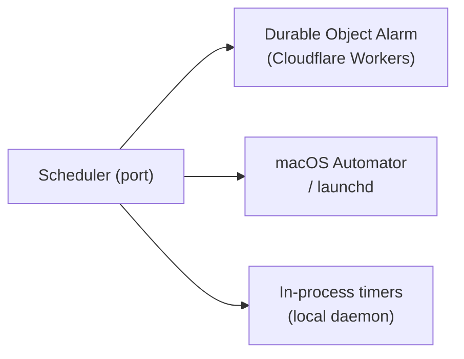

# Scheduler

The scheduler is a kernel primitive for deferred and recurring task execution. Defined as a **kernel interface trait** with **platform-specific implementations** — the kernel defines *what* to schedule; each platform implementation decides *how*.

> **Terminology note:** "Adapter" here refers to internal kernel implementations (tokio timers, launchd, DO Alarms), not external app drivers. See [os.md § 5](os.md) for the driver/adapter distinction.

## Platform Adapters

| Platform | Adapter | Durable? |
|----------|---------|----------|
| **Cloudflare Workers** | Durable Object Alarm | Yes — persists across restarts |
| **macOS** | launchd / Automator | Yes — OS-managed scheduling |
| **Local daemon** | In-process timers | No — lost on daemon restart |

## Design Constraints

1. The scheduler port lives in the domain — no platform dependencies.
2. Adapters live behind feature flags or in separate modules.
3. The in-process adapter is the default and requires no external setup.
4. Task payloads are serializable. They describe *what* to run, not *how*.
5. Durable adapters persist schedules across restarts. The in-process adapter does not — applications MUST handle re-registration on startup if durability is needed.
