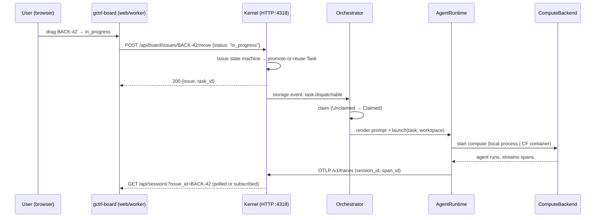

# Session Trigger from Board

How dragging an Issue to `in_progress` on the gctrl-board web UI kicks off an agentic development session. Ties together existing primitives — it is **not** a new kernel subsystem.

> Related specs:
> - [kernel/orchestrator.md](kernel/orchestrator.md) — claim states, dispatch, retry (kernel primitive)
> - [apps/gctl-board.md](apps/gctl-board.md) — what the board tracks (Issues vs. Tasks)
> - [../gctrl/WORKFLOW.md](../gctrl/WORKFLOW.md) — issue lifecycle + agent dispatch CLI

---

## Problem

Today, starting an agent session is a CLI act:

```sh
gctrl board assign BACK-42 --agent claude-code
gctrl board move BACK-42 in_progress
```

The deployed gctrl-board is view-only for dispatch: a user can drag a card but nothing agentic happens. We want the drag gesture itself — on both local and deployed board — to be the trigger.

---

## Invariants (inherited, not redefined here)

1. **Issues are app-level; the Orchestrator never sees them.** Board emits Issue-level events; kernel promotes them into Tasks; the Orchestrator dispatches Sessions against Tasks. See [kernel/orchestrator.md](kernel/orchestrator.md) §1.
2. **Apps MUST NOT access storage or external services directly.** The board (both local and deployed) talks to the kernel HTTP API. See [os.md §Dependency Direction](os.md).
3. **Orchestrator state machine is authoritative** for dispatch/claim/retry. The board does not implement its own scheduler.

---

## End-to-End Flow



### Boundaries

- The **board** is a dumb trigger. It sends `move` and renders state. It never decides which agent to run.
- The **kernel** owns the Issue → Task promotion and feeds the Orchestrator.
- The **Orchestrator** owns dispatch eligibility, claim, and retry. Unchanged from [kernel/orchestrator.md](kernel/orchestrator.md).
- The **AgentRuntime** renders + launches the agent. It is a new abstraction that wraps today's `AgentAdapter` (see next section).
- The **ComputeBackend** is where the runtime runs. It is a new abstraction.

---

## Compute × Runtime Split

Today's [implementation/kernel/orchestrator.md](../implementation/kernel/orchestrator.md) defines `AgentAdapter::launch(prompt, workspace, attempt) -> AgentHandle{pid}`. That conflates two concerns:

1. **Which agent is running?** (the *runtime*) — Claude Code, Claude Agent SDK, opencode, aider, custom.
2. **Where is it running?** (the *compute*) — local process, Cloudflare Container, e2b, etc.

We split the port:

```text
AgentRuntime × ComputeBackend  →  launched Session
```

### AgentRuntime

```rust
#[async_trait]
pub trait AgentRuntime: Send + Sync {
    fn kind(&self) -> &str;                           // "claude-code" | "claude-agent-sdk" | "opencode" | ...
    fn render_invocation(&self, prompt: &str,
                         workspace: &Path) -> Invocation;
}

/// Describes what to execute inside a ComputeBackend.
pub struct Invocation {
    pub command: Vec<String>,     // e.g. ["claude", "--print", "--prompt", ...]
    pub env: BTreeMap<String, String>,
    pub stdin: Option<String>,    // for runtimes that pass prompt via stdin
    pub workspace_mount: PathBuf, // local path to mount/copy
}
```

### ComputeBackend

```rust
#[async_trait]
pub trait ComputeBackend: Send + Sync {
    fn kind(&self) -> &str;  // "local-process" | "cf-containers" | ...
    async fn launch(&self, invocation: Invocation) -> Result<ComputeHandle, ComputeError>;
}

pub struct ComputeHandle {
    pub id: String,                               // pid for local, container_id for CF
    pub kill: Box<dyn FnOnce() -> Result<(), ComputeError> + Send>,
    pub wait: Box<dyn Future<Output = ComputeExit> + Send>,
}
```

The existing `AgentAdapter` becomes a composite: `(runtime, compute) -> AgentHandle`. No changes to the Orchestrator state machine or claim logic.

### Configuration

`WORKFLOW.md` frontmatter gains a `compute` key (defaults to `local-process` for backward compatibility):

```yaml
agent:
  runtime: claude-code
  compute: local-process           # or: cf-containers
  args: ["--print", "--dangerously-skip-permissions"]
  # cf-containers-specific:
  compute_config:
    image: "gctrl/claude-code:latest"
    cpu_ms: 30000
    memory_mb: 2048
```

---

## Deployment Phasing

The deployed gctrl-board runs on Cloudflare Workers and has no local kernel to talk to. We reach the end goal in three slices, each shippable on its own.

### Slice 1 — Local trigger (this PR)

- Board drag works when run locally against a local kernel.
- `ComputeBackend = local-process`, `AgentRuntime = claude-code`.
- **No CF Containers yet, no deployed flow yet.** The deployed board still shows sessions read-only.
- Acceptance: Playwright local — drag card → `GET /api/sessions?issue_id=X` returns a row.

### Slice 2 — Remote compute, local orchestrator

- Add `cf-containers` ComputeBackend. Same `claude-code` runtime.
- Local kernel orchestrates; agent runs in a CF Container and streams OTLP back to the local kernel.
- Still requires a local kernel daemon. Deployed board unchanged.
- Acceptance: local kernel + CF Container — session completes, spans land in DuckDB.

### Slice 3 — Cloud orchestrator (end goal)

- Deploy an orchestrator slice on Cloudflare (Worker + Durable Object for claim state + D1 for session rows + Containers for compute + OTel forwarding to SigNoz / local via pull-sync).
- Deployed board → deployed orchestrator. No local daemon needed.
- The Rust `gctrl-orch` crate stays the source of truth for state-machine semantics; the Workers slice is a **Rust-compiled-to-Wasm** binding (candidate: `workers-rs`) wrapping the same `transition()` function. This keeps the Lean-verified semantics identical in both deployments.
- Acceptance: `wrangler dev --remote` preview — drag card → session row in D1 via `GET /api/sessions`.

Each slice is behind a feature flag; no slice breaks the prior one.

---

## HTTP Contract Changes

No new routes for Slice 1 — the existing `POST /api/board/issues/:id/move` route gains side-effects when the target status is `in_progress`:

- Kernel locates or creates the linked Task (by `issue_id` foreign key).
- Kernel emits `task.dispatchable` event (storage row + tracing span).
- Response shape extended:

```json
{
  "issue": { ... existing ... },
  "task_id": "BACK-42.T1",
  "dispatched": true
}
```

Task IDs are project-keyed `<ISSUE_ID>.T<N>` (see [implementation/kernel/session-trigger.md §Task ID format](../implementation/kernel/session-trigger.md#task-id-format)).

`dispatched: false` (with `task_id: null`) is returned when the Issue has no project-level agent config (i.e. WORKFLOW.md has no `agent:` section) — the move still succeeds, no Task row is created, and no session kicks off. This keeps the non-agentic flow a first-class path for human-only projects.

Re-dragging an Issue whose latest Task is **`Released`** (terminal) creates a **new** Task with the next `.T<N>` ordinal. A drag while a non-terminal Task already exists reuses that Task, so rapid re-drags stay idempotent.

### Future routes (Slice 2+)

- `POST /api/sessions` — explicit manual dispatch (bypasses the board flow).
- `GET /api/sessions?issue_id=X` — already exists; re-used by the board to poll.
- `POST /v1/traces` — OTLP receive endpoint, exists, used by CF-Container-hosted agent.

---

## Observability

New events (appended to the existing orchestrator event table in [kernel/orchestrator.md](kernel/orchestrator.md) §Observability):

| Event | Fields |
|-------|--------|
| `board.issue_moved` | `issue_id`, `from_status`, `to_status`, `actor_id`, `triggered_dispatch: bool` |
| `task.promoted_from_issue` | `task_id`, `issue_id`, `project_key` |

The existing `orchestrator.claim` / `orchestrator.dispatch` events fire downstream unchanged.

---

## Non-Goals

- **No new state machine.** We reuse the existing claim-state machine.
- **No write-path for Tasks from the board UI.** Tasks remain read-only from the human side per [apps/gctl-board.md](apps/gctl-board.md).
- **No agent-of-the-month picker in the UI** (yet). Which runtime runs is configured via WORKFLOW.md; the drag just means "go".
- **No per-slice rollback plan** — each slice sits behind a config flag; default stays on the previously shipped slice.
