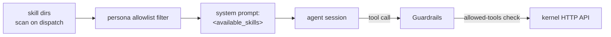

# Skills — Declarative Utilities

Skills are gctrl's adoption of the [agentskills](https://github.com/agentskills/agentskills) spec: single-purpose bundles of procedural knowledge that agents invoke by name. They are a **subclass of utility** in the Unix layer model — see [os.md § 4 Skills](os.md#skills--declarative-utilities) for the layer-level framing.

This document covers the skill format, discovery, enforcement, and how skills compose with the rest of gctrl (personas, orchestrator, guardrails, memory).

---

## Goals

1. Let agents (and humans) extend gctrl's procedural knowledge without changing code.
2. Interoperate with existing `.claude/skills/` and other agentskills hosts (Cursor, Gemini CLI, Codex, OpenHands, Goose, ...).
3. Keep the kernel small — no skills table, no skills service, no sync. The filesystem is the registry.
4. Make tool-permission enforcement authoritative and uniform across skill activations via Guardrails.

## Non-goals

- A skills marketplace or registry service.
- Per-skill DuckDB state. (Skills that need state should register themselves as an **application**, not a skill.)
- Runtime patching of agent behaviour outside tool-call boundaries.

---

## 1. Skill Format

Skills follow the upstream agentskills specification. The canonical artefact is a directory containing `SKILL.md`:

```
<skill-name>/
├── SKILL.md        # required
├── scripts/        # optional: executable helpers
├── references/     # optional: supporting docs
└── assets/         # optional: templates
```

`SKILL.md` frontmatter:

```yaml
---
name: dispatch                       # lowercase-kebab, matches parent dir, ≤64 chars
description: |                       # ≤1024 chars — this is the *search surface*
  Prepare a dispatch recommendation for agent work on an issue — gather
  context and suggest an execution plan.
allowed-tools: Bash(gctrl:*) Read Grep  # advisory; enforced by Guardrails
license: Apache-2.0                  # optional
compatibility:                       # optional
  hosts: ["claude-code", "gctrl"]
metadata:                            # optional, free-form
  owner: gctrl-core
---

Body is unconstrained Markdown. May reference ./scripts/foo.sh,
./references/bar.md, and ./assets/template.md by relative path.
```

**Validation policy:** lenient per the upstream spec — warn on malformed frontmatter, skip on hard errors, never halt discovery.

---

## 2. Discovery — the `$PATH` for Skills

Skill directories are scanned in order; the first match for a given `name` wins (the same precedence rule as `$PATH`):

| Order | Path | Scope | Purpose |
|---|---|---|---|
| 1 | `./.agents/skills/` | project | Checked into the repo; canonical location |
| 2 | `~/.agents/skills/` | user | Per-developer extensions |
| 3 | `./.claude/skills/` | project (compat) | Existing Claude Code skills |
| 4 | `~/.claude/skills/` | user (compat) | Existing Claude Code skills |
| 5 | `gctrl/utils/skills/` | shipped | Repo-shipped skills (e.g. `/dispatch`, `/review`). Nests under `gctrl/utils/` to reflect that skills are a subclass of utility; the leaf stays `skills` for agentskills host discovery. |

**Override environment variable:** `GCTRL_SKILLS_PATH` — colon-separated list replacing the default order (same convention as `$PATH`).

Discovery is a stateless filesystem walk. Skills are read lazily when activated; only frontmatter is parsed eagerly for listing.

---

## 3. Discovery API

Skills are a shell-and-orchestrator concern. Neither the kernel nor any app stores skill state. Two surfaces consume the filesystem:

### 3.1 Shell CLI

```sh
gctrl skills list                   # all skills on $PATH, with scope
gctrl skills list --scope project   # filter
gctrl skills show <name>            # dump SKILL.md (Tier 2 load)
gctrl skills path                   # show effective $PATH
gctrl skills which <name>           # resolve to absolute path (like `which`)
```

The shell implements this by scanning the directories listed in § 2. No HTTP round-trip is required; skills are files, not kernel state.

### 3.2 Orchestrator injection at dispatch

At dispatch time, the orchestrator:

1. Scans skill dirs (respecting `GCTRL_SKILLS_PATH`).
2. Filters to skills permitted by the active persona's allowlist.
3. Renders `<available_skills>` into the agent prompt with Tier-1 content only (`name` + `description`).
4. Records the catalog snapshot as a span attribute for audit.



---

## 4. Activation & Progressive Disclosure

Activation is **model-driven**, not orchestrator-driven. Three tiers (verbatim from the upstream spec):

| Tier | Content | Cost | Timing |
|---|---|---|---|
| 1 | `name` + `description` | ~50–100 tokens/skill | Session start (in `<available_skills>`) |
| 2 | Full `SKILL.md` body | <5000 tokens | On activation (model reads the file) |
| 3 | Referenced scripts / docs / assets | Variable | On demand |

The model activates a skill by reading `SKILL.md` via its existing Read tool (no new `activate_skill` verb required). Hosts MAY register an explicit activation tool; gctrl does not, to stay close to the upstream protocol.

---

## 5. `allowed-tools` Enforcement

`allowed-tools` is the skill's declared capability footprint — e.g. `Bash(gctrl:*) Read Grep`. It is **advisory in the file** and **authoritative at the Guardrails boundary**.

**Enforcement rule:** when an agent session attempts a tool call, Guardrails compares the call against the **union** of:

1. The persona's capability grant (`specs/team/personas.md § tools`).
2. The currently activated skill's `allowed-tools` (if any).
3. Any task-scoped capability grants (equivalent to `sudo` for one Task — see [os.md § 6.2](os.md#62-persona--unix-analogy)).

A call is allowed only if it passes all applicable gates. This matches the Unix rule that a process's effective capability is the intersection of user, group, and file ACLs.

**Open question — activation state:** tracking which skill is "active" in a multi-turn session requires either (a) the agent explicitly declaring activation via a tool call, or (b) span-level annotation by the orchestrator. gctrl adopts (b) initially: Guardrails treats the last explicitly-activated skill within the current span subtree as active, falling back to persona-only allowlist otherwise.

---

## 6. Skills ≠ Personas ≠ Apps

| Concept | Answers | State | Example |
|---|---|---|---|
| **Persona** | *Who* is acting | Identity, capability grant, cost quota | `reviewer-bot` |
| **Skill** | *How* to act on a class of task | Markdown file, no runtime state | `/dispatch`, `/review` |
| **App** | *What* domain data is affected | Owns DuckDB tables (`board_*`, `inbox_*`) | `gctrl-board` |
| **Driver** | *How* to reach an external system | Kernel interface implementation | `driver-github` |

A persona declares which skills it may activate. A skill may drive an app (via shell HTTP) or invoke a driver (via shell HTTP → kernel → driver). A skill never imports a driver or reads an app's tables directly.

---

## 7. Composition

Skills compose via **agent tool-use**, not shell pipes. The composition surface is the agent's conversation, not stdin/stdout:

```
/dispatch  →  emits a plan (tool output)
       ↓
/review    →  reads plan from context, critiques
       ↓
/audit     →  validates final output against spec rules
```

Where skills need to hand off structured data (not free-text), they SHOULD persist it to a well-known location and reference it by path — `.gctrl/runs/<session_id>/<skill>/output.json` — rather than relying on unbounded agent memory.

---

## 8. Relationship to Memory

Skills and memory are orthogonal layers with a well-defined interaction:

- **Skills are read-only code.** They do not mutate memory on their own.
- **Memory is shared state.** The entity graph (see `specs/architecture/kernel/knowledgebase.md` and the forthcoming `entity_*` tables) is the kernel-owned filesystem that skills read from and write to via kernel HTTP.
- **A skill invocation MAY append observations** (e.g. `/review` could post `entity_observations` for the reviewed entity). This happens through the kernel's memory API, not through skill-local state.

Unix parallel: skills are `grep`/`jq`, memory is the filesystem. `grep` doesn't have its own on-disk state; it reads files and writes to stdout.

---

## 9. Explicit Non-Kernel Surface

The kernel does **not** gain:

- A `gctrl-skills` crate.
- A `skills` DuckDB table.
- A `/api/skills/*` HTTP route.
- A file watcher for skill dirs.

Skill activation is annotated on existing `spans` (attribute: `skill.name`, `skill.path`, `skill.content_hash`). This is derived telemetry, not authoritative state.

**Rationale:** skills are stateless declarative files. Promoting them to kernel state would (a) duplicate the filesystem, (b) force a sync problem that doesn't exist, and (c) violate the "kernel provides mechanisms, not policy" principle — skill selection is policy.

---

## 10. Implementation Roadmap

| Milestone | Scope | Notes |
|---|---|---|
| **M0 — Listing** | `gctrl skills list/show/path/which` in the shell | Pure filesystem scan; frontmatter parsing via `gray-matter` (TS) / `serde_yaml` (Rust) |
| **M1 — Orchestrator injection** | Render `<available_skills>` in dispatched agent prompts | Persona allowlist filter; Tier-1 only |
| **M2 — Guardrails integration** | Enforce `allowed-tools` at tool-call boundary | Union with persona + task grants; span annotation for active skill |
| **M3 — Composition convention** | `.gctrl/runs/<session>/<skill>/output.*` standard for structured hand-off | Optional; skills may still hand off via free text |
| **M4 — Task-scoped grants** | `gctrl skills grant <skill> --task <id>` — one-shot elevation | Analogous to `sudo` |

M0 and M1 unlock the user-visible value; M2 is the correctness gate; M3 and M4 are ergonomic improvements.

---

## 11. Examples

### 11.1 A gctrl-shipped skill — `gctrl/utils/skills/dispatch/SKILL.md`

```markdown
---
name: dispatch
description: Prepare a dispatch recommendation for agent work on a board issue — gather context, check guardrails, suggest an execution plan and persona.
allowed-tools: Bash(gctrl board:*) Bash(gctrl sessions:*) Bash(gctrl gh:*) Read
metadata:
  owner: gctrl-core
  stability: stable
---

# /dispatch

Given an issue reference, produce a dispatch plan: persona, WORKFLOW.md template,
estimated cost, and any unresolved prerequisites.

## Procedure

1. `gctrl board issues view <id>` → fetch issue + blockers
2. `gctrl gh pr list --linked <id>` → check for in-flight work
3. Match persona by `review_focus` tags (see specs/team/personas.md)
4. Render WORKFLOW.md template; return dispatch recommendation as JSON
```

### 11.2 A user-scope skill — `~/.agents/skills/standup/SKILL.md`

```markdown
---
name: standup
description: Produce the daily standup from board + sessions activity over the last 24h.
allowed-tools: Bash(gctrl board:*) Bash(gctrl sessions:*)
---

# /standup

Summarise issues moved, sessions run, and spans flagged by guardrails in the
last 24h for the active user. Group by project.
```

---

## 12. References

- [agentskills spec](https://github.com/agentskills/agentskills) — canonical format and progressive-disclosure protocol.
- [os.md § 4 Utilities](os.md#4-utilities--small-single-purpose-tools) — layer-level framing.
- [specs/team/personas.md](../team/personas.md) — persona definitions and capability grants.
- [specs/architecture/kernel/orchestrator.md](kernel/orchestrator.md) — where `<available_skills>` injection happens at dispatch.
- [specs/architecture/kernel/knowledgebase.md](kernel/knowledgebase.md) — entity graph and memory API skills may call.
