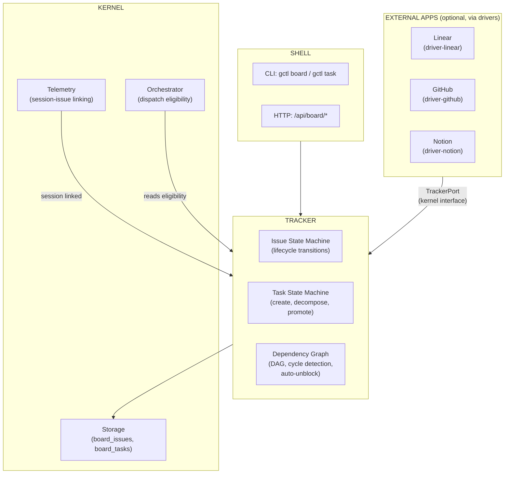
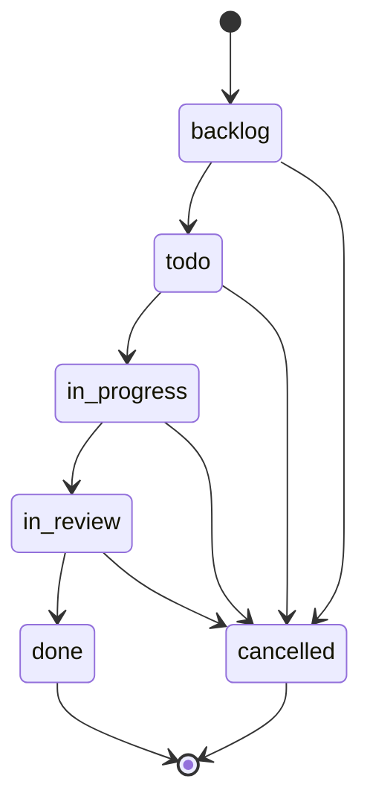
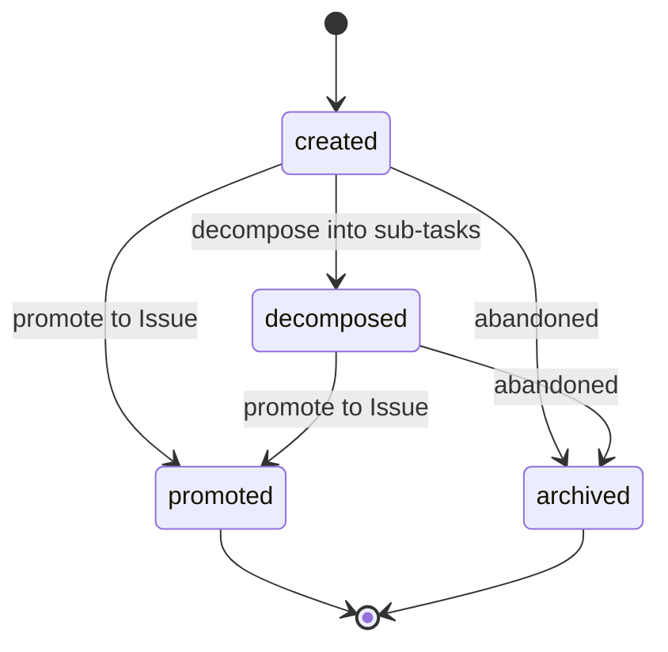
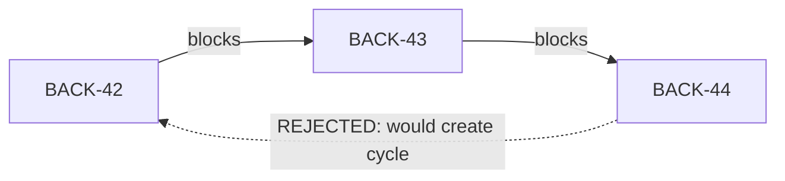
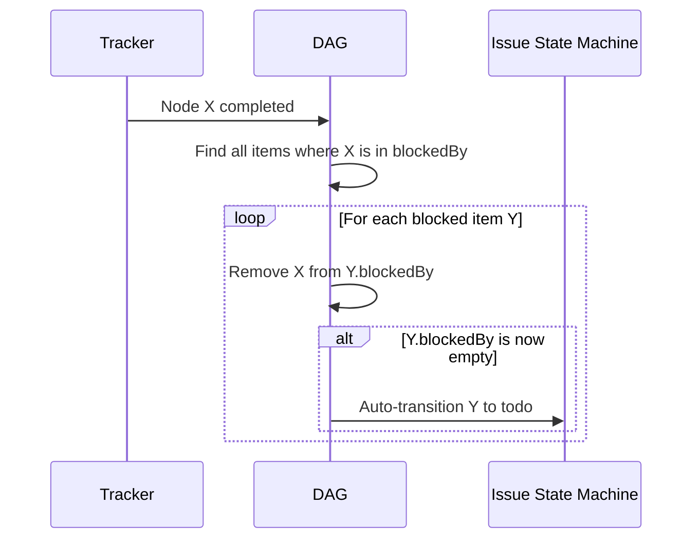

# Tracker — Issue & Task Graph Management

The Tracker is the subsystem responsible for managing the lifecycle of Issues and Tasks, their dependency graph (DAG), and the transitions defined by the workflow templates. It is the engine behind gctl-board's kanban and task planning features.

## Scope

The Tracker owns:

1. **Issue lifecycle** — status transitions, validation rules, and auto-transitions as defined in [issue-lifecycle.md](../gctl/workflows/issue-lifecycle.md).
2. **Task lifecycle** — creation, decomposition, dependency resolution, and promotion to Issues as defined in [task-planning.md](../gctl/workflows/task-planning.md).
3. **Dependency graph (DAG)** — the directed acyclic graph of `blockedBy` / `blocking` relationships across both Tasks and Issues.
4. **Graph integrity** — cycle detection, auto-unblock propagation, and topological ordering for dispatch eligibility.

The Tracker does NOT own:

- **Telemetry linkage** — session-to-issue linking is handled by the kernel's Telemetry primitive; the Tracker consumes the resulting events.
- **External sync** — bidirectional sync with Linear/GitHub/Notion is handled by drivers that read/write through the Tracker's kernel interface.
- **Orchestration dispatch** — the Orchestrator reads issue eligibility from the Tracker but owns the dispatch state machine (see [orchestration.md](../gctl/workflows/orchestration.md)).

## Relationship to Other Components



## Issue State Machine

The Tracker enforces the kanban lifecycle from [issue-lifecycle.md](../gctl/workflows/issue-lifecycle.md):



### Transition Validation Rules

1. `backlog -> todo` — MAY be triggered by human sprint planning or auto-unblock from DAG.
2. `todo -> in_progress` — MUST have at least one acceptance criterion. MAY be triggered by agent claiming the issue.
3. `in_progress -> in_review` — MUST have a linked PR. SHOULD auto-trigger when a PR referencing the issue is opened.
4. `in_review -> done` — SHOULD auto-trigger when the linked PR is merged.
5. `* -> cancelled` — MUST include a reason note in the event log.

### Auto-Transitions

The Tracker MUST subscribe to external events and apply auto-transitions:

| Event Source | Event | Auto-Transition |
|-------------|-------|-----------------|
| Telemetry | Agent session starts, referencing issue key | Link session to issue; if issue is `todo`, move to `in_progress` |
| GitHub driver | PR opened referencing issue key | Move to `in_review` |
| GitHub driver | PR merged | Move to `done` |
| DAG | All blockers resolved | Move from blocked state to `todo` |

## Task State Machine

Tasks follow the planning lifecycle from [task-planning.md](../gctl/workflows/task-planning.md):



### Task Rules

1. Tasks are local planning artifacts — they MUST NOT be synced to external trackers.
2. Tasks MAY have `blockedBy` / `blocking` edges to other Tasks or Issues (shared DAG).
3. When a Task is promoted to an Issue, dependency edges MUST be preserved on the resulting Issue.
4. The original Task MUST be archived (not deleted) after promotion for audit trail.

## Dependency Graph (DAG)

The Tracker maintains a single DAG that spans both Tasks and Issues. A node in the graph is identified by a `WorkItemId` which is either a `TaskId` or an `IssueId`.

### Graph Operations

| Operation | Description | Invariant |
|-----------|-------------|-----------|
| **Add edge** | `A blocks B` | MUST reject if adding the edge would create a cycle |
| **Remove edge** | Remove `A blocks B` | No constraint |
| **Complete node** | Node transitions to terminal state (`done`, `cancelled`, `archived`, `promoted`) | MUST propagate: check all items blocked by this node; if all their blockers are now resolved, auto-unblock them |
| **Topological sort** | Return items in dependency order | Used by Orchestrator to determine dispatch eligibility |
| **Ready set** | Return all items with zero unresolved blockers | Used by `gctl task ready` and dispatch candidate selection |

### Cycle Detection

The Tracker MUST reject any `addDependency` call that would introduce a cycle. Implementation SHOULD use depth-first search from the target node to check if the source is reachable before inserting the edge.



### Auto-Unblock Propagation

When a work item completes:



## Tracker Kernel Interface

The Tracker exposes an interface trait that drivers and the shell consume. This is the single entry point for all issue/task mutations — external app drivers (Linear, GitHub) and CLI commands both go through this interface.

```rust
#[async_trait]
pub trait TrackerPort: Send + Sync {
    // --- Issues ---
    async fn create_issue(&self, input: CreateIssueInput) -> Result<Issue, TrackerError>;
    async fn move_issue(&self, id: &IssueId, status: IssueStatus, note: Option<&str>) -> Result<Issue, TrackerError>;
    async fn assign_issue(&self, id: &IssueId, assignee: Assignee) -> Result<Issue, TrackerError>;
    async fn list_issues(&self, filter: IssueFilter) -> Result<Vec<Issue>, TrackerError>;
    async fn get_issue(&self, id: &IssueId) -> Result<Issue, TrackerError>;

    // --- Tasks ---
    async fn create_task(&self, input: CreateTaskInput) -> Result<Task, TrackerError>;
    async fn decompose_task(&self, id: &TaskId, sub_titles: &[String]) -> Result<Vec<Task>, TrackerError>;
    async fn promote_task(&self, id: &TaskId, project_key: &str, priority: Priority) -> Result<Issue, TrackerError>;
    async fn complete_task(&self, id: &TaskId, note: Option<&str>) -> Result<Task, TrackerError>;
    async fn list_ready_tasks(&self) -> Result<Vec<Task>, TrackerError>;

    // --- Dependency Graph ---
    async fn add_dependency(&self, blocker: WorkItemId, blocked: WorkItemId) -> Result<(), CyclicDependencyError>;
    async fn remove_dependency(&self, blocker: WorkItemId, blocked: WorkItemId) -> Result<(), TrackerError>;
    async fn get_graph(&self, root: Option<WorkItemId>) -> Result<DependencyGraph, TrackerError>;

    // --- Telemetry integration ---
    async fn link_session(&self, issue_id: &IssueId, session_id: &str, cost: f64, tokens: u64) -> Result<(), TrackerError>;
    async fn link_pr(&self, issue_id: &IssueId, pr_number: u32) -> Result<(), TrackerError>;
}
```

### Work Item ID

Since the DAG spans both Tasks and Issues, a unified identifier is needed:

```rust
pub enum WorkItemId {
    Task(TaskId),
    Issue(IssueId),
}
```

### Error Types

```rust
pub enum TrackerError {
    NotFound { id: String },
    InvalidTransition { from: String, to: String, reason: String },
    MissingAcceptanceCriteria { issue_id: String },
    MissingLinkedPr { issue_id: String },
    MissingCancellationReason { issue_id: String },
    CyclicDependency { path: Vec<String> },
    StorageError(String),
}
```

## Storage

The Tracker reads and writes to DuckDB tables in the `board_*` namespace (see [domain-model.md](domain-model.md) section 5.5 for DDL).

### Task Table (new)

The existing `board_issues` table handles Issues. Tasks require an additional table:

```sql
CREATE TABLE IF NOT EXISTS board_tasks (
    id              VARCHAR PRIMARY KEY,
    title           VARCHAR NOT NULL,
    description     VARCHAR,
    status          VARCHAR NOT NULL DEFAULT 'created',  -- created, decomposed, promoted, archived
    parent_id       VARCHAR,                              -- parent task (decomposition)
    promoted_to     VARCHAR,                              -- issue ID if promoted
    blocked_by      JSON DEFAULT '[]',
    blocking        JSON DEFAULT '[]',
    created_at      VARCHAR NOT NULL,
    updated_at      VARCHAR NOT NULL,
    created_by_id   VARCHAR NOT NULL,
    created_by_name VARCHAR NOT NULL,
    created_by_type VARCHAR NOT NULL,
    note            VARCHAR,
    acceptance_criteria JSON DEFAULT '[]'
);

CREATE INDEX IF NOT EXISTS idx_tasks_status ON board_tasks(status);
CREATE INDEX IF NOT EXISTS idx_tasks_parent ON board_tasks(parent_id);
```

### DAG Storage

Dependency edges are stored inline as JSON arrays (`blocked_by`, `blocking`) on both `board_issues` and `board_tasks`. The Tracker reconstructs the in-memory DAG from these columns on startup and maintains it incrementally during operation.

This avoids a separate edge table while keeping queries simple (`SELECT * FROM board_issues WHERE json_array_length(blocked_by) = 0` for the ready set).

## Integration Points

### With Orchestrator

The Orchestrator queries the Tracker to determine dispatch eligibility:

1. Orchestrator calls `list_issues(filter: { status: "todo", unassigned: true })`.
2. Orchestrator checks `blocked_by` — only issues with empty `blocked_by` are dispatch-eligible.
3. After dispatch, Orchestrator calls `assign_issue` and `move_issue` to transition the issue to `in_progress`.

The Tracker MUST NOT call the Orchestrator — dependency flows one way.

### With Telemetry

The kernel's Telemetry primitive emits events when spans reference issue keys. The Tracker subscribes to these events and calls `link_session` to accumulate cost and token data on the issue.

### With External App Drivers

Drivers (driver-linear, driver-github, driver-notion) implement bidirectional sync through the `TrackerPort`:

- **Pull**: Driver reads from external API, calls `create_issue` / `move_issue` to mirror state locally.
- **Push**: Driver subscribes to Tracker events (issue created, status changed, session linked) and writes back to the external API.

Drivers MUST NOT write to `board_*` tables directly — they MUST go through the `TrackerPort` kernel interface.

## Related Docs

- [issue-lifecycle.md](../gctl/workflows/issue-lifecycle.md) — Kanban status definitions and transition rules
- [task-planning.md](../gctl/workflows/task-planning.md) — Task decomposition and promotion workflow
- [gctl-board.md](gctl-board.md) — Application-level view of the board (agent integration, kernel primitives used)
- [domain-model.md](domain-model.md) — Storage schema DDL and Effect-TS type definitions
- [orchestration.md](../gctl/workflows/orchestration.md) — Dispatch state machine that reads from the Tracker
