# Competitive Landscape: gctl vs. Ruflo, oh-my-claudecode, Symphony

> Comparison as of 2026-03-30. Sources: public GitHub READMEs, SPEC.md, and documentation.

## One-Line Summaries

| Project | What It Is |
|---------|-----------|
| **gctl (GroundCtrl)** | Local-first OS for human+agent teams — Unix-inspired kernel (Rust) + shell (Effect-TS) providing telemetry, storage, guardrails, and orchestration as infrastructure. |
| **Ruflo** (ruvnet/ruflo) | Enterprise multi-agent orchestration platform — 100+ specialized agents in coordinated swarms with self-learning, consensus protocols, and multi-LLM routing. |
| **oh-my-claudecode** (OMC) | Claude Code plugin adding multi-agent orchestration, natural-language task dispatch, and persistent execution modes on top of the existing Claude Code runtime. |
| **Symphony** (openai/symphony) | Issue-tracker-driven daemon that polls Linear for work, creates isolated workspaces, and dispatches coding agents (Codex) — spec-first, language-agnostic. |

---

## Architecture Comparison

```mermaid
graph TB
    subgraph gctl["gctl — Unix OS Model"]
        gK["Kernel (Rust)<br/>telemetry, storage,<br/>guardrails, orchestrator"]
        gS["Shell (Effect-TS CLI)<br/>CLI, HTTP API, query"]
        gA["Apps (Effect-TS)<br/>board, eval, capacity"]
        gA --> gS --> gK
    end

    subgraph ruflo["Ruflo — Swarm Platform"]
        rE["Entry (CLI / MCP)"]
        rR["Router (Q-Learning / MoE)"]
        rSw["Swarm (mesh/hier/ring)"]
        rAg["100+ Agents"]
        rM["Memory (AgentDB + RuVector)"]
        rE --> rR --> rSw --> rAg --> rM
    end

    subgraph omc["OMC — Plugin Layer"]
        oP["Claude Code Plugin"]
        oSk["Skills / Hooks / Keywords"]
        oT["Team Pipeline<br/>plan→prd→exec→verify→fix"]
        oP --> oSk --> oT
    end

    subgraph sym["Symphony — Daemon Runner"]
        sL["Workflow Loader (WORKFLOW.md)"]
        sO["Orchestrator (poll loop)"]
        sW["Workspace Manager"]
        sR["Agent Runner (Codex)"]
        sL --> sO --> sW --> sR
    end
```



### Architectural Philosophy

| Dimension | gctl | Ruflo | OMC | Symphony |
|-----------|------|-------|-----|----------|
| **Metaphor** | Operating system (Unix) | Enterprise platform | Plugin / framework | Daemon / service |
| **Core lang** | Rust kernel + Effect-TS apps | TypeScript + WASM (Rust-compiled policy engine, embeddings) | TypeScript (Claude Code plugin, .mjs hooks) | Spec-agnostic (reference impl: Elixir/OTP) |
| **Agent model** | Agent-agnostic — any agent that emits OTel spans | 100+ built-in specialized agents | 32 built-in agents + multi-model (Claude, Codex, Gemini) | Single coding agent per issue (Codex app-server) |
| **Separation of concerns** | Kernel (mechanism) vs. Shell (policy) vs. Apps (domain) | Layered: entry → routing → swarm → agents → memory | Skills + hooks + orchestration modes stacked on Claude Code | Policy (WORKFLOW.md) vs. coordination (orchestrator) vs. execution (agent subprocess) |
| **Extension model** | CLI subcommands, HTTP routes, event bus, drivers for external apps | Plugin SDK (workers, hooks, providers, security modules), IPFS marketplace | Custom skills, hooks, keyword triggers | WORKFLOW.md front matter; unknown keys ignored for forward compat |

---

## Feature Matrix

| Feature | gctl | Ruflo | OMC | Symphony |
|---------|------|-------|-----|----------|
| **Telemetry / observability** | OTel span ingestion, trace trees, cost analytics, `gctl status` | V3 statusline, context autopilot metrics, background daemon monitoring, performance benchmarking (P95/P99) | HUD statusline (5 presets), Agent Observatory (per-agent health/bottleneck), session replay JSONL, notification callbacks (Telegram/Discord/Slack) | Structured logs with issue/session context, token accounting (delta tracking), optional Phoenix LiveView dashboard + JSON REST API |
| **Guardrails / safety** | Policy engine: cost budgets, loop detection, command allowlists | AIDefence security layer (<10ms), prompt injection protection, input validation, `@claude-flow/guidance` governance with HMAC-SHA256 proof chains | N/A (relies on Claude Code permissions) | Trust boundary at WORKFLOW.md; sandbox posture left to implementation; stall detection (5 min default) |
| **Orchestration** | Orchestrator primitive: dispatch, retry, dependency DAG, concurrency slots | Q-Learning router, MoE, consensus protocols (Raft/BFT/CRDT), swarm topologies | Team pipeline: plan→prd→exec→verify→fix, autopilot, ultrawork modes | Poll-based dispatch, concurrency limits, exponential backoff retries, reconciliation |
| **Storage** | DuckDB (single-writer, namespaced tables), Parquet export | Multi-tier: in-memory (1MB) → SQLite episodic → SQLite+HNSW semantic → optional pgvector; JSON fallback | File-based `.omc/` directory: notepad.md (compaction-resistant), project-memory.json, JSONL session replay | In-memory orchestrator state, filesystem workspaces; no persistent DB required |
| **Multi-LLM support** | Agent-agnostic (any LLM that produces OTel spans) | Claude, GPT, Gemini, Cohere, Ollama with automatic failover | Claude (primary), Codex, Gemini via tmux CLI workers | Codex (primary); spec is agent-executable-agnostic |
| **Issue tracking** | gctl-board (native kanban) + drivers for Linear, GitHub, Notion | Claims system for human-agent coordination | N/A (task dispatch via natural language) | Linear integration (polls active issues, manages state transitions) |
| **Web scraping / context** | gctl-net: fetch, crawl, compact; context manager with DuckDB+filesystem | N/A | N/A | N/A |
| **Browser control** | CDP daemon with ref system, tab management | N/A | N/A | N/A |
| **Cloud sync** | Cloudflare R2 (opt-in), Parquet-based | N/A | N/A | N/A (local workspaces only) |
| **Workspace isolation** | Per-agent sessions tracked via telemetry | Per-swarm agent isolation | Per-team execution | Per-issue workspace directories with lifecycle hooks |
| **Self-learning** | N/A | RuVector: SONA, EWC++, LoRA, 9 RL algorithms, reasoning bank | Skill learning: extracts reusable patterns from sessions | N/A |
| **CI/CD integration** | Kernel driver (driver-github) for GitHub Actions via TrackerPort | N/A | N/A | Agent handles CI via tools; Symphony tracks proof-of-work (CI status, PR review) |
| **License** | MIT | MIT | MIT | Apache 2.0 |

---

## Design Trade-offs

### gctl: Infrastructure-first, agent-agnostic

**Strengths:**
1. Unix-inspired layered architecture provides clean separation — kernel never assumes which agents or apps are present
2. Agent-agnostic: works with Claude Code, Aider, Codex, or any agent that emits OTel spans
3. Local-first with zero config (`gctl serve` gives you telemetry + storage + guardrails immediately)
4. DuckDB storage provides SQL queryability, Parquet export, and structured analytics
5. Built-in web scraping, browser control, and context management — comprehensive toolbox
6. Guardrails as a kernel primitive — not an afterthought

**Trade-offs:**
1. No built-in self-learning or ML-based routing — agents are external, not orchestrated internally
2. Requires running a daemon (`gctl serve`) for full functionality
3. Rust kernel + Effect-TS apps is a dual-language stack that requires both ecosystems

### Ruflo: Maximum agent capability, batteries-included

**Strengths:**
1. 100+ pre-built specialized agents means immediate productivity for common tasks
2. Self-learning via RuVector (SONA, EWC++, RL) — system improves over time
3. Multiple swarm topologies (mesh, hierarchical, ring, star) for different coordination needs
4. Multi-LLM with smart routing and automatic failover
5. Plugin SDK with decentralized marketplace

**Trade-offs:**
1. Very large surface area — 313 MCP tools across 31 modules, 26 CLI commands with 140+ subcommands; complexity is front-loaded
2. Tightly coupled to Claude Code's hook system and MCP protocol — less agent-agnostic than gctl
3. Heavy footprint (~340MB full install, Node.js 20+ required); many packages at `3.0.0-alpha.x`
4. Performance claims (352x faster WASM transforms, 150x-12,500x HNSW search) appear without independent benchmarks
5. "Enterprise" positioning (governance proof chains, plugin marketplace) may overserve individual developer use cases

### OMC: Zero-friction Claude Code enhancement

**Strengths:**
1. Zero configuration — installs as a Claude Code plugin, works immediately
2. Natural language interface (`autopilot: build a REST API`) removes CLI learning curve
3. Team mode with staged pipeline (plan→prd→exec→verify→fix) is a pragmatic workflow
4. Multi-model via tmux workers (Claude + Codex + Gemini) without a platform abstraction
5. Deep interview mode for requirements clarification before execution

**Trade-offs:**
1. Tightly coupled to Claude Code — not usable with other coding agents; also requires tmux for team mode and rate-limit detection
2. File-based state only (`.omc/` directory) — no database, no sync, no remote state sharing
3. No guardrails beyond what Claude Code provides natively; intervention system is advisory (timeout/cost warnings), not enforced
4. No issue tracking integration — task dispatch is conversational, not systematic
5. Plugin architecture means it inherits Claude Code's constraints and upgrade cycles; Windows support is experimental (WSL2 recommended)

### Symphony: Spec-driven, minimal orchestration

**Strengths:**
1. Spec-first design — SPEC.md is language-agnostic, inviting multiple implementations
2. Clean separation: policy in WORKFLOW.md, coordination in orchestrator, execution in subprocess
3. Linear integration for real issue-tracker-driven dispatch (not just ad-hoc tasks)
4. Minimal dependencies — in-memory state, filesystem workspaces, no database required
5. Workspace isolation with lifecycle hooks (after_create, before_run, after_run)
6. Proof-of-work concept: agents provide CI status, PR review, complexity analysis

**Trade-offs:**
1. Very narrow scope — it's a scheduler/runner, not a platform; no telemetry, guardrails, or analytics beyond structured logs
2. Currently Linear-only for issue tracking (spec says `tracker.kind: linear`); other adapters are a TODO
3. Codex app-server JSON-RPC protocol coupled — using other agents requires implementing the same protocol
4. All orchestrator state is in-memory — lost on restart; recovery is tracker-driven (re-poll Linear)
5. Orchestrator only reads tickets — all ticket writes (state transitions, comments, PR links) are delegated to the coding agent
6. Early stage ("low-key engineering preview"); the 78KB SPEC.md is the primary deliverable, Elixir code is explicitly "prototype software"

---

## Positioning Map

```
                    Infrastructure ←————————————→ Workflow Tool
                         |                              |
                    gctl |                              |
                         |                              |
           Broad scope   |          Ruflo               |
           (OS model)    |          (platform)          |
                         |                              |
                         |                              | OMC
                         |                              | (plugin)
                         |                              |
                         |              Symphony        |
                         |              (daemon)        |
                         |                              |
                    Agent-agnostic ←——————————→ Agent-specific
```

| | Agent-agnostic | Agent-specific |
|---|---|---|
| **Broad scope** | **gctl** — OS-level infra for any agent | **Ruflo** — full platform with 100+ built-in agents |
| **Narrow scope** | **Symphony** — dispatcher for any coding agent (spec-level) | **OMC** — Claude Code enhancement layer |

---

## Maturity and Adoption

| Dimension | gctl | Ruflo | OMC | Symphony |
|-----------|------|-------|-----|----------|
| **Stage** | Active development (dogfooding) | v3.5, alpha packages | v4.4.0+, active releases | Engineering preview (draft v1 spec) |
| **GitHub stars** | Early | 6k+ (formerly claude-flow) | 11k+ | OpenAI-backed, new |
| **Install size** | Rust binary + npm workspaces | ~340MB (full), ~45MB (minimal) | npm global + Claude Code plugin | Elixir/OTP + Mix deps |
| **Distribution** | Source (cargo + npm) | npm (`ruflo`), curl installer | Claude Code plugin marketplace or npm (`oh-my-claude-sisyphus`) | Source (Mix), or "build your own from SPEC.md" |
| **Dependencies** | DuckDB (bundled), no cloud required | Node.js 20+, optional SQLite, optional pgvector | Claude Code (required), tmux (recommended), optional Codex/Gemini CLIs | Linear API key, Codex executable, filesystem |
| **Spec quality** | Full specs/ directory with principles, domain model, architecture | 70+ ADRs | Plugin docs, CLI reference | 78KB SPEC.md — the most thorough spec in the group |

---

## Shared Concepts

Several ideas appear across multiple projects, suggesting convergence in the space:

| Concept | gctl | Ruflo | OMC | Symphony |
|---------|------|-------|-----|----------|
| **WORKFLOW.md as config** | Prompt templates + YAML frontmatter for agent dispatch | N/A | N/A | YAML frontmatter + prompt body — identical concept |
| **Orchestrator with concurrency control** | Dispatch, retry, dependency DAG, concurrency slots | Swarm coordination with consensus | Team pipeline with verify/fix loops | Poll-based dispatch with concurrency limits |
| **Workspace isolation** | Per-session telemetry boundary | Per-agent swarm isolation | Per-team execution context | Per-issue filesystem workspace |
| **Claim/dispatch model** | Orchestrator claim states (pending→claimed→running→done) | Claims for human-agent coordination | N/A | Running map + claimed set + retry queue |
| **Retry with backoff** | Orchestrator retry policy | N/A | Ralph mode (persistent execution) | Exponential backoff with configurable attempts |

### gctl vs. Symphony: Closest Cousins

gctl and Symphony share the most architectural DNA:
1. Both use WORKFLOW.md with YAML frontmatter as the policy contract
2. Both have an orchestrator with claim states, concurrency control, and retry
3. Both separate mechanism (kernel/orchestrator) from policy (WORKFLOW.md/apps)
4. Both are agent-agnostic at the spec level

Key differences: gctl provides a full OS (telemetry, storage, guardrails, context, web scraping, browser control) while Symphony is intentionally minimal (dispatcher + workspace manager). gctl is implemented; Symphony is primarily a spec with a reference Elixir implementation. Symphony deeply integrates with Linear; gctl uses a driver/port abstraction for tracker integration.

---

## When to Use What

| Scenario | Best Fit | Why |
|----------|----------|-----|
| Solo dev wanting visibility + safety for agent work | **gctl** | Zero-config daemon gives telemetry, guardrails, and cost tracking immediately |
| Team managing work via Linear with Codex agents | **Symphony** | Purpose-built for Linear→Codex dispatch loop |
| Claude Code user wanting multi-agent without setup | **OMC** | Plugin install, natural language dispatch, team mode |
| Enterprise needing 100+ specialized agents with learning | **Ruflo** | Pre-built agent library, self-learning, multi-LLM routing |
| Building a custom agent platform | **gctl** or **Symphony** | Both are designed as infrastructure layers, not opinionated applications |
| Need guardrails (budget limits, command safety) | **gctl** | Only project with guardrails as a kernel primitive |
| Need web scraping + context management for agents | **gctl** | Built-in net fetch/crawl/compact + context manager |
| Need browser automation for agents | **gctl** | Built-in CDP browser control |

---

## Summary

The agent orchestration space is converging on similar primitives (dispatch, isolation, retry, observability) but diverging on scope and philosophy:

1. **gctl** bets that the problem is infrastructure — agents need an operating system, not a framework. Small kernel, agent-agnostic, local-first. The Unix bet.
2. **Ruflo** bets that the problem is agent capability — ship 100+ agents with learning, routing, and swarm coordination. The platform bet.
3. **OMC** bets that the problem is friction — make Claude Code do multi-agent work with zero learning curve. The plugin bet.
4. **Symphony** bets that the problem is dispatch — turn issue trackers into agent work queues with minimal machinery. The spec bet.

These are complementary more than competitive. gctl could use Symphony's Linear polling as a driver. OMC's skills could run inside a gctl-orchestrated session. Ruflo's self-learning could inform gctl's routing. The space is early enough that composition beats competition.
