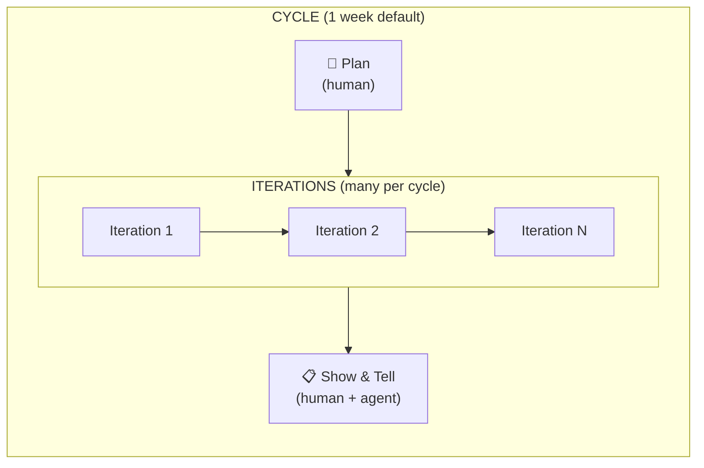
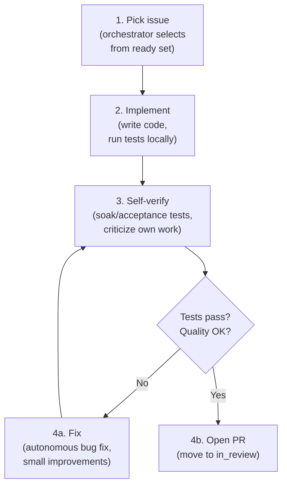

# Template: Product Cycle (Sprint)

Defines the sprint cycle for human+agent teams. A cycle is a time-boxed period (default: 1 week) containing multiple **iterations** — short loops where agents autonomously pick up, work on, and complete issues. Humans set direction; agents execute; both reflect at the end.

Related templates: [issue-lifecycle.md](issue-lifecycle.md), [task-planning.md](task-planning.md), [orchestration.md](orchestration.md), [pr-review.md](pr-review.md).

---

## 1. Cycle Structure



| Phase | Who | Duration | What happens |
|-------|-----|----------|-------------|
| **Plan** | Human (agent assists) | Start of cycle | Prioritize backlog, define issues with acceptance criteria, set cycle goals |
| **Iterations** | Agent (autonomous) | Bulk of cycle | Agents pick up issues, implement, test, open PRs — multiple iterations per cycle |
| **Show & Tell** | Human + agent | End of cycle | Demo what shipped, surface suggestions, seek clarifications, plan next cycle |

---

## 2. Plan Phase

The human sets direction. Agents MAY assist with decomposition and estimation.

1. Human reviews backlog and moves priority issues to `todo`.
2. Each `todo` issue MUST have acceptance criteria before agents can claim it.
3. Human MAY use `gctl task decompose` to break large issues into sub-tasks.
4. Human sets cycle goals — a short list of what MUST ship this cycle.

```sh
gctl board list --status backlog
gctl board move BACK-42 todo
gctl board move BACK-43 todo
gctl task decompose BACK-44 --sub "Schema migration" --sub "API endpoint" --sub "Tests"
```

---

## 3. Iteration Phase (Agent-Autonomous)

An iteration is one pass of the agent autonomy loop. A cycle contains many iterations — each iteration targets one issue or a small batch of related issues.

### Agent Autonomy Loop



### 3.1 Pick Up Issues

The orchestrator (see [orchestration.md](orchestration.md)) selects the next issue from the ready set:

1. Issue MUST be `todo` with zero unresolved blockers.
2. Issue MUST have acceptance criteria.
3. Orchestrator claims the issue, transitions to `in_progress`, and launches the agent.

Agents MUST NOT cherry-pick issues. The orchestrator enforces priority order, concurrency limits, and per-state slot limits.

### 3.2 Implement

The agent works autonomously toward the acceptance criteria:

1. Read relevant specs and source code before writing.
2. Write code, following existing patterns and conventions.
3. Run `cargo test` / `bun run test` continuously during implementation.
4. Keep changes focused — one issue, one concern.

### 3.3 Self-Verify (Criticize Own Work)

Before opening a PR, the agent MUST verify its own work:

1. **Run the full test suite.** `cargo test` and any relevant integration tests MUST pass.
2. **Run soak/acceptance tests** where applicable — e.g., load tests for API changes, browser tests for UI changes.
3. **Self-review the diff.** Read the diff as if reviewing someone else's code. Look for:
   - Missing edge cases
   - Broken invariants (see `specs/principles.md`)
   - Unnecessary complexity
   - Missing or stale specs
4. **Log what changed.** Update relevant specs if the implementation changes behavior documented in `specs/`. Add a note in the PR body listing which spec files were updated and why.

### 3.4 Autonomous Fixes

For bug fixes and small improvements discovered during self-verification:

1. Fix the issue directly — do NOT wait for human approval on trivial fixes.
2. **Track the work.** Create a task or issue in gctl-board so the fix is visible:
   ```sh
   gctl task create "Fix: off-by-one in pagination query"
   gctl task done TASK-N --note "Found during self-review of BACK-42"
   ```
3. **Update specs minimally.** If the fix changes documented behavior, update the relevant spec file. Keep the change minimal — match the scope of the fix.
4. Re-run verification after the fix.

### 3.5 Open PR

When self-verification passes:

1. Open a PR referencing the issue (e.g., `Closes #42`).
2. Issue auto-transitions to `in_review`.
3. PR body MUST include:
   - What changed and why
   - Which spec files were updated (if any)
   - Test results summary
4. The agent's iteration for this issue is complete. The orchestrator MAY dispatch the agent to the next issue while the PR awaits review.

---

## 4. Show & Tell Phase

At the end of the cycle, human and agent reflect on what was accomplished.

### 4.1 Demo What Shipped

The agent produces a cycle summary:

```sh
gctl analytics overview             # cost, sessions, error rate
gctl board list --status done       # issues completed this cycle
gctl board list --status in_review  # issues still awaiting review
```

The summary MUST include:

1. **Issues completed** — list with titles, PR links, and cost.
2. **Issues still in progress** — what is blocking completion.
3. **Metrics** — total cost, total tokens, sessions count, error rate.
4. **Spec changes** — which spec files were added or updated during the cycle.

### 4.2 Suggestions

The agent SHOULD surface suggestions based on patterns observed during the cycle:

1. **Spec gaps** — areas where specs were missing or ambiguous and the agent had to make assumptions.
2. **Recurring issues** — patterns of failures or rework that indicate a systemic problem.
3. **Improvement opportunities** — code quality, test coverage, or process improvements.
4. **Backlog candidates** — new issues to add based on work done this cycle.

Format suggestions as actionable proposals, not vague observations:

```
### Suggestion: Add integration test for session cost aggregation
**Why:** During BACK-42, I found that session cost totals can drift when spans
arrive out of order. The current unit tests don't cover this.
**Proposed action:** Add an integration test in `crates/gctl-otel/tests/` that
inserts spans in random order and asserts aggregate correctness.
```

### 4.3 Seek Clarifications

The agent MUST surface unresolved questions — design decisions that were deferred or ambiguous:

1. Decisions made under uncertainty — flag what was assumed and ask if the assumption is correct.
2. Scope questions — work that was not done because it was unclear whether it was in scope.
3. Conflicting specs — cases where two specs disagreed and the agent chose one.

### 4.4 Plan Next Cycle

Based on the Show & Tell:

1. Human reviews suggestions, approves or rejects.
2. Human reviews open PRs and merges or requests changes.
3. Human updates backlog priorities for the next cycle.
4. New issues from suggestions are added to backlog.
5. Next cycle begins with a fresh Plan phase.

---

## 5. Iteration Cadence

A cycle contains many iterations. The iteration cadence is determined by the orchestrator's poll interval and the complexity of issues.

| Cycle Length | Typical Iterations | Issue Size |
|-------------|-------------------|------------|
| 1 week | 10-30 | Small (1-4 hours agent time) |
| 2 weeks | 20-60 | Mix of small and medium |

### What counts as one iteration

1. Agent picks up an issue.
2. Agent implements, self-verifies, and opens a PR (or gets stuck and requests help).
3. One iteration = one issue attempted.

An agent MAY complete multiple iterations per day. The orchestrator manages concurrency — multiple agents MAY work in parallel on different issues.

---

## 6. Agent Responsibilities Summary

| Responsibility | When | Autonomous? |
|---------------|------|-------------|
| Pick up next issue from ready set | Each iteration | Yes (orchestrator selects) |
| Implement to acceptance criteria | Each iteration | Yes |
| Run tests, soak tests, acceptance tests | Before opening PR | Yes |
| Self-review and criticize own work | Before opening PR | Yes |
| Fix trivial bugs found during self-review | During iteration | Yes |
| Create tasks/issues for discovered work | During iteration | Yes |
| Update specs when behavior changes | During iteration | Yes |
| Open PR with summary | End of iteration | Yes |
| Produce cycle summary | Show & Tell | Yes |
| Surface suggestions and clarifications | Show & Tell | Yes |
| Prioritize backlog | Plan phase | No (human decides) |
| Merge PRs | After review | No (human approves) |
| Set cycle goals | Plan phase | No (human decides) |

---

## 7. CLI Surface (Template)

Applications SHOULD expose these commands for cycle management:

```sh
# Cycle management
gctl cycle start --length 1w --goals "Ship rate limiting" "Fix auth bug"
gctl cycle status                    # current cycle progress
gctl cycle summary                   # generate Show & Tell report

# During iterations (agent uses existing commands)
gctl board list --status todo        # see what's ready
gctl board assign BACK-42 --agent claude-code
gctl board move BACK-42 in_progress
gctl tree <session_id>               # inspect own trace
gctl analytics cost                  # check spend

# Track autonomous fixes
gctl task create "Fix: <description>"
gctl task done TASK-N --note "Found during BACK-42"
```
