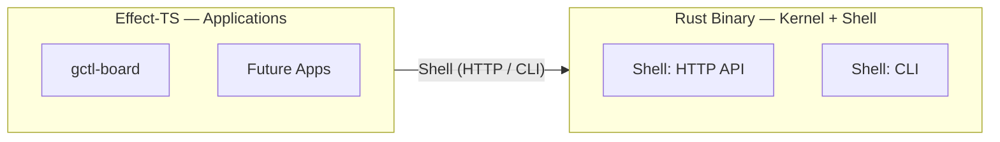

# Application Components (Effect-TS — `packages/`)

Applications are stateful programs that orchestrate kernel primitives through the shell.

## Package Map

| Package | Responsibility | Key Dependencies |
|---------|---------------|-----------------|
| `gctl-board` | Kanban schemas, services, domain logic | `effect`, `@effect/schema`, `@effect/platform` |

## Runtime Model



Applications communicate with the kernel via the shell (HTTP API on `:4318` or `gctl` CLI subprocess). They MUST NOT import Rust kernel crates directly.

## Package Structure

```
packages/gctl-{app}/
├── src/
│   ├── schema/        # Domain: Schema.Class types, branded IDs
│   ├── services/      # Ports: Context.Tag service interfaces
│   ├── adapters/      # Kernel HTTP adapter, storage adapter
│   ├── domain/        # Business rules, state machines (pure, no I/O)
│   └── index.ts
├── test/              # vitest tests
└── package.json
```

## Key Patterns

- **`Schema.Class`** for domain types (immutable, equality by value)
- **`Schema.TaggedError`** for typed domain errors
- **`Context.Tag`** for service ports (testable via `Layer` substitution)
- **`Layer.provide`** for dependency injection — wire at the edge, test with in-memory adapters
- **`Effect.gen`** for all effectful operations
- App tables MUST use namespaced prefixes (`board_*`, `eval_*`)

## gctl-board

- **Domain schemas**: `src/schema/` — Issue, Board, Project as `Schema.Class` types
- **Service ports**: `src/services/` — `BoardService`, `DependencyResolver` as `Context.Tag` services
- **Communication**: Calls Rust kernel via shell (HTTP API or CLI subprocess)

## Integration with Rust Daemon

Two modes:

1. **Sidecar process** — TS board service runs alongside the Rust daemon. Rust CLI delegates `gctl board *` commands to the TS HTTP API. Shared DuckDB (TS writes board tables, Rust writes kernel tables).
2. **Embedded via HTTP** — Board service runs as part of `gctl serve`. Rust daemon proxies `/api/board/*` to the TS process.

## Each App Can Be Its Own Codebase

Applications under `packages/` are independent npm packages. They depend on the kernel only through the shell. This means:

- An app can be extracted to its own repo and still work — it just talks to `gctl` over HTTP
- Apps MUST NOT join across other apps' tables — cross-app data flows through kernel IPC
- Each app declares its own `package.json`, `tsconfig.json`, and test setup

## Testing

- vitest + `Schema.decodeUnknownSync` for schema validation
- Mock `KernelClient` layer for isolated service tests
- See [style.md](style.md) for Effect-TS testing patterns
