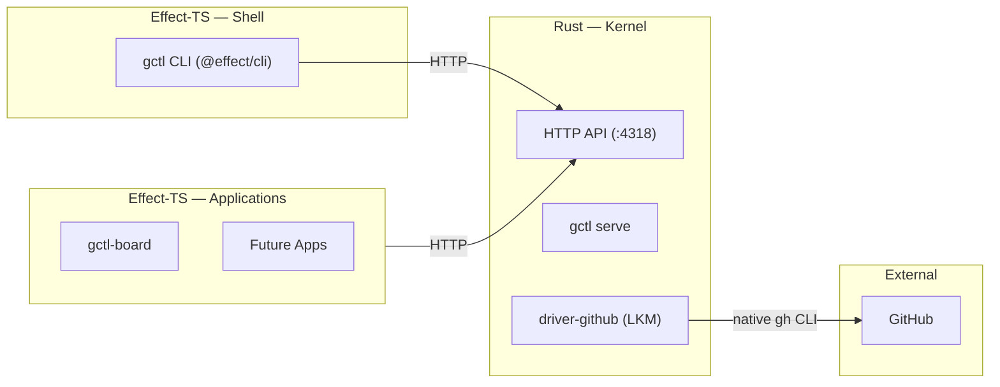

# Application Components (Effect-TS — `apps/`)

Applications are stateful programs that orchestrate kernel primitives through the shell.

## Package Map

| Package | Responsibility | Key Dependencies |
|---------|---------------|-----------------|
| `gctl-board` | Kanban schemas, services, domain logic | `effect`, `@effect/schema`, `@effect/platform` |

## Runtime Model



Applications and the shell communicate with the kernel via the HTTP API on `:4318`. External services (GitHub, Linear, etc.) are accessed through kernel drivers (LKMs) — the shell and apps MUST NOT call external APIs directly. Apps MUST NOT import Rust kernel crates directly.

## Package Structure

```
apps/gctl-{app}/
├── src/
│   ├── schema/        # Domain: Schema.Class types, branded IDs
│   ├── services/      # Ports: Context.Tag service interfaces
│   ├── adapters/      # Kernel HTTP adapter, storage adapter
│   ├── domain/        # Business rules, state machines (pure, no I/O)
│   └── index.ts
├── test/              # vitest tests
└── package.json
```

## Key Patterns

- **`Schema.Class`** for domain types (immutable, equality by value)
- **`Schema.TaggedError`** for typed domain errors
- **`Context.Tag`** for service ports (testable via `Layer` substitution)
- **`Layer.provide`** for dependency injection — wire at the edge, test with in-memory adapters
- **`Effect.gen`** for all effectful operations
- **Prefer `@effect/platform` HttpClient over raw `fetch()` — including in Worker runtime tests.** HTTP adapters and tests use `HttpClient`, `HttpClientResponse`, `HttpBody` from `@effect/platform`. Provide `FetchHttpClient.layer` at the edge. In Cloudflare Worker tests (`@cloudflare/vitest-pool-workers`), do not call `SELF.fetch` directly — adapt it as the underlying fetch via `FetchHttpClient.Fetch` so tests exercise the same Effect HTTP path as production. Example:

  ```ts
  import { FetchHttpClient, HttpClient } from "@effect/platform"
  import { Effect, Layer } from "effect"
  import { SELF } from "cloudflare:test"

  const WorkerFetch = Layer.succeed(
    FetchHttpClient.Fetch,
    ((input, init) => SELF.fetch(input as RequestInfo, init)) as typeof fetch,
  )
  export const TestHttpClient = FetchHttpClient.layer.pipe(Layer.provide(WorkerFetch))
  ```

  Tests then use `HttpClient.HttpClient` inside `Effect.gen`, provided with `TestHttpClient`. Raw `SELF.fetch` calls are permitted only in a single shared test fixture that defines this layer.
- App tables MUST use namespaced prefixes (`board_*`, `eval_*`)

## gctl-board

- **Domain schemas**: `src/schema/` — Issue, Board, Project as `Schema.Class` types
- **Service ports**: `src/services/` — `BoardService`, `DependencyResolver` as `Context.Tag` services
- **Communication**: Calls Rust kernel via shell (HTTP API or CLI subprocess)

## Integration with Kernel

Applications talk to the Rust kernel daemon via the HTTP API on `:4318`. The Effect-TS shell CLI (`shell/gctl-shell/`) delegates app-specific commands (e.g., `gctl board`) to the corresponding app's service layer.

## Each App Can Be Its Own Codebase

Applications under `apps/` are independent npm packages. They depend on the kernel only through the HTTP API. This means:

- An app can be extracted to its own repo and still work — it just talks to `gctl` over HTTP
- Apps MUST NOT join across other apps' tables — cross-app data flows through kernel IPC
- Each app declares its own `package.json`, `tsconfig.json`, and test setup

## Testing

- vitest + `Schema.decodeUnknownSync` for schema validation
- Mock `KernelClient` layer for isolated service tests
- **Worker runtime tests** (`@cloudflare/vitest-pool-workers`) drive the Worker handler through `@effect/platform` `HttpClient` backed by a `FetchHttpClient.Fetch` layer that wraps `SELF.fetch` (see pattern above). Keep the raw `SELF.fetch` call behind one shared fixture; individual tests should only see `HttpClient`.
- See [style.md](style.md) for Effect-TS testing patterns
