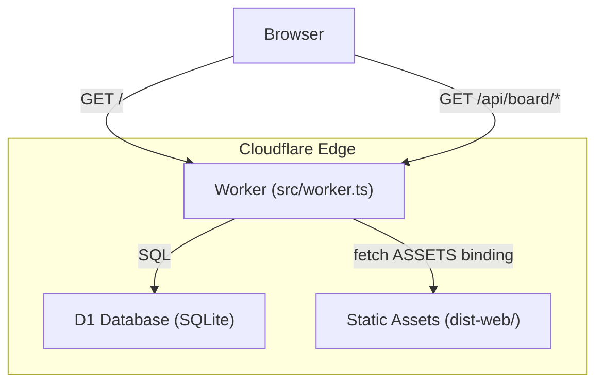
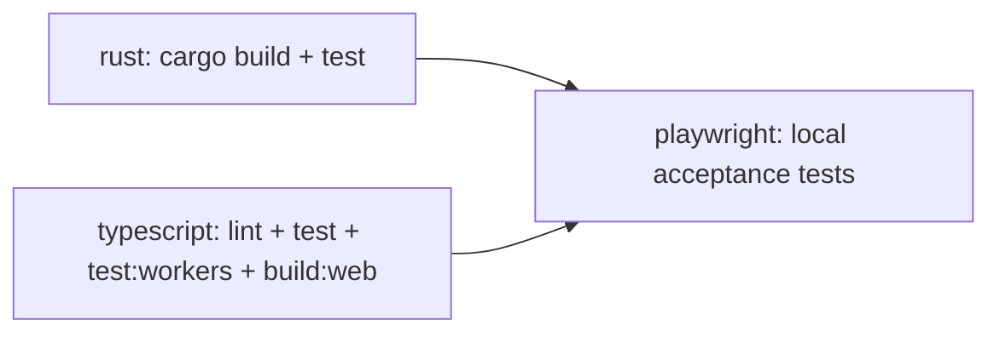

# gctrl-board Cloudflare Deployment

## Overview

gctrl-board deploys to **Cloudflare Workers** as a unified origin: a single Worker serves both the API (`/api/*`) and the static SPA frontend. Persistence uses **Cloudflare D1** (SQLite at the edge).



## Architecture: Two Runtimes

gctrl-board has two distinct runtime modes that share the same domain model:

| Mode | Runtime | Storage | API Access |
|------|---------|---------|------------|
| **Local dev** | Vite dev server + Rust kernel daemon | DuckDB (via kernel HTTP API on `:4318`) | Vite proxy `/api` → kernel |
| **Cloud deploy** | Cloudflare Worker | D1 (SQLite, via Worker binding) | Worker routes `/api/*` directly |

The **cloud Worker is self-contained** — it does not call the Rust kernel. It implements the board API routes directly using Effect-TS programs against the D1 binding. This is intentional: the board's cloud deployment is an edge-native app, not a proxy to the kernel daemon.

## Worker Entry Point (`src/worker.ts`)

The Worker `fetch` handler routes requests in order:

1. **`/api/*`** — matched against a route table of Effect programs. Each handler receives a `D1Client` (Effect `Context.Tag`) and returns `Effect<Response, D1Error, D1Client>`. Errors are caught at the boundary and mapped to JSON error responses.
2. **Static assets** — delegated to the `ASSETS` binding (Cloudflare Workers Static Assets).
3. **SPA fallback** — non-asset 404s serve `/index.html` for client-side routing.

### API Routes

| Method | Path | Handler |
|--------|------|---------|
| `GET` | `/api/board/projects` | List all projects |
| `POST` | `/api/board/projects` | Create project |
| `GET` | `/api/board/issues` | List issues (filterable by `project_id`, `status`, `assignee_id`, `label`) |
| `GET` | `/api/board/issues/:id` | Get single issue |
| `POST` | `/api/board/issues` | Create issue (auto-increments project counter for ID) |
| `POST` | `/api/board/issues/:id/move` | Change issue status |
| `POST` | `/api/board/issues/:id/assign` | Assign issue |
| `POST` | `/api/board/issues/:id/comment` | Add comment |
| `GET` | `/api/board/issues/:id/comments` | List comments |
| `GET` | `/api/board/issues/:id/events` | List issue events |
| `POST` | `/api/board/issues/:id/link-session` | Link session to issue |
| `GET` | `/api/inbox/stats` | Inbox stats (stub) |

## D1 Database

### Schema (`migrations/0001_init.sql`)

Four tables, all using `TEXT` primary keys (UUIDs):

- **`projects`** — `id`, `name`, `key` (unique), `counter`, `github_repo`, `created_at`
- **`issues`** — `id` (`{KEY}-{counter}`), `project_id` (FK), status/priority/assignee fields, JSON array columns (`labels`, `session_ids`, `pr_numbers`, `blocked_by`, `blocking`, `acceptance_criteria`) stored as `TEXT`
- **`comments`** — `id`, `issue_id` (FK), author fields, `body`, `session_id`
- **`issue_events`** — `id`, `issue_id` (FK), `event_type`, actor fields, `data` (JSON `TEXT`)

Indexes on `issues(project_id)`, `issues(status)`, `comments(issue_id)`, `issue_events(issue_id)`.

### Migrations

Applied via `wrangler d1 migrations apply`. Migration directory: `apps/gctrl-board/migrations/`.

## D1Client (Effect Port)

`src/d1.ts` defines `D1Client` as an Effect `Context.Tag` wrapping the raw `D1Database` binding:

- `query(sql, ...binds)` — returns all rows
- `first<T>(sql, ...binds)` — returns first row or `null`
- `batch(stmts)` — atomic batch of prepared statements
- `run(sql, ...binds)` — single mutation

`makeD1Client(db)` constructs the implementation from the Worker's `env.DB` binding. Errors are wrapped as `D1Error` (a `Schema.TaggedError`).

## Wrangler Configuration (`wrangler.toml`)

```toml
name = "gctrl-board"
compatibility_date = "2025-04-01"
compatibility_flags = ["nodejs_compat"]
main = "src/worker.ts"

[assets]
directory = "dist-web"
binding = "ASSETS"

[assets.serving]
not_found_handling = "single-page-application"

[[d1_databases]]
binding = "DB"
database_name = "gctrl-board-db"
database_id = "2173a9e0-f901-4d76-9f26-71f532b0eda7"
migrations_dir = "migrations"
```

Key flags:
- **`nodejs_compat`** — enables Node.js built-in module polyfills in the Worker runtime
- **`not_found_handling = "single-page-application"`** — serves `index.html` for unmatched static asset paths

## CI/CD Pipeline

### Design Principle: Depot for Heavy Builds, Cloudflare for Everything Else

CI uses two execution environments to balance cost and speed:

| Environment | Runner | Best For |
|-------------|--------|----------|
| **Depot** (`depot-ubuntu-24.04`) | Persistent-cache VM runners | Rust compilation, Cargo test, Playwright with local kernel — tasks that need filesystem, native toolchains, or long-running processes |
| **Cloudflare** (Workers, D1, Browser Rendering) | Edge V8 / managed services | Unit tests in production runtime (`@cloudflare/vitest-pool-workers`), preview deploys, D1 migrations, CDP-based acceptance tests, post-deploy health checks, synthetic monitoring |

**Shift work to Cloudflare when possible.** Depot runners bill by minute with persistent caches (no cold Cargo downloads). Cloudflare Workers are free or near-free for CI tasks. The goal is to keep Depot usage to the minimum set of jobs that genuinely need a full Linux VM (Rust builds, local kernel binary), and push everything else to Cloudflare's edge.

#### What runs on Cloudflare

- **Unit & edge testing** (implemented) — board Worker tests run via `@cloudflare/vitest-pool-workers` in the same V8 runtime they deploy to, not a generic Node.js runner (`pnpm test:workers` / `vitest.config.workers.ts`). This catches runtime compat issues (D1 bindings, `nodejs_compat` flags) that Node.js-based tests miss. Runs in the `typescript` CI job.
- **Preview deploys** — every PR gets a preview Worker (`--env preview`) with its own D1 database. The `ensure-preview-d1.mjs` script provisions the D1 database idempotently.
- **D1 migrations** — `wrangler d1 migrations apply` runs against the remote D1 database before each deploy.
- **Browser Rendering acceptance tests** — Playwright connects to Cloudflare Browser Rendering via Chrome DevTools Protocol (CDP over WSS). Tests run against the deployed preview Worker — no local Chromium install, no Playwright browser binaries on the runner.
- **Post-deploy health checks** — curl-based retries against the deployed URL.
- **Synthetic monitoring** (future) — Cron Triggers on Workers to ping deployed apps from global edge locations.

#### What stays on Depot

- **Rust kernel build + test** — `cargo build --workspace` and `cargo test --workspace` need a Linux VM with Rust toolchain. Depot's persistent cache eliminates cold Cargo registry downloads.
- **Playwright with local kernel** — acceptance tests that need the Rust kernel binary (OTel ingestion, filesystem markdown sync) run against a local kernel process on the Depot runner.
- **TypeScript lint + test + build** — runs on Depot because it uploads `board-web-dist` as an artifact consumed by downstream jobs. Could be migrated to Cloudflare Workers if artifact passing is solved.

### CI (`.github/workflows/ci.yml`)

Three jobs on `depot-ubuntu-24.04`:



1. **`rust`** — builds and tests the kernel workspace, uploads the `gctrl` binary as an artifact. No explicit Cargo cache step — Depot runners provide persistent build caches.
2. **`typescript`** — installs deps (root + board + shell), runs Biome lint, tests shell + board, runs `test:workers` (Miniflare V8 isolate), runs `build:web`, uploads `dist-web/` as artifact.
3. **`playwright`** — downloads kernel binary + web assets, runs full Playwright acceptance test suite against the local kernel + Vite dev server. Covers all tests including OTel ingestion and markdown sync.

All jobs use a shared composite action (`.github/actions/setup-node`) for Node.js + pnpm setup, and a single root `pnpm install` resolves the full workspace (`pnpm-workspace.yaml`).

### Acceptance Test Modes

Playwright supports two execution modes configured via environment variables:

| Mode | Trigger | Browser | Backend | Tests Run |
|------|---------|---------|---------|-----------|
| **Local** (default) | `playwright` job | Local Chromium (installed via `playwright install`) | Rust kernel `:memory:` + Vite proxy | All 6 spec files |
| **Remote CDP** | `acceptance-cdp` job | Cloudflare Browser Rendering (CDP over WSS) | Deployed preview Worker + D1 | 4 spec files (excludes `agent-integration`, `markdown-sync`) |

Environment variables for remote CDP mode:

| Variable | Purpose |
|----------|---------|
| `CDP_ENDPOINT` | WSS URL to Cloudflare Browser Rendering (`wss://api.cloudflare.com/client/v4/accounts/{id}/browser-rendering/devtools/browser?keep_alive=600000`) |
| `CF_API_TOKEN` | Cloudflare API token with `Browser Rendering - Edit` permission |
| `PREVIEW_URL` | Deployed preview Worker URL |

When `CDP_ENDPOINT` is set, `playwright.config.ts` skips `webServer` startup (no local kernel/Vite), uses `PREVIEW_URL` as `baseURL`, and the test fixture connects via `chromium.connectOverCDP()` instead of launching a local browser.

### Preview D1 Provisioning

The preview environment uses a placeholder `database_id = "preview"` in `wrangler.toml`. Before each preview deploy, `scripts/ensure-preview-d1.mjs` runs to:

1. List existing D1 databases via `wrangler d1 list --json`
2. Create `gctrl-board-preview-db` if it doesn't exist
3. Patch `wrangler.toml` with the real database UUID

This handles wrangler's mixed stdout (telemetry banners before JSON) by extracting the JSON array/object from the raw output using Node.js.

### Deploy (`.github/workflows/deploy.yml`)

Three jobs:

- **`preview`** (PR only) — provisions preview D1, runs migrations, deploys with `--env preview`, comments the preview URL on the PR. Outputs `deployment-url` for downstream jobs.
- **`acceptance-cdp`** (PR only, `needs: preview`) — health-checks the preview URL, cleans D1 test data, runs Playwright acceptance tests using Cloudflare Browser Rendering (CDP over WSS). Skips tests requiring kernel-only endpoints (`agent-integration`, `markdown-sync`). No browser install needed.
- **`deploy`** (main only) — triggered by `workflow_run` after CI succeeds, or `workflow_dispatch` for manual deploy. Downloads `board-web-dist` artifact from CI, runs `wrangler deploy`, health checks the deployed URL.

### Required Secrets

| Secret | Purpose |
|--------|---------|
| `CLOUDFLARE_API_TOKEN` | Wrangler deploy, D1 provisioning/migrations |
| `CLOUDFLARE_ACCOUNT_ID` | Cloudflare account identifier |
| `CF_BROWSER_RENDERING_TOKEN` | Cloudflare API token with `Browser Rendering - Edit` permission for CDP acceptance tests |

### Future: Further Cloudflare Shift

Opportunities to move more CI work off Depot runners:

- **CI orchestration Worker** — a Worker receives push/PR webhooks, inspects changed files (`apps/gctrl-board/**` vs `kernel/**`), and triggers only the relevant GitHub Actions workflows. Avoids running the full matrix on doc-only changes.
- **Global E2E smoke tests** — Cron Trigger Workers that run lightweight health checks from multiple edge locations after each production deploy.
- **Artifact-free TypeScript CI** — if Cloudflare can host build artifacts (R2 or Workers KV), the TypeScript lint/test/build job can move entirely to a Worker, eliminating the Depot runner for that job.

## Local Development

```sh
# Start Vite dev server (SPA + proxy to kernel)
cd apps/gctrl-board && pnpm dev

# Vite proxies /api/* → http://localhost:4318 (kernel daemon)
# Override kernel port: GCTRL_KERNEL_PORT=5000 pnpm dev
```

For local D1 testing (without the Rust kernel):

```sh
# Start Worker locally with Miniflare (includes local D1)
cd apps/gctrl-board && wrangler dev
```

## Local vs Cloud Storage

| Concern | Local (kernel mode) | Cloud (Worker mode) |
|---------|-------------------|-------------------|
| Storage engine | DuckDB (embedded, kernel-owned) | D1 (SQLite, Cloudflare-managed) |
| Schema location | Kernel crate (`gctrl-storage`) | `migrations/0001_init.sql` |
| Table prefix | `board_*` (namespaced in kernel) | No prefix (Worker owns the database) |
| Access pattern | Shell/app → HTTP API `:4318` → DuckDB | Worker → D1 binding → SQLite |
| JSON columns | DuckDB native JSON type | `TEXT` columns with `JSON.parse` at app layer |

The schemas are semantically equivalent but not identical — D1 uses `TEXT` for JSON arrays while the kernel's DuckDB uses native JSON columns. The domain model (`src/schema/`) is shared.
