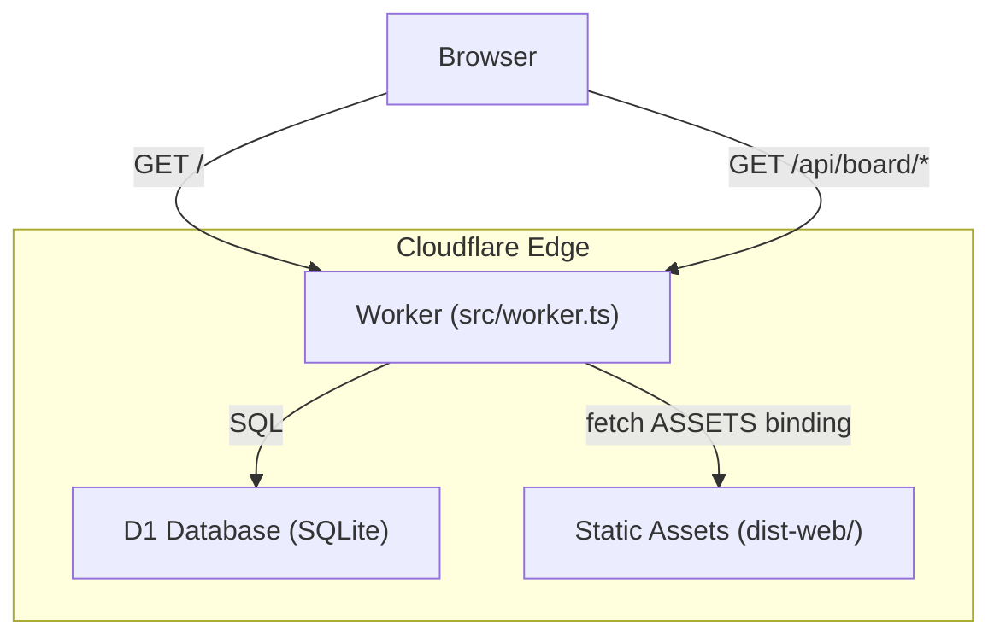
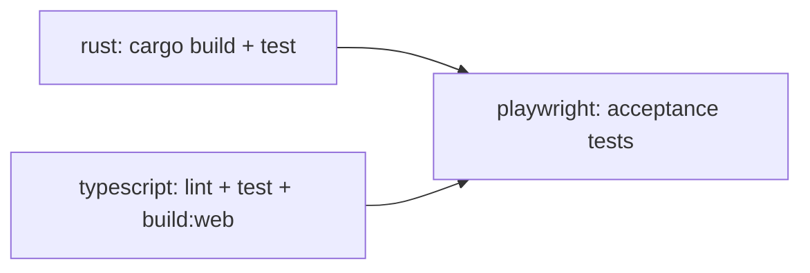

# gctl-board Cloudflare Deployment

## Overview

gctl-board deploys to **Cloudflare Workers** as a unified origin: a single Worker serves both the API (`/api/*`) and the static SPA frontend. Persistence uses **Cloudflare D1** (SQLite at the edge).



## Architecture: Two Runtimes

gctl-board has two distinct runtime modes that share the same domain model:

| Mode | Runtime | Storage | API Access |
|------|---------|---------|------------|
| **Local dev** | Vite dev server + Rust kernel daemon | DuckDB (via kernel HTTP API on `:4318`) | Vite proxy `/api` → kernel |
| **Cloud deploy** | Cloudflare Worker | D1 (SQLite, via Worker binding) | Worker routes `/api/*` directly |

The **cloud Worker is self-contained** — it does not call the Rust kernel. It implements the board API routes directly using Effect-TS programs against the D1 binding. This is intentional: the board's cloud deployment is an edge-native app, not a proxy to the kernel daemon.

## Worker Entry Point (`src/worker.ts`)

The Worker `fetch` handler routes requests in order:

1. **`/api/*`** — matched against a route table of Effect programs. Each handler receives a `D1Client` (Effect `Context.Tag`) and returns `Effect<Response, D1Error, D1Client>`. Errors are caught at the boundary and mapped to JSON error responses.
2. **Static assets** — delegated to the `ASSETS` binding (Cloudflare Workers Static Assets).
3. **SPA fallback** — non-asset 404s serve `/index.html` for client-side routing.

### API Routes

| Method | Path | Handler |
|--------|------|---------|
| `GET` | `/api/board/projects` | List all projects |
| `POST` | `/api/board/projects` | Create project |
| `GET` | `/api/board/issues` | List issues (filterable by `project_id`, `status`, `assignee_id`, `label`) |
| `GET` | `/api/board/issues/:id` | Get single issue |
| `POST` | `/api/board/issues` | Create issue (auto-increments project counter for ID) |
| `POST` | `/api/board/issues/:id/move` | Change issue status |
| `POST` | `/api/board/issues/:id/assign` | Assign issue |
| `POST` | `/api/board/issues/:id/comment` | Add comment |
| `GET` | `/api/board/issues/:id/comments` | List comments |
| `GET` | `/api/board/issues/:id/events` | List issue events |
| `POST` | `/api/board/issues/:id/link-session` | Link session to issue |
| `GET` | `/api/inbox/stats` | Inbox stats (stub) |

## D1 Database

### Schema (`migrations/0001_init.sql`)

Four tables, all using `TEXT` primary keys (UUIDs):

- **`projects`** — `id`, `name`, `key` (unique), `counter`, `github_repo`, `created_at`
- **`issues`** — `id` (`{KEY}-{counter}`), `project_id` (FK), status/priority/assignee fields, JSON array columns (`labels`, `session_ids`, `pr_numbers`, `blocked_by`, `blocking`, `acceptance_criteria`) stored as `TEXT`
- **`comments`** — `id`, `issue_id` (FK), author fields, `body`, `session_id`
- **`issue_events`** — `id`, `issue_id` (FK), `event_type`, actor fields, `data` (JSON `TEXT`)

Indexes on `issues(project_id)`, `issues(status)`, `comments(issue_id)`, `issue_events(issue_id)`.

### Migrations

Applied via `wrangler d1 migrations apply`. Migration directory: `apps/gctl-board/migrations/`.

## D1Client (Effect Port)

`src/d1.ts` defines `D1Client` as an Effect `Context.Tag` wrapping the raw `D1Database` binding:

- `query(sql, ...binds)` — returns all rows
- `first<T>(sql, ...binds)` — returns first row or `null`
- `batch(stmts)` — atomic batch of prepared statements
- `run(sql, ...binds)` — single mutation

`makeD1Client(db)` constructs the implementation from the Worker's `env.DB` binding. Errors are wrapped as `D1Error` (a `Schema.TaggedError`).

## Wrangler Configuration (`wrangler.toml`)

```toml
name = "gctl-board"
compatibility_date = "2025-04-01"
compatibility_flags = ["nodejs_compat"]
main = "src/worker.ts"

[assets]
directory = "dist-web"
binding = "ASSETS"

[assets.serving]
not_found_handling = "single-page-application"

[[d1_databases]]
binding = "DB"
database_name = "gctl-board-db"
database_id = "2173a9e0-f901-4d76-9f26-71f532b0eda7"
migrations_dir = "migrations"
```

Key flags:
- **`nodejs_compat`** — enables Node.js built-in module polyfills in the Worker runtime
- **`not_found_handling = "single-page-application"`** — serves `index.html` for unmatched static asset paths

## CI/CD Pipeline

### CI (`.github/workflows/ci.yml`)

Three jobs:



1. **`rust`** — builds and tests the kernel, uploads the `gctl` binary as an artifact
2. **`typescript`** — installs deps (root + board + shell), runs Biome lint, tests shell + board, runs `build:web`, uploads `dist-web/` as artifact
3. **`playwright`** — downloads both artifacts, runs acceptance tests against the kernel + Vite dev server

All jobs use a shared composite action (`.github/actions/setup-node`) for Node.js + pnpm setup, and a single root `pnpm install` resolves the full workspace (`pnpm-workspace.yaml`).

### Deploy (`.github/workflows/deploy.yml`)

Triggered by `workflow_run` (after CI succeeds on main) or `workflow_dispatch` (manual). Single job:

1. Checkout + setup via composite action
2. Download `board-web-dist` artifact from CI run (skips rebuild), or build from scratch on manual dispatch
3. `cloudflare/wrangler-action@v3` — runs `wrangler deploy` from `apps/gctl-board/`
4. Post-deploy health check — retries up to 3 times against the deployed URL

Credentials: `CLOUDFLARE_API_TOKEN` and `CLOUDFLARE_ACCOUNT_ID` from GitHub secrets.

Concurrency group `deploy-board` with `cancel-in-progress: false` serializes deploys. Deploy is skipped if the triggering CI run failed.

## Local Development

```sh
# Start Vite dev server (SPA + proxy to kernel)
cd apps/gctl-board && pnpm dev

# Vite proxies /api/* → http://localhost:4318 (kernel daemon)
# Override kernel port: GCTL_KERNEL_PORT=5000 pnpm dev
```

For local D1 testing (without the Rust kernel):

```sh
# Start Worker locally with Miniflare (includes local D1)
cd apps/gctl-board && wrangler dev
```

## Local vs Cloud Storage

| Concern | Local (kernel mode) | Cloud (Worker mode) |
|---------|-------------------|-------------------|
| Storage engine | DuckDB (embedded, kernel-owned) | D1 (SQLite, Cloudflare-managed) |
| Schema location | Kernel crate (`gctl-storage`) | `migrations/0001_init.sql` |
| Table prefix | `board_*` (namespaced in kernel) | No prefix (Worker owns the database) |
| Access pattern | Shell/app → HTTP API `:4318` → DuckDB | Worker → D1 binding → SQLite |
| JSON columns | DuckDB native JSON type | `TEXT` columns with `JSON.parse` at app layer |

The schemas are semantically equivalent but not identical — D1 uses `TEXT` for JSON arrays while the kernel's DuckDB uses native JSON columns. The domain model (`src/schema/`) is shared.
