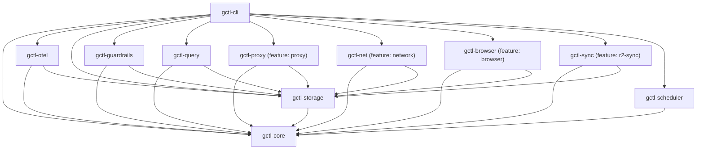
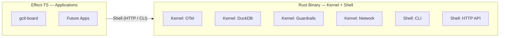

# Component Implementation

Concrete languages, frameworks, crate/package structure, and code patterns for each architectural layer. See `specs/architecture/README.md` for the high-level design; this document covers *how* each component is built.

---

## Crate & Package Map

### Rust Crates (`crates/`)

| Crate | Layer | Responsibility | Key Dependencies |
|-------|-------|---------------|-----------------|
| `gctl-core` | Domain | Types, errors, config, trait definitions (ports) | `thiserror`, `serde`, `chrono` |
| `gctl-storage` | Kernel | DuckDB embedded storage (11 tables), schema migrations | `duckdb` (bundled), `gctl-core` |
| `gctl-otel` | Kernel | OTel receiver, OTLP JSON ingestion, HTTP API (axum) | `axum`, `tokio`, `gctl-core`, `gctl-storage` |
| `gctl-guardrails` | Kernel | Policy engine (cost limits, loop detection) | `gctl-core`, `gctl-storage` |
| `gctl-proxy` | Kernel | MITM proxy, traffic logging (stub) | `hudsucker`, `gctl-core`, `gctl-storage` |
| `gctl-browser` | Kernel | CDP browser daemon, ref system, tab management | `gctl-core`, `gctl-storage` |
| `gctl-sync` | Kernel | R2 cloud sync, Parquet export (stub) | `arrow`, `parquet`, `gctl-core`, `gctl-storage` |
| `gctl-scheduler` | Kernel | Scheduler port + platform adapters (tokio, launchd, DO) | `tokio`, `gctl-core` |
| `gctl-cli` | Shell | CLI dispatcher (clap), routes to commands | `clap`, all kernel crates |
| `gctl-query` | Shell | Guardrailed DuckDB query executor | `gctl-core`, `gctl-storage` |
| `gctl-net` | Utility | Web fetch, crawl, readability extraction, compaction | `htmd`, `readability`, `scraper`, `url`, `gctl-core` |

### TypeScript Packages (`packages/`)

| Package | Layer | Responsibility | Key Dependencies |
|---------|-------|---------------|-----------------|
| `gctl-board` | Application | Kanban schemas, services, domain logic | `effect`, `@effect/schema`, `@effect/platform` |

### Crate Dependency Graph



---

## Internal Code Architecture (Kernel + Shell)

The Rust binary uses a layered dependency structure internally. Dependencies flow inward: Shell → Kernel → Domain, never reverse. This is the implementation-level view — for the OS-level layer model (with external apps, drivers, IPC), see [specs/architecture/os.md](../architecture/os.md).

> **Terminology:** "Adapter" in this section refers to internal kernel implementations (DuckDB, OTel receiver, etc.), not external app connectors. External app connectors are called **drivers** (e.g., `driver-linear`). See [specs/architecture/os.md § 5](../architecture/os.md) for the distinction.

### Domain Layer (`gctl-core`)

Pure types, errors, and business rules. No I/O dependencies.

- **Aggregates**: Session (with Span children), TrafficRecord
- **Value Objects**: SpanId, SessionId, TraceId (branded string newtypes)
- **Domain Types**: SpanType (Generation/Span/Event), SpanStatus, SessionStatus, PolicyDecision
- **Domain Errors**: `GctlError` variants via `thiserror` (Storage, Config, GuardrailViolation, etc.)

### Kernel Interface Traits (`gctl-core` traits + service interfaces)

Abstract interfaces defining how kernel talks to the outside:

- `DuckDbStore` methods as the storage interface
- `GuardrailPolicy` trait for composable policy chain
- `Scheduler` trait for deferred/recurring task execution (platform-specific implementations)
- `TrackerPort` trait for external app drivers (Linear, GitHub, Notion)
- `BoardService` / `DependencyResolver` (Effect-TS Context.Tag services)

### Kernel Implementations (kernel crates)

Concrete implementations wired at the edge — these are the kernel subsystems:

- `DuckDbStore` — DuckDB embedded storage (11 tables)
- OTel receiver — OTLP JSON ingestion pipeline via axum
- Guardrail policies — SessionBudgetPolicy, LoopDetectionPolicy, etc.
- Scheduler implementations — tokio timers (local), launchd (macOS), Durable Object Alarms (Cloudflare)
- Network — MITM proxy via hudsucker, traffic logging
- Browser — persistent Chromium daemon via CDP, ref system, tab management
- Sync — R2 cloud sync via arrow/parquet (stub)

### Shell Implementation

- **CLI dispatcher**: `clap` derive macros, modular subcommand files in `gctl-cli/src/commands/`
- **HTTP API**: `axum` router with 21+ endpoints, served on `:4318`
- **Query engine**: guardrailed DuckDB SQL access via `gctl-query`

### Application Implementation (gctl-board)

- **Runtime**: Effect-TS (`effect`, `@effect/schema`, `@effect/platform`)
- **Build**: `tsup` (ESM + DTS), `vitest` for tests
- **Domain schemas**: `src/schema/` — Issue, Board, Project as `Schema.Class` types
- **Service ports**: `src/services/` — `BoardService`, `DependencyResolver` as `Context.Tag` services
- **Communication**: Calls Rust kernel via shell (HTTP API or CLI subprocess)

---

## Monorepo Structure

```
gctrl/
├── crates/                    # Rust workspace
│   ├── gctl-core/             # Domain: types, errors, config
│   │
│   │  # --- Kernel (primitives) ---
│   ├── gctl-storage/          # Kernel: DuckDB embedded storage
│   ├── gctl-otel/             # Kernel: OTel receiver + HTTP API
│   ├── gctl-guardrails/       # Kernel: policy engine
│   ├── gctl-proxy/            # Kernel: MITM proxy (stub)
│   ├── gctl-browser/          # Kernel: CDP browser daemon
│   ├── gctl-sync/             # Kernel: R2 cloud sync (stub)
│   ├── gctl-scheduler/        # Kernel: scheduler port + adapters
│   │
│   │  # --- Shell (dispatcher + interface) ---
│   ├── gctl-cli/              # Shell: CLI dispatcher (clap)
│   ├── gctl-query/            # Shell: query executor
│   │  # (HTTP API lives in gctl-otel as axum routes)
│   │
│   │  # --- Utilities ---
│   └── gctl-net/              # Utility: web fetch, crawl, compaction
│
├── packages/                  # TypeScript packages
│   │  # --- Applications ---
│   └── gctl-board/            # App: Effect-TS kanban (schemas, services)
│       ├── src/schema/        # Domain: Issue, Board, Project schemas
│       ├── src/services/      # Ports: BoardService, DependencyResolver
│       └── test/              # vitest tests
├── specs/                     # Architecture and design specs
└── Request.md
```

See `specs/implementation/repo.md` for Nx orchestration, dual build system, and per-project config.

---

## Runtime Model: Rust + Effect-TS

gctl uses a dual-runtime approach, mirroring how Unix kernels are written in C while userspace tools use higher-level languages:

1. **Rust binary (`gctl`)** — The kernel and shell. Handles high-performance, low-latency concerns: OTel ingestion, DuckDB storage, MITM proxy, guardrails evaluation, CLI gateway, and HTTP API server. Compiled as a single static binary.
2. **Effect-TS packages** — Applications. Handle application-layer logic, schema validation, and higher-level orchestration (e.g., `gctl-board`). Effect-TS code communicates with the Rust kernel via the shell (HTTP API or CLI subprocess calls).



### When to use which runtime

| Concern | Runtime | Layer | Rationale |
|---------|---------|-------|-----------|
| Telemetry ingestion, storage, network | Rust | Kernel | Latency-sensitive, long-running daemon |
| Guardrails engine | Rust | Kernel | Needs direct DuckDB access |
| CLI gateway, HTTP API, query engine | Rust | Shell | Mediates all kernel access |
| Application domain logic | Effect-TS | Application | Faster iteration, richer type-level composition |
| Schema validation, service orchestration | Effect-TS | Application | Effect's `Schema`, `Layer`, and error channel |
| Web scraping, crawling | Rust | Utility | Performance, streaming, readability extraction |

---

## Scheduler Implementation

The scheduler is defined as a port (trait) in `gctl-core` with platform-specific adapters.

### Port

```rust
/// Kernel port — platform-agnostic scheduling interface
#[async_trait]
trait Scheduler {
    /// Schedule a one-shot task to fire after `delay`.
    async fn schedule_once(&self, id: TaskId, delay: Duration, payload: SchedulePayload) -> Result<()>;
    /// Schedule a recurring task at `interval`.
    async fn schedule_recurring(&self, id: TaskId, interval: Duration, payload: SchedulePayload) -> Result<()>;
    /// Cancel a scheduled task.
    async fn cancel(&self, id: TaskId) -> Result<()>;
    /// List active schedules.
    async fn list(&self) -> Result<Vec<ScheduledTask>>;
}
```

### Platform Adapters

| Platform | Adapter | How it works |
|----------|---------|-------------|
| **Cloudflare Workers** | Durable Object Alarm | Each scheduled task maps to a DO with `alarm()` handler. The alarm fires at the scheduled time and invokes the task payload via the Worker's fetch handler. Recurring tasks re-arm the alarm in the `alarm()` callback. |
| **macOS** | Automator / launchd | Schedules map to launchd plist files (or Automator workflows). `schedule_once` creates a one-shot launchd job; `schedule_recurring` creates a calendar-interval job. Tasks invoke `gctl` CLI commands when triggered. |
| **Local daemon** | tokio timers | Default adapter for `gctl serve`. Uses `tokio::time::sleep` / `tokio::time::interval` in-process. Tasks run as async tasks on the daemon's runtime. Lost on daemon restart (non-durable). |

### Design Constraints

1. The `Scheduler` port lives in `gctl-core` — no platform dependencies.
2. Adapters live in their own crates or behind feature flags (e.g., `gctl-scheduler-do`, `gctl-scheduler-launchd`).
3. The local tokio adapter is the default and MUST NOT require external setup.
4. Durable adapters (DO, launchd) persist schedules across restarts. The tokio adapter does not — applications MUST handle re-registration on startup if durability is needed.
5. Task payloads are serializable (JSON). They describe *what* to run, not *how* — typically a shell command or HTTP callback.

---

## Kernel Subsystem Details

### gctl-otel (OTel Receiver)

- `POST /v1/traces` — Accepts OTLP/HTTP JSON spans (protobuf planned)
- Parses OpenTelemetry `ExportTraceServiceRequest`
- Extracts semantic conventions: `ai.model.id`, `ai.tokens.input`, `ai.tokens.output`, `ai.tool.name`
- Maps to internal `Span` type, writes to DuckDB via `SpanStore`
- Session management: groups spans by `session.id` resource attribute, auto-creates sessions, updates aggregates (cost, tokens) on each span batch
- HTTP API: 21+ axum endpoints for sessions, analytics, trace tree, scoring

### gctl-proxy (MITM Proxy)

- Uses `hudsucker` for transparent HTTP(S) proxy
- Auto-generates CA cert on first run (`~/.local/share/gctl/ca/`)
- Logs every request/response to DuckDB `traffic` table
- Domain allowlist enforcement from config
- Rate limiting per-domain

### gctl-guardrails (Policy Engine)

Composable policy chain via trait objects:

```rust
pub struct GuardrailEngine {
    policies: Vec<Box<dyn GuardrailPolicy>>,
}
```

Built-in policies:
- `SessionBudgetPolicy` — halt if session cost exceeds threshold
- `LoopDetectionPolicy` — flag repeated identical tool calls
- `DiffSizePolicy` — alert on large diffs
- `CommandAllowlistPolicy` — block unauthorized commands
- `BranchProtectionPolicy` — prevent direct pushes to main

### gctl-query (Query Interface)

Three access modes:
1. **Pre-built queries** — Named commands with fixed SQL
2. **Natural language** (planned) — NL→SQL with column allowlist
3. **Raw SQL** (opt-in) — Gated by `allow_raw_sql` config

Output formats: `table`, `json`, `markdown`, `csv`

### gctl-sync (Sync Engine)

- Export DuckDB rows to Parquet via `arrow` + `parquet` crates
- Upload to R2 via S3-compatible API
- Partition: `r2://{workspace}/{device}/traces/{timestamp}.parquet`
- Manifest tracking at `r2://_manifests/{device}.json`
- Modes: periodic, on-session-end, manual push/pull

---

## gctl-net Implementation

Web scraping utility built in Rust.

- **Dependencies**: `htmd` (HTML→markdown), `readability` / `dom_smoothie` (article extraction), `scraper` (DOM), `url`
- **Storage**: Filesystem under `~/.local/share/gctl/spider/{domain}/`
- **Pages**: Markdown with YAML frontmatter (url, title, words)
- **Manifest**: `_index.json` per domain tracks pages, word counts, last crawl
- **Compact output**: Gitingest-style single-file `DOMAIN_CONTEXT.md` — directory structure, token estimate, all pages concatenated with `=` separators
- **Readability**: Enabled by default; falls back to full-page conversion if readability output is <25% of full content
- **Quality gates**: Skip pages with fewer than `--min-words` words; auto-skip analytics/auth/asset URL patterns
