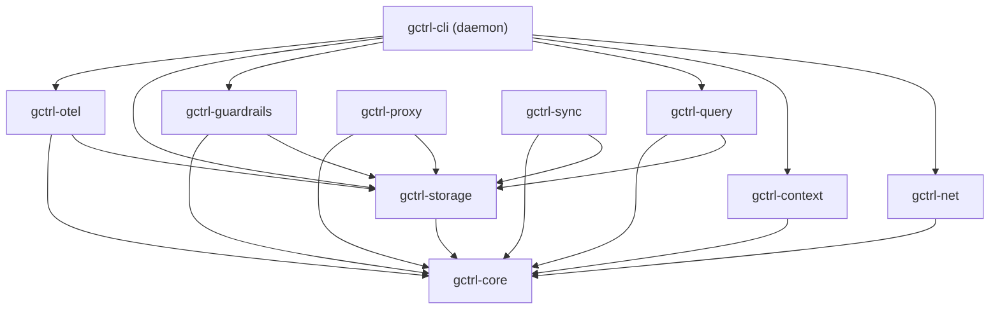

# Kernel Components (Rust — `kernel/crates/`)

The kernel is Rust-only. It provides core primitives, storage, and the HTTP API that the shell and applications consume. Kernel crates have no knowledge of the shell (Effect-TS CLI) or applications.

The kernel also includes a minimal Rust binary (`gctrl-daemon`) for starting the daemon server. All user-facing CLI logic lives in the Effect-TS shell — see [shell/components.md](../shell/components.md).

## Crate Map

| Crate | Responsibility | Key Dependencies |
|-------|---------------|-----------------|
| `gctrl-core` | Types, errors, config, port traits | `thiserror`, `serde`, `chrono` |
| `gctrl-storage` | DuckDB embedded storage, schema migrations | `duckdb` (bundled), `gctrl-core` |
| `gctrl-otel` | OTel receiver, OTLP JSON ingestion, HTTP API | `axum`, `tokio`, `gctrl-core`, `gctrl-storage` |
| `gctrl-guardrails` | Policy engine (cost limits, loop detection) | `gctrl-core`, `gctrl-storage` |
| `gctrl-context` | Context manager (DuckDB metadata + filesystem content) | `duckdb`, `sha2`, `dirs`, `gctrl-core` |
| `gctrl-query` | Guardrailed DuckDB query executor, named queries, raw SQL (opt-in) | `gctrl-core`, `gctrl-storage` |
| `gctrl-net` | Web fetch, crawl, readability extraction, compaction | `htmd`, `readability`, `scraper`, `url`, `gctrl-core` |
| `gctrl-proxy` | MITM proxy, traffic logging (stub) | `hudsucker`, `gctrl-core`, `gctrl-storage` |
| `gctrl-sync` | R2 cloud sync, Parquet export (stub) | `arrow`, `parquet`, `gctrl-core`, `gctrl-storage` |
| `gctrl-cli` | Minimal daemon binary (`gctrl serve`) | `clap`, `tokio`, all kernel crates |

## Dependency Graph

## Domain Layer (`gctrl-core`)

Pure types, errors, and business rules. No I/O dependencies.

- **Aggregates**: Session (with Span children), TrafficRecord, ContextEntry
- **Value Objects**: SpanId, SessionId, TraceId, ContextEntryId (branded string newtypes)
- **Domain Types**: SpanType, SpanStatus, SessionStatus, PolicyDecision, ContextKind, ContextSource
- **Domain Errors**: `GctlError` variants via `thiserror`

## Port Traits (`gctrl-core`)

- `GuardrailPolicy` trait for composable policy chain
- `Scheduler` trait for deferred/recurring task execution
- `TrackerPort` trait for external app drivers

### Adding a Kernel Primitive

1. Define the port trait in `gctrl-core`.
2. Create `kernel/crates/gctrl-{name}/`.
3. Implement the trait; depend on `gctrl-core` and optionally `gctrl-storage`.
4. Expose via HTTP API in `gctrl-otel/src/receiver.rs`.
5. Feature-gate in `gctrl-cli/Cargo.toml` if needed for the daemon binary.
6. The crate MUST NOT reference any application or shell crate.

## Subsystem Details

### gctrl-cli (Daemon Binary)

Minimal Rust binary. Its only job is to start the kernel daemon (`gctrl serve`). All user-facing CLI commands live in the Effect-TS shell — see [shell/components.md](../shell/components.md).

### gctrl-otel (OTel Receiver + HTTP API)

- `POST /v1/traces` — Accepts OTLP/HTTP JSON spans (protobuf planned)
- Extracts semantic conventions: `ai.model.id`, `ai.tokens.input`, `ai.tokens.output`
- Session management: groups spans by `session.id`, auto-creates sessions, updates aggregates
- Hosts the HTTP API router — the primary interface consumed by the Effect-TS shell and applications
- See [shell/components.md](../shell/components.md) for the full route list

### gctrl-query (Query Engine)

Three access modes, from safest to most powerful:

1. **Pre-built queries** — Named commands with fixed SQL (`sessions`, `analytics`).
2. **Natural language** (planned) — NL→SQL with column allowlist.
3. **Raw SQL** (opt-in) — Gated by `allow_raw_sql` config, `max_rows` limit, `blocked_columns` redaction.

Exposed to the shell via HTTP API endpoints.

### gctrl-guardrails (Policy Engine)

Composable policy chain via trait objects:

- `SessionBudgetPolicy` — halt if session cost exceeds threshold
- `LoopDetectionPolicy` — flag repeated identical tool calls
- `DiffSizePolicy` — alert on large diffs
- `CommandAllowlistPolicy` — block unauthorized commands
- `BranchProtectionPolicy` — prevent direct pushes to main

### gctrl-context (Context Manager)

- Hybrid DuckDB (metadata) + filesystem (content) store
- Filesystem: `~/.local/share/gctrl/context/{config,snapshots,documents}/`
- Content stored as markdown with YAML frontmatter
- `path` is unique key for upsert semantics
- `content_hash` (SHA-256) for sync change detection

### gctrl-net (Web Scraping)

- `htmd` (HTML→markdown), `readability` (article extraction), `scraper` (DOM)
- Storage: filesystem under `~/.local/share/gctrl/spider/{domain}/`
- Pages as markdown with YAML frontmatter; `_index.json` manifest per domain
- Compact: gitingest-style single-file context output

### gctrl-proxy (MITM Proxy)

- `hudsucker` for transparent HTTP(S) proxy
- Auto-generates CA cert on first run
- Logs to DuckDB `traffic` table
- Domain allowlist + rate limiting

### gctrl-sync (Sync Engine)

- Export DuckDB rows to Parquet via `arrow` + `parquet`
- Upload to R2 via S3-compatible API
- Partition: `r2://{workspace}/{device}/traces/{timestamp}.parquet`
- Modes: periodic, on-session-end, manual push/pull

### Scheduler

Port trait in `gctrl-core` with platform adapters:

| Platform | Adapter | Durable? |
|----------|---------|----------|
| Local daemon | tokio timers | No — lost on restart |
| macOS | launchd | Yes |
| Cloudflare Workers | Durable Object Alarm | Yes |

## Testing

- `DuckDbStore::open(":memory:")` for all DB tests
- `tempfile::TempDir` for filesystem tests (gctrl-net, gctrl-context)
- Integration test: `kernel/crates/gctrl-otel/tests/pipeline.rs` (11-step end-to-end pipeline)
