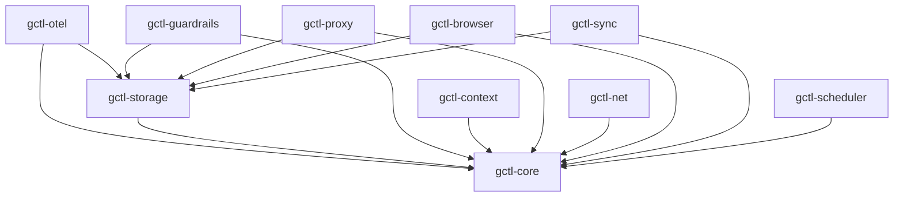

# Kernel Components (Rust — `crates/`)

## Crate Map

| Crate | Responsibility | Key Dependencies |
|-------|---------------|-----------------|
| `gctl-core` | Types, errors, config, port traits | `thiserror`, `serde`, `chrono` |
| `gctl-storage` | DuckDB embedded storage, schema migrations | `duckdb` (bundled), `gctl-core` |
| `gctl-otel` | OTel receiver, OTLP JSON ingestion, HTTP API (axum) | `axum`, `tokio`, `gctl-core`, `gctl-storage` |
| `gctl-guardrails` | Policy engine (cost limits, loop detection) | `gctl-core`, `gctl-storage` |
| `gctl-context` | Context manager (DuckDB metadata + filesystem content) | `duckdb`, `sha2`, `dirs`, `gctl-core` |
| `gctl-proxy` | MITM proxy, traffic logging (stub) | `hudsucker`, `gctl-core`, `gctl-storage` |
| `gctl-browser` | CDP browser daemon, ref system, tab management | `gctl-core`, `gctl-storage` |
| `gctl-sync` | R2 cloud sync, Parquet export (stub) | `arrow`, `parquet`, `gctl-core`, `gctl-storage` |
| `gctl-scheduler` | Scheduler port + platform adapters (tokio, launchd, DO) | `tokio`, `gctl-core` |
| `gctl-net` | Web fetch, crawl, readability extraction, compaction | `htmd`, `readability`, `scraper`, `url`, `gctl-core` |

## Dependency Graph

## Domain Layer (`gctl-core`)

Pure types, errors, and business rules. No I/O dependencies.

- **Aggregates**: Session (with Span children), TrafficRecord, ContextEntry
- **Value Objects**: SpanId, SessionId, TraceId, ContextEntryId (branded string newtypes)
- **Domain Types**: SpanType (Generation/Span/Event), SpanStatus, SessionStatus, PolicyDecision, ContextKind, ContextSource
- **Domain Errors**: `GctlError` variants via `thiserror` (Storage, Config, GuardrailViolation, Context, etc.)

## Port Traits (`gctl-core`)

Abstract interfaces defining how the kernel talks to the outside:

- `DuckDbStore` methods as the storage interface
- `GuardrailPolicy` trait for composable policy chain
- `Scheduler` trait for deferred/recurring task execution
- `TrackerPort` trait for external app drivers (Linear, GitHub, Notion)

### Adding a Kernel Primitive

1. Define the port trait in `gctl-core`.
2. Create `crates/gctl-{name}/`.
3. Implement the trait; depend on `gctl-core` and optionally `gctl-storage`.
4. Feature-gate in `gctl-cli/Cargo.toml`.
5. The crate MUST NOT reference any application crate.

## Subsystem Details

### gctl-otel (OTel Receiver)

- `POST /v1/traces` — Accepts OTLP/HTTP JSON spans (protobuf planned)
- Extracts semantic conventions: `ai.model.id`, `ai.tokens.input`, `ai.tokens.output`, `ai.tool.name`
- Session management: groups spans by `session.id`, auto-creates sessions, updates cost/token aggregates
- HTTP API: 21+ axum endpoints for sessions, analytics, trace tree, scoring, context

### gctl-guardrails (Policy Engine)

Composable policy chain via trait objects:

- `SessionBudgetPolicy` — halt if session cost exceeds threshold
- `LoopDetectionPolicy` — flag repeated identical tool calls
- `DiffSizePolicy` — alert on large diffs
- `CommandAllowlistPolicy` — block unauthorized commands
- `BranchProtectionPolicy` — prevent direct pushes to main

### gctl-context (Context Manager)

- Hybrid DuckDB (metadata) + filesystem (content) store
- Filesystem: `~/.local/share/gctl/context/{config,snapshots,documents}/`
- Content stored as markdown with YAML frontmatter
- `path` is unique key for upsert semantics
- `content_hash` (SHA-256) for sync change detection

### gctl-query (Query Interface)

Three access modes:
1. **Pre-built queries** — Named commands with fixed SQL
2. **Natural language** (planned) — NL→SQL with column allowlist
3. **Raw SQL** (opt-in) — Gated by `allow_raw_sql` config

### gctl-proxy (MITM Proxy)

- `hudsucker` for transparent HTTP(S) proxy
- Auto-generates CA cert on first run
- Logs to DuckDB `traffic` table
- Domain allowlist + rate limiting

### gctl-sync (Sync Engine)

- Export DuckDB rows to Parquet via `arrow` + `parquet`
- Upload to R2 via S3-compatible API
- Partition: `r2://{workspace}/{device}/traces/{timestamp}.parquet`
- Modes: periodic, on-session-end, manual push/pull

### gctl-net (Web Scraping)

- `htmd` (HTML→markdown), `readability` (article extraction), `scraper` (DOM)
- Storage: filesystem under `~/.local/share/gctl/spider/{domain}/`
- Pages as markdown with YAML frontmatter; `_index.json` manifest per domain
- Compact: gitingest-style single-file context output

### Scheduler Implementation

Port trait in `gctl-core` with platform adapters:

| Platform | Adapter | Durable? |
|----------|---------|----------|
| Local daemon | tokio timers | No — lost on restart |
| macOS | launchd | Yes |
| Cloudflare Workers | Durable Object Alarm | Yes |

## Testing

- `DuckDbStore::open(":memory:")` for all DB tests
- `tempfile::TempDir` for filesystem tests (gctl-net, gctl-context)
- `tower::ServiceExt::oneshot` for axum router tests
- Integration test: `crates/gctl-otel/tests/pipeline.rs` (11-step end-to-end pipeline)
