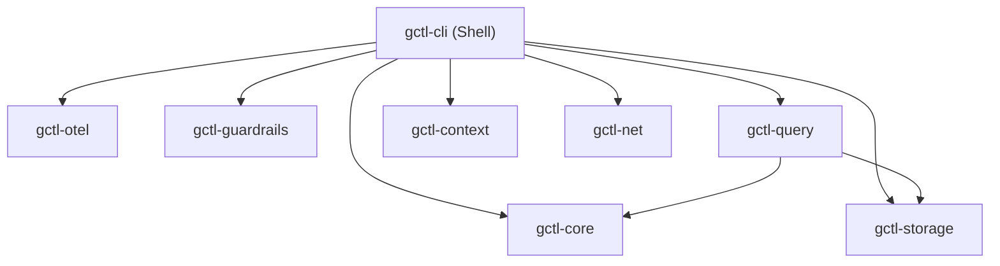

# Shell Components (Rust dispatcher + Effect-TS command logic)

The shell has two sub-layers:

1. **Rust dispatcher** (`gctl-cli`, `gctl-otel` axum routes, `gctl-query`) — thin routing only. Stays Rust because it must link against kernel crates and serve the HTTP API. Contains no business logic.
2. **Effect-TS command packages** (`packages/gctl-{command}/`) — implement actual command logic. Call the kernel via HTTP API or CLI subprocess.

## Crate Map

| Crate / Package | Responsibility | Key Dependencies |
|-----------------|---------------|-----------------|
| `gctl-cli` | CLI dispatcher (clap), routes to commands | `clap`, all kernel crates |
| `gctl-query` | Guardrailed DuckDB query executor | `gctl-core`, `gctl-storage` |
| HTTP API | axum routes (lives in `gctl-otel`) | `axum`, `gctl-storage`, `gctl-context` |

## Dependency Graph



## When to Use Rust vs Effect-TS

| Concern | Use |
|---------|-----|
| Raw kernel access (DuckDB queries, OTel ingestion) | Rust (kernel layer) |
| Routing: parse `gctl foo bar` and call a handler | Rust (CLI dispatcher) |
| Command logic: fetch data, format, output | Effect-TS package |
| Business rules, domain validation | Effect-TS package |

## Effect-TS Shell Command Package

```
packages/gctl-{command}/
├── src/
│   ├── index.ts           # Public API
│   ├── commands/          # Command implementations (Effect.gen)
│   ├── services/          # Context.Tag service interfaces
│   └── adapters/          # HTTP client, config, formatter adapters
├── test/                  # vitest tests
├── package.json
└── tsconfig.json
```

## Calling the Kernel from Effect-TS

Shell packages MUST communicate with the kernel via the HTTP API (`http://localhost:4318/api/*`) or CLI subprocess. They MUST NOT import Rust kernel crates directly.

```typescript
import { Effect, Layer } from "effect"
import { HttpClient, HttpClientRequest } from "@effect/platform"

class KernelClient extends Effect.Tag("KernelClient")<
  KernelClient,
  { listSessions: () => Effect.Effect<Session[], KernelError> }
>() {}

const KernelClientLive = Layer.succeed(KernelClient, {
  listSessions: () =>
    Effect.gen(function* () {
      const client = yield* HttpClient.HttpClient
      const res = yield* client.execute(
        HttpClientRequest.get("http://localhost:4318/api/sessions")
      )
      return yield* HttpClientResponse.schemaBodyJson(SessionArray)(res)
    }),
})
```

## Testing

- axum router tests via `tower::ServiceExt::oneshot` (in-process HTTP, no real server needed)
- Effect-TS command tests via vitest with mock `KernelClient` layer
