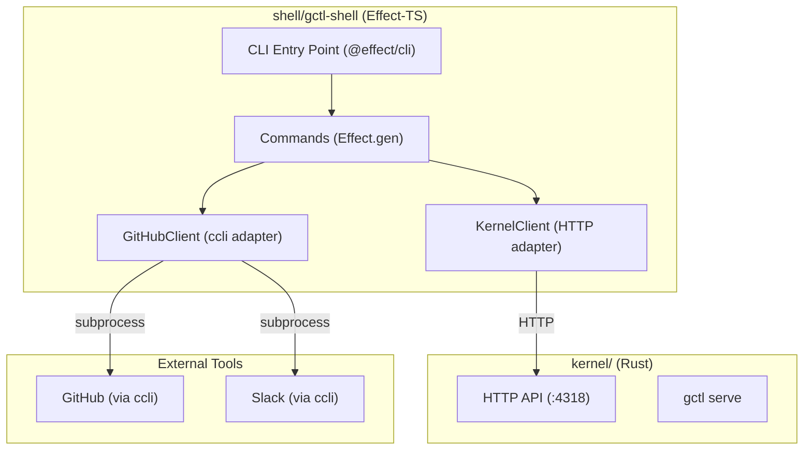
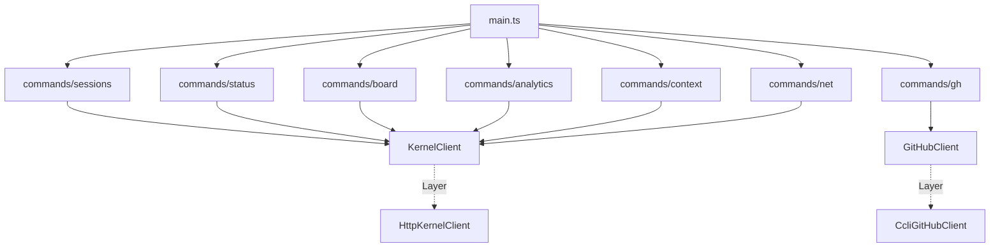

# Shell Components (Effect-TS CLI — `shell/`)

The shell is the user-facing CLI. It mediates all access to the kernel and external tools. It parses input, routes to handlers, formats output, and orchestrates cross-system workflows (kernel + GitHub + other tools). It contains no business logic — that lives in the kernel (Rust) or applications (Effect-TS).

The shell is an Effect-TS package using `@effect/cli` for command parsing and `@effect/platform` for I/O. It communicates with the Rust kernel exclusively via the HTTP API on `:4318`.

## Package Map

| Package | Directory | Responsibility | Key Dependencies |
|---------|-----------|---------------|-----------------|
| `gctl-shell` | `shell/gctl-shell/` | Effect-TS CLI, command dispatcher, external tool adapters | `effect`, `@effect/cli`, `@effect/platform` |

## Architecture



## Package Structure

```
shell/gctl-shell/
├── src/
│   ├── main.ts               # Entry point, top-level Command
│   ├── commands/              # Command implementations (Effect.gen)
│   │   ├── sessions.ts        # gctl sessions
│   │   ├── status.ts          # gctl status
│   │   ├── board.ts           # gctl board (delegates to gctl-board)
│   │   ├── analytics.ts       # gctl analytics
│   │   ├── context.ts         # gctl context
│   │   ├── net.ts             # gctl net
│   │   └── gh.ts              # gctl gh (GitHub integration)
│   ├── services/              # Port interfaces (Context.Tag)
│   │   ├── KernelClient.ts    # Kernel HTTP API port
│   │   └── GitHubClient.ts    # GitHub operations port
│   ├── adapters/              # Concrete implementations
│   │   ├── HttpKernelClient.ts    # HTTP adapter for kernel API
│   │   └── CcliGitHubClient.ts   # ccli subprocess adapter for GitHub
│   └── errors.ts             # Shell-level TaggedErrors
├── test/                      # vitest tests
├── package.json
└── tsconfig.json
```

## Dependency Graph



---

## CLI Entry Point (`main.ts`)

Uses `@effect/cli` to define the top-level command tree. Each subcommand is a separate module that returns a `Command`.

```typescript
import { Command } from "@effect/cli"
import { NodeContext, NodeRuntime } from "@effect/platform-node"

const command = Command.make("gctl").pipe(
  Command.withSubcommands([
    sessionsCommand,
    statusCommand,
    boardCommand,
    analyticsCommand,
    contextCommand,
    netCommand,
    ghCommand,
  ])
)

const cli = Command.run(command, { name: "gctl", version: "0.1.0" })
cli(process.argv).pipe(
  Effect.provide(ShellLive),
  NodeRuntime.runMain
)
```

## CLI Commands

| Command | Subcommands | Description |
|---------|-------------|-------------|
| `gctl sessions` | | List recent sessions (--agent, --status, --format) |
| `gctl status` | | Config and system info (kernel health + version) |
| `gctl board` | `create`, `list`, `move`, `assign`, `view` | Board operations (delegates to gctl-board) |
| `gctl analytics` | `overview`, `cost`, `latency`, `scores`, `daily` | Analytics dashboard and queries |
| `gctl context` | `add`, `list`, `show`, `remove`, `compact`, `stats` | Manage agent context |
| `gctl net` | `fetch`, `crawl`, `list`, `show`, `compact` | Web scraping and agent context |
| `gctl gh` | `issues`, `prs`, `runs` | GitHub integration (wraps ccli) |

### Adding a New CLI Command

1. Create `shell/gctl-shell/src/commands/{name}.ts` with a `Command.make` definition.
2. Add the command to the `withSubcommands` list in `main.ts`.
3. If the command needs a new kernel endpoint, add the route in the kernel first (see [kernel/components.md](../kernel/components.md)).
4. If the command needs a new external tool, create a service port in `services/` and adapter in `adapters/`.

---

## Service Ports

### KernelClient (Kernel HTTP API)

Port interface for calling the Rust kernel daemon.

```typescript
class KernelClient extends Context.Tag("KernelClient")<
  KernelClient,
  {
    readonly get: <A>(path: string, schema: Schema.Schema<A>) => Effect.Effect<A, KernelError>
    readonly post: <A>(path: string, body: unknown, schema: Schema.Schema<A>) => Effect.Effect<A, KernelError>
    readonly delete: (path: string) => Effect.Effect<void, KernelError>
  }
>() {}
```

### GitHubClient (External Tool)

Port interface for GitHub operations. Wraps `ccli gh` as a subprocess.

```typescript
class GitHubClient extends Context.Tag("GitHubClient")<
  GitHubClient,
  {
    readonly listIssues: (repo: string, filter?: IssueFilter) => Effect.Effect<ReadonlyArray<GhIssue>, GitHubError>
    readonly listPRs: (repo: string) => Effect.Effect<ReadonlyArray<GhPR>, GitHubError>
    readonly listRuns: (repo: string, branch?: string) => Effect.Effect<ReadonlyArray<GhRun>, GitHubError>
    readonly createIssue: (repo: string, input: CreateGhIssueInput) => Effect.Effect<GhIssue, GitHubError>
  }
>() {}
```

---

## Adapters

### HttpKernelClient

Concrete adapter that calls the kernel HTTP API on `:4318`. Uses `@effect/platform` `HttpClient`.

```typescript
const HttpKernelClientLive = (baseUrl = "http://localhost:4318") =>
  Layer.succeed(KernelClient, {
    get: (path, schema) =>
      Effect.gen(function* () {
        const client = yield* HttpClient.HttpClient
        const res = yield* client.get(`${baseUrl}${path}`)
        return yield* HttpClientResponse.schemaBodyJson(schema)(res)
      }).pipe(
        Effect.catchAll((e) => Effect.fail(new KernelError({ message: String(e) })))
      ),
    // ... post, delete similarly
  })
```

### CcliGitHubClient

Concrete adapter that shells out to `ccli gh` commands. Uses `@effect/platform` `Command` for subprocess execution.

```typescript
const CcliGitHubClientLive = Layer.succeed(GitHubClient, {
  listIssues: (repo, filter) =>
    Effect.gen(function* () {
      const args = ["gh", "issue", "list", "--repo", repo]
      if (filter?.state) args.push("--state", filter.state)
      const result = yield* runCcli(args)
      return parseIssueList(result.stdout)
    }),
  // ...
})
```

---

## HTTP API (Kernel-hosted)

The HTTP API lives in the Rust kernel (`kernel/crates/gctl-otel/src/receiver.rs`) as an axum router. It is served by `gctl serve` on port 4318. The shell consumes this API — it does not host its own server.

### Routes

| Method | Path | Description |
|--------|------|-------------|
| POST | `/v1/traces` | OTel OTLP span ingestion |
| GET | `/api/sessions` | List sessions (query: limit, agent, status) |
| GET | `/api/sessions/{id}` | Get session by ID |
| GET | `/api/sessions/{id}/spans` | Get spans for session |
| GET | `/api/sessions/{id}/tree` | Trace tree (Langfuse-style) |
| POST | `/api/sessions/{id}/auto-score` | Auto-score a session |
| POST | `/api/sessions/{id}/end` | End a session |
| GET | `/api/sessions/{id}/loops` | Detect error loops |
| GET | `/api/sessions/{id}/cost-breakdown` | Per-model cost breakdown |
| GET | `/api/analytics` | Overview analytics |
| GET | `/api/analytics/cost` | Cost by model and agent |
| GET | `/api/analytics/latency` | Latency percentiles |
| GET | `/api/analytics/spans` | Span type distribution |
| GET | `/api/analytics/scores` | Score summary (query: name) |
| GET | `/api/analytics/daily` | Daily aggregates |
| POST | `/api/analytics/score` | Create a score |
| POST | `/api/analytics/tag` | Create a tag |
| GET | `/api/analytics/alerts` | List alert rules |
| GET | `/api/context` | List context entries (query: kind, tag, search, limit) |
| POST | `/api/context` | Upsert context entry |
| GET | `/api/context/{id}` | Get context entry metadata |
| GET | `/api/context/{id}/content` | Get context entry content (markdown) |
| DELETE | `/api/context/{id}` | Remove context entry |
| GET | `/api/context/compact` | Compact context (query: kind, tag) |
| GET | `/api/context/stats` | Context store statistics |
| GET | `/api/query` | Execute named or raw SQL query |
| GET | `/health` | Health check |

---

## Testing

- Effect-TS command tests via vitest with mock `KernelClient` and `GitHubClient` layers
- No real HTTP server needed — mock layers return canned responses
- Adapter integration tests call real kernel daemon (requires `gctl serve` running)
