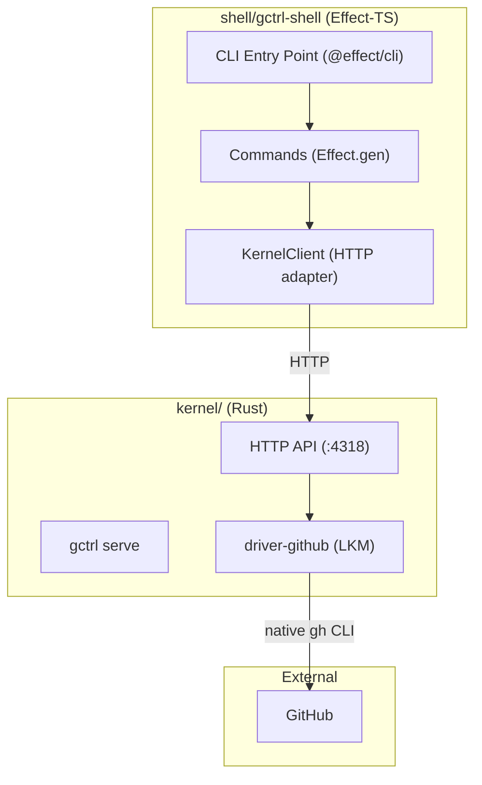
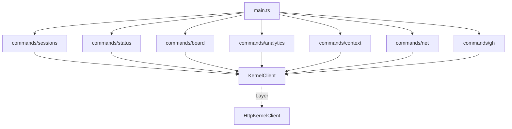

# Shell Components (Effect-TS CLI — `shell/`)

The shell is the user-facing CLI. It mediates all access to the kernel. It parses input, routes to handlers, and formats output. It contains no business logic — that lives in the kernel (Rust) or applications (Effect-TS).

The shell is an Effect-TS package using `@effect/cli` for command parsing and `@effect/platform` for I/O. It communicates with the Rust kernel exclusively via the HTTP API on `:4318`. **The shell MUST NOT call external APIs directly** — external services (GitHub, Linear, etc.) are accessed through kernel drivers (loadable kernel modules) exposed via the kernel HTTP API.

## Package Map

| Package | Directory | Responsibility | Key Dependencies |
|---------|-----------|---------------|-----------------|
| `gctrl-shell` | `shell/gctrl-shell/` | Effect-TS CLI, command dispatcher, external tool adapters | `effect`, `@effect/cli`, `@effect/platform` |

## Architecture



## Package Structure

```
shell/gctrl-shell/
├── src/
│   ├── main.ts               # Entry point, top-level Command
│   ├── commands/              # Command implementations (Effect.gen)
│   │   ├── sessions.ts        # gctrl sessions
│   │   ├── status.ts          # gctrl status
│   │   ├── board.ts           # gctrl board (delegates to gctrl-board)
│   │   ├── analytics.ts       # gctrl analytics
│   │   ├── context.ts         # gctrl context
│   │   ├── net.ts             # gctrl net
│   │   └── gh.ts              # gctrl gh (GitHub via kernel driver)
│   ├── services/              # Port interfaces (Context.Tag)
│   │   └── KernelClient.ts    # Kernel HTTP API port
│   ├── adapters/              # Concrete implementations
│   │   └── HttpKernelClient.ts    # HTTP adapter for kernel API
│   └── errors.ts             # Shell-level TaggedErrors
├── test/                      # vitest tests
├── package.json
└── tsconfig.json
```

## Dependency Graph



All commands — including `gctrl gh` — route through `KernelClient`. GitHub operations are handled by `driver-github` (a kernel LKM) behind the kernel HTTP API. The shell has no direct knowledge of the GitHub REST API.

---

## CLI Entry Point (`main.ts`)

Uses `@effect/cli` to define the top-level command tree. Each subcommand is a separate module that returns a `Command`.

```typescript
import { Command } from "@effect/cli"
import { NodeContext, NodeRuntime } from "@effect/platform-node"

const command = Command.make("gctrl").pipe(
  Command.withSubcommands([
    sessionsCommand,
    statusCommand,
    boardCommand,
    analyticsCommand,
    contextCommand,
    netCommand,
    ghCommand,
  ])
)

const cli = Command.run(command, { name: "gctrl", version: "0.1.0" })
cli(process.argv).pipe(
  Effect.provide(ShellLive),
  NodeRuntime.runMain
)
```

## CLI Commands

| Command | Subcommands | Description |
|---------|-------------|-------------|
| `gctrl sessions` | | List recent sessions (--agent, --status, --format) |
| `gctrl status` | | Config and system info (kernel health + version) |
| `gctrl board` | `create`, `list`, `move`, `assign`, `view` | Board operations (delegates to gctrl-board) |
| `gctrl analytics` | `overview`, `cost`, `latency`, `scores`, `daily` | Analytics dashboard and queries |
| `gctrl context` | `add`, `list`, `show`, `remove`, `compact`, `stats` | Manage agent context |
| `gctrl net` | `fetch`, `crawl`, `list`, `show`, `compact` | Web scraping and agent context |
| `gctrl gh` | `issues`, `prs`, `runs` | GitHub integration (via kernel driver) |

### Adding a New CLI Command

1. Create `shell/gctrl-shell/src/commands/{name}.ts` with a `Command.make` definition.
2. Add the command to the `withSubcommands` list in `main.ts`.
3. If the command needs a new kernel endpoint, add the route in the kernel first (see [kernel/components.md](../kernel/components.md)).
4. If the command needs a new external tool, create a service port in `services/` and adapter in `adapters/`.

---

## Service Ports

### KernelClient (Kernel HTTP API)

Port interface for calling the Rust kernel daemon.

```typescript
class KernelClient extends Context.Tag("KernelClient")<
  KernelClient,
  {
    readonly get: <A>(path: string, schema: Schema.Schema<A>) => Effect.Effect<A, KernelError>
    readonly post: <A>(path: string, body: unknown, schema: Schema.Schema<A>) => Effect.Effect<A, KernelError>
    readonly delete: (path: string) => Effect.Effect<void, KernelError>
  }
>() {}
```

### GitHub Operations (via Kernel Driver)

GitHub operations (`gctrl gh issues`, `gctrl gh prs`, `gctrl gh runs`) use the same `KernelClient` port as all other commands. The kernel exposes GitHub data through HTTP routes (`/api/github/*`) backed by `driver-github` (a loadable kernel module that delegates to the native `gh` CLI). The kernel handles **caching** (TTL-based, invalidated on writes) and **OTel instrumentation** (spans per call with latency/status). The shell has **no `GitHubClient` service** — it is not aware of the GitHub API or `gh` CLI.

```typescript
// gctrl gh issues — calls kernel, which delegates to driver-github
const listIssues = (repo: string) =>
  KernelClient.pipe(
    Effect.flatMap((kc) => kc.get(`/api/github/issues?repo=${repo}`, GhIssueList))
  )
```

---

## Adapters

### HttpKernelClient

Concrete adapter that calls the kernel HTTP API on `:4318`. Uses `@effect/platform` `HttpClient`.

```typescript
import { HttpClient, HttpClientResponse, HttpBody, FetchHttpClient } from "@effect/platform"

const HttpKernelClientLive = (baseUrl = "http://localhost:4318") =>
  Layer.effect(KernelClient,
    Effect.gen(function* () {
      const client = yield* HttpClient.HttpClient
      return {
        get: (path, schema) =>
          client.get(`${baseUrl}${path}`).pipe(
            Effect.flatMap((res) =>
              res.status < 200 || res.status >= 300
                ? Effect.flatMap(res.text, (text) =>
                    Effect.fail(new KernelError({ message: text, statusCode: res.status })))
                : HttpClientResponse.schemaBodyJson(schema)(res).pipe(
                    Effect.catchTag("ParseError", (e) =>
                      Effect.fail(new KernelError({ message: `Schema decode: ${e}` }))))
            ),
            Effect.scoped,
            Effect.catchTag("RequestError", () =>
              Effect.fail(new KernelUnavailableError({ message: "..." }))),
          ),
        // ... post (with HttpBody.unsafeJson), delete, getText similarly
      }
    })
  )
```
```

---

## HTTP API (Kernel-hosted)

The HTTP API lives in the Rust kernel (`kernel/crates/gctrl-otel/src/receiver.rs`) as an axum router. It is served by `gctrl serve` on port 4318. The shell consumes this API — it does not host its own server.

### Routes

| Method | Path | Description |
|--------|------|-------------|
| POST | `/v1/traces` | OTel OTLP span ingestion |
| GET | `/api/sessions` | List sessions (query: limit, agent, status) |
| GET | `/api/sessions/{id}` | Get session by ID |
| GET | `/api/sessions/{id}/spans` | Get spans for session |
| GET | `/api/sessions/{id}/tree` | Trace tree (Langfuse-style) |
| POST | `/api/sessions/{id}/auto-score` | Auto-score a session |
| POST | `/api/sessions/{id}/end` | End a session |
| GET | `/api/sessions/{id}/loops` | Detect error loops |
| GET | `/api/sessions/{id}/cost-breakdown` | Per-model cost breakdown |
| GET | `/api/analytics` | Overview analytics |
| GET | `/api/analytics/cost` | Cost by model and agent |
| GET | `/api/analytics/latency` | Latency percentiles |
| GET | `/api/analytics/spans` | Span type distribution |
| GET | `/api/analytics/scores` | Score summary (query: name) |
| GET | `/api/analytics/daily` | Daily aggregates |
| POST | `/api/analytics/score` | Create a score |
| POST | `/api/analytics/tag` | Create a tag |
| GET | `/api/analytics/alerts` | List alert rules |
| GET | `/api/context` | List context entries (query: kind, tag, search, limit) |
| POST | `/api/context` | Upsert context entry |
| GET | `/api/context/{id}` | Get context entry metadata |
| GET | `/api/context/{id}/content` | Get context entry content (markdown) |
| DELETE | `/api/context/{id}` | Remove context entry |
| GET | `/api/context/compact` | Compact context (query: kind, tag) |
| GET | `/api/context/stats` | Context store statistics |
| GET | `/api/query` | Execute named or raw SQL query |
| GET | `/health` | Health check |

---

## Style Guide

- **No `.js` in imports.** Use extensionless imports (`from "../services/KernelClient"`, not `from "../services/KernelClient.js"`). The shell uses `moduleResolution: "bundler"` which resolves `.ts` files without extensions.
- **Single service port.** All commands use `KernelClient` — no separate service ports for external APIs.
- **No secrets in the shell.** The shell MUST NOT read environment variables for API tokens (e.g., `GITHUB_TOKEN`). Secrets are managed by the kernel.
- **Prefer `@effect/platform` HttpClient over raw `fetch()`.** HTTP adapters MUST use `HttpClient`, `HttpClientResponse`, and `HttpBody` from `@effect/platform` instead of the global `fetch()` API. This keeps HTTP in the Effect ecosystem (typed errors, scoped resources, layer-based DI). Use `FetchHttpClient.layer` at the entry point to provide the concrete implementation. Map `RequestError` → `KernelUnavailableError`, `ResponseError` → `KernelError`, `ParseError` → `KernelError`.

## Testing

- Effect-TS command tests via vitest with mock `KernelClient` layer
- No real HTTP server needed — mock layer returns canned responses
- Adapter integration tests call real kernel daemon (requires `gctrl serve` running)
- GitHub command tests use the same `KernelClient` mock — no separate GitHub mock needed
