# GroundCtrl — Product Requirements Document

> **GroundCtrl is a small, local-first operating system for human+agent teams, modeled after Unix.** Usable out of the box by an individual developer or a small team — no infrastructure required. The **Kernel** is intentionally small: telemetry, storage, guardrails, and an orchestrator. The **Shell** mediates access via CLI and HTTP API. **Applications & Utilities** are all optional — gctl ships useful defaults (board, eval, net tools) but every external tool you already use (Linear, Notion, Obsidian, Arize Phoenix, etc.) integrates via adapters, not replacement.
>
> The "kernel" is the local daemon; the "filesystem" is DuckDB; the "shell" is the CLI + HTTP API; the "process manager" is guardrails. Utilities are small composable tools (like Unix `grep`, `curl`). Install, run `gctl serve`, and you have a working ground control station. Cloud sync, external integrations, and team features layer on when you need them — not before.
>

## 1. Unix-Inspired Architecture

GroundCtrl separates concerns into three layers, modeled after Unix:

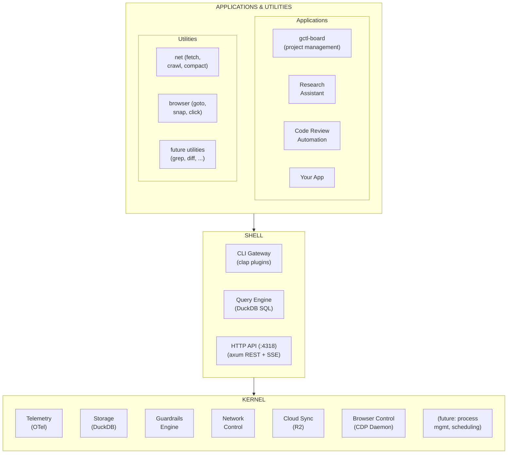

### 1.1. Kernel — Small by Design

The kernel is intentionally small, agent-agnostic, and use-case-agnostic. An individual developer gets a working system with just the core primitives — no external services, no cloud accounts, no configuration files.

**Core primitives (always present):**

| Primitive | What It Does | Consumed By |
|-----------|-------------|-------------|
| **Telemetry** | OTLP span ingestion, session tracking, cost attribution | Shell, apps, utilities |
| **Storage** | DuckDB embedded DB with schema migrations, retention policies | Shell, all apps (shared DB, isolated table namespaces) |
| **Guardrails** | Policy engine (cost limits, loop detection, command gateway) | Shell, any app enforcing agent safety |
| **Orchestrator** | Agent-agnostic dispatch, retry, reconciliation (see [orchestration.md](gctl/workflows/orchestration.md)) | Shell, any app dispatching agent work |

**Optional kernel extensions (feature-gated):**

| Extension | What It Does | When to Enable |
|-----------|-------------|----------------|
| **Network Control** | MITM proxy, domain allowlists, traffic logging | When you need network visibility |
| **Browser Control** | CDP daemon, persistent Chromium, ref system, tab management | When you need browser automation |
| **Cloud Sync** | R2 Parquet export, device-partitioned sync, knowledge store | When sharing data across devices/teams |
| **Scheduler** | Deferred and recurring task execution (adapters: tokio, macOS launchd, Cloudflare DO Alarms) | When you need timed triggers beyond the orchestrator |

The kernel makes **no assumptions** about what you're building. A solo developer running `gctl serve` gets telemetry, storage, guardrails, and orchestration. Everything else layers on as needed.

### 1.2. Shell — Dispatcher & Interface Layer

The shell mediates all access to the kernel, like `bash` mediates access to Linux syscalls. The shell is the *dispatcher* — it parses input and routes to the right command. Individual CLI subcommands (like `gctl sessions`, `gctl net fetch`) are utilities/applications that *run through* the shell, not part of it.

| Interface | What It Does | Unix Analogy |
|-----------|-------------|--------------|
| **CLI Dispatcher** | Unified `gctl` CLI, parses args, routes to commands | `bash` / `zsh` (the interpreter, not the commands) |
| **HTTP API** | REST endpoints on `:4318`, SSE for live feeds | Network sockets / IPC |
| **Query Engine** | Guardrailed DuckDB queries, NL-to-SQL (planned) | `awk` / `sed` for structured data |

### 1.3. Applications & Utilities

**All applications are optional.** gctl ships useful defaults, but the real power is the driver model: integrate the tools you already use instead of replacing them.

**Applications** are larger, stateful programs that orchestrate kernel primitives through the shell. **Utilities** are smaller, single-purpose tools that do one thing well and compose via stdin/stdout where practical.

#### Shipped Applications (all optional)

| Application | Use Case | Kernel Primitives Used (via Shell) |
|-------------|----------|-----------------------------------|
| **gctl-board** | Lightweight project management & kanban | Storage, Telemetry (session-issue linking), Cloud Sync |
| **Observe & Eval** | Analytics, scoring, prompt management | Telemetry, Storage, Query Engine |
| **Capacity Engine** | Throughput measurement, forecasting | Storage, Telemetry, Query Engine |

#### Shipped Utilities

| Utility | Use Case | Unix Analogy |
|---------|----------|--------------|
| **net fetch** | Fetch a URL, convert to markdown | `curl` |
| **net crawl** | Crawl a site, extract readable content | `wget -r` |
| **net compact** | Compact crawled pages into LLM-ready context | `tar` / `cat` |
| **browser goto/snapshot/click** | Browser automation via CDP | headless Chrome scripting |

#### External Applications (Installed via Drivers)

gctl does not replace your existing tools — it connects to them as external applications installed on the OS. Each driver is optional and independently enabled. Use the tools you already know; gctl provides the kernel primitives (telemetry, orchestration, guardrails) underneath.

| Category | External App | Driver | What It Does |
|----------|-------------|--------|-------------|
| **Project Tracking** | Linear | `driver-linear` | Bidirectional issue sync, dispatch from Linear issues |
| **Project Tracking** | GitHub Issues | `driver-github` | Issue sync, PR linking, status mirroring |
| **Project Tracking** | Notion | `driver-notion` | Read/write Notion databases as issue source |
| **Knowledge & Docs** | Obsidian | `driver-obsidian` | Mount `specs/` as vault, edit specs in Obsidian UI |
| **Observability** | Arize Phoenix | `driver-phoenix` | Export traces/evals to Phoenix for LLM analysis |
| **Observability** | Langfuse | `driver-langfuse` | Export traces/scores to Langfuse |
| **Observability** | SigNoz | `driver-signoz` | Forward OTel spans to SigNoz for dashboarding |
| **Agents** | Claude Code | built-in | Orchestrator dispatches via `claude` CLI |
| **Agents** | Aider | built-in | Orchestrator dispatches via `aider` CLI |
| **Agents** | Custom | built-in | Any executable that accepts a prompt |

Drivers follow the Unix device driver model: each implements a kernel interface trait (e.g., `TrackerPort`, `ObservabilityExportPort`) and is wired at startup via configuration. Zero drivers = gctl works standalone. Add drivers as your workflow grows.

#### Example Future Applications

| Application | Use Case | Kernel Primitives Used |
|-------------|----------|----------------------|
| **Research Assistant** | Build knowledge bases, semantic search | Network Control, Storage, Cloud Sync |
| **Code Review Bot** | Automated PR review with trace-informed context | Telemetry, CLI Gateway, HTTP API |
| **Incident Response** | Alert triage, runbook execution, post-mortem generation | Guardrails, Telemetry, Network Control |
| **Compliance & Audit** | Track all agent actions for regulatory compliance | Telemetry (full trace), Guardrails (policy log), Storage |

### 1.4. Extension Model

Applications and utilities integrate with gctl through the shell:

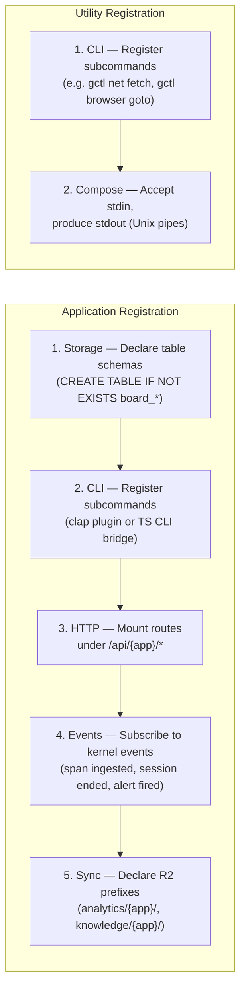

**Rust applications** (like Observe & Eval, Capacity) are compiled into the `gctl` binary as feature-gated crates. They have direct access to `DuckDbStore` and can register axum routes on the shared router.

**TypeScript applications** (like gctl-board) run as sidecar processes or are proxied through the Rust daemon. They communicate via the shell (HTTP API or CLI subprocess calls).

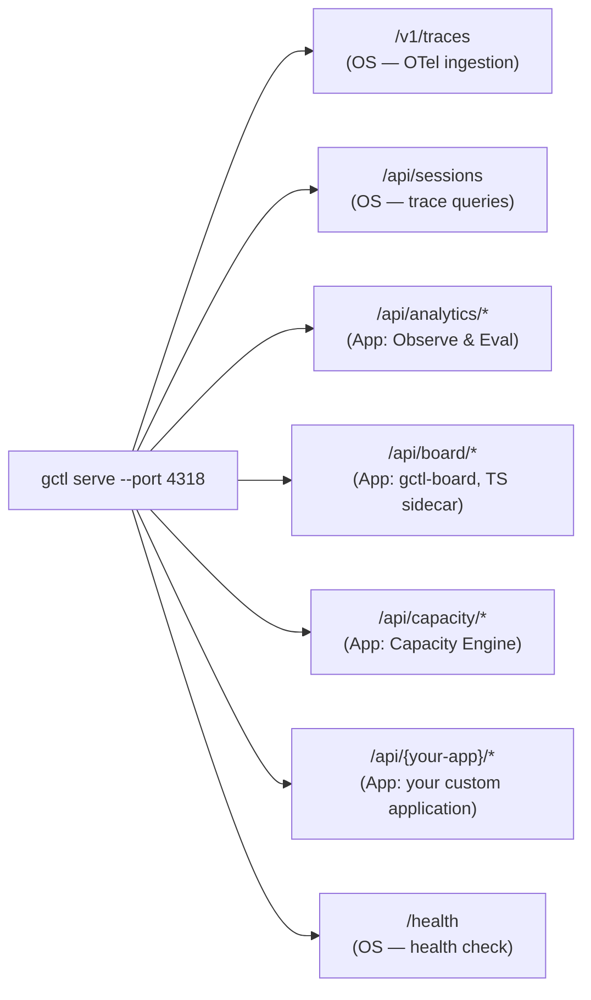

## 2. Design Principles

1. **Usable out of the box by one person.** `cargo install gctl && gctl serve` — no config files, no cloud accounts, no Docker. An individual developer or a small team gets telemetry, storage, guardrails, and orchestration immediately. Complexity is opt-in, not opt-out.
2. **Small kernel, optional everything else.** The kernel has four core primitives (telemetry, storage, guardrails, orchestrator). Network control, browser control, cloud sync, and the scheduler are feature-gated extensions. All applications and adapters are optional.
3. **Adapt, don't replace.** gctl connects to the tools you already use (Linear, Notion, Obsidian, Arize Phoenix, etc.) via adapters. Shipped applications (gctl-board, Observe & Eval) are defaults, not mandates. Zero adapters = standalone. Add what you need.
4. **OS layer is stable; applications evolve fast.** The telemetry format, storage schema, and CLI gateway change rarely. Applications can ship, iterate, and break independently.
5. **Applications share primitives, not state.** Apps read from the same DuckDB but own their table namespaces (`board_*`, `eval_*`, `capacity_*`). Cross-app data flows through OS-level events, not direct table joins.
6. **Agents are first-class application consumers.** Applications expose CLI and HTTP interfaces that agents can call directly. No browser-only UIs — every feature is automatable.
7. **Local-first, cloud-optional.** The OS layer works fully offline. Cloud sync (R2) is opt-in. Applications inherit this property automatically.

## 3. Target Use Cases

gctl is designed for **individuals first, small teams second**. A solo developer with one agent gets full value on day one. Team features layer on naturally — not as a separate product.

### Individual Developer (zero config)

| Use Case | What You Use |
|----------|-------------|
| **"What did my agent do and how much did it cost?"** | Kernel (Telemetry + Query) |
| **"Prevent my agent from force-pushing to main"** | Kernel (Guardrails) |
| **"Dispatch work to my agent and track progress"** | Kernel (Orchestrator) + gctl-board |
| **"What should my agent work on next?"** | gctl-board |
| **"Crawl these docs and make them agent-ready"** | net utilities |

### Small Team (add adapters as needed)

| Use Case | What You Use |
|----------|-------------|
| **"Sync our Linear/GitHub issues to gctl orchestration"** | Kernel + driver-linear / driver-github |
| **"View and edit specs in Obsidian"** | driver-obsidian |
| **"Export traces to Arize Phoenix for LLM analysis"** | Kernel (Telemetry) + driver-phoenix |
| **"How is our team's agent adoption trending?"** | Observe & Eval |
| **"Can we ship this milestone on time?"** | Capacity Engine |
| **"Orchestrate 5 agents across 20 issues"** | Kernel (Orchestrator) with concurrency config |

## 4. System Architecture

The system operates on a **Local-First + Cloud-Sync** model, with a clear separation between OS primitives and applications.

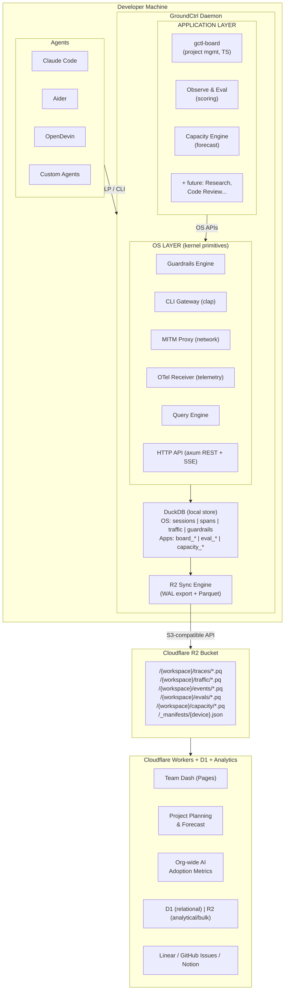

### 4.1. The Local Daemon

Runs in the background on the developer's machine.

* **MITM Proxy** (`gctl net proxy`) — Transparent HTTP proxy that intercepts all agent traffic to LLM APIs and external services. Logs to `traffic.jsonl`. Enables network-level guardrails.
* **Command Gateway** — All DevOps operations route through `gctl` (not bare `gh`, `aws`, `pulumi`). This creates a single audit log and enforcement point.
* **OTel Receiver** (`gctl otel`) — Accepts OTLP spans over HTTP, stores in DuckDB with full span hierarchy, session tracking, and cost attribution.
* **Eval Engine** (planned) — Runs prompt/agent evaluations locally, stores results alongside traces for correlation.
* **Capacity Engine** (planned) — Ingests issue tracker data (Linear, GitHub Issues, Notion), correlates with execution telemetry, produces throughput metrics and delivery forecasts.
* **Local DuckDB** — Embedded analytical DB for traces, traffic logs, GitHub events, eval results, and project/task data. Works fully offline.
* **R2 Sync Engine** — Asynchronous sync of local DuckDB data to Cloudflare R2 as Parquet files. See Section 4.4.

### 4.2. Tech Stack (Rust)

Already implemented in the prototype:

| Layer | Choice |
|-------|--------|
| **Language** | Rust (2021 edition) |
| **Async Runtime** | `tokio` (full) |
| **Web Framework** | `axum` 0.8 (OTel receiver, webhook listener) |
| **CLI** | `clap` (derive macros), plugin architecture |
| **HTTP Client** | `reqwest` 0.12 |
| **MITM Proxy** | `hudsucker` 0.24 (auto-CA generation) |
| **Web Crawling** | `spider` 2.0 + `dom_smoothie` (readability) |
| **Storage** | `duckdb` 1.0 (bundled, embedded) |
| **Cloud Sync** | `rust-s3` or `aws-sdk-s3` (R2 is S3-compatible) |
| **Export Format** | Apache Parquet via `arrow` + `parquet` crates |
| **AWS** | `aws-sdk-*` 1.0 (STS, ECS, CloudWatch) |
| **Serialization** | `serde` + `serde_json` |

Feature-gated compilation: `network`, `proxy`, `otel`, `gh-events`, `slack`, `r2-sync` — only compile what you need.

### 4.3. The Cloud Platform (Cloudflare Stack)

Fully built on Cloudflare for simplicity, global edge performance, and zero egress fees from R2.

| Layer | Cloudflare Service | Role |
|-------|-------------------|------|
| **Object Storage** | R2 | Parquet files for traces, traffic, events, evals, capacity data. Zero egress. S3-compatible API. |
| **Relational DB** | D1 (SQLite at edge) | Users, teams, workspaces, projects, permissions, issue metadata |
| **API** | Workers | Serverless API for dashboard, webhooks, issue tracker sync |
| **Frontend** | Pages | Dashboard SPA for team visibility, project planning, evals |
| **Auth** | Access / Zero Trust | SSO, team-based access control |
| **Cron / Triggers** | Workers Cron | Periodic aggregation, forecast recalculation, stale issue detection |
| **Notifications** | Workers + Queues | Alert delivery (Slack, email) for budget breaches, risk signals |

### 4.4. R2 Sync Engine (Local → Cloud)

The sync engine is the bridge between local-first DuckDB and the Cloudflare cloud layer. Design principles: **offline-first, eventually consistent, conflict-free, minimal bandwidth**.

#### How it works

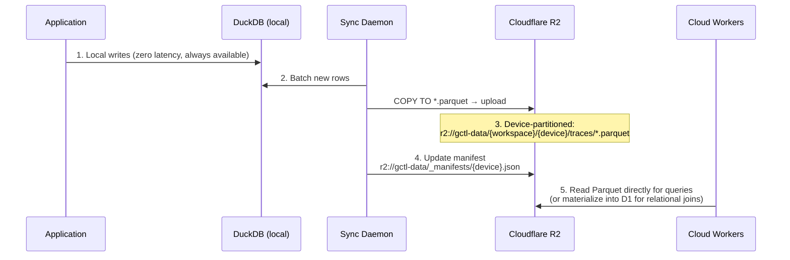

#### Sync modes

| Mode | Trigger | Use Case |
|------|---------|----------|
| **Periodic** | Every 5 min (configurable) | Default background sync |
| **On-session-end** | Agent session completes | Ensure completed work is synced promptly |
| **Manual** | `gctl sync push` | Developer forces immediate sync |
| **Pull** | `gctl sync pull` | Pull team data from R2 into local DuckDB for offline queries |

#### Conflict resolution

No conflicts by design — each device writes to its own R2 prefix. The cloud layer merges by reading all device partitions. This is an **append-only, partition-per-device** model:

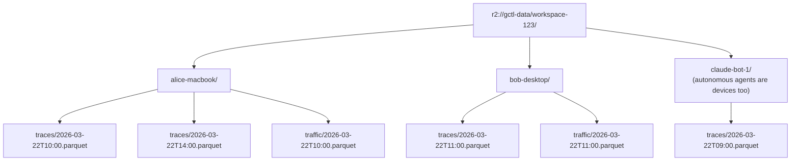

#### Why R2?

* **Zero egress fees** — Dashboard reads from R2 are free. Critical when multiple team members query frequently.
* **S3-compatible API** — Rust crates (`aws-sdk-s3`, `rust-s3`) work out of the box. No custom SDK needed.
* **Global edge** — R2 is distributed across Cloudflare's network. Low latency for globally distributed teams.
* **Parquet native** — Columnar format means Workers can read only the columns needed (e.g., cost data without full prompt text).
* **Cloudflare ecosystem** — Tight integration with Workers, D1, Pages. No cross-cloud data transfer.
* **Cost** — R2 storage is $0.015/GB/month with no egress. A team of 10 developers generating ~100MB/day of traces = ~$0.45/month.

#### Data lifecycle

```
gctl sync status
```

| Table   | Local  | Synced | Pending  |
|---------|--------|--------|----------|
| traces  | 4,821  | 4,500  | 321 rows |
| traffic | 12,044 | 12,044 | 0 rows   |
| events  | 892    | 890    | 2 rows   |
| evals   | 47     | 47     | 0 rows   |

Last sync: 3 min ago | Next: 2 min | R2 bucket: gctl-data

* **Local retention:** Configurable TTL (default 30 days). Old data pruned from DuckDB after sync confirmed.
* **R2 retention:** Configurable per workspace (default 90 days). Lifecycle rules auto-delete old Parquet files.
* **Compaction:** Workers cron job periodically merges small Parquet files per workspace into larger ones (reduces R2 read overhead).

### 4.5. R2 as Dual-Purpose Store: Analytics + Agent Knowledge

R2 is not just for analytics Parquet files — it is equally suited as the backing store for **agent-consumable markdown content**. The `gctl net crawl` and `gctl net fetch` features already convert web content to markdown locally. R2 unifies both workloads in one bucket, serving two fundamentally different access patterns from one storage layer.

#### The two data planes

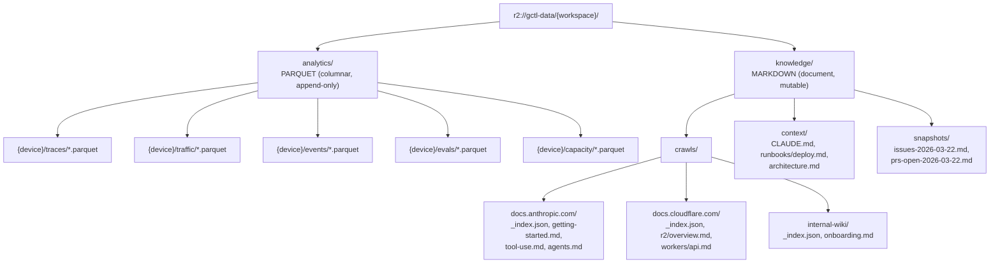

#### Why R2 works for both

| Dimension | Analytics (Parquet) | Agent Knowledge (Markdown) | R2 Fit |
|-----------|-------------------|--------------------------|--------|
| **Access pattern** | Scan columns across many rows | Fetch single documents by path | R2 handles both — columnar reads via byte-range requests, doc reads via simple GET |
| **Write pattern** | Append-only, batched | Overwrite on re-crawl, occasional updates | R2 supports both PUT (overwrite) and multipart upload (large batch) |
| **Read frequency** | Dashboard queries (periodic) | Agent context loading (per-session) | Zero egress means neither pattern costs more at scale |
| **Size per object** | 1-50 MB (batched Parquet) | 1-500 KB (single markdown page) | R2 has no minimum object size penalty unlike S3 IA/Glacier |
| **Concurrency** | Multiple dashboards reading | Multiple agents reading same docs | R2 is eventually consistent, fine for both (agents don't need strong consistency on docs) |
| **Caching** | Workers cache hot Parquet ranges | Workers/CDN cache hot markdown | Cloudflare CDN in front of R2 — automatic edge caching for frequently-read docs |
| **Versioning** | Immutable Parquet files (timestamp-partitioned) | Mutable markdown (overwrite on re-crawl) | R2 supports object versioning — enable for knowledge/ prefix to track doc changes over time |

#### Agent knowledge workflow

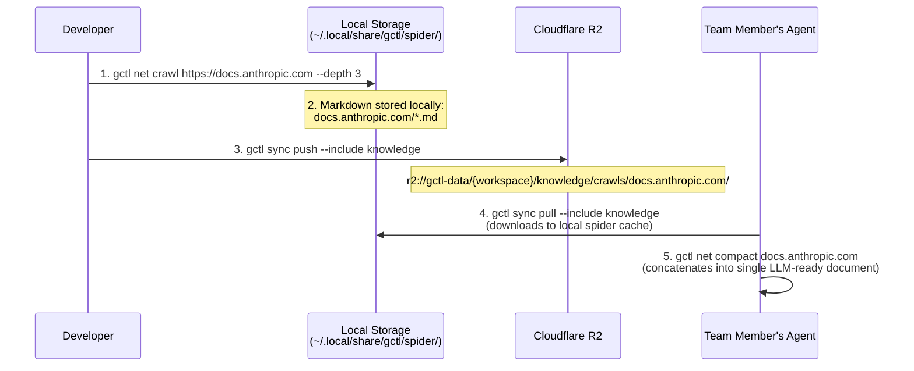

#### Shared agent context via R2

The `knowledge/context/` prefix stores team-wide agent configuration — shared CLAUDE.md files, runbooks, architecture docs — that every developer's agent should have access to:

```
gctl context push ./CLAUDE.md
  → r2://gctl-data/{workspace}/knowledge/context/CLAUDE.md

gctl context push ./docs/deploy-runbook.md --as runbooks/deploy.md
  → r2://gctl-data/{workspace}/knowledge/context/runbooks/deploy.md

gctl context pull
  → downloads all team context to ~/.local/share/gctl/context/
```

This means a new team member's agent immediately has access to:
- Crawled documentation for all libraries the team uses
- Shared prompt configs and CLAUDE.md conventions
- Operational runbooks for deploy, incident response, etc.
- Architecture docs that inform agent decision-making

#### Issue/PR snapshots for agent context

The capacity engine (Pillar 4) periodically snapshots issue tracker and PR state as markdown, synced to R2:

```
gctl project snapshot --format markdown
  → knowledge/snapshots/issues-2026-03-22.md
  → knowledge/snapshots/prs-open-2026-03-22.md
```

Agents can load these snapshots as context to understand:
- What issues are in flight and who's working on them
- What PRs need review and their current status
- What the team is focused on this sprint

This bridges the gap between project management tools (Linear, GitHub Issues) and agent context windows — agents don't need API access to issue trackers, they just read markdown snapshots from R2.

#### Why not separate stores?

| Alternative | Problem |
|-------------|---------|
| **S3 for Parquet + R2 for markdown** | Cross-cloud egress costs. Two billing accounts. Two auth systems. |
| **R2 for Parquet + D1 for markdown** | D1 has a 10MB row limit and isn't designed for document storage. Markdown files vary wildly in size. |
| **R2 for Parquet + KV for markdown** | KV has a 25MB value limit (fine for markdown) but no prefix listing, no versioning, no lifecycle rules. Can't browse a crawled site's directory structure. |
| **Separate R2 buckets** | Unnecessary operational overhead. One bucket with prefix-based separation (`analytics/` vs `knowledge/`) is simpler, and Workers can apply different caching/access rules per prefix. |

**One R2 bucket, two prefixes, two data planes.** Analytics is Parquet, append-only, device-partitioned. Knowledge is markdown, mutable, domain-organized. Both benefit from zero egress, S3 compatibility, and Cloudflare edge caching. The simplicity of a single storage layer that serves both structured analytics and unstructured agent context is the architectural win.

#### Cost model (combined)

```
Analytics:  10 devs × 100MB/day × 30 days = 30 GB     → $0.45/month
Knowledge:  50 crawled sites × 5MB avg    = 250 MB     → $0.004/month
Context:    shared docs + snapshots        = ~50 MB     → $0.001/month
                                                 Total: ~$0.46/month

Compare: S3 equivalent with egress for dashboard reads = $5-15/month
```

## 5. Pillar 1: Guardrails

### 5.1. Permission Enforcement

Agents operate within an **allowlist model**. GroundCtrl enforces what commands an agent can execute:

```json
// .claude/settings.local.json — already implemented
{
  "permissions": {
    "allow": [
      "Bash(./target/release/gctl:*)",
      "Bash(git commit:*)",
      "Bash(cargo build:*)"
    ]
  }
}
```

All DevOps operations must go through `gctl` — this is the enforcement boundary. An agent cannot `gh pr merge` directly; it must use `gctl gh pr merge`, which can apply additional policy checks.

### 5.2. Network Control (MITM Proxy)

The proxy (`gctl net proxy`) provides network-level guardrails:

* **Domain Allowlisting** — Restrict which external APIs/hosts agents can reach.
* **Request Logging** — Every HTTP request logged with method, URL, status, size, duration to `traffic.jsonl`.
* **Rate Limiting** — Throttle requests to prevent runaway agents from hammering APIs.
* **Traffic Analytics** — `gctl net stats/daily/analytics` to audit all network activity.

### 5.3. Cost Limits & Circuit Breakers

* **Session Budget** — Halt agent execution if a session exceeds a configurable token/dollar threshold (e.g., "Pause if session > $5.00").
* **Loop Detection** — Flag when an agent calls the same file/command repeatedly without progress (Error Loop Frequency metric).
* **Diff Size Gate** — Alert or pause if an agent produces an unusually large diff (potential runaway refactor).

### 5.4. Git Safety

* **Branch Protection** — Enforce feature branches; block direct pushes to main/master.
* **Force Push Prevention** — Block `--force` pushes through the CLI layer.
* **Diff Capture** — Snapshot git state before/after agent execution for rollback capability.

### 5.5. Agent Data Access Layer (`gctl query`)

Claude Code and other agents **cannot read DuckDB binary files** via their built-in file reading tools. The Read tool only handles text/image formats. This means the local DuckDB — full of traces, traffic logs, eval results, project data — is invisible to agents unless GroundCtrl explicitly exposes it.

This is a design constraint that becomes a **feature**: GroundCtrl controls what data agents can see, how much of it, and in what format. The agent never gets raw database access — it gets curated, guardrailed query results.

#### `gctl query` — general-purpose agent data interface

```
gctl query <domain> <question-or-sql> [--format table|json|markdown|csv]
                                       [--limit 100]
                                       [--output .tmp/result.md]
```

Three access modes, from safest to most powerful:

**1. Pre-built queries (existing)** — Named commands with fixed schemas:
```
gctl otel sessions                     → list recent agent sessions
gctl otel analytics                    → p50/p95 latency, cost/model
gctl capacity status --team backend    → workload overview
gctl project health --milestone v2.0   → risk dashboard
gctl net stats                         → traffic summary
```
These are the primary interface. Safe, fast, output designed for agent consumption.

**2. Natural language queries (planned)** — Agent describes what it wants, GroundCtrl translates to SQL:
```
gctl query traces "sessions where cost > $2 in the last 7 days"
gctl query capacity "which developer closed the most issues last week"
gctl query traffic "top 10 domains by request count today"
```
GroundCtrl validates the generated SQL against a read-only allowlist of tables/columns before execution. Prevents agents from reading sensitive columns (e.g., raw prompt text) unless explicitly permitted.

**3. Raw SQL (opt-in, power users)** — Direct DuckDB SQL, gated behind a config flag:
```
gctl query sql "SELECT agent_name, SUM(cost_usd) FROM spans
                WHERE created_at > now() - INTERVAL '7 days'
                GROUP BY agent_name ORDER BY 2 DESC"
  --format markdown --output .tmp/agent-costs.md
```
Disabled by default. Enabled via `config.toml`:
```toml
[query]
allow_raw_sql = true          # default: false
max_rows = 1000               # prevent unbounded result sets
blocked_columns = ["raw_prompt", "raw_response"]  # redact sensitive data
read_only = true              # always — no writes via query interface
```

#### Output for agent consumption

The `--output` flag writes results to a file that Claude Code can then read with the Read tool:

```
# Agent workflow:
# 1. Bash: gctl query traces "failed sessions today" --format markdown --output .tmp/failed-sessions.md
# 2. Read: .tmp/failed-sessions.md
# 3. Agent now has structured data in its context window
```

The `--format markdown` mode is optimized for LLM consumption — tables with headers, not raw JSON. The `--format json` mode is available for structured parsing.

#### Why not just install the `duckdb` CLI?

| Approach | Problem |
|----------|---------|
| **`duckdb` CLI directly** | No guardrails. Agent can read raw prompts, responses, secrets. No query limits. No audit log. Requires separate install. |
| **MCP server for DuckDB** | Heavy setup. Requires running a persistent server. Another process to manage. |
| **Export to CSV/JSON then Read** | Manual, slow. No caching. Agent must know DuckDB schema to request the right export. |
| **`gctl query` (this approach)** | Guardrailed. Column-level redaction. Read-only. Audit logged. Output formatted for agents. Installed with GroundCtrl. Zero config for safe mode. |

#### Agent self-awareness

This query layer enables a powerful pattern: **agents that understand their own performance**.

```
# An agent checking its own cost before continuing:
gctl query traces "my current session cost"
→ Session sess-4821: $1.87 (14.2k tokens, 23 tool calls)

# An agent learning from past failures on similar tasks:
gctl query evals "failed runs on tasks tagged 'auth'" --limit 5 --format markdown
→ Table of 5 failed sessions with failure reasons

# An agent checking if it's in a loop:
gctl query traces "repeated tool calls in current session"
→ WARNING: read_file called 8 times on src/auth.rs in last 5 minutes
```

Combined with guardrails (Section 5.3), this creates a feedback loop: the agent can detect it's stuck or expensive and adjust its approach — or the guardrail engine can halt it.

#### R2 knowledge access via query

The query interface also bridges to the R2 knowledge layer (Section 4.5):

```
# List available crawled documentation:
gctl query knowledge "list crawled sites"
→ docs.anthropic.com (142 pages, crawled 2026-03-20)
→ docs.cloudflare.com (89 pages, crawled 2026-03-21)

# Search across crawled docs:
gctl query knowledge "cloudflare r2 lifecycle rules"
→ Matches in: docs.cloudflare.com/r2/buckets/object-lifecycles.md (lines 12-34)

# Load a specific doc into context:
gctl net compact docs.anthropic.com/tool-use --output .tmp/tool-use.md
```

The local spider cache and R2-synced knowledge are both searchable through the same interface. If a doc is cached locally, it reads from disk. If not, it pulls from R2.

## 6. Pillar 2: Unified DevOps CLI

All agent-initiated infrastructure operations go through GroundCtrl's plugin system:

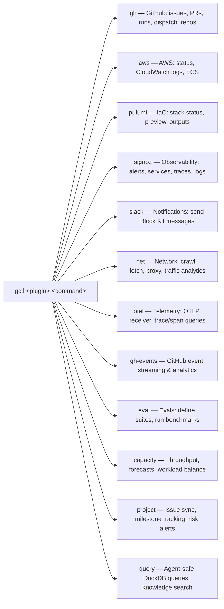

### Why route everything through GroundCtrl?

1. **Single audit log** — Every operation is recorded, attributable to an agent + session.
2. **Caching** — TTL-based response cache (120s reads, 30s CI checks) with auto-invalidation after writes. Prevents agents from hammering APIs.
3. **Consistent interface** — Agents don't need to know the quirks of `gh` vs `aws` vs `pulumi` CLIs.
4. **Policy enforcement** — The CLI layer can check permissions, budgets, and policies before executing.
5. **Offline resilience** — Cached data available when network is unreliable.

## 7. Pillar 3: Observe & Eval — Langfuse-Grade Analytics, Local-First

> **GroundCtrl's observability layer is a local-first alternative to Langfuse.** Same depth of trace inspection, cost analytics, eval scoring, and prompt management — but running entirely on your machine in DuckDB, with optional cloud sync to R2 for team dashboards. No data leaves your laptop unless you explicitly sync it.

### 7.1. Telemetry & Trace Capture

* **OTLP Receiver** — `gctl otel` accepts OpenTelemetry spans over HTTP (port 4318).
* **Data Captured per Span:** trace_id, session_id, agent_name, model, input/output tokens, cost (USD), tool calls, execution results, status, duration.
* **Storage:** DuckDB with full span hierarchy. Queryable via `gctl otel sessions/traces/spans/analytics`.
* **Langfuse-inspired schema:** Session → Trace → Span model, with cost attribution at every level.

#### Trace Hierarchy (Langfuse-compatible)

GroundCtrl adopts Langfuse's **Session → Trace → Observation** model but extends it for coding agents:

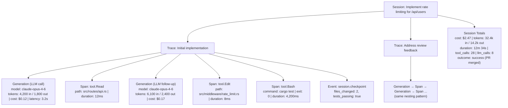

#### Observation Types

Like Langfuse, GroundCtrl distinguishes three observation types within a trace:

| Type | Description | Key Fields |
|------|-------------|------------|
| **Generation** | LLM API call (the core unit of AI cost) | model, input/output tokens, cost, latency, prompt, completion, tool_calls |
| **Span** | Tool execution or logical grouping | name, input, output, duration, status |
| **Event** | Point-in-time marker (no duration) | name, metadata (e.g., "test passed", "git commit") |

#### Span Metadata & Tagging

Every observation can carry arbitrary metadata for filtering and grouping:

```
gctl otel tag <session_id> --key "project" --value "api-server"
gctl otel tag <session_id> --key "task_type" --value "bug_fix"
gctl otel tag <session_id> --key "prompt_version" --value "v2.3"
```

Built-in auto-tags (extracted from context):
- `agent.name` — Which agent (claude-code, aider, custom)
- `agent.model` — Primary model used
- `git.branch` — Active branch during session
- `git.repo` — Repository name
- `issue.id` — Linked issue (from gctl-board or external tracker)
- `prompt.hash` — SHA256 of the active CLAUDE.md / system prompt

### 7.2. Analytics Dashboard

> **Goal: Every metric Langfuse shows in its dashboard, GroundCtrl can produce from local DuckDB — via CLI, HTTP API, or web UI.**

#### 7.2.1. Cost & Token Analytics

```
gctl analytics cost --window 7d

=== Cost Analytics (last 7 days) ===

Total spend:     $42.18
Total tokens:    1,284,000 (892k in / 392k out)
Total sessions:  67
Total traces:    214
Total LLM calls: 1,847
```

| Model           | Cost   | Calls | Avg $/c | % Total |
|-----------------|--------|-------|---------|---------|
| claude-opus-4-6 | $31.24 | 892   | $0.035  | 74.1%   |
| claude-sonnet   | $8.47  | 743   | $0.011  | 20.1%   |
| claude-haiku    | $2.47  | 212   | $0.012  | 5.9%    |

| Agent        | Cost   | Sessions | Avg $/s | Success% |
|--------------|--------|----------|---------|----------|
| claude-code  | $28.90 | 42       | $0.69   | 88%      |
| claude-bot-1 | $8.12  | 18       | $0.45   | 72%      |
| aider        | $5.16  | 7        | $0.74   | 100%     |

```
Daily trend:
  Mon: ################  $8.12  (14 sessions)
  Tue: ##############    $7.44  (12 sessions)
  Wed: ############      $6.20  (9 sessions)
  Thu: ################## $9.02 (15 sessions)
  Fri: ############      $5.88  (8 sessions)
  Sat: ####              $2.40  (4 sessions)
  Sun: ######            $3.12  (5 sessions)
```

#### 7.2.2. Latency Analytics

```
gctl analytics latency --window 7d

=== Latency Analytics (last 7 days) ===
```

LLM Call Latency:

| Model           | p50  | p75  | p90  | p95   | p99   |
|-----------------|------|------|------|-------|-------|
| claude-opus-4-6 | 3.2s | 5.1s | 8.4s | 12.1s | 22.3s |
| claude-sonnet   | 1.1s | 1.8s | 3.2s | 4.5s  | 8.1s  |
| claude-haiku    | 0.4s | 0.7s | 1.1s | 1.5s  | 2.8s  |

```
Time-to-First-Token (TTFT):
  claude-opus-4-6:  p50=0.8s  p95=2.1s
  claude-sonnet:    p50=0.3s  p95=0.9s
  claude-haiku:     p50=0.1s  p95=0.4s

Tokens per Second (output):
  claude-opus-4-6:  p50=62 tok/s  p95=38 tok/s
  claude-sonnet:    p50=89 tok/s  p95=52 tok/s
  claude-haiku:     p50=120 tok/s p95=78 tok/s

Session Duration Distribution:
  < 1 min:   ##################  27%
  1-5 min:   ################################  48%
  5-15 min:  ##############  21%
  15-30 min: ##        3%
  > 30 min:  #         1%
```

#### 7.2.3. Trace Explorer (Langfuse-style)

Interactive trace browsing — the core Langfuse feature, replicated locally:

```
gctl analytics traces --window 24h --sort cost-desc --limit 20
```

| Session            | Agent        | Cost  | Tokens | Dur | Status |
|--------------------|--------------|-------|--------|-----|--------|
| Implement auth...  | claude-code  | $3.42 | 28.4k  | 18m | ✓ done |
| Fix flaky test...  | claude-bot-1 | $2.18 | 16.2k  | 12m | ✓ done |
| Migrate schema...  | claude-code  | $1.87 | 14.8k  | 9m  | ✗ fail |
| Update API docs... | docs-bot     | $0.34 | 4.2k   | 2m  | ✓ done |
| ...                |              |       |        |     |        |

Drill into a session:

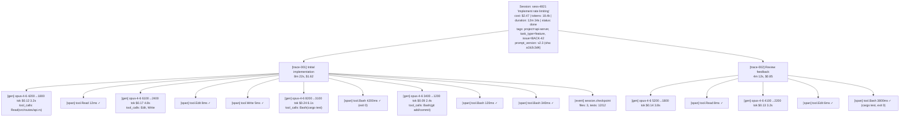

#### 7.2.4. Generation Detail View

Deep inspection of a single LLM call (like Langfuse's generation detail panel):

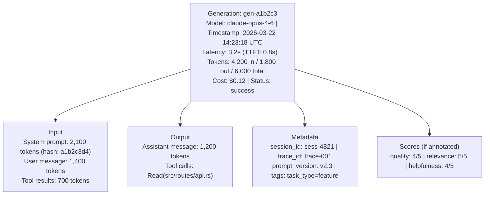

### 7.3. Scoring & Annotation

> **Langfuse's scoring system lets users rate LLM outputs. GroundCtrl extends this for coding agents — scores can be human-annotated or machine-computed.**

#### Score Types

| Score Type | Source | Example |
|-----------|--------|---------|
| **Human annotation** | Developer rates a generation/session | quality: 4/5, "good approach but missed edge case" |
| **Automated (rule-based)** | Computed from observable state | tests_pass: 1/1, lint_clean: 1/1, build_success: 1/1 |
| **Automated (model-based)** | LLM-as-judge evaluates output | code_quality: 3.7/5.0 (evaluated by gpt-4o-mini) |
| **Outcome-based** | Derived from downstream events | pr_merged: true, code_reverted: false, issue_closed: true |

#### Score CLI

```
# Human annotation
gctl analytics score <session_id> --name quality --value 4 --comment "Clean implementation"
gctl analytics score <generation_id> --name relevance --value 5

# Automated scoring (runs after session completes)
gctl analytics auto-score <session_id>
→ tests_pass:    ✓ (1/1)
→ lint_clean:    ✓ (1/1)
→ build_success: ✓ (1/1)
→ diff_size:     moderate (142 lines)
→ tool_loops:    none detected
→ cost_efficiency: $0.017/line

# Batch scoring
gctl analytics auto-score --window 7d --unscored-only
→ Scored 23 sessions. Summary: 87% pass rate, avg $0.62/session.
```

#### Score Dashboard

```
gctl analytics scores --window 30d

=== Score Summary (last 30 days) ===
```

Automated Scores:

| Score          | Pass | Fail | Rate  | Trend   |
|----------------|------|------|-------|---------|
| tests_pass     | 187  | 27   | 87.4% | ↑ +2.1% |
| lint_clean     | 201  | 13   | 93.9% | ↔ 0.0%  |
| build_success  | 208  | 6    | 97.2% | ↑ +0.8% |
| pr_merged      | 142  | 31   | 82.1% | ↓ -1.4% |
| no_error_loops | 194  | 20   | 90.7% | ↑ +3.2% |

```
Human Scores (where annotated):
  quality:      avg 3.8/5  (n=42)
  relevance:    avg 4.2/5  (n=38)
  helpfulness:  avg 4.0/5  (n=35)

Cost per Successful Session:
  Overall:      $0.74  (down from $0.92 last month)
  claude-code:  $0.82
  claude-bot:   $0.51
  aider:        $0.68
```

### 7.4. Prompt Management

> **Like Langfuse's prompt management, but for CLAUDE.md files and agent system prompts — version-tracked, A/B tested, and correlated with execution outcomes.**

#### Prompt Versioning

Every time an agent session starts, GroundCtrl captures and hashes the active prompt configuration:

```
gctl analytics prompts
```

| Version | Prompt File       | Hash     | Sessions | Avg Cost | Pass % |
|---------|-------------------|----------|----------|----------|--------|
| v2.3    | .claude/CLAUDE.md | a1b2c3d4 | 42       | $0.69    | 88%    |
| v2.2    | .claude/CLAUDE.md | e5f6g7h8 | 31       | $0.87    | 81%    |
| v2.1    | .claude/CLAUDE.md | i9j0k1l2 | 18       | $1.12    | 72%    |
| v1.0    | AGENTS.md         | m3n4o5p6 | 8        | $0.45    | 63%    |

Insight: v2.3 is 22% cheaper and 16% more successful than v2.1.
Main change: added "prefer editing over creating files" instruction.

#### Prompt Diff & Impact Analysis

```
gctl analytics prompt-diff v2.2 v2.3

--- v2.2 (hash: e5f6g7h8)
+++ v2.3 (hash: a1b2c3d4)

@@ Section: Coding Conventions @@
+ - Prefer editing existing files over creating new ones
+ - Always run tests after making changes
- - Write comprehensive docstrings for all public functions

Impact Analysis (v2.2 → v2.3):
  Sessions compared: 31 vs 42
  Avg cost:          $0.87 → $0.69  (-21%)
  Pass rate:         81% → 88%      (+7%)
  Avg tool calls:    24 → 19        (-21%)
  Avg file creates:  3.2 → 1.1      (-66%)  ← direct impact of new rule
  Avg test runs:     1.4 → 2.8      (+100%) ← direct impact of new rule
```

#### Prompt A/B Testing

```
gctl analytics prompt-ab \
  --control ./claude-md-v2.2.md \
  --variant ./claude-md-v2.3.md \
  --metric pass_rate --metric cost \
  --sessions 50

A/B Test Results (n=50 per group):

                 Control (v2.2)    Variant (v2.3)    Delta       Sig?
  Pass rate:     82% (41/50)       90% (45/50)       +8%         p=0.04 ✓
  Avg cost:      $0.84             $0.67             -20%         p=0.01 ✓
  Avg duration:  8.2 min           6.8 min           -17%         p=0.03 ✓
  Avg tokens:    14.2k             11.8k             -17%         p=0.02 ✓
  Error loops:   12% of sessions   6% of sessions    -50%         p=0.08

Recommendation: Deploy variant (v2.3). Statistically significant improvement
                in pass rate and cost. Error loop reduction trending but
                needs more data.
```

#### Prompt Token Budget Analysis

```
gctl analytics prompt-tokens <prompt_hash>

Prompt Token Budget (hash: a1b2c3d4, 2,100 tokens)
```

| Section                  | Tokens | % Bud | Influence Score |
|--------------------------|--------|-------|-----------------|
| System identity          | 180    | 8.6%  | high            |
| Coding conventions       | 420    | 20.0% | highest         |
| Git workflow             | 290    | 13.8% | high            |
| Tool usage rules         | 380    | 18.1% | high            |
| Output formatting        | 210    | 10.0% | medium          |
| Project-specific context | 340    | 16.2% | medium-high     |
| Examples                 | 280    | 13.3% | low             |

*Influence score: correlation between section content and tool call patterns.
"Examples" section consumes 13% of budget but has low measured influence.
Consider reducing examples to save ~280 tokens/call (saves ~$0.02/session).*

### 7.5. User & Session Analytics

#### User-Level Dashboard (Langfuse-style)

```
gctl analytics users --window 30d

=== User Analytics (last 30 days) ===
```

| User/Agent   | Sessions | Cost   | Tokens | Pass% | Avg $/s | Trend  |
|--------------|----------|--------|--------|-------|---------|--------|
| alice        | 42       | $28.90 | 892k   | 88%   | $0.69   | ↑ +12% |
| bob          | 31       | $18.40 | 612k   | 81%   | $0.59   | ↔ 0%   |
| claude-bot-1 | 67       | $31.20 | 1,024k | 72%   | $0.47   | ↑ +8%  |
| claude-bot-2 | 28       | $12.80 | 420k   | 82%   | $0.46   | new    |
| docs-bot     | 14       | $2.40  | 84k    | 100%  | $0.17   | ↔ 0%   |

Drill into a user:

```
gctl analytics user alice --window 7d

=== alice — Last 7 Days ===

Sessions: 12 │ Cost: $8.24 │ Tokens: 284k │ Pass rate: 92%

Model Usage:
  claude-opus-4-6:  $6.12 (74%) │ 8 sessions
  claude-sonnet:    $2.12 (26%) │ 4 sessions

Session Outcomes:
  ✓ Completed:  11 (92%)
  ✗ Failed:     1  (8%)  ← sess-5012: error loop on test fixture

Top Tags:
  task_type=feature:   7 sessions ($5.40)
  task_type=bug_fix:   3 sessions ($1.84)
  task_type=refactor:  2 sessions ($1.00)

Daily Activity:
  Mon: ███  3 sessions
  Tue: ██   2 sessions
  Wed: ███  3 sessions
  Thu: ██   2 sessions
  Fri: ██   2 sessions
```

### 7.6. Real-Time Monitoring

#### Live Session Feed

```
gctl analytics live

=== Live Sessions ===  (auto-refreshes every 5s)

● sess-5821  alice+claude-code   "Add webhook retry logic"
  │ Running 4m 12s │ $0.82 │ 12.4k tokens │ 6 tool calls
  │ Last: [gen] claude-opus-4-6 → Edit("src/webhooks/retry.rs")
  │
● sess-5822  claude-bot-1        "Fix pagination offset bug"
  │ Running 2m 08s │ $0.34 │ 6.2k tokens │ 3 tool calls
  │ Last: [span] tool.Bash("cargo test -- pagination")
  │
◌ sess-5820  bob+claude-code     "Migrate to new auth provider"
  │ Completed 8m ago │ $1.24 │ 18.8k tokens │ ✓ tests pass
```

#### Alerting & Anomaly Detection

```
gctl analytics alerts

Active Alerts:
  ⚠ [cost] claude-bot-1 session sess-5815 exceeded $5.00 budget (current: $5.42)
  ⚠ [loop] alice session sess-5821 has 4 consecutive Read calls on same file
  ⚠ [latency] claude-opus-4-6 p95 latency spiked to 18.2s (baseline: 12.1s)
  ℹ [trend] Overall pass rate dropped from 88% to 82% this week

Alert Rules:
  gctl analytics alert create --name "budget-breach" \
    --condition "session.cost > 5.00" --action warn
  gctl analytics alert create --name "error-loop" \
    --condition "session.repeated_tool_calls > 3" --action pause
  gctl analytics alert create --name "latency-spike" \
    --condition "model.p95_latency > 2x baseline" --action notify
```

### 7.7. Context Indexing

* Link traces to git diffs — capture file changes produced during a specific trace span.
* Index terminal output (errors/warnings) that prompted agent actions.
* Semantic search over trace context (e.g., "Find the trace where Claude updated the auth middleware").

### 7.8. Evals & Prompt Analytics (For Developers)

Unlike Langfuse/Braintrust which evaluate production chatbot quality, GroundCtrl evaluates **developer agent effectiveness**. Inspired by [OpenAI Agents SDK evals](https://developers.openai.com/cookbook/examples/agents_sdk/evaluate_agents) but adapted for coding agents.

#### What we evaluate

| Metric | What it measures | How |
|--------|-----------------|-----|
| **Task Completion Rate** | Did the agent actually solve the issue? | Compare agent output against expected state (test pass, lint clean, issue closed) |
| **Code Acceptance Rate** | % of agent-generated code that gets committed vs. reverted | Track diffs through git history post-session |
| **Cost Efficiency** | Tokens/dollars spent per successful task | Correlate cost spans with completion outcomes |
| **Tool Call Accuracy** | Did the agent call the right tools in the right order? | Score tool call sequences against known-good patterns |
| **Error Loop Frequency** | How often the agent retries the same failing approach | Detect repeated identical tool calls within a span |
| **Time-to-Resolution** | Wall clock time from issue assignment to PR merge | Correlate GitHub events with trace timestamps |
| **Prompt Effectiveness** | Which system prompts / CLAUDE.md configs yield better outcomes | A/B compare sessions with different prompt configurations |

#### Eval workflow

```
1. Define eval suite:
   gctl eval create --name "auth-refactor" \
     --criteria "tests pass" "no lint errors" "PR approved"

2. Run agent with eval tracking:
   gctl eval run --suite "auth-refactor" --agent "claude-code" \
     --prompt-config ./claude-md-v2.md

3. Agent executes normally (traces captured via OTel)

4. Eval engine scores the session:
   gctl eval results --suite "auth-refactor"
   | Run     | Agent  | Score | Cost  | Time   |
   |---------|--------|-------|-------|--------|
   | run-001 | claude | 3/3   | $1.24 | 4m 12s |
   | run-002 | aider  | 2/3   | $0.87 | 6m 30s |

5. Compare prompt configs:
   gctl eval compare --suite "auth-refactor" \
     --config-a ./claude-md-v1.md --config-b ./claude-md-v2.md
```

#### Eval Datasets & Benchmarks

```
# Create dataset from real sessions
gctl eval dataset create --from-sessions "last 7 days" \
  --filter "completed=true AND score.quality >= 4" \
  --output ./evals/dataset.jsonl

# Run benchmark across agents
gctl eval benchmark --dataset ./evals/dataset.jsonl \
  --agents "claude-code,aider" \
  --models "claude-opus-4-6,claude-sonnet-4-6"

Benchmark Results (dataset: 24 tasks):
| Agent + Model            | Pass  | Avg Cost | Avg Time | Loops |
|--------------------------|-------|----------|----------|-------|
| claude-code + opus-4-6   | 22/24 | $0.82    | 6.4m     | 2     |
| claude-code + sonnet-4-6 | 19/24 | $0.34    | 4.2m     | 5     |
| aider + opus-4-6         | 20/24 | $0.91    | 8.1m     | 3     |
| aider + sonnet-4-6       | 17/24 | $0.42    | 5.8m     | 7     |

Best cost-efficiency: claude-code + sonnet-4-6 ($0.018/passing task)
Best pass rate:       claude-code + opus-4-6 (91.7%)
```

### 7.9. HTTP API for Analytics (Langfuse-Compatible Endpoints)

All analytics are accessible via HTTP API when the daemon is running. Designed to be consumed by web dashboards, CI scripts, or external tools.

```
GET  /api/analytics/cost          ?window=7d&group_by=model
GET  /api/analytics/latency       ?window=7d&model=claude-opus-4-6&percentiles=50,95,99
GET  /api/analytics/traces        ?window=24h&sort=cost&order=desc&limit=50
GET  /api/analytics/trace/:id     (full trace tree with all observations)
GET  /api/analytics/generation/:id (single LLM call detail)
GET  /api/analytics/users         ?window=30d
GET  /api/analytics/user/:id      ?window=7d
GET  /api/analytics/scores        ?window=30d&name=tests_pass
GET  /api/analytics/prompts       ?window=30d
GET  /api/analytics/prompt/:hash  (token budget breakdown)
GET  /api/analytics/live          (SSE stream of active sessions)
GET  /api/analytics/alerts        (active alerts)
GET  /api/analytics/daily         ?days=30  (daily aggregates for charts)

POST /api/analytics/score         { target_id, name, value, comment }
POST /api/analytics/tag           { target_id, key, value }
POST /api/analytics/alert         { name, condition, action }
```

#### Daily Aggregates for Charting

```
GET /api/analytics/daily?days=14&metrics=cost,sessions,tokens,pass_rate

[
  { "date": "2026-03-08", "cost": 5.42, "sessions": 8, "tokens": 184000, "pass_rate": 0.875 },
  { "date": "2026-03-09", "cost": 7.18, "sessions": 12, "tokens": 241000, "pass_rate": 0.833 },
  { "date": "2026-03-10", "cost": 6.90, "sessions": 11, "tokens": 228000, "pass_rate": 0.909 },
  ...
]
```

This powers time-series charts in the web UI — cost trends, token usage, pass rates over time — exactly like Langfuse's dashboard but from local data.

### 7.10. Web Dashboard (Local)

A local web UI served by `gctl serve` at `http://localhost:4318/dashboard`. Provides visual equivalents of all CLI analytics.

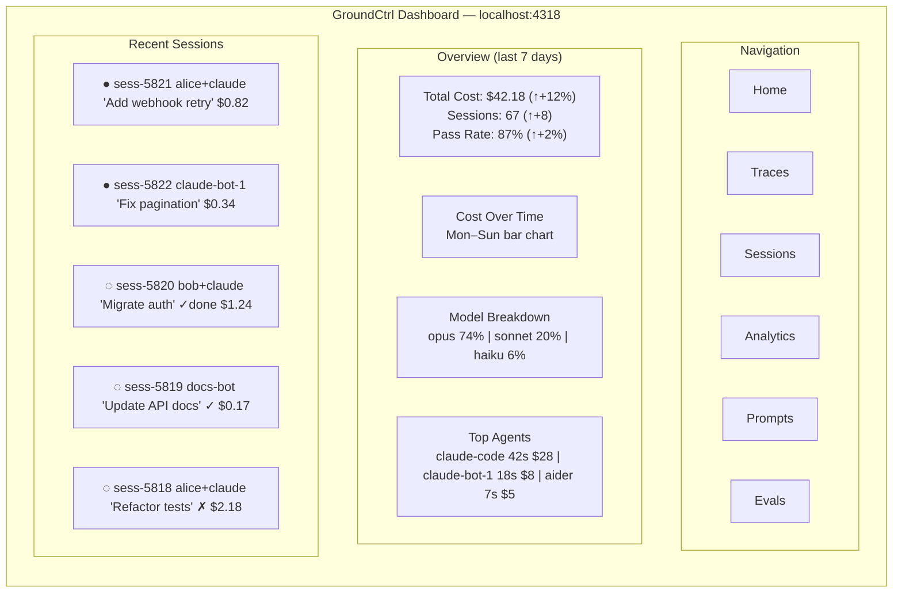

Dashboard pages:

| Page | Content | Langfuse Equivalent |
|------|---------|-------------------|
| **Home** | Overview cards, cost chart, recent sessions, alerts | Dashboard |
| **Traces** | Searchable/filterable trace list, drill into tree view | Traces |
| **Sessions** | Session list grouped by user/agent, timeline view | Sessions |
| **Analytics** | Cost/latency/token charts, model comparison, daily trends | Metrics |
| **Prompts** | Prompt versions, diff view, A/B test results, token budget | Prompts |
| **Evals** | Eval suites, benchmark results, score distributions | Evals |
| **Scores** | Score overview, annotation interface, quality trends | Scores |
| **Users** | Per-user/agent analytics, activity heatmaps | Users |

#### Technology

The dashboard is a lightweight local web app:
- **Option A**: Static SPA (React/Solid) served from the Rust binary, queries `/api/analytics/*` endpoints
- **Option B**: Server-rendered HTMX pages generated by the Rust daemon (zero JS build step)
- **Option C**: Effect Platform (from gctl-board) serves both board UI and analytics UI

All options read from the same DuckDB + HTTP API. The dashboard is purely a visualization layer — all data logic lives in the API.

### 7.11. Comparison: GroundCtrl vs Langfuse

| Feature | Langfuse | GroundCtrl |
|---------|----------|------------|
| **Deployment** | Cloud SaaS or self-hosted server | Local daemon on developer machine |
| **Storage** | PostgreSQL + ClickHouse | DuckDB (embedded, zero ops) |
| **Data residency** | Your server or Langfuse cloud | Your laptop (never leaves unless synced) |
| **Trace model** | Session → Trace → Observation | Same hierarchy, extended for coding agents |
| **Cost tracking** | Per-generation, per-trace | Per-generation + per-session + per-issue + per-sprint |
| **Scoring** | Human + automated | Human + automated + outcome-based (PR merged, tests pass) |
| **Prompt management** | Version, deploy, A/B test | Same + CLAUDE.md-aware + token budget analysis |
| **Evals** | Dataset-based eval runs | Same + coding-specific metrics (acceptance rate, tool loops) |
| **User analytics** | Per-user usage metrics | Same + agent-as-user + human+agent pair analytics |
| **Integration** | SDK (Python, JS, etc.) | OTel protocol (any language) + MITM proxy (zero code) |
| **Real-time** | WebSocket updates | SSE live feed + CLI watch mode |
| **Dashboard** | Web UI (React) | Local web UI + full CLI equivalents |
| **Offline** | Requires server connection | Fully offline, sync when ready |
| **Cost** | Free tier + paid plans | Free forever (runs on your machine) |
| **Team sharing** | Built-in (server-based) | R2 sync for team dashboards |
| **Project management** | None | gctl-board integration (issues ↔ traces) |

### 7.12. GitHub Integration

* **PR Enrichment** — GitHub App auto-comments on PRs with agent summary (tokens, cost, trace link, eval score).
* **Session Sharing** — Secure shareable links to agent traces for team review.
* **Event Capture** — Webhook listener + polling for GitHub events, stored in DuckDB for correlation with agent traces.

## 8. Pillar 4: Developer Capacity

Traditional capacity planning treats developers as interchangeable units with gut-feel velocity estimates. In an AI-augmented world, the unit of work is a **developer+agent pair**, and GroundCtrl has the execution data to measure actual capacity — not estimate it.

### 8.1. Throughput Measurement

GroundCtrl correlates three data sources to produce real throughput metrics:

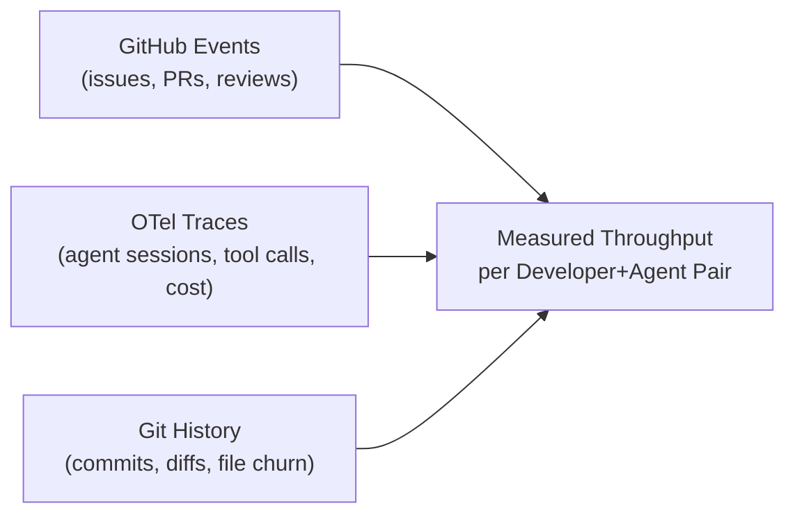

| Metric | Definition | Source |
|--------|-----------|--------|
| **Issues Closed / Week** | Completed work items per developer | GitHub Events |
| **Agent-Assisted %** | Fraction of closed issues that had agent sessions | OTel + GH correlation |
| **Effective Cost per Issue** | Total tokens + compute + developer time per issue | OTel cost + GH timestamps |
| **Code Churn Rate** | % of agent-generated lines modified within 7 days | Git diff tracking |
| **Review Turnaround** | Time from PR open to first review | GH Events |
| **Cycle Time** | Issue created → PR merged | GH Events + OTel |
| **Agent Leverage Ratio** | Lines shipped per $ spent on agent tokens | OTel + Git |

### 8.2. Workload Modeling

```
gctl capacity status --team "backend"
```

| Developer    | Active | In Review | Blocked | Agent Sessions |
|--------------|--------|-----------|---------|----------------|
| alice        | 3      | 1         | 0       | 12 today       |
| bob          | 2      | 3         | 1       | 4 today        |
| carol        | 1      | 0         | 0       | 8 today        |
| *agents*     |        |           |         |                |
| claude-bot-1 | 1      | 2         | 0       | autonomous     |
| claude-bot-2 | 0      | 1         | 0       | autonomous     |

Utilization: 78% | Bottleneck: review queue (4 PRs > 24h)

Key capabilities:
* **WIP Limits** — Alert when a developer has too many concurrent issues (context-switching tax).
* **Review Queue Health** — Surface PRs waiting > N hours for review. Identify review bottlenecks.
* **Blocked Work Detection** — Cross-reference issue labels/status with agent activity. Flag issues where no agent sessions have occurred in > 48h.
* **Autonomous Agent Tracking** — Treat headless agents (running in CI or on dedicated machines) as capacity units alongside human developers.

### 8.3. Forecasting & Burndown

```
gctl capacity forecast --milestone "v2.0" --team "backend"

Milestone: v2.0 (due: 2026-04-15)
  Total issues: 24 │ Closed: 14 │ Remaining: 10

  Measured throughput (last 14 days):
    Team: 4.2 issues/week (human+agent)
    Range: 3.1 – 5.8 (p20–p80)

  Forecast:
    Optimistic (p80):  2026-03-28  ✓ on track
    Expected (p50):    2026-04-02  ✓ on track
    Pessimistic (p20): 2026-04-11  ⚠ tight

  Risk factors:
    - 3 issues have no agent sessions yet (cold start)
    - Review queue averaging 18h (slowing cycle time)
    - Bob at 100% utilization (no slack for surprises)
```

* **Data-driven estimates** — Forecasts based on measured throughput, not story points.
* **Confidence intervals** — Show range, not a single date. Based on variance in recent throughput.
* **Risk surfacing** — Automatically flag issues that haven't been started, reviewers who are bottlenecks, developers at capacity.
* **Agent scaling scenarios** — "What if we add 2 more autonomous agents to this milestone?"

### 8.4. Developer Effectiveness Profiles

Per-developer analytics (opt-in, privacy-respecting):

* **Peak Productivity Windows** — When does this developer+agent pair produce the most accepted code? (Helps with meeting scheduling, focus time.)
* **Agent Adoption Curve** — Track how a developer's agent usage evolves over time. Are they delegating more? Are acceptance rates improving?
* **Skill-Task Matching** — Which types of issues (bug fix, feature, refactor, docs) does this developer+agent pair handle most efficiently?
* **Context Switch Cost** — Measured drop in throughput when working on > N concurrent issues.

## 9. Pillar 5: Project Intelligence

Project intelligence connects issue trackers to execution telemetry, turning project management from status-update theater into measured reality.

### 9.1. Issue Tracker Integration

```
gctl project sync --source linear --project "BACKEND"
gctl project sync --source github --repo "org/api-server"
gctl project sync --source notion --database "Sprint Board"
```

Bidirectional sync:
* **Ingest** — Pull issues, milestones, labels, assignments, status changes into DuckDB.
* **Enrich** — Write back agent summaries, cost data, eval scores to issue comments/fields.
* **Correlate** — Link every issue to its agent sessions, traces, PRs, and diffs.

### 9.2. Issue-to-Execution Mapping

Every issue gets an execution profile:

```
gctl project issue view BACKEND-142

Issue: BACKEND-142 "Add rate limiting to /api/users"
Status: In Review │ Assignee: alice │ Priority: High

Execution:
  Sessions: 3 (2 by alice+claude, 1 by autonomous-bot)
  Total cost: $2.47 (18.4k tokens)
  Time invested: 1h 24m (agent), ~45m (human review)
  PRs: #891 (open, 2 approvals, CI passing)

  Session timeline:
    03-18 14:22  alice+claude  45m  $1.12  initial implementation
    03-18 16:05  alice+claude  22m  $0.87  address review feedback
    03-19 09:00  auto-bot      17m  $0.48  fix flaky test

Eval: 3/3 criteria met (tests pass, lint clean, <p95 latency)
```

### 9.3. Estimation Calibration

GroundCtrl builds a historical model of how long different types of work actually take:

```
gctl project estimates --team "backend" --last "90 days"
```

| Issue Type  | Estimated | Actual (p50) | Actual (p80) | Accuracy |
|-------------|-----------|--------------|--------------|----------|
| Bug fix     | 2h        | 1.1h         | 2.8h         | ±45%     |
| Feature (S) | 4h        | 2.3h         | 5.1h         | ±38%     |
| Feature (M) | 2d        | 1.4d         | 3.2d         | ±52%     |
| Refactor    | 1d        | 0.6d         | 1.8d         | ±41%     |
| Docs        | 1h        | 0.3h         | 0.8h         | ±62%     |

Insight: Agent-assisted estimates are 40% more accurate than pre-agent baselines. Docs tasks are over-estimated 3x (agents handle them efficiently).

Recommendation: Reduce doc estimates to 30m. Increase Feature (M) buffer — high variance suggests hidden complexity.

* **Automatic sizing** — Suggest issue size based on similar completed work.
* **Agent impact factor** — How much does agent assistance reduce actual time for each category?
* **Estimation drift** — Alert when estimates are consistently off by > 50%.

### 9.4. Risk & Health Dashboard

```
gctl project health --milestone "v2.0"

🟢 On Track    │ 14/24 issues closed
⚠️  Risks:
  - BACKEND-155: assigned 5 days ago, no agent sessions (stalled?)
  - BACKEND-160: 4 agent sessions, all failed eval (complexity?)
  - Review bottleneck: 6 PRs waiting > 24h (carol is sole reviewer)
  - Cost trending 30% above budget ($142 of $200 spent, 58% done)

📊 Velocity trend:
  Week -2: 5.0 issues/week
  Week -1: 3.8 issues/week  ← drop after alice OOO
  This week: 4.1 issues/week (projected)
```

* **Stale Issue Detection** — Issues assigned but with no agent sessions or commits.
* **Complexity Signals** — Issues with multiple failed eval runs or high error loop frequency.
* **Reviewer Load Balancing** — Identify when review work is concentrated on too few people.
* **Budget Tracking** — Total agent token cost against milestone budget.
* **Velocity Anomalies** — Automatic detection of throughput drops with likely causes.

### 9.5. Sprint Planning Assistance

```
gctl project plan-sprint --team "backend" --capacity "3 devs + 2 agents" \
  --duration "2 weeks"

Available capacity: ~12.6 issues (based on measured throughput)

Recommended sprint (priority-ordered, fits capacity):
  ✓ BACKEND-170  [High]   Add webhook retry     ~0.8 issues
  ✓ BACKEND-171  [High]   Fix auth token leak    ~0.5 issues
  ✓ BACKEND-172  [High]   Rate limit dashboard   ~1.2 issues
  ✓ BACKEND-165  [Med]    Migrate to v2 schema   ~2.1 issues
  ✓ BACKEND-168  [Med]    Add audit logging       ~1.0 issues
  ✓ BACKEND-173  [Low]    Update API docs         ~0.3 issues
  ── buffer ──                                     ~6.7 issues slack

  Estimated cost: $89 (tokens) + 42h (human time)

  ⚠ BACKEND-165 has high variance — consider splitting or
    assigning to developer with schema migration experience.
```

* **Capacity-aware planning** — Recommends sprint scope based on measured team throughput, not guesses.
* **Agent-assignable detection** — Flag issues that are good candidates for autonomous agent execution (low complexity, clear acceptance criteria, good test coverage).
* **Dependency awareness** — Surface blocked/blocking relationships between issues.
* **Buffer recommendation** — Suggest slack based on historical variance.

## 10. Data Model

### Execution Layer
* **`Workspace`**: Top-level billing and team entity.
* **`User`**: Developer running the agent.
* **`Project`**: Maps to a GitHub Repository.
* **`Session`**: Continuous block of agent work (e.g., "Implement login page").
* **`Trace`**: Individual back-and-forth interaction within a Session.
* **`Span`**: Granular unit within a Trace (tool call, LLM request, etc.).
* **`Diff`**: Code changes associated with a specific Trace.
* **`TrafficRecord`**: HTTP request/response metadata from the MITM proxy.

### Eval Layer
* **`EvalSuite`**: Named collection of evaluation criteria.
* **`EvalRun`**: A scored agent session against an EvalSuite.
* **`PromptConfig`**: Versioned snapshot of system prompt / CLAUDE.md content.

### Capacity & Project Layer
* **`Team`**: Group of developers + agents with shared capacity.
* **`Issue`**: Synced from Linear/GitHub/Notion. Enriched with execution data.
* **`Milestone`**: Collection of issues with a target date and budget.
* **`Sprint`**: Time-boxed work period with planned issues and measured throughput.
* **`CapacitySnapshot`**: Point-in-time measurement of team throughput, utilization, and queue depth.
* **`EstimateModel`**: Historical calibration data for issue type → actual effort mapping.
* **`ExecutionProfile`**: Per-issue aggregation of sessions, cost, time, eval scores, and PRs.

## 11. Security & Privacy

* **PII/Secret Redaction:** The daemon MUST scrub API keys, passwords, and `.env` variables before syncing trace data to the cloud.
* **Opt-in Cloud Sync:** Developers can flag sessions as "Local Only" for sensitive work.
* **Data Retention:** Configurable TTL for trace data (e.g., 30 days).
* **Proxy CA Isolation:** MITM proxy CA cert is per-machine, never shared.
* **Capacity Data Privacy:** Individual developer metrics are visible only to the developer by default. Team-level aggregates available to managers. Org-level aggregates to leadership. No individual productivity rankings.

## 12. Agent Integration

### 12.1. Claude Code

* **Hooks** — Pre/post tool execution hooks push span events to the daemon.
* **Permission Allowlists** — `settings.local.json` restricts all DevOps to `gctl` commands.
* **Cost Attribution** — Proxy captures every Anthropic API call with token counts.
* **Git Context** — File system watcher captures diffs during sessions.
* **Issue Context** — Agent sessions auto-tagged with issue ID from branch name or commit message.

### 12.2. Open Code (Open-Source Agents)

* **Agent-Agnostic Proxy** — Any agent can be traced by routing traffic through `localhost:8080`. Zero code changes.
* **OTel SDK** — Agents in any language can emit OTLP spans directly to `gctl otel`.
* **Standardized Semantic Conventions** — `ai.tool.name`, `ai.model.id`, `ai.tokens.input` — any agent emitting these is first-class.
* **Eval Compatibility** — Same eval suites work across agents, enabling head-to-head comparison.
* **Capacity Integration** — Autonomous agents register as capacity units, their throughput measured the same way as human+agent pairs.

### 12.3. Key Insight

GroundCtrl operates at the **protocol level** (HTTP proxy + OTLP + CLI gateway), not the agent level. This means it works with any agent that speaks HTTP or emits OTel spans — today and in the future. The OS-layer primitives (telemetry, guardrails, storage, sync) are orthogonal to both the agent implementation and the application built on top.

This is the **OS design principle in action**: the kernel doesn't know about project management, research, or code review. It captures telemetry, enforces safety, stores data, and exposes APIs. Applications like gctl-board, Observe & Eval, or a future Research Assistant compose these primitives into domain-specific workflows.

The unique value proposition: **GroundCtrl is the only tool that connects what was planned (issues) → what was executed (agent traces) → what was delivered (PRs/commits) → what it cost (tokens/$) in a single data pipeline.** The OS layer provides the data pipeline; applications provide the intelligence on top.

## 13. Application: gctl-board — Agent-Native Issue Tracking & Kanban

> **gctl-board is the first application built on the GroundCtrl OS layer.** It demonstrates how applications consume OS primitives (telemetry for session-issue linking, storage for board tables, CLI gateway for `gctl board` commands) to deliver domain-specific value.
>
> The OS layer knows what agents *did* (traces), but not what they *should do* (tasks). External issue trackers (Linear, GitHub Issues) are designed for humans — they require browser UIs, OAuth flows, and API tokens. Agents need a task system that speaks their language: structured data, local-first, CLI-native, and coordination-aware.
>
> gctl-board is a simple Linear-inspired kanban and issue tracking system built with **Effect-TS**, embedded in the GroundCtrl platform. It bridges the gap between "project management" and "agent coordination" — agents can create, claim, update, and close issues through a type-safe API without leaving the terminal.
>
> **As a reference application**, gctl-board also establishes patterns that future applications follow: table namespace isolation (`board_*`), CLI subcommand registration (`gctl board`), HTTP route mounting (`/api/board/*`), and event-driven integration with OS telemetry.

### 13.1. Why Build This?

| Problem | External Trackers | gctl-board |
|---------|------------------|------------|
| **Agent access** | Requires OAuth, API tokens, rate-limited REST APIs | Local CLI + HTTP API, zero auth for local agents |
| **Coordination** | Agents can't see what other agents are working on without API calls | Shared local state — agents query the board directly |
| **Task decomposition** | Humans break down issues; agents work on what they're given | Agents can decompose parent issues into sub-tasks and self-assign |
| **Real-time status** | Polling webhooks or API endpoints | Event-driven via Effect-TS streams, instant state updates |
| **Trace linkage** | Manual: paste trace IDs into issue comments | Automatic: sessions reference issue IDs, issues show execution profiles |
| **Offline** | No internet = no issue tracker | Fully local DuckDB, works offline, syncs when connected |
| **Cost attribution** | Separate billing spreadsheet | Issues automatically accumulate cost from linked agent sessions |

### 13.2. Data Model

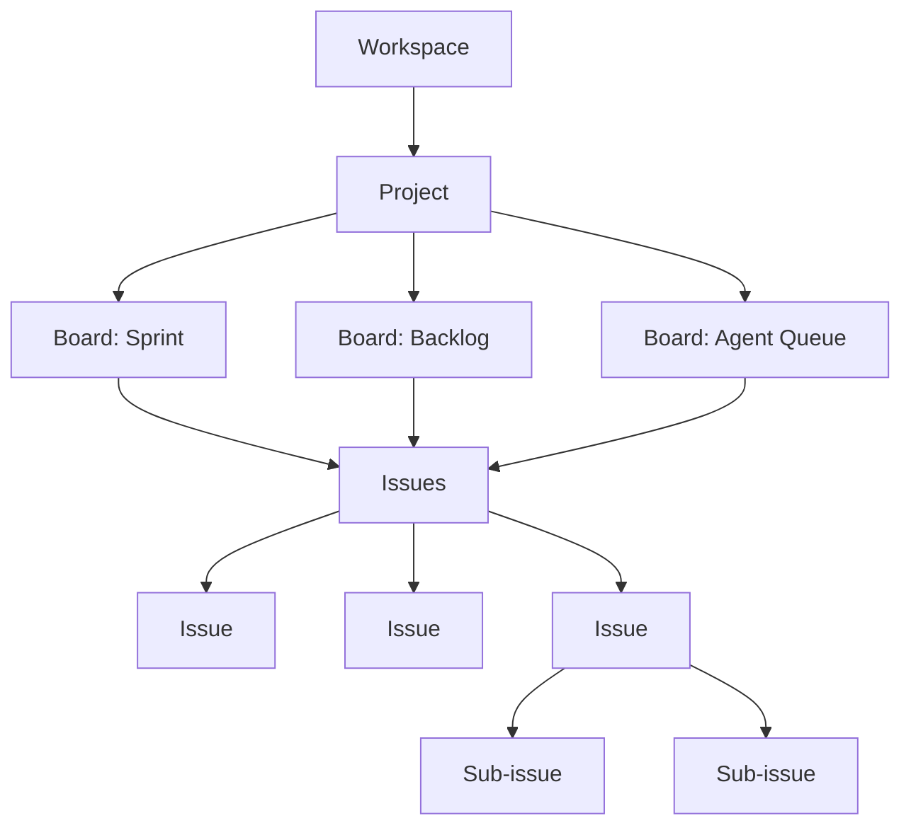

#### Core Entities (Effect-TS Schema)

```typescript
import { Schema } from "effect"

// --- Identifiers ---
const IssueId = Schema.String.pipe(Schema.brand("IssueId"))
const ProjectId = Schema.String.pipe(Schema.brand("ProjectId"))
const BoardId = Schema.String.pipe(Schema.brand("BoardId"))
const LabelId = Schema.String.pipe(Schema.brand("LabelId"))

// --- Issue Status (kanban columns) ---
const IssueStatus = Schema.Literal(
  "backlog",
  "todo",
  "in_progress",
  "in_review",
  "done",
  "cancelled"
)

// --- Priority ---
const Priority = Schema.Literal("urgent", "high", "medium", "low", "none")

// --- Assignee can be human or agent ---
const AssigneeType = Schema.Literal("human", "agent")

const Assignee = Schema.Struct({
  id: Schema.String,
  name: Schema.String,
  type: AssigneeType,
  deviceId: Schema.optional(Schema.String),  // for agents: which device they run on
})

// --- Issue ---
const Issue = Schema.Struct({
  id: IssueId,
  projectId: ProjectId,
  title: Schema.String,
  description: Schema.optional(Schema.String),
  status: IssueStatus,
  priority: Priority,
  assignee: Schema.optional(Assignee),
  labels: Schema.Array(Schema.String),
  parentId: Schema.optional(IssueId),           // sub-issue support
  estimate: Schema.optional(Schema.Number),      // story points or hours
  dueDate: Schema.optional(Schema.DateFromString),
  createdAt: Schema.DateFromString,
  updatedAt: Schema.DateFromString,
  createdBy: Assignee,                           // who created it (human or agent)

  // --- Execution linkage (auto-populated from OTel) ---
  sessionIds: Schema.Array(Schema.String),       // linked agent sessions
  totalCostUsd: Schema.Number,                   // accumulated from sessions
  totalTokens: Schema.Number,                    // accumulated from sessions
  prNumbers: Schema.Array(Schema.Number),        // linked PRs

  // --- Agent coordination ---
  blockedBy: Schema.Array(IssueId),              // dependency graph
  blocking: Schema.Array(IssueId),
  agentNotes: Schema.optional(Schema.String),    // agent-written context/findings
  acceptanceCriteria: Schema.Array(Schema.String), // machine-checkable criteria
})

// --- Issue Event (append-only log) ---
const IssueEventType = Schema.Literal(
  "created",
  "status_changed",
  "assigned",
  "unassigned",
  "comment_added",
  "label_added",
  "label_removed",
  "linked_session",
  "linked_pr",
  "estimate_changed",
  "priority_changed",
  "decomposed",       // parent issue split into sub-issues
  "blocked",
  "unblocked"
)

const IssueEvent = Schema.Struct({
  id: Schema.String,
  issueId: IssueId,
  type: IssueEventType,
  actor: Assignee,     // who triggered this (human or agent)
  timestamp: Schema.DateFromString,
  data: Schema.Unknown, // event-specific payload
})

// --- Comment ---
const Comment = Schema.Struct({
  id: Schema.String,
  issueId: IssueId,
  author: Assignee,
  body: Schema.String,
  createdAt: Schema.DateFromString,
  sessionId: Schema.optional(Schema.String), // if posted during an agent session
})

// --- Board (kanban view) ---
const Board = Schema.Struct({
  id: BoardId,
  projectId: ProjectId,
  name: Schema.String,
  columns: Schema.Array(IssueStatus),
  filter: Schema.optional(Schema.String), // label/assignee filter expression
  wipLimits: Schema.Record({ key: Schema.String, value: Schema.Number }),
})

// --- Project ---
const Project = Schema.Struct({
  id: ProjectId,
  name: Schema.String,
  key: Schema.String,             // e.g. "BACK" → issues are BACK-1, BACK-2
  boards: Schema.Array(BoardId),
  defaultBoard: BoardId,
  autoIncrementCounter: Schema.Number,
})
```

### 13.3. Agent Coordination Protocol

The key innovation: gctl-board is designed for **multi-agent coordination**, not just human project management. Agents can autonomously:

#### Task Claiming

```
# Agent checks what's available:
gctl board issues --status todo --label "agent-ok" --no-assignee

# Agent claims a task:
gctl board assign BACK-42 --agent "claude-code" --device "alice-macbook"

# Other agents see it's taken:
gctl board issues --status in_progress --assignee-type agent
→ BACK-42  "Add rate limiting"  claude-code@alice-macbook  $0.00  0 spans
```

#### Task Decomposition

```
# Agent decomposes a complex issue into sub-tasks:
gctl board decompose BACK-42 \
  --sub "Write rate limit middleware" \
  --sub "Add Redis counter store" \
  --sub "Write integration tests" \
  --sub "Update API docs"

→ Created:
  BACK-42-1  "Write rate limit middleware"    [todo]
  BACK-42-2  "Add Redis counter store"       [todo]
  BACK-42-3  "Write integration tests"       [todo]  blocked-by: BACK-42-1
  BACK-42-4  "Update API docs"               [todo]  blocked-by: BACK-42-1
```

#### Status Reporting

```
# Agent updates status as it works:
gctl board move BACK-42-1 in_progress
gctl board note BACK-42-1 "Using tower middleware. Found existing rate limit crate."

# Agent marks done with evidence:
gctl board move BACK-42-1 done \
  --note "Implemented in src/middleware/rate_limit.rs. Tests passing." \
  --link-session sess-4821 \
  --link-pr 891
```

#### Blocking & Dependencies

```
# Agent discovers a blocker:
gctl board block BACK-42-2 --by BACK-42-1 \
  --reason "Need middleware interface before implementing store"

# Agent checks if its task is unblocked:
gctl board check BACK-42-3
→ BLOCKED by BACK-42-1 (status: in_progress, assignee: claude-code@alice-macbook)

# Automatic unblock when dependency completes:
gctl board move BACK-42-1 done
→ BACK-42-3 automatically moved from blocked → todo
→ BACK-42-4 automatically moved from blocked → todo
```

#### Multi-Agent Handoff

```
# Agent can't complete a task (needs human review):
gctl board move BACK-42-1 in_review \
  --note "Implementation complete. Needs human review for security implications." \
  --request-review "alice"

# Agent hands off to another agent:
gctl board reassign BACK-42-4 --agent "docs-bot" \
  --note "API endpoints finalized. Docs bot can generate from OpenAPI spec."
```

### 13.4. Effect-TS Service Architecture

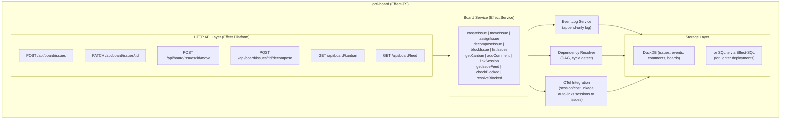

#### Key Effect-TS Patterns

```typescript
import { Effect, Layer, Context, Stream, Schema, pipe } from "effect"

// --- Service definition ---
class BoardService extends Context.Tag("BoardService")<
  BoardService,
  {
    readonly createIssue: (
      input: typeof CreateIssueInput.Type
    ) => Effect.Effect<typeof Issue.Type, BoardError>

    readonly moveIssue: (
      issueId: typeof IssueId.Type,
      newStatus: typeof IssueStatus.Type,
      note?: string
    ) => Effect.Effect<typeof Issue.Type, BoardError | IssueNotFoundError>

    readonly assignIssue: (
      issueId: typeof IssueId.Type,
      assignee: typeof Assignee.Type
    ) => Effect.Effect<typeof Issue.Type, BoardError | IssueNotFoundError>

    readonly decomposeIssue: (
      parentId: typeof IssueId.Type,
      subTasks: ReadonlyArray<string>
    ) => Effect.Effect<ReadonlyArray<typeof Issue.Type>, BoardError>

    readonly listIssues: (
      filter: typeof IssueFilter.Type
    ) => Effect.Effect<ReadonlyArray<typeof Issue.Type>, BoardError>

    readonly getKanban: (
      boardId: typeof BoardId.Type
    ) => Effect.Effect<typeof KanbanView.Type, BoardError>

    readonly getIssueFeed: (
      issueId: typeof IssueId.Type
    ) => Stream.Stream<typeof IssueEvent.Type, BoardError>

    readonly linkSession: (
      issueId: typeof IssueId.Type,
      sessionId: string,
      costUsd: number,
      tokens: number
    ) => Effect.Effect<void, BoardError>
  }
>() {}

// --- Error types (tagged for Effect.catchTag) ---
class BoardError extends Schema.TaggedError<BoardError>()(
  "BoardError",
  { message: Schema.String }
) {}

class IssueNotFoundError extends Schema.TaggedError<IssueNotFoundError>()(
  "IssueNotFoundError",
  { issueId: Schema.String }
) {}

class CyclicDependencyError extends Schema.TaggedError<CyclicDependencyError>()(
  "CyclicDependencyError",
  { issueIds: Schema.Array(Schema.String) }
) {}

class WipLimitExceededError extends Schema.TaggedError<WipLimitExceededError>()(
  "WipLimitExceededError",
  { column: Schema.String, limit: Schema.Number, current: Schema.Number }
) {}

// --- Dependency resolver (cycle detection via topological sort) ---
class DependencyResolver extends Context.Tag("DependencyResolver")<
  DependencyResolver,
  {
    readonly addDependency: (
      issueId: typeof IssueId.Type,
      blockedById: typeof IssueId.Type
    ) => Effect.Effect<void, CyclicDependencyError>

    readonly getBlocked: (
      issueId: typeof IssueId.Type
    ) => Effect.Effect<ReadonlyArray<typeof IssueId.Type>>

    readonly resolveDependency: (
      completedIssueId: typeof IssueId.Type
    ) => Effect.Effect<ReadonlyArray<typeof IssueId.Type>>  // newly unblocked
  }
>() {}
```

#### WIP Limits & Policies (via Effect combinators)

```typescript
// WIP limit enforcement as an Effect middleware
const enforceWipLimit = (boardId: typeof BoardId.Type, targetColumn: typeof IssueStatus.Type) =>
  Effect.gen(function* () {
    const board = yield* BoardService.pipe(Effect.flatMap(s => s.getKanban(boardId)))
    const columnIssues = board.columns[targetColumn]?.length ?? 0
    const limit = board.wipLimits[targetColumn]

    if (limit !== undefined && columnIssues >= limit) {
      return yield* new WipLimitExceededError({
        column: targetColumn,
        limit,
        current: columnIssues,
      })
    }
  })

// Auto-unblock when dependency resolves
const autoUnblock = (completedIssueId: typeof IssueId.Type) =>
  Effect.gen(function* () {
    const resolver = yield* DependencyResolver
    const unblocked = yield* resolver.resolveDependency(completedIssueId)

    for (const id of unblocked) {
      yield* BoardService.pipe(
        Effect.flatMap(s => s.moveIssue(id, "todo", `Auto-unblocked: ${completedIssueId} completed`))
      )
    }

    return unblocked
  })
```

### 13.5. CLI Interface

The board is fully operable from the CLI — designed for both humans and agents.

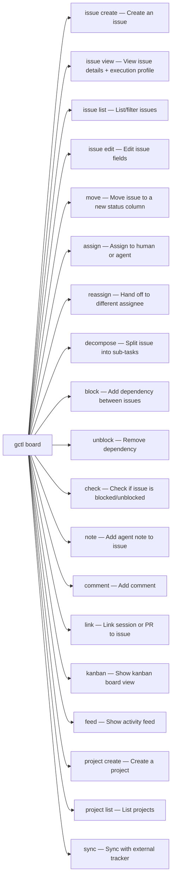

#### Example Agent Workflow

```sh
# 1. Agent starts a session, checks the board for work
gctl board issue list --status todo --label "agent-ok" --no-assignee --format json

# 2. Agent picks the highest-priority unblocked issue
gctl board assign BACK-42 --agent "claude-code" --device "$(hostname)"

# 3. Agent moves to in_progress
gctl board move BACK-42 in_progress

# 4. Agent works (traces flow through OTel, auto-linked to BACK-42)
# ... coding happens ...

# 5. Agent discovers complexity, decomposes
gctl board decompose BACK-42 \
  --sub "Implement rate limit middleware" \
  --sub "Add rate limit tests" \
  --sub "Update API docs"

# 6. Agent completes sub-task, links evidence
gctl board move BACK-42-1 done \
  --note "Implemented in src/middleware/rate_limit.rs" \
  --link-pr 891

# 7. Agent checks what's unblocked
gctl board issue list --status todo --assignee "claude-code" --format json

# 8. Agent marks parent done when all sub-tasks complete
gctl board move BACK-42 done \
  --note "All sub-tasks complete. Rate limiting active."
```

### 13.6. Automatic Session-Issue Linking

When an agent starts a session, gctl-board auto-links it to the relevant issue:

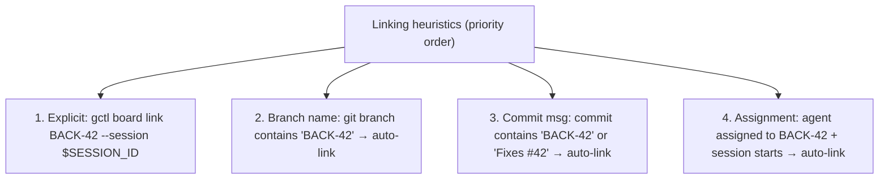

Once linked, the issue automatically accumulates:
- **Session cost** (from OTel spans)
- **Token usage** (input + output)
- **Duration** (wall clock)
- **PR references** (from GitHub events)

```
gctl board issue view BACK-42

Issue: BACK-42 "Add rate limiting to /api/users"
Status: done │ Assignee: claude-code@alice-macbook │ Priority: high
Labels: backend, agent-ok │ Estimate: 3h │ Actual: 1h 47m

Sub-tasks:
  ✓ BACK-42-1  "Implement rate limit middleware"  done   $1.12  45m
  ✓ BACK-42-2  "Add rate limit tests"             done   $0.87  34m
  ✓ BACK-42-3  "Update API docs"                  done   $0.22  28m

Execution Profile:
  Sessions:     3
  Total cost:   $2.21
  Total tokens: 18,400 (12.1k in / 6.3k out)
  PRs:          #891 (merged), #894 (merged)
  Eval score:   3/3 (tests pass, lint clean, docs updated)

Activity:
  03-22 14:00  claude-code  created issue
  03-22 14:01  claude-code  decomposed into 3 sub-tasks
  03-22 14:02  claude-code  moved BACK-42-1 → in_progress
  03-22 14:47  claude-code  moved BACK-42-1 → done  (linked PR #891)
  03-22 14:48  claude-code  moved BACK-42-2 → in_progress
  03-22 15:22  claude-code  moved BACK-42-2 → done
  03-22 15:23  docs-bot     assigned BACK-42-3
  03-22 15:51  docs-bot     moved BACK-42-3 → done  (linked PR #894)
  03-22 15:51  system       all sub-tasks done, moved BACK-42 → done
```

### 13.7. External Tracker Sync

gctl-board can bidirectionally sync with existing trackers for teams that also use Linear or GitHub Issues:

```
gctl board sync --source linear --project "BACKEND" --direction both
gctl board sync --source github --repo "org/api-server" --direction pull
```

| Direction | Behavior |
|-----------|----------|
| **pull** | Import issues from external tracker into gctl-board. Read-only mirror. |
| **push** | Publish gctl-board issues + agent execution data back to external tracker as comments/fields. |
| **both** | Bidirectional. External changes sync in, agent activity syncs out. Conflict: last-write-wins on status, append-only on comments. |

#### What syncs back to Linear/GitHub

- Agent session summaries (cost, tokens, duration)
- Sub-task decomposition (created as child issues)
- Status transitions with agent notes
- PR linkage
- Eval scores

This means the engineering manager sees agent activity in their normal Linear/GitHub workflow — they don't need to adopt a new tool.

### 13.8. Board as Agent Context

The board provides structured context that agents load at session start:

```
gctl board context --project BACKEND --format markdown --output .tmp/board-context.md
```

Produces a concise markdown summary:

```markdown
## BACKEND Board — Current State

### In Progress (3)
- **BACK-42** "Add rate limiting" — claude-code@alice — $1.12 — 45m
- **BACK-55** "Fix auth token leak" — alice (human) — not started
- **BACK-58** "Migrate schema v2" — claude-bot-2@ci — $0.34 — 12m

### Blocked (1)
- **BACK-60** "Update client SDK" — blocked by BACK-58

### Ready for Agent (5)
- **BACK-61** "Add health check endpoint" [low] est: 1h
- **BACK-62** "Fix pagination bug" [high] est: 30m
- **BACK-63** "Add request logging" [medium] est: 2h
- **BACK-64** "Update error codes" [low] est: 1h
- **BACK-65** "Add rate limit headers" [medium] est: 1h — blocked-by: BACK-42

### Sprint Progress
Closed: 8/15 │ Velocity: 4.2/week │ On track for 03-29
```

This context lets agents make informed decisions about what to work on, what's blocked, and how the project is progressing — without calling any external APIs.

### 13.9. Tech Stack & Deployment

| Layer | Choice | Rationale |
|-------|--------|-----------|
| **Language** | TypeScript (Effect-TS) | Type-safe, composable services, excellent error handling |
| **Runtime** | Bun or Node.js | Fast startup for CLI operations |
| **Framework** | Effect Platform (HttpApi) | Schema-driven API, automatic OpenAPI docs |
| **Storage** | DuckDB (via `duckdb-node`) or SQLite (via `@effect/sql-sqlite-node`) | Local-first, same as Rust daemon |
| **Event system** | Effect Stream | Reactive event propagation for auto-unblock, WIP limits |
| **CLI bridge** | `gctl board` delegates to TS process | Rust CLI spawns TS service or communicates via HTTP |
| **Sync** | Effect Schedule + Effect Http | Periodic sync with Linear/GitHub APIs |

#### Integration with Rust Daemon

Two integration modes:

1. **Sidecar process** — The TS board service runs alongside the Rust daemon. Rust CLI delegates `gctl board *` commands to the TS HTTP API. Shared DuckDB (TS writes board tables, Rust writes trace tables).

2. **Embedded via HTTP** — The board service runs as part of `gctl serve`. The Rust daemon proxies `/api/board/*` requests to the TS process. Single port, unified API.

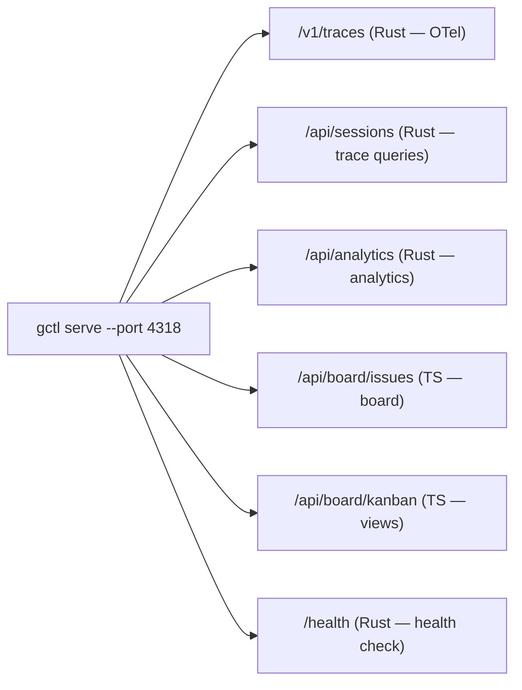

### 13.10. Phased Delivery

| Phase | Scope | Depends On |
|-------|-------|------------|
| **P1: Core Board** | Issue CRUD, status transitions, CLI commands, DuckDB storage | Effect-TS project setup |
| **P2: Agent Coordination** | Claim/assign, decompose, block/unblock, agent notes | P1 |
| **P3: OTel Integration** | Auto-link sessions, cost accumulation, execution profiles | P2 + Rust OTel receiver |
| **P4: External Sync** | Linear pull, GitHub pull, bidirectional sync | P2 |
| **P5: Kanban UI** | Local web dashboard (Effect Platform + HTMX or React) | P1 |

## 14. Application Roadmap

gctl-board is the first application. The OS layer is designed to support a growing ecosystem of applications — both first-party and community-built.

### 14.1. Planned Applications

| Application | Description | OS Primitives | Status |
|-------------|-------------|---------------|--------|
| **gctl-board** | Agent-native project management & kanban (Effect-TS) | Storage, Telemetry, CLI, Sync | P1 shipped (schemas + daily aggregates) |
| **Observe & Eval** | Langfuse-grade analytics, scoring, prompt management | Telemetry, Storage, Query, HTTP API | Partially shipped (analytics endpoints, scoring, alerts) |
| **Capacity Engine** | Throughput measurement, forecasting, sprint planning | Storage, Telemetry, Query | Planned |
| **Research Assistant** | Crawl docs, build knowledge bases, semantic search over crawled content | Network (crawl/fetch), Storage, Sync (knowledge/) | Planned |
| **Code Review Bot** | Auto-review PRs with trace context, suggest improvements | Telemetry, CLI (`gctl review`), HTTP API | Planned |
| **Multi-Agent Orchestrator** | Route tasks across agent pools, manage concurrency | Telemetry, Guardrails, Storage, gctl-board | Planned |

### 14.2. Building a Custom Application

A gctl application follows this pattern:

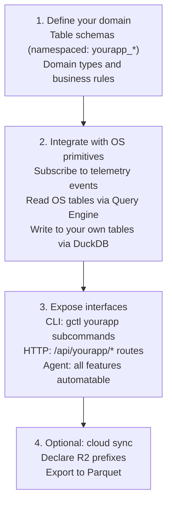

**Rust applications** add a crate to `crates/gctl-yourapp/`, feature-gate it in `Cargo.toml`, and register routes/commands in `gctl-cli`.

**TypeScript applications** add a package to `packages/gctl-yourapp/`, expose an HTTP API, and integrate via the sidecar or proxy pattern established by gctl-board.

### 14.3. Cross-Application Data Flow

Applications don't talk to each other directly. They communicate through OS-level events and shared storage:

```mermaid
sequenceDiagram
  participant Board as gctl-board
  participant Agent as Agent
  participant OS as OS: OTel Receiver
  participant Eval as Observe & Eval
  participant Cap as Capacity Engine
  participant Guard as Guardrails

  Board->>Agent: Creates issue BACK-42
  Agent->>OS: Claims BACK-42, starts coding session
  OS->>OS: Ingests spans (telemetry primitive)
  OS->>Board: Auto-links session to BACK-42, accumulates cost
  OS->>Eval: Scores session, checks prompt effectiveness
  OS->>Cap: Updates throughput metrics for team
  OS->>Guard: Checks cost limits, detects error loops
```

This event-driven architecture means applications are loosely coupled. Adding a new application (e.g., Code Review Bot) doesn't require changes to existing applications — it just subscribes to the same OS events.

## 15. Opinionated Usages

gctl ships with opinionated defaults for how it SHOULD be used. These are not hard constraints — they are recommended workflows that maximize the value of the OS primitives.

### 15.1. Obsidian as Spec Viewer & Editor

The `specs/` directory is designed to be **mounted as an Obsidian vault** for rich viewing and editing. This gives developers and agents a graph-based knowledge base for navigating architecture, domain model, workflows, and decisions — without leaving their local environment.

#### Setup

```sh
# Option 1: Open specs/ directly as a vault
# In Obsidian: "Open folder as vault" → select <project>/specs/

# Option 2: Symlink into an existing vault
ln -s /path/to/gctrl/specs ~/obsidian-vault/gctrl-specs
```

#### Conventions for Obsidian Compatibility

All `specs/` documents MUST use **raw CommonMark / GitHub-Flavored Markdown** (see `AGENTS.md` Documentation Standard #2). This ensures files render correctly in both Obsidian and any other Markdown viewer (GitHub, VS Code, terminal).

What this means in practice:
1. **No Obsidian-specific syntax** — no wikilinks `[[...]]`, no callouts `> [!note]`, no block references `^block-id`, no empty-text links `[](url)`.
2. **Standard links only** — use `[text](relative/path.md)` for cross-references.
3. **Mermaid diagrams** — Obsidian renders mermaid natively in preview mode, so architecture diagrams work out of the box.
4. **YAML frontmatter** — Obsidian reads frontmatter for metadata. Spec files MAY include frontmatter for Obsidian tags/aliases but MUST NOT require it for the document to make sense.
5. **Directory structure = vault structure** — the `specs/` folder hierarchy maps directly to Obsidian's file explorer:

```mermaid
flowchart TB
  Root["specs/ (Obsidian vault root)"]

  Root --> Arch["architecture/\nREADME.md, domain-model.md,\nscheduler.md, gctl-board.md,\nos.md"]
  Root --> Impl["implementation/\ncomponents.md, repo.md,\nstyle-guide.md, testing.md"]
  Root --> Workflows["gctl/workflows/\nREADME.md, issue-lifecycle.md,\ntask-planning.md, pr-review.md,\nworkflow-file.md"]
  Root --> Team["team/\npersonas.md"]
  Root --> Decisions["decisions/ (ADRs)"]
  Root --> PRD["prd.md (this file)"]
  Root --> Principles["principles.md"]
  Root --> Workflow["workflow.md"]
  Root --> BrowserSpec["browser.md"]
```

#### Graph View

Obsidian's graph view visualizes the link structure across specs. Cross-references between documents (e.g., `gctl-board.md` → `domain-model.md` → `workflow.md`) form a navigable knowledge graph. This is especially useful for:
- Tracing how a domain type flows from schema definition to storage DDL to CLI command.
- Understanding which specs a proposed change impacts.
- Onboarding new contributors by exploring the spec graph.

#### Editing Workflow

Obsidian edits are local file changes — they show up in `git status` like any other edit. The recommended workflow:

1. Open `specs/` in Obsidian for reading and light editing.
2. Use Obsidian's preview mode to verify mermaid diagrams and cross-references.
3. Commit spec changes via the normal git workflow (`gctl task`, feature branch, PR).
4. Agents can also edit specs — they work with the same raw markdown files.

This makes specs a **living document** that both humans (via Obsidian) and agents (via file I/O) can read and write.
