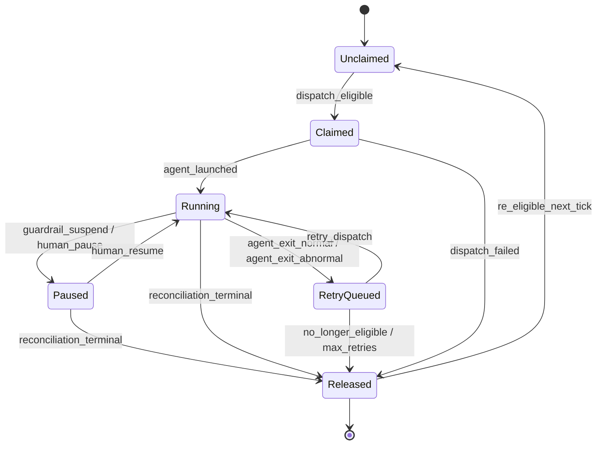
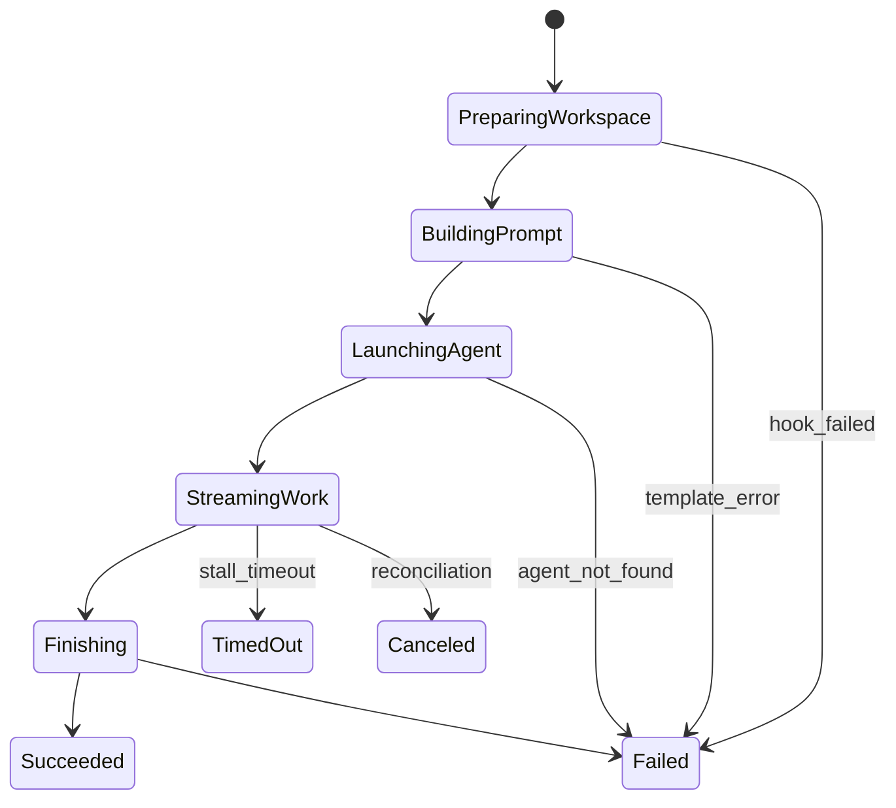

# Template: Orchestration State Machine

Defines the kernel-level orchestration state machine for dispatching, tracking, and recovering agent work on tasks and issues. Inspired by [OpenAI Symphony SPEC.md §7](https://github.com/openai/symphony/blob/main/SPEC.md#7-orchestration-state-machine), adapted for gctl's agent-agnostic, local-first model.

**Key difference from Symphony**: gctl's orchestrator is agent-agnostic — it dispatches to any agent runtime, not just one vendor. It lives in the **kernel layer** and is exposed via CLI.

For implementation details (Lean 4 formal verification, Rust crate structure, adapter wiring), see [specs/implementation/orchestration.md](../../implementation/orchestration.md).

---

## 1. Design Goals

1. Provide a single authoritative orchestrator state for dispatch, retries, and reconciliation.
2. Work with any coding agent that accepts a prompt and produces artifacts (commits, PRs, comments).
3. Live in the kernel — applications observe orchestration state but MUST NOT mutate it directly.
4. Expose all state transitions via CLI for human and agent use.
5. Support restart recovery without requiring persistent orchestrator state (tracker + filesystem are the source of truth).
6. Enforce bounded concurrency and per-state limits.
7. State machine properties (determinism, reachability, liveness) MUST be formally verified before implementation.

## 2. Orchestration States (Kernel Claim States)

These are the orchestrator's **internal claim states**, distinct from the kanban lifecycle in [issue-lifecycle.md](issue-lifecycle.md). An issue's kanban status (`todo`, `in_progress`, etc.) and its orchestration claim state are independent dimensions.



| State | Description |
|-------|-------------|
| `Unclaimed` | Issue exists and is not reserved by the orchestrator. Default state for all issues. |
| `Claimed` | Orchestrator has reserved the issue to prevent duplicate dispatch. Transient — transitions quickly to `Running` or `Released`. |
| `Running` | An agent process is actively working on the issue. |
| `Paused` | Session suspended by a guardrail trigger or human operator. Awaiting explicit resume. MUST NOT be re-dispatched. |
| `RetryQueued` | Agent exited but a retry is scheduled. |
| `Released` | Claim removed. Issue returns to the candidate pool on the next tick if still eligible. |

### Important Nuances

1. A successful agent exit does not mean the issue is done. The orchestrator schedules a continuation check to verify the issue is still active.
2. After abnormal exit, the orchestrator schedules an exponential-backoff retry.
3. `Released` is not terminal for the issue — only for the current claim cycle. If the issue remains in an active kanban state, it becomes `Unclaimed` and re-eligible on the next poll tick.

### Required Properties

The state machine MUST satisfy these properties (to be formally verified):

1. **No duplicate dispatch.** An issue MUST NOT be in both `Claimed` and `Running` simultaneously for two different agent processes.
2. **Reachability.** Every state MUST be reachable from `Unclaimed` via a valid sequence of transitions.
3. **Liveness.** An issue MUST NOT remain in `Claimed` or `RetryQueued` indefinitely — all paths lead to `Running` or `Released` within bounded time.
4. **Determinism.** For any (state, trigger) pair, there is exactly one target state.
5. **Terminal convergence.** If the tracker marks an issue terminal, the orchestration state MUST eventually reach `Released` regardless of current state.
6. **Pause/resume integrity.** A `Paused` session MUST NOT be re-dispatched. It MUST only return to `Running` via an explicit `human_resume` trigger.

## 3. Run Attempt Lifecycle

Each dispatch of an agent for an issue is a **run attempt** with its own lifecycle:



| Phase | Description |
|-------|-------------|
| `PreparingWorkspace` | Create or reuse the per-issue workspace directory. Run creation hook if new. |
| `BuildingPrompt` | Render the prompt template with issue context. |
| `LaunchingAgent` | Start the agent process. Agent kind resolved from configuration. |
| `StreamingWork` | Agent is running. Orchestrator monitors for stalls and reconciliation events. |
| `Finishing` | Agent process exited. Collecting exit status and artifacts. |
| `Succeeded` | Agent exited cleanly. Orchestrator schedules continuation check. |
| `Failed` | Agent exited with error. Orchestrator schedules backoff retry. |
| `TimedOut` | No progress detected within stall timeout. Agent killed, retry queued. |
| `Canceled` | Reconciliation determined issue is no longer active. Agent killed, claim released. |

## 4. Transition Triggers

| Trigger | What Happens |
|---------|-------------|
| **Poll Tick** | Reconcile running issues, validate config, fetch candidates, sort by priority, dispatch until slots exhausted. |
| **Agent Exit (Normal)** | Remove from running set, record telemetry, schedule continuation check. |
| **Agent Exit (Abnormal)** | Remove from running set, record error telemetry, schedule exponential-backoff retry. |
| **Retry Timer Fired** | Re-fetch candidates, re-dispatch if still eligible, else release claim. |
| **Guardrail Suspend** | Guardrails engine emits suspend signal → running session transitions to `Paused`. |
| **Human Pause** | Operator issues `gctl orchestrate pause` → running session transitions to `Paused`. |
| **Human Resume** | Operator issues `gctl orchestrate resume` → `Paused` session transitions back to `Running`. |
| **Reconciliation** | Detect stalls (elapsed > timeout → kill + retry). Refresh tracker state (terminal → release, active → update snapshot, fetch failure → keep running). Paused sessions are skipped — they are not stale. |

### Tick Sequence

1. **Reconcile** — check all running issues against tracker state.
2. **Validate** — verify configuration is loadable.
3. **Fetch candidates** — query active issues from tracker.
4. **Sort** — priority ascending, then `created_at` oldest first, then identifier.
5. **Dispatch** — claim and launch agents until concurrency slots are exhausted.

## 5. Agent Dispatch (Agent-Agnostic)

The orchestrator MUST NOT assume a specific agent. Agent kind is resolved from configuration. Any executable that accepts a prompt (via flag, stdin, or file) and exits with a status code is a valid agent.

### Dispatch Eligibility

An issue is dispatch-eligible only if all conditions hold:

1. It has an identifier, title, and state.
2. Its kanban state is active (not terminal).
3. It is not already `Claimed`, `Running`, or `Paused`.
4. Global concurrency slots are available.
5. Per-state concurrency slots are available.
6. If in `todo` state, no blocker (from the dependency DAG in [task-planning.md](task-planning.md)) is non-terminal.
7. A `user_id` can be resolved — the issue has a configured persona in WORKFLOW.md or a default persona is set.
8. Per-user concurrency slots are available for the resolved `user_id`.

### Dispatch Ordering

1. Priority ascending (lower number = higher priority; null sorts last).
2. `created_at` oldest first.
3. Identifier lexicographic tie-breaker.

## 6. Retry and Backoff

### Continuation Retry (Normal Exit)

- Fixed short delay.
- Purpose: re-check if issue is still active and needs another agent session.
- If re-dispatched, the continuation prompt SHOULD be shorter than the initial prompt.

### Failure Retry (Abnormal Exit)

- Exponential backoff with configurable cap.
- Each retry cancels any existing timer for the same issue before scheduling.

### Retry Limits

- Continuation retries: bounded by max turns configuration.
- Failure retries: bounded by max failure retries configuration. After exhaustion, claim is released.

## 7. Concurrency Control

### Global Limit

Total running agents MUST NOT exceed the configured maximum.

### Per-State Limit

Each kanban state MAY have its own concurrency cap. States without explicit limits fall back to the global maximum.

### Per-User Limit

Each user (persona) MAY have its own concurrency cap, configured in WORKFLOW.md or guardrails config. Per-user limits are enforced after the global and per-state limits — all three must pass for dispatch to proceed.

```toml
[orchestrator]
max_sessions_per_user.agent = 2        # applies to all agent personas
max_sessions_per_user.reviewer-bot = 1 # override for a specific persona
```

### Blocker Rule

Issues in `todo` state MUST NOT be dispatched if any blocker is non-terminal.

## 8. Workspace Management

### Layout

Each issue gets an isolated workspace directory. Workspaces persist across runs for the same issue. Successful runs do NOT auto-delete workspaces.

### Hooks

| Hook | When | Failure behavior |
|------|------|-----------------|
| `after_create` | Workspace directory first created | Abort creation, fail attempt |
| `before_run` | Before each agent launch | Abort attempt, schedule retry |
| `after_run` | After each agent exit | Log warning, continue |
| `before_remove` | Before workspace deletion | Log warning, continue |

### Terminal Cleanup

- On startup: fetch terminal issues from tracker, remove their workspace directories.
- On reconciliation: if a running issue transitions to terminal, kill agent and clean workspace.

## 9. Idempotency and Recovery

1. The orchestrator serializes all state mutations — no concurrent dispatch of the same issue.
2. `Claimed` and `Running` checks are required before launching any agent.
3. Reconciliation runs **before** dispatch on every tick.
4. Restart recovery is **tracker-driven + filesystem-driven**: scan workspaces on startup, cross-reference with tracker state, and resume or clean up.
5. No persistent orchestrator database required — state is reconstructed from the tracker and workspace filesystem.

## 10. Observability

The orchestrator MUST emit structured telemetry for every state transition:

| Event | Fields |
|-------|--------|
| `orchestrator.claim` | `issue_id`, `user_id`, `agent_kind`, `attempt` |
| `orchestrator.dispatch` | `issue_id`, `user_id`, `agent_kind`, `workspace` |
| `orchestrator.agent_exit` | `issue_id`, `exit_code`, `duration_ms` |
| `orchestrator.retry_scheduled` | `issue_id`, `attempt`, `delay_ms`, `reason` |
| `orchestrator.released` | `issue_id`, `reason` |
| `orchestrator.reconciliation` | `running_count`, `stalled_count`, `terminal_count` |

## 11. CLI Surface

The orchestrator is exposed as kernel CLI commands:

```sh
# Start the orchestration loop
gctl orchestrate start
gctl orchestrate start --daemon

# Inspect state
gctl orchestrate status
gctl orchestrate list
gctl orchestrate list --state running
gctl orchestrate inspect BACK-42

# Manual control
gctl orchestrate dispatch BACK-42
gctl orchestrate pause   BACK-42   # SIGSTOP — suspend, await human review
gctl orchestrate resume  BACK-42   # SIGCONT — approve continuation
gctl orchestrate cancel  BACK-42   # SIGTERM — graceful stop
gctl orchestrate retry   BACK-42
gctl orchestrate release BACK-42

# Configuration
gctl orchestrate config
gctl orchestrate config --validate
```

## 12. Kernel Placement

The orchestrator is a **kernel primitive**, not an application. It depends on:

- **Scheduler** — timer management for poll ticks and retry delays.
- **Storage** — reading issue/task state (read-only).
- **Telemetry** — emitting orchestration events.

Applications observe orchestration state through the shell (HTTP API or CLI queries) but MUST NOT bypass the kernel to mutate orchestrator state.
