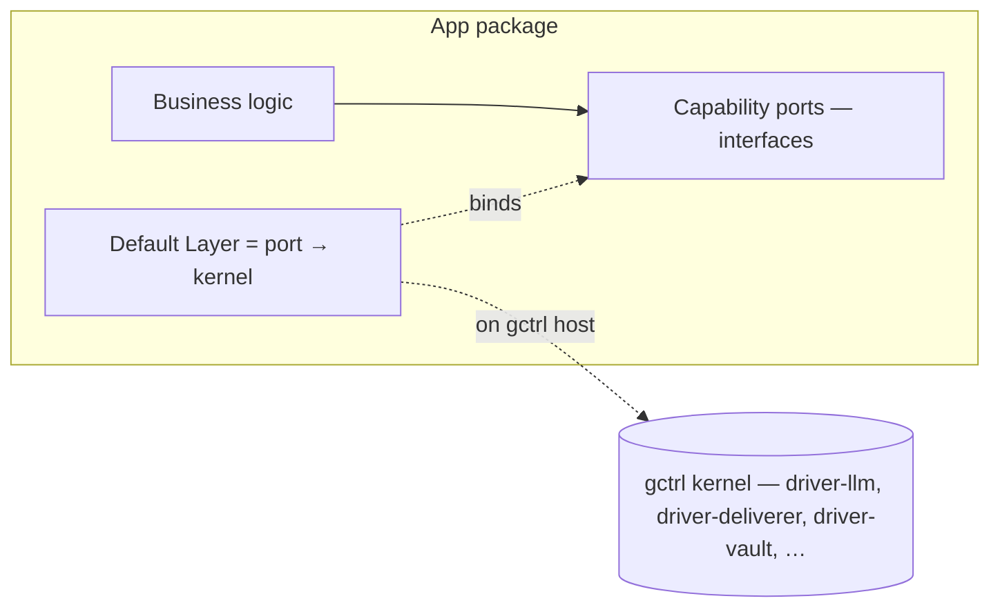

# App ↔ Kernel Decoupling

This spec captures the contract between gctrl applications and the gctrl kernel, and what it means to "eject" an app so it can run on a different host.

> **Invariant:** Apps declare *capability requirements*. The kernel provides *capability implementations*. The two MUST NOT duplicate the same capability.

## The Mental Model

gctrl is an OS. Applications are programs that run on it.

| Term | Meaning |
|---|---|
| **Capability** | A named, kernel-provided service an app can depend on (LLM relay, deliverer, vault storage, scheduler, secrets, OTel capture, etc.) |
| **Capability requirement** | A port (interface) an app declares it needs. Lives in the app. |
| **Capability implementation** | A driver / kernel module that fulfills the port. Lives in the kernel. |
| **App** | Application + featureset requirements. Owns its business logic and its vault namespace; depends on capabilities. |
| **Eject** | Run the app on a host without gctrl. Done by **forking** the app and rewriting the default Layer module to call host-supplied implementations — NOT by shipping a runtime override mechanism inside the app. |

**Default fulfillment:** When an app is installed on a gctrl-equipped host, the kernel fulfills every capability the app declares. The single Layer module the app ships wires its ports to kernel HTTP routes. Nothing else needs to be configured.

**Alternate fulfillment (off-gctrl):** The operator forks the app source and edits the default Layer module to wire the same ports against whatever the host provides — opinionated CLIs, vendor SDKs, in-process implementations, or nothing at all (the feature is then disabled at the Layer level). The app's business logic, ports, vault, and `gctrl-app.toml` manifest stay unchanged. The manifest is the contract the replacement Layer must satisfy — it tells the operator (often with LLM assistance — Claude Code, opencode, aider — that's the "user role to use LLM to configure the app") exactly which capabilities need fulfillment.

## The Zero-Duplication Rule

> **An app MUST NOT ship in-app code that duplicates a capability the kernel already provides.**

If `driver-llm` already routes Anthropic and OpenAI-compat traffic, the app does NOT contain its own `AnthropicLlm.ts` adapter. If `driver-telegram` already POSTs to the Bot API, the app does NOT contain its own `TelegramDeliverer.ts`.

What the app contains:
- The **port** (`LlmService`, `DelivererService`).
- The **business logic** that calls through the port (`brief`, `report`, `send`, `sinkin`).
- The **default Layer wiring** that binds the port to the kernel implementation (`KernelLlmLive`, `HttpDelivererLive`).

What the app MUST NOT contain:
- A second adapter that talks directly to Anthropic / Telegram / Discord / R2 / etc. when the kernel already has a driver for that target.

**Why:** Two implementations drift. Drift creates bugs that only show up in one mode. Caching, secret injection, OTel capture, rate limiting, cost attribution all live in the kernel — re-implementing the transport in the app silently regresses every one of those concerns.

## The Application's Three Pieces

1. **Business logic** — the why-this-app-exists code. Calls through ports only.
2. **Capability ports** — Effect-TS `Context.Tag`s declaring what the app needs (e.g. `LlmService`, `DelivererService`, `VaultWriterPort`, `SecretsService`).
3. **Default Layer** — a `Layer.mergeAll(...)` that binds each port to its kernel-fulfilled adapter. This is the only Layer the app ships.

## Ejection — What Actually Changes

Ejecting an app to another host changes ONE thing: the small Layer module that wires ports to implementations. Everything else stays put.

| Surface | On gctrl host (default) | On another host (forked) |
|---|---|---|
| Business logic | unchanged | unchanged |
| Ports | unchanged | unchanged |
| Default Layer module | wires ports to kernel HTTP routes | rewritten in the fork to wire ports to host-supplied implementations (vendor SDKs, in-process modules, opinionated CLIs) |
| App-specific data | lives in the app vault | lives in the app vault |
| Secrets | resolved by kernel `driver-secrets` | resolved by the fork's chosen SecretsService impl |
| `gctrl-app.toml` manifest | consumed by `gctrl app install` | acts as the spec the fork's Layer must satisfy |

The eject is **not** a rewrite. It is a **rebinding** — and in v1, the rebinding happens at the **source-tree level** in a fork, not at install time inside the kernel.

### How the rebinding happens

For a non-gctrl host, the operator forks the app and edits the default Layer module to call whatever the host provides. The app's `gctrl-app.toml` manifest doubles as the contract for that fork — it tells the operator (often with LLM assistance — Claude Code, opencode, aider) exactly which capabilities the replacement Layer must fulfill, and which optional capabilities can be skipped. See [app-install-protocol.md § Non-gctrl hosts](app-install-protocol.md#non-gctrl-hosts) for the procedural detail.

The app MUST NOT ship its own runtime override / extension mechanism (no `UBER_CUSTOM_LAYER`-style env loaders, no in-app `local-direct` / `cloud-only` mode adapters). The single shipped Layer wires to the kernel; everything else is a fork's concern. v2 may introduce a narrowly-scoped runtime override if a real need surfaces, but v1 deliberately stops short — a forking operator with the manifest in hand has everything they need.

## What This Means for Vault & Storage

Apps MUST NOT depend on kernel SQL tables for app-specific data. The vault is the source of truth.

- App-specific schemas in the kernel's DuckDB (`app_*` tables) are a **smell** — they coupled the kernel to the app and forced a new kernel migration whenever the app's data shape changed.
- The replacement: the app owns its vault namespace (`apps/{app}/vault/...`); the kernel watches the filesystem and indexes mtime + content_hash; queryability comes from the kernel's generic vault index, not from per-app tables.
- This makes the app trivially portable: zip the vault, hand it to another host, the app keeps working as soon as the ports are bound.

## Worked Example — Uebermensch

| Capability | Default Layer (gctrl host) | Fork-rewire example (non-gctrl host) | What does NOT live in the app |
|---|---|---|---|
| LLM curator + summary lanes | `KernelLlm` Layer → `driver-llm` | Edit Layer to call Anthropic SDK / OpenAI SDK / local LM Studio directly | A second LLM transport in `apps/uebermensch/src/adapters/` |
| Telegram delivery | `HttpDeliverer` → `driver-telegram` | Edit Layer to fetch `api.telegram.org/bot{token}/sendMessage` directly, or swap to a different chat platform | A second deliverer transport in the app |
| Discord delivery | `HttpDeliverer` → `driver-discord` | Edit Layer to fetch the webhook URL directly, or swap to a different platform | A second deliverer transport in the app |
| Vault filesystem write | `FileSystemVault` + kernel watcher | Edit Layer to back `VaultWriterPort` with the host's storage (S3, Notion API, plain FS) | A vault transport in the app when the host already has one |
| Vault sync to R2 | `KernelR2Sync` → kernel `/api/sync/vault/*` (extends `gctrl-sync`) | Edit Layer to satisfy `SyncService` against the host's blob store | An R2/wrangler transport in the app — see `sync-vault.md` |
| Secrets read | `EnvSecrets` (transitional) / `driver-secrets` (TBD) | Edit Layer to read the host's keychain, 1Password CLI, Worker bindings, etc. | Anything provider-specific |
| Scheduling | kernel `scheduler` | Replace with host cron / launchd / Worker cron / GitHub Actions | An in-app scheduler |
| OTel session correlation | kernel telemetry | Wire to host OTel collector, or accept the telemetry loss | An app-side span exporter |

## Boundary Tests for Reviewers

When reviewing an app PR, ask:

1. **"Does the kernel already do this?"** If yes, the app MUST NOT add its own implementation. Use the kernel driver via the existing port.
2. **"Is this app code calling an external API directly?"** If yes, it should be calling a kernel route that wraps a driver. Direct external calls bypass caching, OTel, and secret injection.
3. **"Is the app declaring a new app-specific kernel table?"** If yes, push back hard — vault file + watcher index is almost always the right shape.
4. **"Is there a second 'mode' that swaps in app-bundled adapters?"** If yes, those adapters are duplicating the kernel. Either delete them or move them to the kernel as drivers (with proper interface traits).
5. **"To eject, can someone change ONLY the default Layer module?"** Ejection is fork-and-rewire. The fork should touch one file (the Layer wiring); business logic, ports, vault layout, and the manifest stay untouched. If a fork would also need to edit a command, an adapter, or a service body, the port surface is wrong.

## Related

- [`../principles.md`](../principles.md) § App ↔ Kernel Decoupling
- [`os.md`](os.md) § 3 Applications, § 5 Drivers
- [`app-install-protocol.md`](app-install-protocol.md) — `gctrl-app.toml`, install flow, fork-based ejection
- [`apps/adr-runtime-compute-decoupling.md`](apps/adr-runtime-compute-decoupling.md) — sibling concern (compute substrate vs harness)
