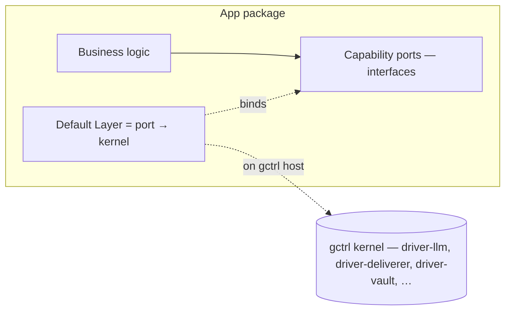

# App ↔ Kernel Decoupling

This spec captures the contract between gctrl applications and the gctrl kernel, and what it means to "eject" an app so it can run on a different host.

> **Invariant:** Apps declare *capability requirements*. The kernel provides *capability implementations*. The two MUST NOT duplicate the same capability.

## The Mental Model

gctrl is an OS. Applications are programs that run on it.

| Term | Meaning |
|---|---|
| **Capability** | A named, kernel-provided service an app can depend on (LLM relay, deliverer, vault storage, scheduler, secrets, OTel capture, etc.) |
| **Capability requirement** | A port (interface) an app declares it needs. Lives in the app. |
| **Capability implementation** | A driver / kernel module that fulfills the port. Lives in the kernel, OR is supplied by another host at install time. |
| **App** | Application + featureset requirements. Owns its business logic and its vault namespace; depends on capabilities. |
| **Eject** | Make the app installable on a non-gctrl host. NOT "re-implement everything kernel does". |

**Default fulfillment:** When an app is installed on a gctrl-equipped host, the kernel fulfills every capability the app declares. Nothing else needs to be wired.

**Alternate fulfillment:** When an app is installed on a host without gctrl, the operator (often with LLM assistance — Claude Code, opencode, aider — that's the "user role to use LLM to configure the app") wires the declared capabilities to whatever the host provides: opinionated CLIs, vendor SDKs, in-process implementations, or nothing at all (the feature is then disabled).

## The Zero-Duplication Rule

> **An app MUST NOT ship in-app code that duplicates a capability the kernel already provides.**

If `driver-llm` already routes Anthropic and OpenAI-compat traffic, the app does NOT contain its own `AnthropicLlm.ts` adapter. If `driver-telegram` already POSTs to the Bot API, the app does NOT contain its own `TelegramDeliverer.ts`.

What the app contains:
- The **port** (`LlmService`, `DelivererService`).
- The **business logic** that calls through the port (`brief`, `report`, `send`, `sinkin`).
- The **default Layer wiring** that binds the port to the kernel implementation (`KernelLlmLive`, `HttpDelivererLive`).

What the app MUST NOT contain:
- A second adapter that talks directly to Anthropic / Telegram / Discord / R2 / etc. when the kernel already has a driver for that target.

**Why:** Two implementations drift. Drift creates bugs that only show up in one mode. Caching, secret injection, OTel capture, rate limiting, cost attribution all live in the kernel — re-implementing the transport in the app silently regresses every one of those concerns.

## The Application's Three Pieces

1. **Business logic** — the why-this-app-exists code. Calls through ports only.
2. **Capability ports** — Effect-TS `Context.Tag`s declaring what the app needs (e.g. `LlmService`, `DelivererService`, `VaultWriterPort`, `SecretsService`).
3. **Default Layer** — a `Layer.mergeAll(...)` that binds each port to its kernel-fulfilled adapter. This Layer is the *default*, used unless the user explicitly overrides.

## Ejection — What Actually Changes

Ejecting an app to another host changes ONE thing: the Layer that fulfills the ports. Everything else stays put.

| Surface | On gctrl host (default) | On another host (ejected) |
|---|---|---|
| Business logic | unchanged | unchanged |
| Ports | unchanged | unchanged |
| Default Layer | wires to kernel | replaced by user-supplied Layer |
| App-specific data | lives in the app vault | lives in the app vault |
| Secrets | resolved by kernel `driver-secrets` | resolved by host-supplied SecretsService impl |

The eject is **not** a rewrite. It is a **rebinding**.

### How the rebinding happens

The app exposes an extension point that loads a user-supplied Layer at startup. Suggested mechanisms (any one is sufficient):

- **`UBER_CUSTOM_LAYER` env var** — points to a JS module exporting a `Layer` that satisfies the app's port surface. Loaded with dynamic import at startup. (Reference design — not yet implemented.)
- **`gctrl-app.toml` capability declarations** — the app's manifest lists the capabilities it requires; the host's installer wires them. (Implementation specced in [implementation/app-install-protocol.md] — to be written.)

The app MUST NOT bundle a hard-coded "alternate" Layer for `local-direct` or `cloud-only` modes that simply re-implements kernel drivers. That defeats the point.

## What This Means for Vault & Storage

Apps MUST NOT depend on kernel SQL tables for app-specific data. The vault is the source of truth.

- App-specific schemas in the kernel's DuckDB (`app_*` tables) are a **smell** — they coupled the kernel to the app and forced a new kernel migration whenever the app's data shape changed.
- The replacement: the app owns its vault namespace (`apps/{app}/vault/...`); the kernel watches the filesystem and indexes mtime + content_hash; queryability comes from the kernel's generic vault index, not from per-app tables.
- This makes the app trivially portable: zip the vault, hand it to another host, the app keeps working as soon as the ports are bound.

## Worked Example — Uebermensch

| Capability | Default (kernel) | Ejected option (user wires) | What does NOT live in the app |
|---|---|---|---|
| LLM curator + summary lanes | `driver-llm` via `KernelLlm` Layer | Anthropic SDK, OpenAI SDK, local LM Studio call, anything that satisfies `LlmService` | A second LLM transport in `apps/uebermensch/src/adapters/` |
| Telegram delivery | `driver-telegram` via `HttpDeliverer` | direct fetch against `api.telegram.org/bot{token}/sendMessage`, or a different chat platform entirely | A second deliverer transport in the app |
| Discord delivery | `driver-discord` via `HttpDeliverer` | direct fetch against the webhook URL, or a different platform | A second deliverer transport in the app |
| Vault filesystem write | `FileSystemVault` (filesystem direct) + watcher | R2VaultWriter, S3, Notion API, anything that satisfies `VaultWriterPort` | An R2 transport in the app *if* an `driver-r2-vault` is the right home for it |
| Secrets read | `driver-secrets` (kernel — TBD) / `EnvSecrets` transitional | local keychain, 1Password CLI, env vars, Worker bindings | Anything provider-specific |
| Scheduling | kernel `scheduler` | host cron, launchd, Worker cron, GitHub Actions | An in-app scheduler |
| OTel session correlation | kernel telemetry | host OTel collector, or none (lose telemetry) | An app-side span exporter |

## Boundary Tests for Reviewers

When reviewing an app PR, ask:

1. **"Does the kernel already do this?"** If yes, the app MUST NOT add its own implementation. Use the kernel driver via the existing port.
2. **"Is this app code calling an external API directly?"** If yes, it should be calling a kernel route that wraps a driver. Direct external calls bypass caching, OTel, and secret injection.
3. **"Is the app declaring a new app-specific kernel table?"** If yes, push back hard — vault file + watcher index is almost always the right shape.
4. **"Is there a second 'mode' that swaps in app-bundled adapters?"** If yes, those adapters are duplicating the kernel. Either delete them or move them to the kernel as drivers (with proper interface traits).
5. **"Does ejecting the app require touching its source?"** If yes, the port surface is wrong. Ejection should be configuration / Layer wiring at install time, not a fork.

## Related

- [`../principles.md`](../principles.md) § App ↔ Kernel Decoupling
- [`os.md`](os.md) § 3 Applications, § 5 Drivers
- [`apps/adr-runtime-compute-decoupling.md`](apps/adr-runtime-compute-decoupling.md) — sibling concern (compute substrate vs harness)
