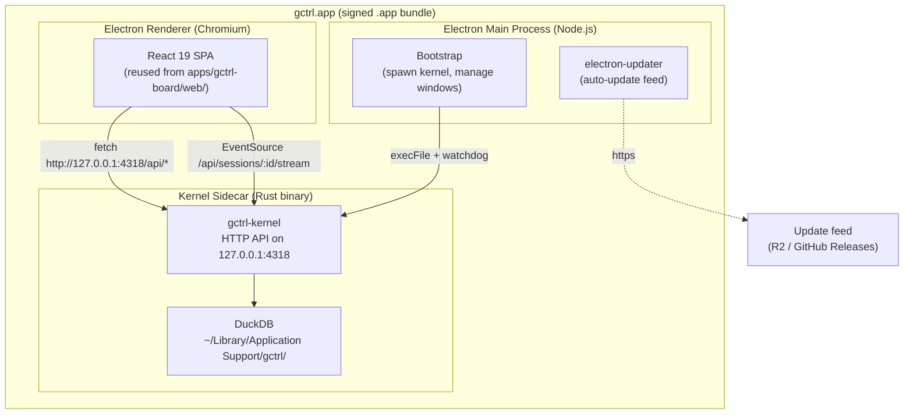

# gctrl Desktop — Native macOS Distribution

gctrl Desktop is a **packaging and distribution mode**, not a new application. It bundles the Rust kernel binary together with the React UI from `apps/gctrl-board/web/` (and future apps) into a single signed, notarized macOS `.app` that a user can drag into `/Applications`. macOS is the first target; Windows and Linux are out of scope for v1.

The desktop app preserves every architectural invariant from [os.md](../os.md): the kernel runs as an independent binary, the UI consumes kernel HTTP on `:4318`, and dependency direction stays `App → Shell → Kernel`. From the kernel's perspective, the desktop app is identical to local-dev mode — a renderer process that talks HTTP. The Electron shell is a thin packaging layer, not a runtime the kernel knows about.

## Architectural Position

**Key invariants preserved:**

1. **Local-first.** No network connectivity required for any feature. The kernel runs entirely on-device; no remote calls are added by the desktop shell.
2. **Single-writer DuckDB.** The kernel sidecar is the sole writer (same as local-dev mode). The renderer never opens DuckDB directly.
3. **Dependency direction unchanged.** The renderer is an HTTP client of the kernel — the same role the Cloudflare Worker SPA plays in cloud mode and the Vite dev server plays in local-dev mode.
4. **No new application layer.** Desktop is a deployment target, not an app. There are no `desktop_*` tables, no `/api/desktop/*` routes. Bootstrap concerns (spawning the kernel, auto-update) live in the Electron main process and never touch the kernel.

## Tech Stack Decision: Electron

Electron was chosen over Tauri 2 and Flutter after evaluating tradeoffs against the Unix invariants in [principles.md](../../principles.md) and the kernel-as-HTTP architecture defined in [os.md](../os.md).

### Decision matrix

| Concern | Electron | Tauri 2 | Flutter |
|---|---|---|---|
| **React 19 + @dnd-kit reuse** | Near-100%, no rewrite | Near-100%, but WebView fragmentation | Full UI rewrite (~350–500 hrs) |
| **Kernel sidecar pattern** | Standard (1Password 8, Pieces, Tabby) | First-class (`externalBin`) | Standard (Process API) |
| **WebView consistency** | One Chromium across platforms | WKWebView/WebView2/WebKitGTK divergence | N/A (Skia/Impeller) |
| **Native macOS feel** | Acceptable; not WKWebView-native | Better (WKWebView) | Worst (every pixel custom-painted) |
| **Bundle / RAM** | ~80–120 MB / 150–300 MB | ~10 MB / 50–85 MB | ~30 MB / native-ish |
| **Community / hireability** | Largest by far | Growing but smaller | Mid; Dart is niche |
| **Linux story (future)** | Predictable | WebKitGTK rot — maintainers eyeing CEF | Acceptable |
| **Mobile reuse** | None — separate project regardless | Tauri 2 mobile too young (GA Oct 2024) | Best — but irrelevant given separate-codebase decision |
| **macOS App Store risk** | Well-trodden | Sandbox + localhost kernel = review risk | Well-trodden |

### Why Electron wins for gctrl

1. **The "Rust synergy" argument doesn't apply.** Tauri's value proposition leans on co-locating Rust with the WebView. The gctrl kernel is *already* a separate HTTP binary on `:4318` — Tauri vs Electron is purely a WebView-shell choice for us, not a Rust integration choice.
2. **The existing React 19 + Tailwind + shadcn + @dnd-kit + custom-SVG visualization stack is the most-iterated layer.** Throwing it away (Flutter) is the largest cost; preserving it across all runtime modes (local dev, Cloudflare Worker, desktop) keeps one UI codebase.
3. **WebView consistency matters for an agent-heavy UI.** Custom visualizations (`GanttBoard`, `SessionsTimeline`, `SessionsHeatmap`), live SSE streams, and dense kanban interactions benefit from one Chromium across platforms vs. three diverging WebViews.
4. **Mobile is a separate codebase regardless** — see [gctrl-mobile.md](gctrl-mobile.md). Picking a desktop framework "for the mobile reuse" is moot.
5. **Bloat is mitigated, not solved — but the kernel's heavy lifting is outside Electron.** All business logic, storage, and telemetry run in the Rust sidecar. Electron is just the shell around the renderer; the marginal cost of one more Chromium instance is acceptable for a tool the user opens deliberately, not a background daemon.

### Tradeoffs accepted

- **~150–300 MB RAM** for the renderer + main process (vs. ~50–85 MB on Tauri). Acceptable because the kernel is the heavy compute, not the UI.
- **Hardened-runtime entitlements required** for V8 JIT (`com.apple.security.cs.allow-jit`, `allow-unsigned-executable-memory`). Not required on Tauri.
- **Auto-update via electron-updater** is the de-facto standard but adds a code path not present in cloud mode.

## Runtime Modes

The same React UI runs in three distinct runtime configurations. The desktop mode adds no new application logic — it is a third deployment target for code that already exists.

| Mode | Frontend host | Kernel | Storage | Used for |
|------|---------------|--------|---------|----------|
| **Cloud (Cloudflare Worker)** | Worker serves SPA | None — Worker proxies select kernel routes via `KERNEL_URL`; some routes (board CRUD) are D1-backed at the edge | D1 (edge) | Hosted demo, mobile companion, public-facing analytics surfaces |
| **Local dev (Vite + kernel daemon)** | Vite dev server proxies `/api` → `:4318` | Local Rust kernel daemon, manually started | DuckDB (`~/.local/share/gctrl/`) | Day-to-day development; full feature parity with desktop |
| **Desktop (Electron + kernel sidecar)** | Electron renderer loads bundled SPA assets | Bundled Rust kernel spawned by Electron main on app launch | DuckDB (`~/Library/Application Support/gctrl/`) | End-user distribution; what we ship as `gctrl.app` |

The frontend code in `apps/gctrl-board/web/` is identical in all three modes. Mode selection happens at *build time* (which bundle is being built) and *runtime* (which kernel URL the SPA points at). No conditional logic in the React tree itself.

## Components and Responsibilities

### Electron Main Process

The main process is a **bootstrap and lifecycle manager**, not a business-logic surface. It MUST NOT replicate kernel functionality, hold secrets, or proxy non-kernel APIs.

Responsibilities:
1. Spawn the kernel sidecar binary on app launch (`execFile`, hardened-runtime safe).
2. Watchdog the kernel — restart on crash with exponential backoff; surface fatal failures to the renderer via a banner.
3. Kill the kernel cleanly on `before-quit`.
4. Manage native windows, dock menu, application menu (`Edit`, `View`, `Window`, `Help`).
5. Wire `electron-updater` to the auto-update feed.
6. Forward deep links (`gctrl://open?session=...`) to the renderer.

Explicit non-goals:
- No IPC bridge for kernel data. The renderer talks to `http://127.0.0.1:4318` directly. This keeps Electron a true *shell* and keeps a single API path across runtime modes.
- No Node integration in the renderer (`contextIsolation: true`, `nodeIntegration: false`, `sandbox: true`).

### Kernel Sidecar

The same Rust kernel binary defined in `kernel/`, compiled as a universal2 macOS binary (arm64 + x86_64 via `cargo-zigbuild`) and bundled inside the `.app` under `Contents/Resources/kernel/`. Behavior is identical to local-dev mode; the only desktop-specific configuration is the storage path and the bind address (`127.0.0.1:4318`, never `0.0.0.0`).

### Renderer (React 19 SPA)

Loaded from a packaged `dist-web/` directory bundled into the `.app`. Routes use `HashRouter` (or `app://` protocol) instead of `BrowserRouter`. All `fetch('/api/...')` calls become `fetch('http://127.0.0.1:4318/api/...')` — a one-line base-URL change at the request wrapper.

### Auto-Update

`electron-updater` checks an update feed (S3/R2 hosted JSON manifest or GitHub Releases) on app launch and at a configurable interval. Updates are downloaded in the background and applied on next launch. Update payloads are signed with the same Developer ID Application certificate used for the app itself; signature verification is enforced by Squirrel.

## Local-First Invariants

The desktop mode MUST preserve the local-first guarantees from [principles.md](../../principles.md) § Design Principles:

1. **Offline functional.** Disconnect the network; every feature continues to work, including session history, board state, analytics, and inbox. The kernel does not phone home.
2. **No mandatory cloud account.** The desktop app launches and is fully usable without any login. Cloud sync (R2) and external drivers (GitHub, Linear) remain opt-in and configured per-user, exactly as in CLI/local-dev mode.
3. **Data lives in `~/Library/Application Support/gctrl/`.** Uninstalling the app does NOT delete user data; deletion is a deliberate user action (`gctrl reset` or manual). The vault directory remains user-owned and Obsidian-mountable.
4. **Updates do not require online presence.** The app launches and works without an update check succeeding; auto-update is a background concern.

## Distribution

### v1: Direct DMG

- Download from project website / GitHub Releases.
- Notarized + stapled DMG; Gatekeeper accepts on first launch without warning.
- Auto-update via `electron-updater` against an R2-hosted JSON manifest.

### v2 (optional): Homebrew Cask

- Submit cask to `homebrew/homebrew-cask` once the DMG cadence is stable.
- Cask references the GitHub Releases asset; `brew upgrade --cask gctrl` works.

### Out of scope for v1

- **Mac App Store (MAS).** The App Sandbox + localhost-binding kernel is a known review-risk combination. Auto-update inside MAS is also forbidden, which would force a divergent update path. Revisit only if a sandbox-friendly architecture is needed.
- **Windows / Linux desktop.** Electron supports both, but they are not v1 targets. Linux distribution (`.deb`, `.rpm`, AppImage) and Windows installer (`.exe` via Squirrel) can be added later without changing the architecture — the kernel sidecar pattern is portable.

## Mobile Relationship

The mobile app is **a separate codebase with a different feature set**. It does NOT embed the kernel and is not a port of the desktop app. See [gctrl-mobile.md](gctrl-mobile.md) for the mobile architecture, scope, and rationale.

The kernel-as-HTTP-server design means desktop and mobile are decoupled: they share kernel HTTP contracts (defined by the shell + apps), not UI code. This is intentional — mobile and desktop have different ergonomic targets, different feature subsets, and different platform constraints (iOS sandbox vs. macOS user filesystem).

## Implementation Reference

Concrete bundling, signing, notarization, and CI details live in the implementation spec:

- [implementation/apps/desktop-electron.md](../../implementation/apps/desktop-electron.md) — `electron-builder` config, kernel sidecar bundling, code signing, hardened-runtime entitlements, universal binary build, auto-update wiring, CI workflow.

## Related

- [os.md](../os.md) — Unix layer model; dependency direction invariant
- [principles.md](../../principles.md) — local-first, vendor independence, malleability
- [gctrl-board.md](gctrl-board.md) — the React UI bundled by the desktop app
- [implementation/apps/deployment.md](../../implementation/apps/deployment.md) — Cloudflare Worker deployment (the parallel runtime mode)
- [gctrl-mobile.md](gctrl-mobile.md) — mobile app architecture (separate scope)
