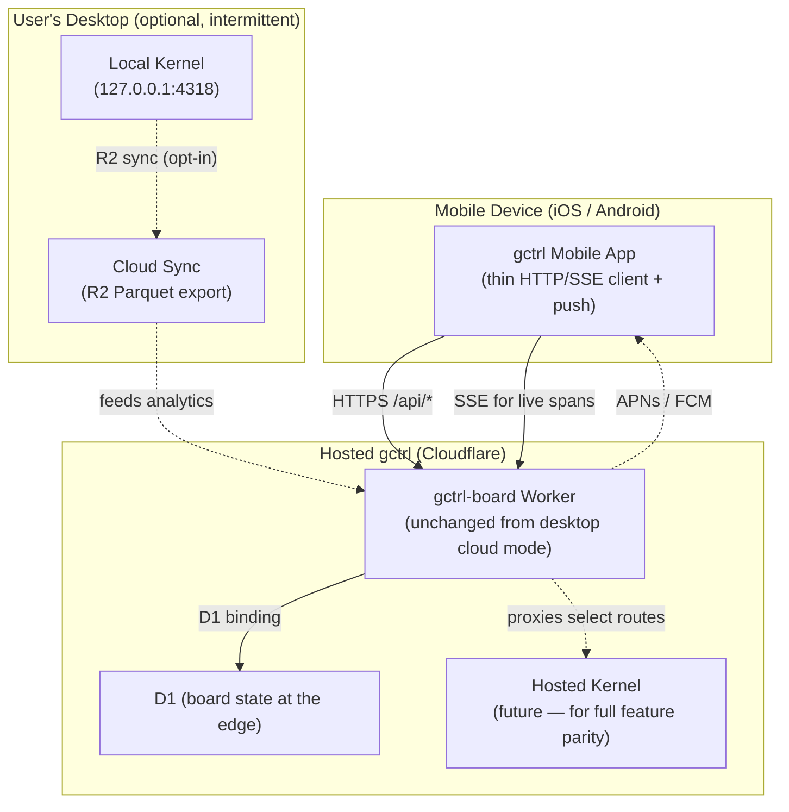

# gctrl Mobile — Remote-Only Companion App

The gctrl mobile app is a **remote-only companion** for iOS and Android, scoped to a strict subset of the desktop feature set. It does NOT bundle the kernel; it does NOT store DuckDB locally; it is NOT a port of the desktop app. Mobile is closer in shape to the hosted Cloudflare Worker SPA than to the Electron desktop bundle — a thin client over HTTP, designed for the operations a user performs while away from their primary machine.

This is a deliberate divergence from the desktop architecture. Mobile and desktop share kernel HTTP contracts, not UI code or runtime model.

## Scope

### In scope (v1)

The mobile app supports three feature areas: **agent comms, prompting, and analytics**. These are read-mostly, low-state-mutation surfaces that work well over a network and do not require local DuckDB.

| Feature area | Surface | Read or write | Backend route(s) |
|---|---|---|---|
| **Agent comms** | View running and recent sessions; tail span events live; receive push notification on session completion or guardrail intervention | Read + acknowledge | `/api/sessions/*`, `/api/sessions/:id/stream` (SSE), `/api/inbox/*` |
| **Prompting** | View prompt history; trigger an agent dispatch (e.g. assign agent to an Issue, kick off a scheduled prompt); attach context from clipboard or share sheet | Write (dispatch) | `/api/team/recommend`, `/api/team/render`, `/api/board/issues/:id/move`, `/api/orchestrate/dispatch` |
| **Analytics** | Cost summaries, latency p95s, token usage by day/model/persona; alerts list; daily aggregates | Read | `/api/analytics/*` |

### Out of scope (v1)

The mobile app explicitly omits surfaces that are unsuitable for remote-only operation, would be redundant on a small screen, or would require shipping the kernel:

- **Local kernel.** No DuckDB on device; no sidecar binary; no local span ingestion.
- **Vault editing.** The Obsidian-mountable vault is desktop-only; mobile does not mount or edit Markdown.
- **Web crawling, browser control, network proxy.** Utilities under `gctrl net *` and `gctrl browser *` are kernel-side only.
- **Eval engine, local model routing.** All LLM calls flow through the cloud kernel.
- **Settings that touch local filesystem or system services.** Driver configuration, secrets, notarization-equivalent flows.

If a feature requires the kernel, it is not in the mobile scope. If the feature can be expressed as "GET data, render it" or "POST a small command," it is a mobile candidate.

## Architectural Position

**Three separate runtime targets, one set of HTTP contracts:**

1. **Desktop (Electron + local kernel)** — full feature set, source of truth for user data. See [gctrl-desktop.md](gctrl-desktop.md).
2. **Cloud (Cloudflare Worker SPA)** — public hosted instance, also the backend the mobile app talks to. See [implementation/apps/deployment.md](../../implementation/apps/deployment.md).
3. **Mobile (this spec)** — thin client over the same Worker. Native iOS/Android shell.

The Worker plays two roles: it serves the public SPA (browsers) AND the mobile app (native HTTP/SSE clients). The kernel HTTP contracts shape both.

## Why No Kernel on Mobile

Shipping the kernel to mobile would be a significant architecture change for marginal user benefit. The constraints are concrete, not philosophical:

1. **iOS sandbox.** No `fork`, restricted filesystem, no arbitrary `localhost` binding without entitlements unavailable to non-system apps. The kernel as it stands cannot run as a sidecar process on iOS. A Rust *library* (`cargo-lipo` + Swift bridge) would be possible but is a wholesale rewrite of how the kernel is exposed.
2. **DuckDB on mobile is not a goal.** Vault, sessions, telemetry, and analytics live on the user's primary machine. Mobile is for monitoring and lightweight intervention, not parallel local-first operation.
3. **Battery and storage.** A persistent OTel ingestion daemon on a phone is the wrong shape for a mobile lifecycle (background termination, cold starts, foreground-only network).
4. **Sync complexity.** Two writable kernels (desktop + mobile) across devices needs CRDT-grade conflict resolution. R2 sync ([kernel/sync.md](../kernel/sync.md)) is designed for read replicas, not multi-master.

The remote-only design accepts an explicit tradeoff: **mobile requires connectivity to be useful.** This is fine for the scoped feature set — checking on agents, kicking off prompts, viewing analytics — and is consistent with how users already think about phone-vs-laptop work boundaries.

## How Mobile Talks to Cloud

The mobile app talks to the same `gctrl-board` Cloudflare Worker that serves the public SPA. No new backend is introduced for mobile.

| Concern | Mechanism |
|---|---|
| **Auth** | Session token issued by the Worker after sign-in (OAuth via GitHub for v1). Stored in iOS Keychain / Android EncryptedSharedPreferences. |
| **Data fetch** | Standard HTTPS to `/api/*` routes. ETags / `If-None-Match` for caching. |
| **Live updates** | EventSource (SSE) for session streams; falls back to polling when SSE is unavailable on mobile network paths. |
| **Push notifications** | Worker emits to APNs (iOS) and FCM (Android) on session completion, guardrail signal, alert firing. |
| **Offline** | Read-only cache of last-fetched analytics and inbox. Writes (dispatch) require connectivity; the UI surfaces this clearly. |

## Tech Stack: Deferred Decision

The mobile framework is **not chosen yet**. v1 is scoped intentionally so the choice can be made when mobile becomes a real product priority, not as a side-effect of the desktop decision.

The three viable options, ranked by likely fit:

| Option | When it wins | Cost |
|---|---|---|
| **React Native** | Maximum reuse of Effect-TS domain types from `packages/domain` and existing TS schemas; team already fluent in TS+React; some component patterns transfer | Native module surface still required for push, deep links, biometrics |
| **Native (Swift + Kotlin/Compose)** | Best UX, smallest binaries, cleanest platform integration; what 1Password does | Two codebases, two languages, two CI pipelines; longer cycle |
| **Flutter** | One mobile codebase across iOS/Android, single design language | Brand-new ecosystem for the team; no shared code with web/desktop |

**Capacitor (wrap the React SPA) is explicitly rejected.** The desktop research surfaced that `@dnd-kit` and dense React 19 interactions fight WKWebView gesture handling on touch — the same UX failure mode that pushed many "wrap your web app" projects to native rewrites. The mobile feature set is small enough that a native or React Native app is feasible without the Capacitor compromise.

A decision is expected when mobile moves from "future work" to "next quarter" — not before.

## Relationship to the Cloud Worker SPA

The hosted `gctrl-board` Cloudflare Worker SPA already solves most of mobile's data-access problem. Mobile v1 can be modeled as: "the Cloudflare SPA, but as a native app with push notifications and a touch-optimized layout."

Concretely:
- The mobile app uses the same `/api/*` contracts the Worker SPA already consumes.
- Server-side rendering, D1 reads, and analytics aggregations are reused unchanged.
- Mobile-specific additions on the Worker are limited to: APNs/FCM dispatch, session-token issuance, and any view models that don't make sense for the desktop SPA (e.g. condensed inbox digests).

This means mobile development can begin without changes to the kernel and with minimal changes to the Worker — most of the "cloud backend for mobile" is already deployed.

## Local-First Compatibility

The desktop app remains the source of truth for user data. The mobile app is a *projection* of state that lives on the user's primary machine, accessed via cloud sync.

The flow:

1. User runs gctrl Desktop locally; kernel writes DuckDB.
2. Cloud Sync ([kernel/sync.md](../kernel/sync.md)) periodically exports Parquet to the user's R2 bucket.
3. The Cloudflare Worker reads from R2 to serve aggregations to the mobile app.
4. The mobile app renders and notifies; writes (dispatch, acknowledgements) flow back to the Worker, which queues them for the desktop kernel to pick up on next sync OR routes them through the future hosted-kernel surface.

For users who run *only* the cloud Worker (no desktop install), the mobile app works directly against the Worker's edge state — no R2 sync involved. For users who run only desktop (no R2 sync configured), mobile shows an empty state with a clear message: "Connect cloud sync to use the mobile app."

This preserves [principles.md](../../principles.md) § Design Principles #3: **local-first, cloud-optional**. Mobile is itself opt-in; it does not change desktop behavior.

## Out-of-Scope Discussions

To prevent scope creep, the following are explicit non-goals for the mobile spec and should not be added without revisiting this document:

- **Editing the vault from mobile.** Obsidian's mobile app exists; gctrl does not duplicate it.
- **Running agents on the device.** Agents run where the kernel runs (desktop, or future hosted kernel). Mobile triggers them; it does not host them.
- **Custom mobile-only data formats.** All mobile data flows through existing kernel HTTP contracts. New routes can be added on the Worker, but no parallel data model.
- **Native widgets / Live Activities (iOS) / App Shortcuts (Android).** Out of v1; possible v2 once the core feature set is shipped.

## Related

- [gctrl-desktop.md](gctrl-desktop.md) — Electron desktop app architecture; deliberately separate codebase
- [implementation/apps/deployment.md](../../implementation/apps/deployment.md) — Cloudflare Worker SPA the mobile app shares a backend with
- [kernel/sync.md](../kernel/sync.md) — R2 cloud sync that feeds mobile
- [principles.md](../../principles.md) — local-first invariant; remote-only mobile preserves it
