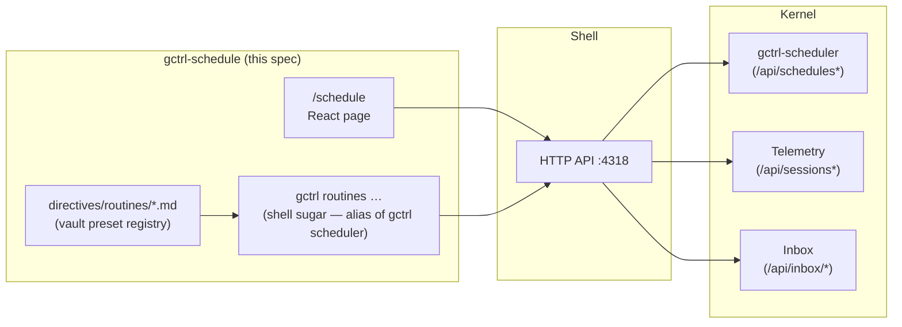
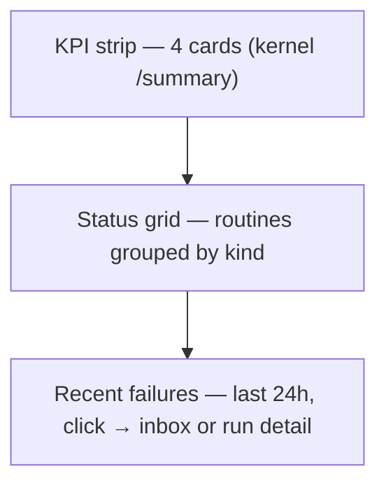

# Application: gctrl-schedule (Routines)

> Web surface and shell sugar for setting up, monitoring, and triaging recurring agentic tasks — gap analyses, codebase audits, eval runs, weekly status digests, ingest jobs — built on the existing kernel `gctrl-scheduler` primitive. CI-style health roll-up plus a per-routine drill-in that reuses Inbox and Analytics surfaces for details.

## 1. Problem

The kernel ships `gctrl-scheduler` and a working `gctrl scheduler …` CLI today. Operators can already CRUD schedules and `run-now` a single fire. What is missing — and what blocks routine agentic work from being trustworthy — is the **observability and triage surface around the cron primitive**:

1. **No durable run history.** The `schedules` row records only `last_run_at` / `last_status` / `last_error`. The most recent fire is observable; everything before that is gone. There is no way to see "did the weekly audit succeed for the past two months?".
2. **No CI-style "is anything broken?" view.** A single `gctrl scheduler list` row tells you the latest status of one schedule. There is no aggregated health pane, no green/amber/red rollup, no failure feed across schedules.
3. **No edit-in-place.** Mutating a cron expression today requires `DELETE` + `POST`, which orphans whatever run history we add and rewrites identity. A fast iteration loop on a flaky routine (twiddle cron, watch it fire) is two destructive commands.
4. **No first-class "routine" concept for agentic work.** Operators want to set up "weekly codebase audit," "gap analysis between specs and code," "daily eval regression." Today each is a hand-rolled `target_kind: exec` with absolute argv and bespoke env list. There is no preset catalog, no shared vocabulary, no namespacing convention beyond what each app invents (uber's `uber.*` rows).
5. **No triage path on failure.** Today a failing schedule is silent unless an operator reads its row. No alert fan-out, no inbox integration. Routines that protect us (audits, gaps, evals) need to be loud when they regress.

This spec adds the smallest set of kernel additions needed to fix (1)–(3) and (5), plus an app-layer presentation (web page + shell sugar + vault catalog) that fixes (4).

## 2. Target Users

Mirrors the gctrl-board PRD — the Schedule page is the second permanent surface those personas live in.

### Primary: Developer dispatching agents

| Need | Surface | Solution |
|---|---|---|
| "Set up a weekly codebase audit" | Web UI / Shell | Pick `audit.codebase` from the catalog, fill the form, submit |
| "Did the audit run last week — pass or fail?" | Web UI | Status grid + sparkline of last N fires per routine |
| "Why did this fire fail?" | Web UI | Run detail with stdout/stderr preview + deep-link to the agent session in /analytics |
| "Run the audit now to test a fix" | Web UI / Shell | "Run now" button / `gctrl routines run audit.codebase` |
| "Pause this routine while I'm refactoring" | Web UI / Shell | Disable toggle / `gctrl routines disable …` |

### Secondary: Team lead reviewing health

| Need | Surface | Solution |
|---|---|---|
| "Is anything broken?" | Web UI | KPI strip — green / amber / red counts at top of /schedule |
| "How much are agentic routines costing this week?" | Web UI | "Scheduled spend (24h)" KPI sourced from `analytics.cost?kind=internal` |
| "Triage failing routines from one place" | Web UI / Inbox | Inbox `kind: schedule_failed` messages, action via existing inbox UI |

## 3. Architectural Position

gctrl-schedule is a **native application** in the Unix layer model — same position as `gctrl-board`, `gctrl-analytics`, `gctrl-inbox`. It is **not** a new kernel primitive: the kernel already owns `gctrl-scheduler` (see [kernel/scheduler.md](../kernel/scheduler.md)). This app is a presentation + ergonomics layer over the existing `/api/schedules` HTTP surface plus a small set of kernel additions called out in §5.



1. The Schedule page MUST consume kernel HTTP API only — MUST NOT open DuckDB / SQLite directly and MUST NOT import kernel crates.
2. The page is mounted as a fourth top-level surface in the gctrl-board web SPA (alongside Board / Inbox / Analytics), the same way gctrl-analytics is mounted today. Mounting in the board SPA is a deployment detail; the app is logically independent and MAY ship its own Worker in a future iteration.
3. There is no app-side daemon. All state lives in kernel SQLite (`schedules`, new `scheduler_runs`).
4. `gctrl routines …` is a thin opinionated alias over `gctrl scheduler …`. The two CLIs MUST return identical data when targeting the same schedule. `gctrl routines` is the friendlier, agentic-task-shaped subset; `gctrl scheduler` remains the full kernel surface.

## 4. Scope

### 4.1 In scope

1. A Schedule page in the board SPA: list, create, run-now, enable/disable, edit, delete; per-routine detail drawer with run history, embedded sessions, and embedded inbox alerts.
2. A "Routine" wrapper concept on top of `target_kind: exec` schedules — agentic recurring jobs (gap analysis, codebase audit, weekly status, eval ticks).
3. CI-style health roll-up at the top of the page, sourced from a kernel-computed summary endpoint (§5.6) — never recomputed client-side.
4. Vault-defined routine catalog (`directives/routines/<name>.md`), reconciled to the kernel via a `gctrl routines sync` command — same shape as `uber schedule sync` ([uber scheduling.md](/specs/scheduling.md)).
5. Cross-link surfaces:
   - per-run → embed `<SessionsTab>` from gctrl-analytics filtered to the routine
   - per-routine alerts → embed inbox messages with `kind = schedule_failed`
6. Shell sugar `gctrl routines …` — a routines-shaped subset on top of the existing `gctrl scheduler` CLI, with the same `--format table|json` flag convention.

### 4.2 Out of scope

1. Authoring agent prompts. Prompts live in `WORKFLOW.md` files and `directives/` vault entries; the Schedule page renders them but does not edit them.
2. Cron expression IDE. A single text field with parse-time validation against the existing `cron::next_after()` is sufficient.
3. Workflow / DAG composition. A routine is a single cron → single job. Composition lives inside the spawned agent / skill.
4. CI replacement for repo builds. GitHub Actions and external CI continue to own repo-level builds; this is the local-first **agentic** counterpart.
5. Multi-tenant access control. Single-operator assumption (same as the rest of gctrl).

## 5. Kernel Dependencies

The kernel already owns 80% of what's needed. The remaining 20% lands as five focused additions, each independently useful and shippable as a standalone work item.

### 5.1 `scheduler_runs` table — durable run history

> **Naming:** the table is `scheduler_runs`, not `schedule_runs`. All cross-cutting kernel-extension tables MUST be prefixed with their owning crate (`scheduler_*`, like `inbox_*`, `board_*`, `eval_*`) per [principles.md § Architectural Invariants #3](../../principles.md#architectural-invariants).

Today, the `schedules` row carries only `last_*` cache fields ([gctrl-core/src/schedule.rs](../../../../kernel/crates/gctrl-core/src/schedule.rs)). That is enough for the existing CLI but lossy for a CI-style timeline — only the most recent fire is observable.

```sql
CREATE TABLE IF NOT EXISTS scheduler_runs (
    id              TEXT PRIMARY KEY,            -- uuid
    schedule_id     TEXT NOT NULL,
    started_at      TEXT NOT NULL,               -- RFC3339 UTC
    finished_at     TEXT,                        -- NULL while running (manual run-now mid-flight)
    status          TEXT NOT NULL,               -- success | failure | timed_out | refused | interrupted
    fire_kind       TEXT NOT NULL,               -- cron | manual
    exit_code       INTEGER,                     -- exec only
    http_status     INTEGER,                     -- http only
    response_preview TEXT,                       -- caps + redaction (see below)
    error_preview   TEXT,                        -- caps + redaction (see below)
    duration_ms     INTEGER,
    created_at      TEXT NOT NULL,
    FOREIGN KEY (schedule_id) REFERENCES schedules(id) ON DELETE CASCADE
);

CREATE INDEX IF NOT EXISTS idx_scheduler_runs_schedule_started
  ON scheduler_runs(schedule_id, started_at DESC);
CREATE INDEX IF NOT EXISTS idx_scheduler_runs_status_started
  ON scheduler_runs(status, started_at DESC);
```

**Transactional write path.** The runner (and `run_now`) MUST wrap the existing `schedules` UPDATE, the new `scheduler_runs` INSERT, and the inbox emit (§5.3) in a single SQLite transaction. A daemon crash mid-fire MUST NOT leave `current_failure_streak` incremented without either the run row or the inbox alert. The combined operation lives behind a new `SqliteStore::record_schedule_run_v2(&schedule_id, run, &update, maybe_inbox_msg)` helper.

**Output redaction.** `response_preview` and `error_preview` MUST inherit the redaction posture of `last_response` / `last_error` from [kernel/scheduler.md § Output Redaction](../kernel/scheduler.md#output-redaction): apply the same regex pass (`(?i)(token|secret|key|password|webhook)\s*[=:]\s*\S+` → `[redacted]`) before writing. The 90-day retention amplifies leak surface; redaction at write time is mandatory, not optional. Implementation: extract the existing redactor from runner.rs into a `gctrl-scheduler::redact` module shared by both the row UPDATE and the new INSERT.

**Startup reaper.** On `ScheduleRunner::run_forever` startup, after `backfill_next_run`, the runner MUST scan for `scheduler_runs WHERE finished_at IS NULL` and mark them `status = 'interrupted', finished_at = now`. A `manual` fire interrupted by a daemon crash leaves a dangling row otherwise.

**Routes:**

| Route | Purpose |
|---|---|
| `GET /api/schedules/{id_or_name}/runs?limit=50&since=...&status=...` | Run history for one schedule. Default limit 50, max 500. |
| `GET /api/schedules/runs?status=failure&since=24h&limit=200` | Cross-schedule recent runs. Powers the top-of-page failure feed. |
| `DELETE /api/schedules/runs?before=<RFC3339>` | Prune route invoked by `_internal.scheduler_runs_gc`. Idempotent — same `before` twice deletes nothing the second call. Auth: limited to `127.0.0.1` via the existing host-allowlist middleware. |

**Retention** (decision, formerly OQ): default lives in `SchedulerConfig.run_retention_days: u32 = 90` (new field on the `gctrl-core` struct). Per-schedule override via a new nullable `schedules.retention_days INTEGER` column; null falls back to global. Worst-case row budget at default config (poll 30s, max_per_tick 16, retention 90 days) is `(86400/30) × 16 × 90 = 4.15M` rows ≈ 800 MB SQLite — practical workloads sit two orders of magnitude below this. The runner MUST emit `tracing::warn!` if `scheduler_runs` row count exceeds `SchedulerConfig.run_warn_row_count: u32 = 100_000` (configurable) so operators see the signal before disk fills.

### 5.2 `PATCH /api/schedules/{id}` — edit in place

Currently the only mutation routes are `POST /api/schedules`, `DELETE /api/schedules/{id}`, and the `enable / disable / run` action endpoints. Editing a routine therefore requires DELETE + POST, which orphans `scheduler_runs` rows once §5.1 ships.

**Merge semantics.** PATCH follows [RFC 7396 — JSON Merge Patch](https://datatracker.ietf.org/doc/html/rfc7396): a JSON object whose keys are the fields to update. **Field absence is a no-op; explicit `null` clears the field** (where the column is nullable). The Rust handler MUST distinguish absent from null using `Option<Option<T>>` or an explicit JSON `Map` walk — serde's `Option<T>` alone collapses the two and is incorrect here.

**Patchable fields:**

```text
cron, target_method, body_json, headers_json,
command, cwd, env_keys, timeout_secs, enabled,
alert_after_failures, retention_days
```

`target_kind` and `name` MUST NOT be patchable — they are identity. Changing kind requires DELETE + POST, which is the correct path because it forces a new identity (and a new history bucket).

**Validation rules.** PATCH MUST re-run **every** create-time gate, with the merged-row view (incoming PATCH + stored row for absent fields):

1. Cron (incoming or stored) parses via `cron::next_after()`; PATCH that included `cron` recomputes `next_run_at` from `Utc::now()`.
2. **Mutual exclusion** — if the merged row's `target_kind` is `http`, the merged view MUST NOT carry non-empty `command` / `cwd` / `env_keys`. If `target_kind` is `exec`, the merged view MUST NOT carry non-empty `target_url`. A PATCH that violates this returns 400 — this prevents lateral upgrade of an `http` row by adding a `command` array post-creation.
3. **Exec gate re-validation** — for `exec` rows, `cfg.exec_enabled` MUST be true AND `argv[0]` (incoming or stored) MUST appear in `cfg.exec_allowed_programs` AND `argv[0]` MUST be absolute AND `cwd` (incoming or stored) MUST be absolute. The handler MUST fetch the stored row first and validate against the merged view — never validate only the incoming partial.
4. Unknown keys in the PATCH body MUST be rejected with 400 — fail closed.
5. Patch on a non-existent id returns 404; concurrent PATCH wins last-writer (no ETag in M1; revisit if observed).

**Route registration.** PATCH MUST be registered on the same `Router::new()` instance that the existing `/api/schedules*` routes share, so the `host_allowlist_middleware` (DNS-rebinding defence — see [kernel/scheduler.md § Security gates](../kernel/scheduler.md#security-gates-operator-opt-in)) wraps it automatically. `gctrl-scheduler::http::router` is the single mounting point.

### 5.3 Inbox source: `schedule_failed`

When a schedule's failure streak reaches a configurable threshold, the kernel SHOULD emit an inbox message so the operator triages it through the existing Inbox UI rather than a bespoke alerts surface in /schedule.

**Schema additions to `schedules`:**

```sql
ALTER TABLE schedules ADD COLUMN alert_after_failures INTEGER;        -- NULL = disabled
ALTER TABLE schedules ADD COLUMN current_failure_streak INTEGER NOT NULL DEFAULT 0;
ALTER TABLE schedules ADD COLUMN retention_days INTEGER;              -- NULL = use SchedulerConfig.run_retention_days
```

**Kind whitelist.** The receiver's `inbox_create_message` validates `kind` against a hard-coded `VALID_KINDS` list ([gctrl-otel/src/receiver.rs](../../../../kernel/crates/gctrl-otel/src/receiver.rs)). `schedule_failed` MUST be added to that list as part of M3 before the kernel emit code lands — without the whitelist update, the emit returns 400 and the alert is lost. The whitelist sweep MUST also add `schedule_failed` to the `KIND_OPTIONS` list in `apps/gctrl-board/web/src/pages/InboxPage.tsx` so the global Inbox filter dropdown surfaces these messages.

**Runner logic on every fire (inside the §5.1 transaction):**

1. On `success = true`, reset `current_failure_streak = 0`. If a previous `schedule_failed` inbox row for this schedule is still `pending`, no implicit transition (operator owns the inbox lifecycle).
2. On `success = false`, `current_failure_streak += 1`. If `alert_after_failures IS NOT NULL AND current_failure_streak == alert_after_failures` (exact equality, not `>=`), enqueue ONE `inbox_messages` INSERT in the same transaction:

```json
{
  "source": "kernel",
  "kind": "schedule_failed",
  "urgency": "high",
  "title": "Routine `audit.codebase` failed 3 times",
  "context": {
    "schedule_id": "...",
    "schedule_name": "audit.codebase",
    "failure_streak": 3,
    "last_error": "<redacted preview>"
  },
  "requires_action": true
}
```

`context.last_error` MUST go through the same redaction regex (§5.1) before embedding — this is a second exfil path that an under-redacted child stderr would otherwise leak into the Inbox UI.

Subsequent failures within the same streak MUST NOT spam — the dedupe is the streak counter (only emit at the boundary). When the streak resets, the next streak crossing emits a new message; the operator may have acted (or not) on the previous one and the kernel does not auto-resolve.

Threshold default: kernel does NOT set a global default. Catalog presets opt in.

### 5.4 `_internal.*` prefix — kernel-side guard

The `_internal.*` namespace is reserved for daemon-managed schedules (e.g. `_internal.scheduler_runs_gc`). The kernel MUST reject `POST /api/schedules` and `PATCH /api/schedules/{id}` requests whose `name` matches `^_internal\.` from any caller other than the daemon's own internal registration path.

Mechanism: the create / patch handlers are HTTP-layer; "the daemon" registering an internal row uses a private `SqliteStore::create_schedule_internal()` helper that bypasses the HTTP layer entirely. The HTTP route checks the prefix and 403s. An agent with vault write access cannot mint a forever-running `_internal.exfil` schedule by dropping a YAML file into `directives/routines/`.

### 5.5 `session.schedule_id` (deferred to M4)

For routines that spawn agent sessions, hard-linking the resulting `session` row to the firing schedule lets the Schedule detail drawer deep-link to a session's trace tree without a heuristic.

Mechanism: kernel scheduler injects `GCTRL_SCHEDULE_ID` into the spawned child's env (already gated through `env_keys`), and OTel ingest fans out a `gctrl.schedule.id` resource attribute into a denormalised column on `Session`.

Until then, the page derives "sessions for routine `audit.codebase`" by querying `/api/sessions?created_by=scheduler` client-side and filtering by `agent_name` + time-window match against the schedule's recent runs. Lossy at the edges (concurrent fires of routines with similar names) but acceptable while routine count stays in the dozens.

### 5.6 `GET /api/schedules/summary` — kernel-computed rollup

The /schedule page rollup (KPIs + per-row health state) MUST NOT be aggregated client-side. Per [gctrl-analytics.md § Reuse vs. New](gctrl-analytics.md#reuse-vs-new) — "no new analytics logic in the app, any new aggregation belongs in the kernel so the CLI benefits too" — this endpoint computes the rollup once on the server and serves it to the page AND to `gctrl routines list --summary`.

```text
GET /api/schedules/summary

{
  "total": 12,
  "by_health": { "green": 8, "amber": 1, "red": 1, "pending": 1, "paused": 1 },
  "runs_last_24h": { "success": 47, "failure": 2 },
  "spend_last_24h_usd": 0.42        -- joins to analytics.cost?kind=internal&since=24h
}
```

Per-row `health` is also returned from `GET /api/schedules` as a derived column — the SQL view computes it from `enabled`, `last_status`, `current_failure_streak`, `alert_after_failures`, `last_run_at`, `next_run_at`. The page never re-derives. CLI parity: `gctrl routines list` shows the same `health` column.

### 5.7 Shell sugar — `gctrl routines …`

The kernel CLI already exposes `gctrl scheduler list / show / add / rm / enable / disable / run` ([gctrl-cli/src/main.rs:155](../../../../kernel/crates/gctrl-cli/src/main.rs)). The shell-layer `gctrl routines …` is an opinionated alias for the agentic-routine subset:

```sh
gctrl routines list [--summary] [--format table|json]
gctrl routines run <name>                              # POST /api/schedules/{name}/run
gctrl routines show <name> [--format table|json]       # row + last 10 runs
gctrl routines enable <name>
gctrl routines disable <name>
gctrl routines logs <name> [--limit 50] [--status failure] [--since 7d] [--format table|json]
gctrl routines sync [--dir <path>]                     # reconcile directives/routines/*.md to kernel
```

`gctrl routines …` MUST be sugar — under the hood it calls the same `/api/schedules*` routes the kernel CLI does. No new HTTP surface. Every command MUST accept `--format table|json` to match the kernel CLI's existing convention. `gctrl routines list` output MUST be pipeable: `gctrl routines list --format json | jq '.[] | select(.health=="red")'`. Module location: `shell/gctrl-shell/src/commands/routines.ts`. The reconciler logic (file walk, YAML parse, diff, apply) MUST live in the shell, never in a kernel crate — kernel never reads vault directly.

## 6. Domain Model

### 6.1 Routine vs. Schedule vs. Task

| Term | Crate | Meaning |
|---|---|---|
| **Schedule** | `gctrl-scheduler` | Kernel primitive: cron-fired HTTP / exec callback. `target_kind ∈ {http, exec}`. Defined in [kernel/scheduler.md](../kernel/scheduler.md). |
| **Task** | `gctrl-orch` | Kernel primitive: a long-lived agent claim with retry semantics. Different lifecycle from Schedule — see [kernel/scheduler.md § Implementation status](../kernel/scheduler.md#implementation-status-may-2026). |
| **Routine** | this app | Schedule with a recognised name prefix and (optionally) a vault catalog entry. Pure UX concept; on the wire every Routine is a Schedule. NOT a Task. |

The Schedule page renders all kernel schedules; routines are simply schedules with a recognised `name` prefix and (optionally) a vault catalog entry.

### 6.2 Tagging — name prefix

Mirroring the existing uber convention, routines use a dotted-name prefix as their kind:

| Prefix | What | Example |
|---|---|---|
| `audit.*` | Codebase / spec / dependency audits | `audit.codebase`, `audit.deps` |
| `gap.*` | Gap analyses | `gap.specs-vs-code`, `gap.test-coverage` |
| `eval.*` | Eval runs | `eval.daily`, `eval.regression` |
| `digest.*` | Periodic summaries | `digest.weekly-status` |
| `ingest.*` | Driver-pulled feeds | `ingest.rss`, `ingest.sec` |
| `uber.*` | Uebermensch user briefs | `uber.morning_brief` |
| `_internal.*` | Daemon-managed; reserved | `_internal.scheduler_runs_gc` |

The page renders the prefix as the column / group header. `_internal.*` is enforced server-side per §5.4. Other prefixes are free-form; the kernel does not enforce a registry.

### 6.3 Health states

Health is computed **kernel-side** as a derived column on each `schedules` row (§5.6):

| State | Definition |
|---|---|
| `green` | `enabled = true` AND last run succeeded AND `current_failure_streak = 0`. |
| `amber` | `enabled = true` AND last run failed AND (`alert_after_failures IS NULL` OR `current_failure_streak < alert_after_failures`). |
| `red` | `alert_after_failures IS NOT NULL AND current_failure_streak >= alert_after_failures`. |
| `pending` | `enabled = true` AND `last_run_at IS NULL` AND `next_run_at IS NOT NULL`. |
| `paused` | `enabled = false`. |

A routine with `alert_after_failures = NULL` STAYS amber under sustained failure — the threshold is the only red gate. This is intentional: a routine without an explicit alerting opt-in MUST NOT escalate silently. The Web UI surfaces a "no alert threshold set" hint on amber rows so operators notice.

### 6.4 Routine catalog (vault-driven)

Apps contribute routine templates as YAML frontmatter in their vault, mirroring the existing pattern in [uber scheduling.md § Vault Schema](/specs/scheduling.md#vault-schema--directivesschedulesmd):

```yaml
---
schema_version: 1
routine:
  name: audit.codebase
  cron: "0 3 * * 1"                                # Mon 03:00
  tz: UTC
  argv: ["/usr/local/bin/node", "/abs/path/skills/audit/run.js"]
  cwd: /abs/path/repo
  env_keys: [GCTRL_KERNEL_URL, ANTHROPIC_API_KEY]
  timeout_secs: 1800
  alert_after_failures: 3
  retention_days: 365                              # optional override of global default
  description: |
    Weekly codebase audit. Reads vault/specs and the working tree,
    emits a vault page in input/audits/<date>.md and an inbox
    eval_request when findings exceed threshold.
---

# audit.codebase

Free-form notes / changelog below the frontmatter.
```

Files live at `apps/<app>/vault/directives/routines/<name>.md` (or `vault/directives/routines/<name>.md` for cross-cutting routines).

`gctrl routines sync` reconciler:

1. Reads catalog files; validates YAML schema (any unknown frontmatter key is rejected before any mutation).
2. Rejects any file naming itself `_internal.*` (kernel will 403 anyway; reconciler fails fast with a clear error).
3. GETs kernel rows scoped to the app's name prefix.
4. Diffs and applies upserts/deletes.
5. **Graceful degradation**: a missing `directives/routines/` directory is a no-op exit 0 with a `tracing::info!` log line — fresh checkouts MUST NOT fail `pnpm dev` startup. An empty existing directory is also a no-op.
6. **Atomicity**: any per-row apply failure aborts the run; subsequent runs are idempotent and resume.

The reconciler is scoped by **author directory**, not by name prefix — two apps cannot fight over the same prefix. A reconciler invoked from `apps/gctrl-board/vault/directives/routines/` will never touch a row created by the uber reconciler in `/directives/routines/`.

## 7. UX

### 7.1 Top-of-page rollup (CI-style)

The first thing on `/schedule`. Designed to answer "is anything broken?" without scrolling. KPIs come from `GET /api/schedules/summary` (§5.6) — never recomputed in the browser.



KPI strip:

1. **Routines** — `total` enabled / total registered.
2. **Health** — `by_health.green / amber / red` counts. Each clickable to filter the grid below.
3. **Runs (24h)** — `runs_last_24h.success / failure` as a stacked mini-bar.
4. **Scheduled spend (24h)** — `spend_last_24h_usd`. Hidden when zero.

Status grid: one card per routine, grouped by kind prefix (§6.2). Each card shows:

1. Name, cron, timezone (if non-UTC).
2. Health pill from the row's kernel-computed `health` column (`green` / `amber` / `red` / `pending` / `paused`).
3. **Sparkline** of recent runs as success/failure dots. Window is **time-based, not count-based**: last 30 days for daily-or-faster routines, last 12 weeks for weekly routines (auto-switched on detection of cron cadence). A weekly routine that fired only twice shows two dots, not 18 empty placeholders.
4. Last run timestamp + duration.
5. Next run timestamp.
6. Inline buttons: `run now`, enable/disable toggle.

### 7.2 Detail drawer

Clicking a routine opens a right-side drawer with tabs (mirrors `IssueDetailPanel` and `SessionDetailPane` patterns already in the SPA). Tabs:

1. **Runs** — table of `scheduler_runs` for this routine, latest first. Columns: started_at, duration, status, exit_code/http_status, error preview. Click a row → second-level drawer (or full-route `/schedule/:name/runs/:run_id`) with full response_preview / error_preview and, when derivable, a deep link to the run's session in `/analytics/sessions/:id`.
2. **Edit** — form bound to `PATCH /api/schedules/{id}`. Fields: cron, command/url+method, env_keys (multi-select from a known-key list), timeout, `alert_after_failures`, `retention_days`, enabled. Cron is parsed live via the kernel's parse helper exposed at `POST /api/schedules/parse-cron` (returns next-5 firings + raw error string from `cron::next_after()` like `expected 5 fields, got 4`). The UI surfaces the kernel's raw error verbatim — never a generic "invalid cron".
3. **Sessions** — when `target_kind = exec` and at least one historical run, embed `<SessionsTab>` from gctrl-analytics. **Component refactor required**: today `SessionsTab` accepts `kind: "all" | "internal" | "external"` only. M1c MUST extend it with `createdBy?: string` and `agentNameMatch?: string` props, OR carve out a smaller `<SessionsList>` primitive that both pages consume. Decision belongs in the M1c PR; the spec calls out the work so it does not get lost as "embed the existing component" with no plan.
4. **Alerts** — `GET /api/inbox/messages?kind=schedule_failed&context.schedule_id=<id>`. Renders with the existing `<MessageCard>` and `<MessageDetail>` components. Action buttons (acknowledge, defer) call the existing inbox action endpoints. No bespoke alert UI.

### 7.3 Create routine — two entrypoints

1. **From templates** (default for non-power users): pick a preset from the registered `directives/routines/` files. UI label is "Templates"; internal/CLI vocabulary keeps "catalog". Form pre-fills argv / cwd / env_keys / cron and offers the preset's authored knobs (e.g. "audit which repo path?"). Submit → POST to `/api/schedules`.
2. **Free-form** (power users): full kernel surface — name, cron, target_kind, target_url or argv, env_keys, timeout. Same form the kernel CLI's `scheduler add` exposes.

Validation:
- Cron parse error renders the kernel's raw error string inline.
- Exec: name MUST match `[a-z0-9_.-]+` AND name MUST NOT start with `_internal.` (kernel will reject anyway; client validates for fast feedback). argv[0] / cwd absolute. The kernel rejects on violation; the UI surfaces the error inline.

### 7.4 Web routes

The current `Route` discriminated union in [`apps/gctrl-board/web/src/hooks/useRoute.ts`](../../../../apps/gctrl-board/web/src/hooks/useRoute.ts) is closed (`board | inbox | analytics`). M1b extends it:

```ts
export type Route =
  | { page: "board"; projectKey: string | null; view: BoardView }
  | { page: "inbox"; threadId: string | null }
  | { page: "analytics"; tab: AnalyticsTab; sessionId: string | null }
  | { page: "schedule"; name: string | null; runId: string | null }   // NEW
```

| Path | Page | Meaning |
|---|---|---|
| `/schedule` | Schedule list + rollup | Top-of-page surface. |
| `/schedule/:name` | Schedule list + detail drawer | Deep-linkable to one routine. |
| `/schedule/:name/runs/:run_id` | Schedule list + run detail | Deep-linkable to one fire. |

NavSidebar gets a new entry between Analytics and the bottom logo mark. Icon: a clock outline (`<svg viewBox="0 0 20 20">` with circle + 12-3 hands) in the same inline-SVG style as `BoardIcon` / `InboxIcon` / `AnalyticsIcon`. M1b ships the icon.

### 7.5 Live updates

Subscribe to `useSessionStream` (already mounted everywhere in the SPA) and refresh:

1. On `session_ended` events whose new `created_by` is `scheduler` — refetch `/api/schedules` to pick up updated `last_run_at` / `current_failure_streak`.
2. On a 30s timer (background) — refetch `/api/schedules/runs?since=30s&limit=50` to pick up `http` routine fires that don't always emit OTel spans.

Independent SSE for `/api/schedules/runs/stream` is deferred — at the project's expected cadence (≤ a handful of routines, dozens of fires per day) polling is sufficient.

### 7.6 Cross-app linkage diagram

```mermaid
flowchart LR
  Cron["scheduler runner\n(tokio fiber)"] -->|"BEGIN TXN"| Txn[(SQLite tx)]
  Txn -->|UPDATE schedules| Sched["schedules\n(SQLite)"]
  Txn -->|INSERT scheduler_runs §5.1| Runs["scheduler_runs\n(SQLite, NEW)"]
  Txn -->|on streak boundary §5.3| InboxRows["inbox_messages\n(SQLite)"]
  Cron -->|"exec()"| Child["child process\n(uber, audit, gap, …)"]
  Child -->|OTLP spans| Sessions["sessions\n(DuckDB)"]

  subgraph UI["gctrl-board web SPA"]
    SchedulePage["/schedule"]
    AnalyticsPage["/analytics"]
    InboxPage["/inbox"]
  end

  SchedulePage -->|GET /api/schedules\nGET /api/schedules/{id}/runs\nGET /api/schedules/summary| Sched
  SchedulePage -->|GET /api/schedules/runs| Runs
  SchedulePage -.->|"deep-link via session_id"| AnalyticsPage
  SchedulePage -.->|"embed inbox messages\nkind=schedule_failed"| InboxPage
  AnalyticsPage -->|GET /api/sessions?created_by=scheduler| Sessions
  InboxPage -->|GET /api/inbox/messages?kind=schedule_failed| InboxRows
```

The Schedule page does NOT subscribe to a new event bus. It piggy-backs on the existing OTel session stream (for live `last_run_at` updates) and the existing Inbox SSE (for live alert refresh).

## 8. Routine Catalog — Presets

The first three are the agentic routines the user explicitly called out. Each is a `target_kind: exec` schedule invoking a skill or shell command. **Skill provenance** matters for sizing: catalog entries marked **(reuse)** wrap an existing command; entries marked **(new skill)** require building the skill itself in the same milestone.

| Routine | Default cron | Spawns | Status |
|---|---|---|---|
| `audit.codebase` | `0 3 * * 1` (Mon 03:00) | `gctrl audit` skill | **(reuse)** — `/audit` already exists as a Claude skill; routine wraps it |
| `gap.specs-vs-code` | `0 3 * * 2` (Tue 03:00) | New skill: walks `vault/specs/**` and greps the working tree | **(new skill)** — counted in M2 sizing as separate work |
| `gap.test-coverage` | `0 4 * * 2` (Tue 04:00) | New skill: parses cargo / vitest coverage output | **(new skill)** — counted in M2 sizing as separate work |
| `digest.weekly-status` | `0 17 * * 5` (Fri 17:00) | Reuses Uebermensch `DelivererService` against a session+PR+board summary template | **(reuse + glue)** — deferred to M3 due to cross-app coupling |
| `eval.daily` | `0 1 * * *` (nightly 01:00) | Re-runs `alert_rules` over yesterday's sessions | **(reuse)** — kernel alert engine already exists |
| `_internal.scheduler_runs_gc` | `0 4 * * *` (nightly 04:00) | HTTP target → `DELETE /api/schedules/runs?before=<RFC3339-90d-ago>` | **(internal)** — daemon-bootstrapped at startup |

Catalog ships as data only — adding a routine MUST NOT require kernel or shell code changes once §5.1 / §5.2 / §6.4 land. The two `gap.*` skills are net-new code in M2 and have their own roadmap rows (§9 M2).

## 9. Roadmap

Issues MUST be created in gctrl-board before each milestone kicks off. `Issue: TBD` rows below are placeholders for the planning step — they MUST be replaced before work starts so milestone "Done when" is checkable.

### 9.1 M1a — Kernel substrate (P0)

**Goal:** the kernel can persist run history, prune it, edit a schedule in place, and serve a rollup. UI does not exist yet.

| Task | Description | Issue |
|---|---|---|
| `scheduler_runs` table + storage CRUD | Insert / list / filter (by schedule, status, since) / cascade-on-schedule-delete / index hit-rate test | TBD |
| `GET /api/schedules/{id}/runs` + `GET /api/schedules/runs` | Powers list + rollup feed; both routes have happy/400/404 tests | TBD |
| `DELETE /api/schedules/runs?before=<RFC3339>` | Idempotent prune; auth via existing host-allowlist | TBD |
| `SchedulerConfig.run_retention_days` + `run_warn_row_count` | New struct fields with defaults 90 / 100_000; serde round-trip test | TBD |
| `_internal.scheduler_runs_gc` self-bootstrap on daemon startup | Daemon registers if missing; verifies parses cleanly; replaces if corrupt | TBD |
| Startup reaper: mark `finished_at IS NULL` rows `status=interrupted` | Tested with a manually-seeded dangling row | TBD |
| Output redaction module (`gctrl-scheduler::redact`) | Extracted shared by row UPDATE + new INSERT; covers `(token|secret|key|password|webhook)` regex | TBD |
| `PATCH /api/schedules/{id}` + RFC 7396 merge semantics + cross-field gate | Happy path + every gate violation has a test; mutual-exclusion rejection covered | TBD |
| `_internal.*` HTTP-layer guard | 403 on POST/PATCH for any caller via HTTP; private storage helper for daemon | TBD |
| `GET /api/schedules/summary` + per-row `health` derived column | Returns total / by_health / runs_last_24h / spend_last_24h_usd; CLI parity | TBD |
| Transactional write path: UPDATE + INSERT + inbox emit in one SQLite tx | New `SqliteStore::record_schedule_run_v2` helper; crash-mid-fire test (drop tx) | TBD |
| `alert_after_failures` / `current_failure_streak` / `retention_days` schema migration | Column adds; idempotent re-run; backwards-compat test against pre-migration DB file | TBD |

**Done when:** `cargo test -p gctrl-scheduler -p gctrl-storage -p gctrl-otel` is green, `gctrl scheduler list --format json` shows `health` per row, and a manually-fired routine writes one `scheduler_runs` row visible at `GET /api/schedules/{id}/runs`.

### 9.2 M1b — Schedule page minimum (P0)

**Goal:** an operator can see CI-style health at `/schedule` and click into a routine's run history.

| Task | Description | Issue |
|---|---|---|
| Extend `Route` discriminated union + `parseRoute` for `/schedule(/:name(/runs/:run_id)?)?` | TS type adds; route parser tests | TBD |
| `<NavSidebar>` Schedule entry + `<ScheduleIcon>` (clock outline) | Active-state highlight; mirrors existing icon pattern | TBD |
| `<SchedulePage>` rollup KPI strip + status grid + adaptive sparkline | Pulls `/api/schedules/summary` + `/api/schedules`; never recomputes counts | TBD |
| `<RoutineDetailDrawer>` with Runs tab only (Edit gated until M1c) | Run rows clickable to full-output sub-drawer | TBD |
| `run now` / enable / disable inline buttons | Wired to existing endpoints | TBD |
| Playwright acceptance: `/schedule` loads, run-now refreshes Runs tab, deep-link to `/schedule/:name` opens drawer | Mirrors existing 7 board acceptance tests | TBD |

**Done when:** Playwright acceptance tests pass, `/schedule` renders without 5xx, the rollup matches what `gctrl scheduler list --format json` reports.

### 9.3 M1c — Edit, shell sugar, and Sessions embed (P0)

**Goal:** parity between the page and the shell; routines are editable in place; sessions deep-link works for exec routines.

| Task | Description | Issue |
|---|---|---|
| Edit tab in `<RoutineDetailDrawer>` wired to PATCH | Cron live-preview via `/api/schedules/parse-cron`; raw error rendering | TBD |
| Refactor `<SessionsTab>` to accept `createdBy` + `agentNameMatch` props (or carve out `<SessionsList>` primitive) | Decision in PR description; both options viable | TBD |
| Sessions tab in detail drawer | Wraps the refactored component; empty state for `http` routines | TBD |
| `gctrl routines list / show / run / enable / disable / logs` shell sugar | Each accepts `--format table|json`; mock-KernelClient tests for every subcommand | TBD |
| Shell test parity: `gctrl routines list --format json` ≡ web `/schedule` rollup | One golden-output integration test | TBD |

**Done when:** `pnpm test -F @gctrl/shell` is green, an operator can change `audit.codebase`'s cron from the web UI without losing history, and `gctrl routines logs audit.codebase` returns the same data the Runs tab shows.

### 9.4 M2 — Routine catalog + first agentic routines (P0)

**Goal:** new contributors get useful weekly automation by running `gctrl routines sync` once.

| Task | Description | Issue |
|---|---|---|
| `directives/routines/<name>.md` schema + parser in `shell/gctrl-shell/src/commands/routines.ts` | Schema validation rejects unknown frontmatter; per-row tests | TBD |
| `gctrl routines sync` reconciler | Idempotent on re-run; abort on partial failure; missing-dir is a no-op exit 0; `_internal.*` rejected pre-mutation | TBD |
| `audit.codebase` catalog file (reuse existing `/audit` skill) | First agentic routine ships | TBD |
| `gap.specs-vs-code` skill — new code | Walks `vault/specs/**`; greps working tree | TBD |
| `gap.specs-vs-code` catalog file | Wraps the new skill | TBD |
| `gap.test-coverage` skill — new code | Parses cargo / vitest coverage output | TBD |
| `gap.test-coverage` catalog file | Wraps the new skill | TBD |
| Web SPA: "Templates" sub-tab in the create dialog | Lists discovered presets; pre-fills form | TBD |

**Done when:** `gctrl routines sync` followed by `gctrl routines list` shows all three routines registered; first fire of each completes successfully on a fresh checkout.

### 9.5 M3 — Failure triage + cross-app linkage (P1)

**Goal:** failing routines surface in the existing inbox and can be acknowledged from one place.

| Task | Description | Issue |
|---|---|---|
| `schedule_failed` added to `VALID_KINDS` in receiver + `KIND_OPTIONS` in `InboxPage.tsx` | Whitelist sweep (kernel + SPA) | TBD |
| Inbox emit on streak boundary inside the §5.1 transaction | Idempotent dedup test (same streak value never re-emits) | TBD |
| Schedule detail drawer: Alerts tab (embed inbox messages filtered) | Reuses `<MessageCard>` / `<MessageDetail>`; action buttons hit existing inbox routes | TBD |
| `digest.weekly-status` routine using `DelivererService` | Cross-app glue with uber | TBD |
| `eval.daily` routine + regression inbox emit | Eval feedback loop | TBD |

**Done when:** a routine that fails 3 times in a row generates exactly one inbox message; acknowledging it transitions the inbox row but does NOT silence future streaks.

### 9.6 M4 — Hard linkage (P2)

| Task | Description | Issue |
|---|---|---|
| `session.schedule_id` denormalised column | No more time-window heuristic | TBD |
| `GCTRL_SCHEDULE_ID` env injection at exec spawn + OTel attribute fan-out | Population path for the column | TBD |

### 9.7 Backlog (unprioritised)

1. SSE stream `/api/schedules/runs/stream` for sub-30s update latency.
2. Per-routine cost budget (reuse Guardrails `BudgetExceeded`).
3. Pause-on-failure auto-disable, configurable per routine.
4. Catalog browser with shared / community routines.
5. Per-fire artifact attachments.
6. Routine import / export across machines (R2-synced catalog mirror).
7. Free-form HTTP-routine create UI variant (M1 ships exec-only knobs in the create flow; HTTP routines remain creatable via `gctrl scheduler add`).

## 10. Test Plan

Required tests, mirroring [kernel/scheduler.md § Tests](../kernel/scheduler.md#tests). Per [principles.md § Testing Invariants](../../principles.md#testing-invariants), every new public function MUST have a test; HTTP routes MUST cover happy / 400 / 404 / conflict.

### 10.1 Storage (`gctrl-storage`)

| Test | File |
|---|---|
| `scheduler_runs` insert + read-back round-trip | `gctrl-storage/tests/scheduler_runs.rs` (new) |
| `list_runs_by_schedule` honours limit / since / status filters | same |
| `delete_runs_before(t)` is idempotent (second call deletes nothing) | same |
| `ON DELETE CASCADE` removes runs when schedule deleted | same |
| Index `idx_scheduler_runs_schedule_started` is hit by listing query | same |
| Schema migration from pre-`alert_after_failures` DB file | `gctrl-storage/tests/migrations.rs` (extended) |
| `record_schedule_run_v2` is transactional — drop tx mid-call leaves no row, no streak increment, no inbox row | new |

### 10.2 Scheduler runner (`gctrl-scheduler`)

| Test | File |
|---|---|
| Runner inserts one `scheduler_runs` row per fire with `fire_kind = cron` | `gctrl-scheduler/tests/runner_dispatch.rs` (extended) |
| `run_now` HTTP handler inserts row with `fire_kind = manual` | `gctrl-scheduler/tests/http_routes.rs` (extended) |
| Startup reaper marks `finished_at IS NULL` rows `interrupted` | new |
| Streak counter resets on success | new |
| Streak boundary emits exactly one inbox row at `streak == alert_after_failures` | new |
| Streak past boundary (4, 5, …) does NOT re-emit | new |
| Concurrent `run_now` + cron tick: only one inbox emit on simultaneous boundary cross | new |
| Output redactor masks `token=foo` / `secret: bar` / `password=…` in `error_preview` | `gctrl-scheduler/tests/redact.rs` (new) |

### 10.3 HTTP API (`gctrl-otel` / `gctrl-scheduler::http`)

| Test | File |
|---|---|
| `GET /api/schedules/{id}/runs` happy + 404 + filter combinations | `gctrl-scheduler/tests/http_routes.rs` |
| `GET /api/schedules/runs?status=failure&since=24h` | same |
| `DELETE /api/schedules/runs?before=…` idempotent + auth | same |
| `GET /api/schedules/summary` returns counts that match `gctrl scheduler list` | same |
| `PATCH /api/schedules/{id}` cron-only recomputes `next_run_at`, leaves other fields unchanged | same |
| `PATCH` partial update for each individual field | same |
| `PATCH` rejects `target_kind` / `name` / unknown keys with 400 | same |
| `PATCH` exec-row mutual exclusion: rejects `target_url` carry | same |
| `PATCH` http-row mutual exclusion: rejects `command` carry | same |
| `PATCH` re-validates `exec_allowed_programs` with merged view | same |
| `PATCH` non-existent id returns 404 | same |
| `POST /api/schedules` rejects `_internal.*` name with 403 | same |
| `PATCH /api/schedules/{id}` rejects rename to `_internal.*` (forbidden anyway since name is immutable) | same |

### 10.4 Shell (`shell/gctrl-shell`)

| Test | File |
|---|---|
| `gctrl routines list / show / run / enable / disable / logs` for empty + non-empty kernel state | `shell/gctrl-shell/test/routines.test.ts` (new) |
| `--format json` output is pipeable (parses with `JSON.parse`) | same |
| `gctrl routines sync` idempotent on second run | same |
| `gctrl routines sync` aborts on partial failure | same |
| `gctrl routines sync` no-op on missing `directives/routines/` | same |
| `gctrl routines sync` rejects `_internal.*` name pre-mutation | same |
| Reconciler scoped by author dir: uber.* rows untouched when board reconciles | same |

### 10.5 Web SPA (Playwright in `apps/gctrl-board/tests/`)

| Test | File |
|---|---|
| `/schedule` loads, KPI strip renders, status grid renders | `apps/gctrl-board/tests/schedule.spec.ts` (new) |
| Click "run now" → Runs tab updates within one network round-trip | same |
| Deep-link `/schedule/audit.codebase` opens detail drawer pre-selected | same |
| Empty state: zero routines registered renders "no routines yet" | same |
| Edit tab cron parse error renders kernel raw message | same |

## 11. Non-Goals

1. **Not a workflow engine.** No DAGs, no fan-out, no human approval steps inside a routine. A routine is a single cron → single job. Composition lives in the spawned agent or skill, not in the scheduler.
2. **Not an alternative to gctrl-orch.** Orch dispatches Tasks (`tasks` table, long-lived agent claims, retry semantics) — see [kernel/scheduler.md § Implementation status](../kernel/scheduler.md#implementation-status-may-2026). Schedule fires Routines (`schedules` table, short HTTP/exec callbacks). The two share `created_by = scheduler` provenance but live in separate crates and write paths.
3. **Not a CI replacement.** GitHub Actions / external CI continue to own repo-level builds. This is the local-first agentic-task counterpart, not a build farm.
4. **Not the place agents create their own work.** Agents create Tasks via `SchedulerPort.create_task` (Tasks table). Only humans — or `gctrl routines sync` reading a vault file authored by a human — create Routines.
5. **Not a chat / conversation surface.** A routine that needs human input emits an inbox `agent_question`, exactly as today.

## 12. Success Criteria

Each criterion specifies the environment so it is checkable.

1. **Routine fire → page render < 60 seconds.** On a developer laptop with the daemon already running on `:4318`, with `audit.codebase` already registered and its skill cold-cache (~5s exec), clicking "run now" in the SPA and seeing the resulting `success` row in the Runs tab MUST complete in under 60 seconds. Measured: timestamp of click event in the SPA console to timestamp of the new run row appearing in the Runs tab DOM.
2. **CI-style health roll-up — at-a-glance.** Operator MUST NOT need to scroll the page to see the count of red routines. The KPI strip is the first 96px of the page above the fold at 1280×800 viewport.
3. **Single inbox emit per streak.** A routine that fails 3 times consecutively (with `alert_after_failures = 3`) MUST generate exactly **one** `inbox_messages` row at the third failure. Failures 4, 5, …, 99 MUST NOT add new rows. After one success, failures 4, 5, 6 (counting from the reset) MUST emit a second row.
4. **Run history retention ≥ 90 days.** `scheduler_runs` rows survive daemon restarts and are queryable for at least the configured `run_retention_days` (default 90). The GC tick deletes only rows older than that window.
5. **CLI ≡ Web parity.** `gctrl routines list --format json` MUST return the same per-row `health` and the same row count as `/api/schedules` powering the SPA. Verified by one integration test that runs both and diffs the output.
6. **Reconciler is idempotent.** `gctrl routines sync` followed by `gctrl routines sync` MUST mutate nothing on the second run, even after `directives/routines/*.md` was hand-edited but not changed semantically (whitespace, comment-only edits).
7. **App is removable.** Removing the gctrl-schedule app code (web routes + shell sugar + catalog) MUST leave the kernel scheduler fully functional — confirming the dependency direction (App → Shell → Kernel). Verified by `cargo test -p gctrl-scheduler` continuing to pass after the SPA route file is deleted.

## 13. Open Questions

Both prior open questions are resolved in §5 and §6. Only one item remains genuinely deferrable:

1. **HTTP routine create-flow UI variant** — most agentic routines are exec-shaped. Free-form HTTP routines remain creatable via `gctrl scheduler add` (kernel CLI) and the "Free-form" tab of the web create dialog. Whether to add a dedicated HTTP-routine variant in the SPA depends on user feedback after M2 ships. Leaning: keep exec-only knobs in the SPA create dialog; HTTP creation stays power-user via the kernel CLI. — Revisit after M2.

## 14. Related

1. [kernel/scheduler.md](../kernel/scheduler.md) — kernel primitive, including the `target_kind: exec` security gates this app inherits unchanged.
2. [apps/gctrl-analytics.md](gctrl-analytics.md) — sibling native app; `<SessionsTab>` (or its M1c-refactored variant) is embedded in the routine detail drawer.
3. [apps/gctrl-inbox.md](gctrl-inbox.md) — inbox routes the failure-streak alerts go through; defines the `kind` enum extensibility.
4. [apps/gctrl-board.md](gctrl-board.md) — host SPA for the Schedule page; nav sidebar mounts the new route.
5. [apps/uebermensch — scheduling.md](/specs/scheduling.md) — reference implementation of vault-driven `gctrl-scheduler` reconciliation; the routine catalog mirrors its shape.
